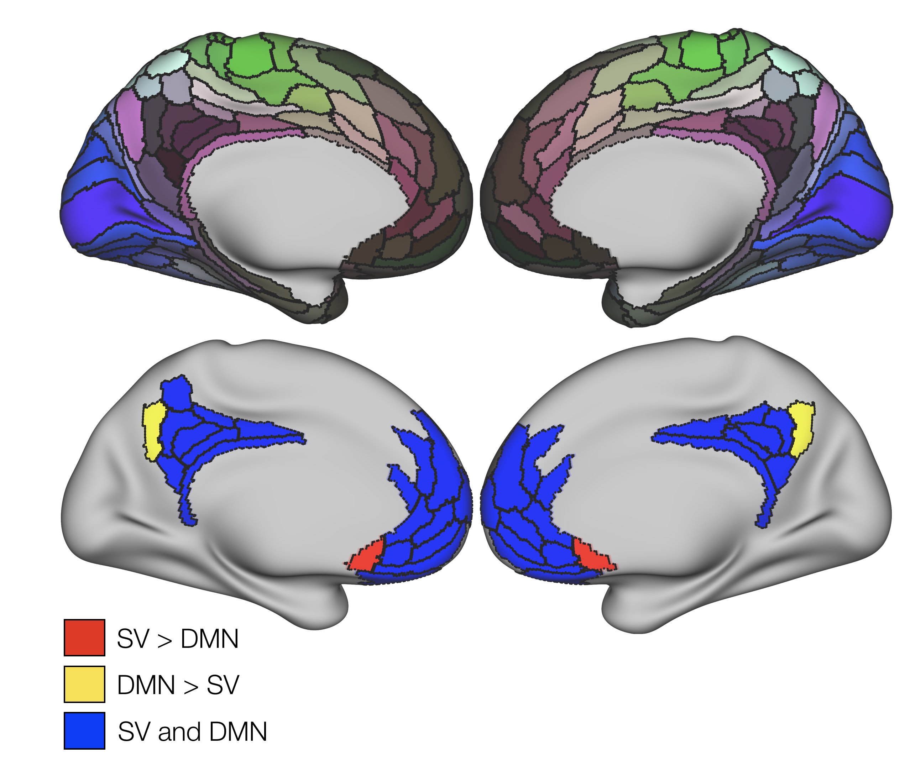
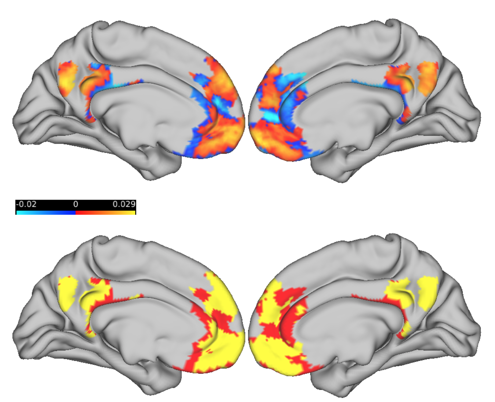

```{r setup, include=FALSE}
knitr::opts_chunk$set(echo = FALSE, warning = FALSE)
```

```{r Libraries and functions, include = FALSE, fig.align="center", fig.width=6, fig.height=4, echo=FALSE}

Cols <- c("aquamarine4","#D9541A",rgb(190,190,190,100, maxColorValue = 255)) # left, right, interhemisphere

# In case I want to visualize stuff in the brain
labelCoords_vertex <- read.csv2('labelCoords_vertex.csv')[,2:6]
labelCoords_vertex <- transform(labelCoords_vertex, x = as.numeric(as.character(x)), y = as.numeric(as.character(y)), z = as.numeric(as.character(z)))

# Whether to apply subject-wise thresholds on maps or not
threshMaps <- TRUE

# Libraries used for the whole process
library(tidyverse)
library(igraph)
library(pander)
library(ggnetwork)
library(ggplot2)
library(gridExtra)
library(data.table)
library(plyr)
library(mcclust)
library(lme4)
library(parallel)
library(corrplot)
library(DescTools)
library(knitr)


## Cohen's D for 2 groups
# for a more flexible approach, make the data input to be a list with entries for n groups, 
# then do length(list) for the number of groups. 
cohenD <- function(group1 = 1, group2 = 2){
  
  # means
  mean1 <- mean(group1, na.rm = T)
  mean2 <- mean(group2, na.rm = T)
  
  # variance
  var1 <- var(group1, na.rm = T)
  var2 <- var(group2, na.rm = T)
  
  # equation
  out <- (mean1 - mean2) / sqrt((var1 + var2)/2)
  
  return(out)
  
}

## log-log degree distribution
logDegreeDist <- function(Graph = padjMat) {
  
  tempD <- degree(Graph)
  tempDD <- degree.distribution(Graph) # frequency of occurrencies of certain degrees
  d <- (0:(max(tempD)-1))
  ind <- (tempDD!=0)
  plot(d[ind], tempDD[ind], log = "xy", col = "blue", 
       xlab = "Log-Degree", ylab = "Log-Intensity",  
       main = "Log-Log Degree Distribution")
  
}


## Create correlation matrix between vertices of 2 ROIs
# Requires labeled time series matrix
vertexCorrMat <- function(ROI_1 = 'R_7m_ROI', ROI_2 = 'L_7m_ROI'){
  
  # extract the time series from the ROIs
  indexing_1 <- which(rownames(timeSeries)==as.character(ROI_1))
  indexing_2 <- which(rownames(timeSeries)==as.character(ROI_2))
  nVerts_1 <- length(indexing_1)
  nVerts_2 <- length(indexing_2)
  ROI_1_tseries <- timeSeries[indexing_1, ]
  ROI_2_tseries <- timeSeries[indexing_2, ]
  
  # Create empty matrix
  corrMat <- matrix(data = 0, nrow = nVerts_1, ncol = nVerts_2)
  
  # 
  for (vertex_1 in seq(nVerts_1)){
    
    # temp series 1
    tempOne <- ROI_1_tseries[vertex_1, ]
    
    for(vertex_2 in seq(nVerts_2)){
      
      # temp series 2
      tempTwo <- ROI_2_tseries[vertex_2, ]
      
      # store the Pearson correlation in the corr matrix
      corrMat[vertex_1, vertex_2] <- cor(tempOne, tempTwo, method = "pearson") 
      
    }
  }
  
  # name the dimensions of the matrix according to the surface vertex index
  rownames(corrMat) <- indexing_1
  colnames(corrMat) <- indexing_2
  
  # plot (optional?)  
  # unclustered heatmap
  heatmap(corrMat,
          Rowv = NA,
          Colv = NA,
          scale = "row",
          col = pallette(1000))
  
  # clustered heatmap
  heatmap(corrMat,
          scale = "row",
          col = pallette(1000))
  
  # print min-max corr vals
  print(range(corrMat))
  
  return(corrMat)
  
}


## Correlation matrix between an ROI and the Glasser parcels
parcelCorrMat <- function(ROI = 'R_7m_ROI', lbels = lookup$V1){
  
  # extract the time series from the ROIs
  indexing <- which(rownames(timeSeries)==as.character(ROI))
  nVerts <- length(indexing)
  ROI_tseries <- timeSeries[indexing, ]
  
  # create empty matrix to store values
  corrMat <- matrix(data = 0, nrow = nVerts, ncol = 360)
  
  # Loop through every combination of label and 7m vertex
  for (Parcel in lbels){
    
    # Get an ROI index to retrieve timeseries and store correlation vals
    indxROI <- which(lbels==as.character(Parcel))
    
    for(vertex in seq(nVerts)){
      
      # temp series
      tempROI <- as.numeric(ptSeries[indxROI, ])
      tempVertex <- ROI_tseries[vertex, ]
      
      # store the Pearson correlation in the corr matrix
      corrMat[vertex, indxROI] <- cor(tempROI, tempVertex, method = "pearson") 
      
    }
  }
  
  # name the columns according to labels
  colnames(corrMat) <- lbels
  rownames(corrMat) <- indexing
  
  # plot (optional?)  
  # unclustered heatmap
  heatmap(corrMat,
          Rowv = NA,
          Colv = NA,
          scale = "none",
          col = pallette(1000))
  
  # clustered heatmap
  heatmap(corrMat,
          scale = "none",
          col = pallette(1000))
  
  # print min-max corr vals
  print(range(corrMat))
  
  return(corrMat)
  
}


## Correlation matrix between an Parcel and every other grayordinate
# THIS CAN BE OPTIMIZED WITH A BETTER USE OF COR()
partoverCorrMat <- function(ROI = 'R_7m_ROI', lbels = verts[[1]]){
  
  # extract the time series from the ROI
  indexing <- which(rownames(ptSeries)==as.character(ROI))
  ROI_tseries <- as.numeric(ptSeries[indexing, ])
  
  # get the remaining number of vertices
  nVerts <- length(lbels) 
  
  # Create data frame to store values
  parcelIndx <- which(labelCoords_parcel$Label==ROI)
  corrVec <- data.frame(Seed = rep(ROI, nVerts),
                        Labels = lbels,
                        xstart = rep(labelCoords_parcel$x[parcelIndx], nVerts), # 7.33324 for R_7m
                        ystart = rep(labelCoords_parcel$y[parcelIndx], nVerts), # -63.142
                        zstart = rep(labelCoords_parcel$z[parcelIndx], nVerts)) # 42.5578
  
  for(vertex in seq(nVerts)){
    
    # temp series
    tempVertex <- timeSeries[vertex, ] 
    
    # store the Pearson correlation in the corr matrix
    #corrVec$Correlation[vertex] <- cor(ROI_tseries, tempVertex, method = "pearson") 
    
    # Another option, so that FDR can be applied
    tempCor <- cor.test(ROI_tseries, tempVertex, method = "pearson")
    corrVec$Correlation[vertex] <- tempCor$estimate
    corrVec$pval[vertex] <- tempCor$p.value
    
  }
  
  # Turn ROI vertices into 0s
  indexing <- which(corrVec$Labels==as.character(ROI))
  corrVec$Correlation[indexing] <- 0
  
  # Create a column with p-vals corrected for multiple comparisons
  corrVec$adjPval <- p.adjust(corrVec$pval, "BY")
  
  # normalize correlation vals for analysis (see below)
  tempTanh <- fisherTanh(Data = corrVec$Correlation)
  corrVec$tanhZ <- tempTanh$tanhZ
  corrVec$tanhPvals <- tempTanh$pvals
  corrVec$tanhPAdjusted <- tempTanh$adjustPvals
  
  return(corrVec)
  
}


## tanh-z transformation (variance stabilizing Fisher) and p-values (adjusted and not)
# This takes either a matrix of correlation values (vectors too, but manually compute pvals)
# Normalization approach suggested in network textbook (equation 7.10)
fisherTanh <- function(Data = padjMatrix){
  
  transformed <- list()
  
  # tanh
  transformed$tanhZ <- 0.5 * log((1 + Data) / (1 - Data))
  
  # p-vals
  if (is.matrix(Data)) {
    z.vec <- transformed$tanhZ[upper.tri(transformed$tanhZ)]
    n <- dim(Data)[1]
  } else if (is.vector(Data)) {
    z.vec <- transformed$tanhZ
    n <- length(Data)
  }
  transformed$pvals <- 2 * pnorm(abs(z.vec), 0 , sqrt(1 / (n-3)), lower.tail=F)
  
  # adjust pvals
  transformed$adjustPvals <- p.adjust(transformed$pvals, "BH")
  
  if (is.matrix(Data)) {
    # get pvals and their adjustment into a symetric matrix form
    # regular
    tempMat <- matrix(0, dim(Data)[1], dim(Data)[2])
    tempMat[upper.tri(tempMat)] <- transformed$pvals
    tempMat[lower.tri(tempMat)] <- transformed$pvals
    dimnames(tempMat) <- list(rownames(Data), rownames(Data))
    transformed$pvals <- tempMat
    
    # adjusted
    tempMat <- matrix(0, dim(Data)[1], dim(Data)[2])
    tempMat[upper.tri(tempMat)] <- transformed$adjustPvals
    tempMat[lower.tri(tempMat)] <- transformed$adjustPvals
    dimnames(tempMat) <- list(rownames(Data), rownames(Data))
    transformed$adjustPvals <- tempMat
  }
  
  return(transformed)
  
}


## Extract the centroid-most vertex from each parcel
parcelCentroid <- function(ROI = 'R_7m_ROI', all_coordinates = labelCoords_vertex){
  
  # The coordinate file must contain a Label column
  
  # Get the ROI-specific vertices
  indx <- grep(ROI, all_coordinates$Label)
  
  # Grab the coordinates
  tempCoords <- all_coordinates[indx, c("x","y","z")]
  rownames(tempCoords) <- indx
  
  # Compute the distance among all vertices, and turn into a matrix
  tempDist <- dist(tempCoords, diag = T)
  tempDist <- as.matrix(tempDist)
  
  # Compute the sum of distances for each vertex, and get the minimum
  sumDists <- colSums(tempDist)
  minDist <- which(sumDists == min(sumDists))
  minDist <- indx[minDist]
  
  return(minDist)
  
}


## This function takes the output from partoverCorrMat() and adds/removes the characteristics we decided on.
prepROItoVer <- function(Data = R_7m_allCorr, Coordinates = labelCoords_vertex){
  
  # Add vertex coordinates
  tempDframe <- cbind(Data, Coordinates[,1:3])
  
  # Remove rows with non-significant adjusted pvalues
  indx <- tempDframe$adjPval < 0.05
  tempDframe <- tempDframe[indx, ]
  
  # Characterize correlation direction and round up vals for plotting
  tempDframe$Relation <- ifelse(tempDframe$Correlation < 0, "Negative", "Positive")
  tempDframe$Correlation <- round(tempDframe$Correlation, digits = 2)
  
  # Add a column to differentiate between left/right hemispheres
  tempDframe$Hemisphere <- substring(tempDframe$Labels,1,1)
  
  return(tempDframe)
  
}


## Plot correlation from ROI to rest of vertices
plotROItoVertex <- function(Data = R_7m_allCorr, ROI = 'R_7m_ROI', ColRange = Cols, View = "Axial", Legends = TRUE){
  
  ROIindx <- grep(ROI, Data$Labels)
  ROIvertices <- Data[ROIindx,c("x","y","z")] # grab ROI-specific vertices to black out
  labelCoord <- ROIvertices[1,] # just to place the label
  
  if (View == "Axial") {
    ggplot() +
      geom_point(data = Data, aes(x=x, y=y, alpha=.5, color = Correlation), show.legend = Legends) +
      geom_point(data = labelCoords_vertex, aes(x=x, y=y), alpha=0.01) +
      geom_nodes(data = ROIvertices, aes(x=x, y=y)) +
      geom_nodelabel_repel(aes(x=labelCoord$x, y=labelCoord$y, label = sub("_ROI","",ROI))) +
      scale_color_gradient2(low = ColRange[1], mid = "white", high = ColRange[2], limits = c(-1,1)) +
      theme_blank()
  } else if (View == "Sagittal") {
    ggplot() +
      geom_point(data = Data, aes(x=y, y=z, alpha=.5, color = Correlation), show.legend = Legends) +
      geom_point(data = labelCoords_vertex, aes(x=y, y=z), alpha=0.01) +
      geom_nodes(data = ROIvertices, aes(x=y, y=z)) +
      geom_nodelabel_repel(aes(x=labelCoord$y, y=labelCoord$z, label = sub("_ROI","",ROI))) +
      scale_color_gradient2(low = ColRange[1], mid = "white", high = ColRange[2], limits = c(-1,1)) +
      theme_blank()
  } else if (View == "Coronal") {
    ggplot() +
      geom_point(data = Data, aes(x=x, y=z, alpha=.5, color = Correlation), show.legend = Legends) +
      geom_point(data = labelCoords_vertex, aes(x=x, y=z),  alpha=0.01) +
      geom_nodes(data = ROIvertices, aes(x=x, y=z), alpha=.5) +
      geom_nodelabel_repel(aes(x=labelCoord$x, y=labelCoord$z, label = sub("_ROI","",ROI))) +
      scale_color_gradient2(low = ColRange[1], mid = "white", high = ColRange[2], limits = c(-1,1)) +
      theme_blank()
  } else if (View == "Medial Right") {
    if (substring(ROI,1,1) == "R") {
      oneHemi <- Data[grep("R", Data$Hemisphere), ]
      oneHemi$Medial <- ifelse(oneHemi$x < 20, "Medial", "Other")
      medialHemi <- oneHemi[which(oneHemi$Medial=="Medial"), ]
      medialHemi$y <- medialHemi$y * -1
      ROIvertices$y <- ROIvertices$y * -1
      labelCoord$y <- labelCoord$y * -1
      oneHemi_all <- labelCoords_vertex[grep("R",labelCoords_vertex$Hemisphere), ] # whole surface
      oneHemi_all$Medial <- ifelse(oneHemi_all$x < 20, "Medial", "Other")
      medialHemi_all <- oneHemi_all[grep("Medial", oneHemi_all$Medial), ]
      medialHemi_all$y <- medialHemi_all$y * -1
      ggplot() +
        geom_point(data = medialHemi, aes(x=y, y=z, alpha=.1, color = Correlation), show.legend = Legends) +
        #geom_point(data = medialHemi_all, aes(x=y, y=z), alpha=0.07) +
        scale_color_gradient2(low = ColRange[1], mid = "white", high = ColRange[2], limits = c(-1,1)) +
        geom_nodes(data = ROIvertices, aes(x=y, y=z), alpha=.5) +
        geom_nodelabel_repel(aes(x=labelCoord$y, y=labelCoord$z, label = sub("_ROI","",ROI))) +
        theme_blank()
    } else {
      oneHemi <- Data[grep("R", Data$Hemisphere), ]
      oneHemi$Medial <- ifelse(oneHemi$x < 20, "Medial", "Other")
      medialHemi <- oneHemi[which(oneHemi$Medial=="Medial"), ]
      medialHemi$y <- medialHemi$y * -1
      ROIvertices$y <- ROIvertices$y * -1
      labelCoord$y <- labelCoord$y * -1
      oneHemi_all <- labelCoords_vertex[grep("R",labelCoords_vertex$Hemisphere), ] # whole surface
      oneHemi_all$Medial <- ifelse(oneHemi_all$x < 20, "Medial", "Other")
      medialHemi_all <- oneHemi_all[grep("Medial", oneHemi_all$Medial), ]
      medialHemi_all$y <- medialHemi_all$y * -1
      ggplot() +
        geom_point(data = medialHemi, aes(x=y, y=z, alpha=.1, color = Correlation), show.legend = Legends) +
        #geom_point(data = medialHemi_all, aes(x=y, y=z), alpha=0.07) +
        scale_color_gradient2(low = ColRange[1], mid = "white", high = ColRange[2], limits = c(-1,1)) +
        theme_blank()
    }
  } else if (View == "Medial Left") {
    if (substring(ROI,1,1) == "L") {
      oneHemi <- Data[grep("L", Data$Hemisphere), ]
      oneHemi$Medial <- ifelse(oneHemi$x > -20, "Medial", "Other")
      medialHemi <- oneHemi[which(oneHemi$Medial=="Medial"), ]
      oneHemi_all <- labelCoords_vertex[grep("R",labelCoords_vertex$Hemisphere), ] # whole surface
      oneHemi_all$Medial <- ifelse(oneHemi_all$x < 20, "Medial", "Other")
      medialHemi_all <- oneHemi_all[grep("Medial", oneHemi_all$Medial), ]
      ggplot() +
        geom_point(data = medialHemi, aes(x=y, y=z, alpha=.1, color = Correlation), show.legend = Legends) +
        #geom_point(data = medialHemi_all, aes(x=y, y=z), alpha=0.07) +
        scale_color_gradient2(low = ColRange[1], mid = "white", high = ColRange[2], limits = c(-1,1)) +
        geom_nodes(data = ROIvertices, aes(x=y, y=z), alpha=.5) +
        geom_nodelabel_repel(aes(x=labelCoord$y, y=labelCoord$z, label = sub("_ROI","",ROI))) +
        theme_blank()
    } else {
      oneHemi <- Data[grep("L", Data$Hemisphere), ]
      oneHemi$Medial <- ifelse(oneHemi$x > -20, "Medial", "Other")
      medialHemi <- oneHemi[which(oneHemi$Medial=="Medial"), ]
      oneHemi_all <- labelCoords_vertex[grep("R",labelCoords_vertex$Hemisphere), ] # whole surface
      oneHemi_all$Medial <- ifelse(oneHemi_all$x < 20, "Medial", "Other")
      medialHemi_all <- oneHemi_all[grep("Medial", oneHemi_all$Medial), ]
      ggplot() +
        geom_point(data = medialHemi, aes(x=y, y=z, alpha=.1, color = Correlation), show.legend = Legends) +
        #geom_point(data = medialHemi_all, aes(x=y, y=z), alpha=0.07) +
        scale_color_gradient2(low = ColRange[1], mid = "white", high = ColRange[2], limits = c(-1,1)) +
        theme_blank()
    }
  }
  
}


## Run a fastgreedy modularity community detection on ROIs
# This function relies on having the timeSeries data uploaded, and labelCoords_vertex 
# Extras dictates whether the community object + correlation matrix should also be extracted
communityDetection <- function(Data = parcelBins$First, ROIS = "None", Type = "vertex", thresh = F, extras = F) {
  
  print(paste('Computing modularity based on', Type))
  
  if (ROIS == "None"){
    
    # This will just do SP for now, for sliding window
    print("Previously concatenated data")
    
    corrMat <- cor(t(Data))
    corrMatrix <- corrMat
    transfMat <- fisherTanh(Data = corrMat)
    if (thresh == T) {
      transfMat$tanhZ[transfMat$adjustPvals > 0.05] <- 0
    }
    corrMat <- transfMat$tanhZ
    
    diag(transfMat$tanhZ) <- 0    
    diag(corrMat) <- 0
    
    corrMat <- exp(corrMat)
    corrMat[corrMat==1] <- 0
    transfMat$tanhZ <- corrMat
    
    tempGraph <- graph_from_adjacency_matrix(corrMat, weighted = T, mode = "undirected")
    tempLap <- laplacian_matrix(tempGraph, normalized=T)
    tempEigen <- eigen(tempLap)
    f.vec <- length(tempEigen$values) - 1
    tempEigen$binarized <-  as.factor(ifelse(tempEigen$vectors[,f.vec] > 0, 1, 0)) # binarized Fiedler Vector 
    
    summary <- data.frame(Label = colnames(corrMat),
                          Hemisphere = substring(colnames(corrMat),1,1),
                          EigenVal = tempEigen$values,
                          FiedlerVec = tempEigen$vectors[, (length(tempEigen$values) - 1)],
                          FiedlerBinary = tempEigen$binarized)
    
    ## Get the final components
    if (extras == T) {
      modularityResults <- list(CorrMatrix = corrMatrix,
                                TransfMatrix = transfMat,
                                Summary = summary)
    } else {
      modularityResults <- list(Summary = summary)
    }
    
  } else {
    
    if (Type == "vertex") {
      # To store the vertex indices corresponding to the ROIs
      indx <- numeric()
      
      # had to place dashes on each side because grep grabbed strings containing the names (i.e. 47m, a24pr)
      #ROIS <- c("_7m_", vmPFC_labels) # c("_a24_", "_7m_")
      for (ROI in ROIS) {
        indx <- c(indx, grep(ROI, rownames(Data)))  
      }
      
      nVerts <- length(indx)
      ROI_tseries <- Data[indx, ]
      
      # This used to be done with the for loop, but it was too slow. cor() speeds up the process by a lot
      corrMat <- cor(t(ROI_tseries))
      
      # name the dimensions of the matrix according to the surface vertex index
      rownames(corrMat) <- indx
      
      # for storing later
      corrMatrix <- corrMat
      
      # transform to Fisher's (think of thresholding)
      transfMat <- fisherTanh(Data = corrMat)
      
      # Determine if edges should be thresholded or not
      if (thresh == T) {
        transfMat$tanhZ[transfMat$adjustPvals > 0.05] <- 0
      }
      
      # Store Fisher transformed vals for graphing
      corrMat <- transfMat$tanhZ
      
      # diagonals of 1 could be interpreted as self-loops
      diag(transfMat$tanhZ) <- 0    
      diag(corrMat) <- 0
      
      # Exponentiate to preserve distribution while ensuring positive weights
      # I'm keeping corrMat and transfMat$tanhZ separate in case I want to uncorrect transfMat in the future
      corrMat <- exp(corrMat)
      corrMat[corrMat==1] <- 0
      transfMat$tanhZ <- corrMat
      
      # community detection
      # I initially used the absolute value of the correlation, but the exp preserves the distribution 
      # Next, try using the fisher transform
      
      tempGraph <- graph_from_adjacency_matrix(corrMat, weighted = T, mode = "undirected")
      tempCommunity <- fastgreedy.community(tempGraph)
      
      # community object
      #modularityResults$community <- tempCommunity
      
      # correlation matrix with transformed values
      #modularityResults$corrMat <- corrMatrix
      
      # get coordinate info from selected regions (useful for ggplot)
      summary <- data.frame(Vertex = indx,
                            Label = tempCommunity$names,
                            Membership = tempCommunity$membership,
                            Modularity = tempCommunity$modularity,
                            x = labelCoords_vertex[indx, "x"],
                            y = labelCoords_vertex[indx, "y"],
                            z = labelCoords_vertex[indx, "z"],
                            Hemisphere = substring(tempCommunity$names,1,1))
      
      
    } else if (Type == "parcels") {
      
      # This used to be done with the for loop, but it was too slow. cor() speeds up the process by a lot
      corrMat <- cor(t(Data))
      
      # for storing later
      corrMatrix <- corrMat
      
      # transform to Fisher's (think of thresholding)
      transfMat <- fisherTanh(Data = corrMat)
      
      # Determine if edges should be thresholded or not
      if (thresh == T) {
        transfMat$tanhZ[transfMat$adjustPvals > 0.05] <- 0
      }
      
      # Store Fisher transformed vals for graphing
      corrMat <- transfMat$tanhZ
      
      # diagonals of 1 could be interpreted as self-loops
      diag(transfMat$tanhZ) <- 0
      diag(corrMat) <- 0
      
      # Exponentiate to preserve distribution while ensuring positive weights
      # I'm keeping corrMat and transfMat$tanhZ separate in case I want to uncorrect transfMat in the future
      corrMat <- exp(corrMat)
      corrMat[corrMat==1] <- 0
      transfMat$tanhZ <- corrMat
      
      # community detection
      # I initially used the absolute value of the correlation, but the exp preserves the distribution 
      # Next, try thresholding it by the adjusted p-vals
      tempGraph <- graph_from_adjacency_matrix(corrMat, weighted = T, mode = "undirected")
      tempCommunity <- fastgreedy.community(tempGraph)
      
      # community object
      #modularityResults$community <- tempCommunity
      
      # correlation matrix with transformed values
      #modularityResults$corrMat <- corrMatrix
      
      # get coordinate info from selected regions (useful for ggplot)
      summary <- data.frame(Label = tempCommunity$names,
                            Membership = tempCommunity$membership,
                            Modularity = tempCommunity$modularity,
                            x = labelCoords_parcel[ ,"x"],
                            y = labelCoords_parcel[ ,"y"],
                            z = labelCoords_parcel[ ,"z"],
                            Hemisphere = substring(tempCommunity$names,1,1))
      
    }
    
    
    ## Get the final components
    modularityResults <- list(Community = tempCommunity,
                              CorrMatrix = corrMatrix,
                              TransfMatrix = transfMat,
                              Summary = summary)
    
  }
  
  return(modularityResults)
 
}


## plot the communities from communityDetection
plotCommunities <- function(Data = modularityResults, Hemi = "R", type = "Membership", Legends = T, bground=0.1, Cols = c("aquamarine4", "#D9541A")) {
  # This takes the output from the communityDetection function and plots them on the medial wall (since we're interested in medial now)
  # type is the name of the column to plot
  if (Hemi == "R") {
    # "Medial Right"
    oneHemi <- Data[grep("R", Data$Hemisphere), ] # from the ROIs
    oneHemi$Medial <- ifelse(oneHemi$x < 20, "Medial", "Other")
    medialHemi <- oneHemi[grep("Medial", oneHemi$Medial), ]
    medialHemi$y <- medialHemi$y * -1
    oneHemi_all <- labelCoords_vertex[grep("R",labelCoords_vertex$Hemisphere), ] # whole surface
    oneHemi_all$Medial <- ifelse(oneHemi_all$x < 20, "Medial", "Other")
    medialHemi_all <- oneHemi_all[grep("Medial", oneHemi_all$Medial), ]
    medialHemi_all$y <- medialHemi_all$y * -1
    ggplot() + 
      geom_point(data = medialHemi, aes_string(x="y", y="z", color = type), show.legend=Legends) +
      geom_point(data = medialHemi_all, aes(x=y, y=z), alpha=bground) +
      scale_color_gradient(low = Cols[1], high = Cols[2]) +
      theme_blank() 
  } else if (Hemi == "L") {
    # "Medial Left"
    oneHemi <- Data[grep("L", Data$Hemisphere), ]
    oneHemi$Medial <- ifelse(oneHemi$x > -20, "Medial", "Other")
    medialHemi <- oneHemi[which(oneHemi$Medial=="Medial"), ]
    oneHemi_all <- labelCoords_vertex[grep("L",labelCoords_vertex$Hemisphere), ] # whole surface
    oneHemi_all$Medial <- ifelse(oneHemi_all$x > -20, "Medial", "Other")
    medialHemi_all <- oneHemi_all[grep("Medial", oneHemi_all$Medial), ]
    ggplot() + 
      geom_point(data = medialHemi, aes_string(x="y", y="z", color = type), show.legend=Legends) +
      geom_point(data = medialHemi_all, aes(x=y, y=z), alpha=bground) +
      scale_color_gradient(low = Cols[1], high = Cols[2]) +
      theme_blank() 
  }
}


## get ROI coords & index
# The point here is to reduce the summary dframes from community detection to show only ROIs
# Should work for extracting any label-indexed dframe though
# I wanted to also get the index in case I want to extract specific rows from parcel/vertex coord dframes
getCoords <- function(Labels = DMN_labels, Coords = labelCoords_parcel, TimeSeries = FALSE){
  
  indx <- numeric()
  
  # If you want to select time series from raw data
  if (TimeSeries == TRUE) {
    
    for (ROI in Labels) {
      indx <- c(indx, grep(ROI, rownames(Coords)))
    }
    
  } else { # for the summary output of the community detection output
    
    for (ROI in Labels) {
      indx <- c(indx, grep(ROI, Coords$Label))
    }
    
  }
  
  results <- list()
  results$Index <- indx
  results$Coords <- Coords[indx, ]
  
  return(results)
  
}


# eigen value community detection
eigenVals <- function(Data = binnedCommunities_p$First) {
  
  # This will produce a vector of values, ready to be plotted
  tempGraph <- graph_from_adjacency_matrix(Data$TransfMatrix$tanhZ, mode = "undirected", weighted = T)
  tempGraph <- laplacian_matrix(tempGraph, normalized=T)
  tempGraph <- eigen(tempGraph)
  f.vec <- length(tempGraph$values) - 1
  tempGraph$binarized <-  as.factor(ifelse(tempGraph$vectors[,f.vec] > 0, 1, 0)) # binarized Fiedler Vector
  
  return(tempGraph)
  
}


# Attempt at setting up data for confusion matrices and Jaccard index calculations
confusionMatrix <- function(partition1 = parcelCommunities[[1]]$Membership, partition2 = parcelCommunities[[1]]$FiedlerBinary) {
  
  # Divide partitions to evaluate
  # Usually 2 will be fiedler
  
  # Check if any partition has 0s (since I binarize the Fiedler vector)
  if (0 %in% partition1) {
    
    partition1[grep(0, partition1)] <- 1
    partition1[grep(1, partition1)] <- 2
    
  } 
  
  if (0 %in% partition2) {
    
    partition2[grep(1, partition2)] <- 2   
    partition2[grep(0, partition2)] <- 1
    
  }
  
  # Community sizes
  commSizes1 <- table(partition1)
  commSizes2 <- table(partition2)
  
  # Number of communities per partition
  nComms1 <- length(commSizes1)
  nComms2 <- length(commSizes2)
  
  # Number of vertices
  n <- length(partition1)
  
  # Putting together elements of the confusion matrix
  confMatrix <- matrix(nrow = nComms1,
                       ncol = nComms2)
  
  for (i in as.numeric(case.names(commSizes1))) {
    
    # Vertices belonging to community qX of partition X
    tempComm1 <- partition1 == i
    
    for (j in as.numeric(case.names(commSizes2))) {
      
      # Vertices belonging to community qY of partition Y
      tempComm2 <- partition2 == j
      
      # Populate matrix
      confMatrix[i,j] <- sum(tempComm1 & tempComm2) 
      
    }
  }
  
  if (sum(confMatrix) != n) {warning('Sum of the confusion matrix is not equal to number of vertices')}
  
  
  return(confMatrix)
  
}


# Permutation for 2 groups
permute <- function(group1 = 1, group2 = 2, statType = mean, nPerms = 5000, paired = FALSE){
  
  # prep data
  summaryPerm <- list()
  lOne <- length(group1)
  lTwo <- length(group2)
  bigSample <- c(group1,group2)  
  
  if (paired == FALSE) {
    
    
    for (i in 1:nPerms){
      
      # relabel samples
      tempBig <- sample(bigSample)
      tempOne <- tempBig[seq(lOne)]
      tempTwo <- tempBig[-seq(lOne)]
      
      # stats
      tempDiffs <- statType(tempOne,na.rm=T) - statType(tempTwo,na.rm=T)
      summaryPerm$jointDist[i] <- tempDiffs # statType(tempDiffs, na.rm = T) 
      
    }  
    
  } else {
    
    for (i in 1:nPerms){
      
      # shift labels in a pairwise fashion
      tempDiffs <- statType((-1)^rbinom(lOne,1,0.5) * (group1 - group2))
      summaryPerm$jointDist[i] <- tempDiffs
      
    }
    
  }
  
  # get the observed difference
  diffs <- statType(group1,na.rm=T) - statType(group2,na.rm=T)
  observedAbs <- abs(diffs) # maybe leave it as means here
  observed <- diffs
  summaryPerm$Pval <- 2 * (1 - ecdf(summaryPerm$jointDist)(observedAbs))
  if (length(unique(abs(summaryPerm$jointDist))) == 1) {summaryPerm$Pval <- 1} # if the difference is always the same, then p = 1
  summaryPerm$Observed <- observed
  
  return(summaryPerm)
  
}


# Non-parametric Bootstrap for a single group
bootstrap <- function(group = 1, statType = mean, B = 5000){
  
  # prep param
  bootStats <- rep(0,B)
  
  # iterate
  for(b in 1:B){
    
    # wait group
    x <- sample(group,length(group),replace=T)  
    bootStats[b] <- statType(x,na.rm = T)
    
  }
  
  return(bootStats)
  
}


# number of times a node changes affiliation in a time series
flexibility <- function(Data = cbind(1:10, 6:15)) {
  # Calculation of flexibility based on Garcia et al., 2018  
  # This function takes in a data frame or matrix in which columns are the community affiliation 
  # It needs at least 2 colums, although it's pointless for that  
  
  # How many jumps can there be?
  nJumps <- dim(Data)[2] - 1
  
  # Matrix to store jumps
  jumpCount <- matrix(nrow = dim(Data)[1], ncol = nJumps)
  
  # For each transition, get the which nodes changed affiliation
  for (jump in seq(nJumps)) {
    
    jumpCount[, jump] <- Data[, jump] != Data[, jump + 1]
    
  }
  
  # How many times did every node jump?
  totalJumps <- rowSums(jumpCount)
  
  # Calculate the flexibility per node
  flexibility <- totalJumps / nJumps
  
  return(flexibility)
  
}


# Sliding window
slidingWindow <- function(subjTS = ROI_timeSeries[[1]], mins = 15, jump = 1, Spectral = T, Modularity = F, ROIs = c("_7m_", vmPFC_labels)) {
  # This is a fairly specific function. It takes the time series from a participant and preps/runs community detection at each specified time window. 
  # Returns the summaries for each window (based on communityDetection function)
  # The selection of a window size is based on the fact that a TR = 0.720s and an hour is 5000 TRs (HCP-based)
  # Since each subject has a different amount of time points, and all are slightly under 1 hr, I chose to round down the number of window moves to avoid unevenness
  # 
  # Parameter definitions:
  #   
  #   subjTS: Subject time series. Note: if you want to look at more than vmpfc and 7m, add a parameter for the labels that can be passed to the community detection function
  # 
  #   mins: Size of the window that will slide through the data.
  #   
  #   jump: Steps (in mins) advanced per slide
  #   
  #   Spectral: Whether to compute spectral partitioning as well. Takes significantly longer, but might be more useful for bisections
  #
  # Right now this takes ~27 mins per subject to run. Think of ways to improve that.
  
  
  # Adapted so it works with the output from getCoords
  # One wouldn't really apply a full-brain analysis of this sort anyways, too computationally intensive
  indx <- subjTS$Index
  subjTS <- subjTS$Coords
  
  # Window sizing (length)
  # Think about incorporating custom TRs
  TS <- dim(subjTS)[2] # time series for the subject
  WS <- seq(834 * (mins/10)) # window from the first TR up to 834 (~10 mins) times the desired multiplier
  jump <- 84 * jump # 84 ~ 1 min, times the number of mins that the window moves
  nJumps <- floor((TS - length(WS)) / jump) # number of jumps to be performed, based on the selected parameters
  
  ##------- using lapply
  winData <- mclapply(seq(nJumps), function(x) subjTS[,WS+(jump*(x-1))])
  commTS <- mclapply(winData, communityDetection, ROIS = "None", Type = "vertex", thresh = T, extras = F)
  return(commTS)
  
}


# compare sliding window data to overall communities
slideCompare <- function(subjData = slideCommunities[[1]], template = vmpfc7mCommunities[[1]], func = "RI", comm = "Spectral") {
  # This function compares the community partition from each window slide to the one derived from the whole data set
  # 
  # Parameter definitions:
  #   
  #   subjData: A participant's output from slideCommunities
  #   
  #   template: The partition from the whole time series
  # 
  #   func: Which function to use for comparing ("RI" for adjusted RI, "VI" for variation of information)
  # 
  #   comm: The subject data might contain modularity and spectral partitions. Choose which to use.
  
  # For storing RIs or VIs
  tempComparison <- numeric()
  
  # How many jumps does the original data contain?
  nJumps <- length(subjData)
  
  # This loop is technically backwards. I should technically divide by function, then partition method, and then run the window comparisons
  # It's still really fast, so I won't worry.
  for (Win in seq(nJumps)) {
    if (comm == "Modularity") {
      if (func == "RI") {
        tempComparison[Win] <- arandi(subjData[[Win]]$Membership, template$Membership, adjust = T)
      } else if (func == "VI") {
        tempComparison[Win] <- vi.dist(subjData[[Win]]$Membership, template$Membership)
      }
    } else if (comm == "Spectral") {
      if (func == "RI") {
        tempComparison[Win] <- arandi(subjData[[Win]]$FiedlerBinary, template$FiedlerBinary, adjust = T)
      } else if (func == "VI") {
        tempComparison[Win] <- vi.dist(subjData[[Win]]$FiedlerBinary, template$FiedlerBinary)
      }
    }
  }
  
  return(tempComparison)
  
}

# Ensure that all spectral communities associated with 7m (i.e. DMN) have the same label value of 1 
evenSpectral <- function(Data = slideCommunities[[1]][[7]]) {
  
  # Get only the values for 7m
  shortData <- Data[grep("_7m_", Data$Label), ]
  
  # Get 7m's most probable affiliation
  affil <- mean(as.numeric(shortData$FiedlerBinary)-1)
  
  # If it is close to 1, then invert the labeling. 
  # Note: This has no effect on RI or VI, since they are insensitive to actual labeling
  # This is for visualization purposes only
  if (affil < 0.5) {
    
    UD <- as.numeric(Data$FiedlerBinary) - 1
    Data$FiedlerBinary <- as.factor((UD - 1)^2)
    Data$FiedlerVec <- Data$FiedlerVec * -1
    
  }
  
  return(Data)
  
}

# Create a vector ready to be used for HCP data (32k CIFTI surface)
# The input should be the summary from community partitioning
# Once this is created, go to the terminal and input something like this
# wb_command -cifti-convert -from-text dataforCifti.txt 100307.MyelinMap_BC.32k_fs_LR.dscalar.nii testCifti.dscalar.nii
# Where the myelin file here is just a templace. It can be any dscalar.nii with the right surface size
HCPOut <- function(Data = dmnval7mCommunities[[1]], MOI = "Membership", SubjID = "100307", padding = 0){
  
  nVertices <- 59412
  tempVec <- rep(padding, nVertices)
  temp <- grep(MOI, colnames(Data))
  tempVec[Data$Vertex] <- Data[[temp]]
  write.table(file = paste(SubjID,"_",MOI,'_dataforCifti.txt', sep=""), tempVec, row.names = F, col.names = F, dec = ".")
  
}

# Perform pairwise comparisons of clustering outcomes on all subjects
comparePartitions <- function(Data = dmnval7mCommunities, MOI = "FiedlerBinary", Index = "VI", nSubjects = nSubj, subjNames = subjList) {
  # This function will compare the community partitions from all subjects and create a 'comparison matrix' for every pairwise combination of subjects
  # Alternatively, if a second MOI is added 
  # Inputs
  # 
  # Data: the list of summaries produced by the script
  # 
  # MOI: measure of interest (usually the binarized Fiedler vector). If a vector, compares across algorithms per subject
  # 
  # Index: VI for variation of information, RI for the adjusted rand index, Cor for a Pearson correlation
  
  # NOTES:
  # you can apply pairwise comparisons with outer: outer(tempList,tempList,FUN = Vectorize(arandi, SIMPLIFY = FALSE, USE.NAMES = FALSE))
  
  # Get the column position of the MOI(s)
  Columns <- colnames(Data[[1]])
  indx <- as.numeric(Columns %in% MOI)
  MOI_indx <- which(indx==1)
  
  if (length(MOI_indx) < 2) {
    # Combine the measures of interest
    allVecs <- do.call(cbind, lapply(Data, "[[", MOI))
    
    # Create empty matrix
    indexMatrix <- matrix(data = NA, nrow = nSubjects, ncol = nSubjects)
    dimnames(indexMatrix) <- list(subjNames, subjNames)
    
    # Run every pairwise comparison with the index of interest on the measure of interest
    if (Index == "VI") {
      for (subj in seq(nSubjects)) {
        for (subj2 in seq(nSubjects)) {
          indexMatrix[subj,subj2] <- vi.dist(allVecs[, subj], allVecs[, subj2])
        }
      }
    } else if (Index == "RI") {
      for (subj in seq(nSubjects)) {
        for (subj2 in seq(nSubjects)) {
          indexMatrix[subj,subj2] <- arandi(allVecs[, subj], allVecs[, subj2], adjust = T)
        }
      }
    } else if (Index == "Cor") {
      for (subj in seq(nSubjects)) {
        for (subj2 in seq(nSubjects)) {
          indexMatrix[subj,subj2] <- cor(allVecs[, subj], allVecs[, subj2])
        }
      }
    }
  } else {
    indexMatrix <- data.frame(SubjID = as.character(subjList),
                              Index = rep(0, nSubjects))
    # Run every pairwise comparison with the index of interest on the measure of interest
    if (Index == "VI") {
      for (subj in seq(nSubjects)) {
        indexMatrix$Index[subj] <- vi.dist(Data[[subj]][, MOI_indx[1]], Data[[subj]][, MOI_indx[2]])
      }
    } else if (Index == "RI") {
      for (subj in seq(nSubjects)) {
        indexMatrix$Index[subj] <- arandi(Data[[subj]][, MOI_indx[1]], Data[[subj]][, MOI_indx[2]], adjust = T)
      }
    } else if (Index == "Cor") {
      for (subj in seq(nSubjects)) {
        indexMatrix$Index[subj] <- cor(Data[[subj]][, MOI_indx[1]], Data[[subj]][, MOI_indx[2]])
      }
    }
  }
  
  return(indexMatrix)
  
}

# Generate a matrix with submatrices of 1s of a given size along the diagonal
# Useful to extract specific portions of data from a similarity matrix
diagBlocks <- function(dims = 20, sqSize = 4) {
  div <- dims %/% sqSize
  finalMatrix<-matrix(0,nrow=dims,ncol=dims)
  index <- 1
  for(k in seq(div)){
    finalMatrix[index:(index + (sqSize-1)),index:(index + (sqSize-1))] <- 1
    index<-index + sqSize
  }
  finalMatrix <- finalMatrix == 1
  finalMatrix
}

# This function will select a two-tailed fiedler vector threshold with respect to the stability of the vertex
# The threshold will be based on proportion DMN given by thresholdRange
threshFV <- function(Data, thresholdRange = c(0.01, 0.99), nthresh = 50) {

  ## Check if the proportions even go that low, otherwise replace by next most stable low/high value
  # get the 2 values with highest reports (this should be stable upper/lower proportions)
  stableExtremes <- sort(table(Data$slidePropDMN), decreasing = T)[seq(2)]
  stableExtremes <- sort(as.numeric(names(stableExtremes)))
  
  
  # if the values are not extreme enough, replace the original threshold with the new stable ones
  if (thresholdRange[1] < stableExtremes[1]) {
    
    thresholdRange[1] <- stableExtremes[1]
    
  }
  
  if (thresholdRange[2] > stableExtremes[2]) {
    
    thresholdRange[2] <- stableExtremes[2]
    
  }
  
  ## Run the actual process
  # placeholder to be returned
  thresholds <- c(NA,NA)
  
  
  # start the counter at chance
  meanProp <- 0.5
  
  
  # select a range of FV values
  thresh <- seq(0, min(Data$FiedlerVec), length.out = nthresh)
  
  
  # Iterate over the possible FV until DMN affiliations go below 1%
  count <- 1
  while (meanProp >= thresholdRange[1]) {
    
    # get the mean proportion of DMN from remaining vertices based on putative threshold
    meanProp <- Data %>% filter(FiedlerVec <= thresh[count]) %>% summarize(mean(slidePropDMN))
    
    # if a threshold meets requirement, store its value
    if (meanProp <= thresholdRange[1]) {
      thresholds[1] <- thresh[count]
    }

    count <- count + 1
    
  }
  
  
  # repeat for the upper threshold
  # restart parameters
  meanProp <- 0.5
  thresh <- seq(0, max(abs(Data$FiedlerVec)), length.out = nthresh)
  
  
  # Iterate over the possible FV until DMN affiliations go over 99%
  count <- 1
  while (meanProp <= thresholdRange[2]) {
    
    # get the mean proportion of DMN from remaining vertices based on putative threshold
    meanProp <- Data %>% filter(FiedlerVec > thresh[count]) %>% summarize(mean(slidePropDMN))
    
    # if a threshold meets requirement, store its value
    if (meanProp >= thresholdRange[2]) {
      thresholds[2] <- thresh[count]
    }

    count <- count + 1
    
  }
  
  
  return(round(thresholds, digits = 5))

  
}
```
  
``` {r For HCP data, fig.align="center", echo=FALSE, message = FALSE}
setwd('./For_HCP')
temp <- list.files(pattern = '*Binary*')
FB <- lapply(temp, read.table)
Summed <- do.call(cbind, lapply(FB, "[[", 'V1')) - 1
FB_Means <- rowMeans(Summed)
nSubj <- length(temp)
rm(temp)
```

1. Department of Psychological and Brain Sciences, Boston University, Boston, USA

Corresponding author:

\newpage

## Ideas to do

- The new manuscript organization could go like this: 
1) Meta-analysis and ROIs
2) Summary all
  a) Make sure to report mean density and algebraic connectivity
  b) Cross-method agreement
  c) Spatially averaged community maps reproduce group-level analysis
3) Sliding window
  a) Fiedler vector magnitude as a proxy for affiliation strength
  b) Proportion DMN for mPFC and PCC separately to denote overall stability
  b) Proportion DMN across time-series ~ fiedler vector value (consider renaming propDMN to stability)
4) Threshold the maps and rerun summary all
5) Day 1 vs day 2
6) Session
7) Potential noise
8) Structural correspondence
9) Community > correlation

## Abstract

  Valuation effects are consistently observed in medial prefrontal and posterior cingulate cortex (mPFC and PCC). The spatial extent of these effects is mostly indistinguishable from the default mode network (DMN) in existing meta-analyses. However, little is known about how valuation effects fit within the broader functional architecture of mPFC and PCC, or whether that architecture is consistent or idiosyncratic across individuals. Here we complement a meta-analysis with fMRI-based graph theoretic approaches to subdivide mPFC and PCC at the single-subject level. Our results suggest the functional topography of mPFC has substantial variability across individuals. This highlights the potential usefulness of estimating brain effects at the individual level in this region, and points to limitations of aggregative methods such as coordinate-based meta-analysis in determining whether valuation and DMN effects emerge from common or separable brain systems. Our approach shows promise in addressing this issue through future manipulations of valuation.

**Keywords:** brain networks; DMN; individual differences

\newpage

## Introduction

  Studies of decision making have consistently associated activity in ventromedial prefrontal cortex (vmPFC) with the subjective value (SV) assigned to decision outcomes [@Bartra2013; @Clithero2014; @Hiser2018; @Kable2007; @Levy2011]. However, the distributed cortical valuation system also includes posterior cingulate (PCC) and more extended mPFC regions, which collectively show significant spatial overlap with the default mode network (DMN) along the medial wall [@Fox2005; @Laird2009; @Yeo2011]. This shared neural coverage has prompted the question of whether (and to what extent) these two systems can be dissociated.

  Previous meta-analytic work has provided important insights on the psychological phenomena attributed to mPFC subregions. Independent coordinate-based meta-analyses have found mirroring spatial coverage in mPFC for valuation [@Bartra2013] and DMN [@Laird2009]. Whole brain analyses have shown that while more ventral mPFC regions are increasingly associated with reward-related elements of decision making, vmPFC strongly coactivates with DMN regions across the literature, with no clear topographical distinction between these phenomena [@DelaVega2016]. More focused meta-analytic work aimed at disentangling DMN from subjective value has determined that these systems are inseparable within mPFC [@Acikalin2017]. These findings highlight the multifaceted embedding of psychological constructs in subregions of mPFC, and suggest that DMN and valuation might indeed be subserved by the same system. However, recent activation-based meta-analytic work has demonstrated considerable domain specificity in this area [@Kragel2018]. While informative, a key limitation in distinguishing constructs through this approach is that meta-analyses often rely on information derived from group-averaged data. Averaging has traditionally been beneficial in identifying tendencies in brain function and organization when faced with short scanning sessions per subject. However, it has been shown that mPFC is subject to considerable idiosyncratic cortical folding [@Zilles2013] and inter-subject functional variability [@Mueller2013a] compared to the rest of the brain, thus making group-averaging studies difficult to interpret. 
  
  Seeking to remedy these shortcomings, recent work has prescribed relevance to the analysis of single subjects in fMRI. Individual analyses of fMRI data have identified idiosyncratic, reliable, and valid functional organization that would otherwise be blurred in aggregative estimations [@Laumann2015; @Gordon2017; @Gratton2018a]. Furthermore, subject-specific network arrangements have been found to predict behavioral characteristics [@Kong2018]. In regards to DMN, the trend of individualized analyses has led to finer idiosyncratic subdivisions of the DMN through careful selection of seed-based functional connectivity [@Braga2017]. It is thus possible that the indisitinguishable overlap of DMN and valuation effects can be attributed to a lack of spatial resolution that is better understood at the individual level. With this in mind, an important first step in disentangling these phenomena would be to determine the degree of topological heterogeneity of the DMN present within mPFC.

  A persistent issue in analyzing mPFC in individuals is the various factors inducing signal dropout in its more ventral segments [@Logothetis]. As such, there is value in examining all possible sources of covariation that compose DMN, instead of estimating topologies one seed at a time. Connectome-based analyses of resting state functional connectivity (rsFC) have been fruitful in characterizing individualized functional topologies that match task-induced activity [@Gordon2017; @Laumann2015; @Tobyne2017]. A popular approach to analyze these connectomes is to rely on graph theoretic methods, which provide an organic avenue to understand brain network dynamics [@Bassett2018a]. From these, community detection algorithms have been successfully utilized to section brain networks into cohesive substructures [@Garcia2017]. Such communities represent clusters of network nodes that are more connected with each other than with the rest of the network [@Fortunato2016]. Among the algorithms used to estimate these communities, modularity has been widely effective in subsectioning brain networks into multiple groups [@Garcia2017]. However, in attempting to refine the DMN topology at the individual level, dividing these regions into what belongs and does not belong to DMN makes dissection through spectral partitioning (SP) a more valuable option. In short, spectral partitioning performs eigenvalue decompositon on an adjusted form of a correlation matrix (Laplacian matrix). The resulting eigenvector corresponding to the second-to-last eigenvalue (i.e. the Fiedler vector) provides values to divide the network into a positive and a negative community [@Fiedler1975; @Belkin2003]. SP has recently been used to characterize the posterior-anterior functional gradient of the insula using rsfMRI data [@Tian2018]. This method can thus capture a refined group of brain regions that more cohesively share activation patterns during rest.

  In this study, we aim to subsection regions commonly attributed to both DMN and subjective value into subject-specific DMN and non-DMN partitions, quantifying the degree of topographical heterogeneity present in this network within and across individuals. This description will allow researchers to generate more precise topographic targets for future studies of decision making. We do this by capitalizing on the respective strengths of meta-analytic and subject-specific analyses of brain data. First, we define regions of interest (ROI) by identifying overlapping activation throughout the literature projected to an established brain atlas [@Glasser2016]. We then produce a rsFC networks of all the surface vertices within these ROIs for each individual resting state dataset from the Human Connectome Project (HCP; citation), and estimate the extent of DMN coverage through spectral partitioning. The resulting patterns are then evaluated for consistency across methods, throughout each individual's time series, and across subjects. Finally, we show some interesting properties of SP related to the stability of brain networks.


## Methods

### *Meta-analysis*

We used data from metan-alyses that gathered peak brain coordinates of activity from studies of valuation [@Bartra2013] (n = 27 studies) and DMN [@Laird2009] (n = 77). These represent the surviving areas post-statistical thresholding from each study. For each peak volumetric coordinate, 10 mm sphere masks were generated and then projected to a standard cortical mesh (fs_average, 32,000 vertices) using FreeSurfer. The sphere sections that overlapped with the cortex (should I add the details of the overlap?) were mapped to an atlas of the human cortical surface (360 regions)[@Glasser2016]. This produced a list of standardized parcels that were reported on each study. 

With these lists, we identified the areas that were more consistently shared between DMN and valuation. For each literature, we summed the number of times each parcel was reported across studies, and performed a one-way chi-squared test of proportions on each parcel with a null probability equivalent to the bootstrapped (5000 iterations) mean of each literature's report counts. In other words, we checked which regions were significantly (p < 0.05) more reported in their respective literatures than their counterparts. Regions of interest were then determined based on which of the remaining regions were common across literatures.

Next, we identified areas that were solely related to either literature. We limited the search space to the parcels that were contained within the DMN parcellation defined by Yeo et al. [-@Yeo2011]. We permuted the label of every study (i.e. DMN or valuation) 5000 times while preseving the total number of studies observed in each domain, and on each iteration stored the maximum statistic from a area-wise chi-squared test of proportions on the number of permuted studies that had reported each area. This gave us a null distribution of chi-squared values that was used to determine which ROIs were more significantly prevalent on each literature. 

### *fMRI Data*

In order to quantify the intrinsic connectivity of these ROIs in the brain, we acquired resting-state fMRI data from the Human Connectome Project (HCP) [@VanEssen2012] Q6 release (n = `r nSubj`, randomly sampled from the total pool of 469 available subjects). Each subject's data was acquired over two days at Washington University in St. Louis on a Siemens CONNECTOM Skyra MRI scanner (Siemens, Erlangen, Germany). Four resting state sessions (TR = 0.720 s, TE = 33.1 ms, FA = 52°, multiband factor = 8, 72 slices, 2 mm isotropic voxels) were each comprised of 1200 TRs for a total scan time of 14 min 33 s, with left-right and left-right phase encoding implemented on each day. We used this scanning structure to estimate each subject's topology based on session, day, and overall data (4800 TRs). 

Beyond the in-house minimally preprocessed pipeline from HCP [@Glasser2013], which includes considerable motion correction, temporal denoising, highpass filtering (0.0005 Hz threshold), and MNI152-based normalization, all scans went through a number of additional refinements [@Tobyne2017]. These included band-pass filtering (allowed frequencies ranged from 0.009 and 0.08 Hz), as well as mean greyordinate signal regression [@Burgess2016]. Only subjects with both left-right and right-left phase encoding were included (i.e. subjects with four rsfMRI sessions). In addition, only datasets with either low motion levels (under 1.5mm) or under 0.5 mm mean framewise displacement (FD) were used. Volumes that displayed an FD of over 0.5 mm were considered as spikes and removed from the subject's dataset, and subjects whose spike counts were above 5% of their total data were excluded from analyses. Finally, data acquired on the same day (i.e. left-right and right-left phase encoding session) were temporally demeaned. Each subject's brain was comprised of 32k vertices per hemisphere. We retained only the cortical surfaces, which resulted in 59,412 total surface vertices per subject. 

### *Within-ROI Network Definition*

To establish each subject's network, we selected all the vertices contained within the ROIs (n = 5,081 per subject) and computed the Pearson correlation of the time series for every pair of vertices. This produced a weighted network for each subject, where surface vertices were the nodes, and edges the correlations among all of them. Next, we applied Fisher's r to z transformation, and took the exponential of these values so that all weights were positive while maintaining the shape of the original correlation distribution, and retained the edges whose adjusted p-values remained significant after correction for multiple tests (FDR < 0.05). As part of the evaluation step, this procedure (and the community detection outlined below) was applied at four levels: 1) each session separately (1200 TRs each); 2) the concatenated timeseries from each pair of daily sessions (2400 TRs total); 3) each subject's full dataset (4800 TRs total); and 4) on each step of a sliding window analysis (see Evaluation for more details).

### *Community Detection*

Communities (i.e. clusters) were identified by means of spectral partitioning [@Fiedler1975; @Belkin2003]. First, each adjusted network was represented as an $n$ x $n$ correlation matrix (where $n$ = number of vertices within the ROIs, 5,319). This matrix was then transformed into its normalized Laplacian form

$$\begin{aligned}
L = I - D^{-\frac{1}{2}}WD^{-\frac{1}{2}}
\end{aligned}$$

Where $I$ is the identity matrix, $D$ is a diagonal matrix containing the strength of each vertex (i.e. the sum of its correlations with every other vertex), and $W$ is the correlation matrix. We then computed the eigenvalues and eigenvectors of the normalized Laplacian, and used the eigenvector associated with the second-to-lowest eigenvalue to divide the network into two. This vector (from now on called the 'Fiedler Vector') provides a set of positive and negative values to binarize the network with, and guarantees that the resulting communities are connected [@Fiedler1975]. Given that this data-driven method is agnostic to the prevalent function of each community (i.e. DMN or not DMN), we defined the DMN community as the one containing the one DMN-specific area from the meta-analysis (ensuring that the labeling of the DMN community was consistent across subjects). Importantly, given the high density of these networks (see results), spectral partitioning was unlikely to face the issues associated with its use in sparse networks [@Fortunato2016].

In order to evaluate the validity of the resulting partitions, we also estimated these communities using the more traditional approach of modularity maximization using the algorithm from Clauset et al. [-@Clauset2004]. This method maximizes a quality function that compares the strength of the connection between any two vertices against a null model of their probability of being randomly connected to any other vertex in the network. The method heuristically iterates through many possible combination of vertices, and selects the clustering that maximizes the network's modularity. Thus, unlike SP, modularity can fractionate a network into many functional groups. If the partitions from the bounded and unbounded methods show high level of agreement, we can gain confidence in that we are indeed fractioning the ROIs into those belonging to DMN and not.

### *Partition Evaluation*

In order to evaluate the stability and topographical heterogeneity of the partitions within and across subjects, we chose the adjusted rand index (ARI) as the reference metric of agreement between two clusterings [@Hubert1985]. ARI estimates the rate at which every pair of nodes in partition A were jointly assigned to the same/different parcels on partition B, over all possible changes (e.g. clustered together on A, but separately on B). Because of this, the adjusted rand index determines the percentage of agreement between any two partitions while being agnostic to the labeling scheme. The resulting ratio is compared to a baseline given by the expectation of a random node assignment across partitions. This means that even though clustering deviations are heavily penalized, positive ARI values compare favorably against chance clustering (and can take negative values if the index falls below chance). 

We performed a number of comparisons among partitions. First, we computed the degree of agreement between SP and modularity per subject to validate the resulting functional patterns. Modularity and SP show overfitting and underfitting tendencies, respectively, in their community detection performance in a diverse number of network types [@Ghasemian2018]. Their alignment would thus give us confidence in the validity of the resulting topologies. Next, we compared the functional organization derived from the whole time series among all subjects, and report the mean RI for the group. We then estimate the level of agreement between scans taken across days (i.e. pairs of daily left-right and right-left phase encoding sessions). If the functional organization estimated by SP is indeed subject-specific, we should see higher agreement for the same subject across days than either day compared to every other subject. We then extend this idea by computing the overall agreement across all sessions. Similarly, we expect that sessions within subject will show higher agreement than between subjects. Finally, we perform a sliding window analysis (20 min windows, 1 min increments, mean number of windows per subject = 37) 8) comparing each window's functional pattern against the clustering derived from the whole subject's data. This approach should give us a sense of the dynamics of the functional organization of mPFC during rest. We complement this analysis by calculating the proportion of times each surface vertex was affiliated with the DMN community across time, as well as computing the flexibility of each node (i.e. the number of times each vertex changed affiliation across time). Given that the functional heterogeneity of brain areas is unevenly distributed across the brain [@Mueller2013a], we also performed these comparisons for PCC and mPFC separately. Given what we know about these general regions, we expected PCC to be well aligned across participants, and stable within subjects. On the other hand, we hypothesized low agreement of mPFC partitions across participants, but with considerable stability across days and sessions within subject. We compared the agreement within subjects against across subjects by computing the ratio of the mean RI within and between subjects. Ratios close to one denote good alignment across subjects, while ratios significantly higher than one suggest that partitions per subject were more stable than what you would expect against every other subject.

Given the descriptive relevance of Fiedler eigenvector values in previous fMRI research [@Tian2018], we tested the association of their absolute magnitude with the proportion of times a vertex was part of the DMN community during the sliding window analysis. To do this, we performed a mixed effects logistic regression model in which each subject's eigenmap values were used as random predictors of the proportion of times they participated in the DMN community.  


### *Estimation of Noise Effects*

BOLD signal recording through fMRI in mPFC in general, and vmPFC in particular, suffers from technical issues that promote signal dropout [@Logothetis]. It was thus important to quantify the potential influence of noise in our findings. We examined this through two complementary steps. First, we computed the temporal signal-to-noise ratio (tSNR) of all the vertices in the ROIs from HCP minimally preprocessed data (i.e. prior to the complementary denoising described in the "fMRI Data" section). We compared the mean tSNR for each region across subjects through a permutation analysis (all permutation analyses involved 5000 iterations). In addition, we compared the mean tSNR between mPFC and PCC through a permutation analysis for each separate subject, and report the percentage of subjects who had a significantly lower mean tSNR in mPFC after FDR correction for multiple testing [@Benjamini2001]. Next, we estimated which vertices within mPFC had a stronger relationship to the overall dynamics of DMN. To do this, we computed the mean time series of each subject's estimated DMN map, which was then predicted by the time series each mPFC vertex in a mass univariate analysis. The resulting $R^2$ values from each model were extracted to determine the total variance of the mean DMN time series explained by each individual vertex. If high noise in more ventral mPFC areas is affecting our results, we should see a gradient of $R^2$ values that decreases ventrally across subjects. We then spatially correlated (Pearson) the $R^2$ and tSNR values to determine whether low tSNR negatively impacted the individual contribution among vertices. *(PERONSAL NOTE: THIS IS NOW DONE BY CONCATENATING ALL SUBJECTS. IT WOULD PERHAPS BE BETTER TO DO A MIXED EFFECTS MODEL WITH SUBJECTS AS RANDOM EFFECTS, AND TSNR AS A FIXED ONE)*

### *Seed-based FC vs Community Detection*

A potential downfall of the present approach is that it can be computationally demanding, while more direct seed-based functional connectivity methods could provide sufficient approximations of an individual's DMN orgnization. We examined this issue by estimating mPFC functional maps from its vertex-wise functional coupling with the mean PCC activation. For each subject's concatenated day 1 and day 2 scans, we computed the mean time series of all vertices contained within the PCC region of a standard DMN arrangement [@Yeo2011], and correlated it (Pearons) with the time series of every mPFC vertex from our ROIs. The resulting day 1 and day 2 mPFC maps were then correlated within and between subjects in three ways: 1) between correlation-based maps; 2) between community-based maps; and 3) between correlation- and community-based maps. These spatial correlations are aimed to determine the day-to-day stability of each approach, as well as their level of agreement. These methods should produce somewhat similar arrangements, but the one displaying the highest within-subject agreement across days should be preferred (for example, see [@Kong2018; @Mueller2013a]). We thus compared the mean within-subject inter-day correlation coefficients of each method through a paired permutation analysis (5000 iterations).   

### *Anatomical Correspondence*

Finally, we examined whether each idiosyncrasies in functional topology corresponded to outstanding anatomical features. To do this, we correlated each subject's Fiedler vector values with their respective cortical thickness, cortical folding, and myelin density (quantified as the ratio of T1 to T2 magnitudes at every given vertex). These simple correlations are aimed to provide a coarse sense of this possible relationship, which can be studied in depth in the future.  

\bigskip

## Results

### *Meta-analysis*

``` {r ROI computation from Matlab, echo=FALSE, message = FALSE, cache = TRUE}
# This version is literally what I had selected originally, plus 25, OFC, 10v, and RSC; 
# Minus PGi and PGs. This replicates the 7m finding. 
# But if I add L_s32 in accord with our meeting on 12/4/18, then that's significant too
Yeo_labels <- c("L_25_ROI",
                "L_OFC_ROI",
                "L_10v_ROI",
                "R_25_ROI",
                "R_OFC_ROI",
                "R_10v_ROI",
                "L_s32_ROI",
                "L_RSC_ROI",
                "R_RSC_ROI",
                "R_8Ad_ROI",
                "R_9p_ROI",
                "R_23d_ROI",
                "R_d23ab_ROI",
                "R_31a_ROI",
                "R_31pv_ROI",
                "R_31pd_ROI",
                "R_7m_ROI",
                "R_v23ab_ROI",
                "R_p24_ROI",
                "R_d32_ROI",
                "R_9m_ROI",
                "R_p32_ROI",
                "R_a24_ROI",
                "R_10r_ROI",
                "R_10d_ROI",
                "L_8Ad_ROI",
                "L_9p_ROI",
                "L_23d_ROI",
                "L_d23ab_RO",
                "L_31a_ROI",
                "L_31pv_ROI",
                "L_31pd_ROI",
                "L_7m_ROI",
                "L_v23ab_ROI",
                "L_p24_ROI",
                "L_d32_ROI",
                "L_9m_ROI",
                "L_p32_ROI",
                "L_a24_ROI",
                "L_10r_ROI",
                "L_10d_ROI",
                "R_s32_ROI",
                "R_9a_ROI",
                "L_p10p_ROI",
                "L_PCV_ROI")

Yeo_PCC_labels <- c("_7m_",
                    "_23d_",
                    "_31a_",
                    "_31pd_",
                    "_31pv_",
                    "_PCV_",
                    "_POS1_",
                    "_RSC_",
                    "_d23ab_",
                    "_v23ab_")

mPFC_only <- c("_a24_",
               "_d32_",
               "_p32_",
               "_10r_",
               "_9m_",
               "_10v_",
               "_OFC_",
               "_s32_",
               "_p24_")

# Permutation analysis
# Note: this doesn't care whether a region was uni or bilaterally activated. Maybe do that.
# Load the coordinates as studies in a list, because for the contrast the studies are permuted
# Use table(unlist(list)) to get the counts in that case
# setwd('./DEC')
# templist <- dir()
# studyList_sv <- lapply(templist, readr::read_csv, col_names = F)
# 
# setwd('../DMN/')
# templist <- dir()
# studyList_dmn <- lapply(templist, readr::read_csv, col_names = F)
# 
# # For each permutation, reassign the study labels, maintaining the original number of studies per condition
# allStudies <- c(studyList_sv, studyList_dmn)
# nPerms <- 1000 # stored statistics are computed @ 5k, but it's computationally demanding to do that.
# nullDist <- numeric()
# 
# for (i in seq(nPerms)) {
# 
#   if(i %in% c(nPerms*0.25, nPerms*0.5, nPerms*0.75, nPerms*0.95)) {print(paste("Completed", i/nPerms, "percent of the permutation..."))}
# 
#   # Sample all the studies and divide into 2 groups
#   randPerm <- sample(allStudies)
#   tmpSV <- randPerm[seq(length(studyList_sv))]
#   tmpDMN <- randPerm[-seq(length(studyList_sv))]
# 
#   # Count the number of times each region was reported in the literature
#   # Bilateral activations still count as 1, so we might want to reconsider that
#   tmpDF <- data.frame(Parcel = gsub("_","", Yeo_labels),
#                       SV = sapply(Yeo_labels, function(roi) {length(grep(roi, tmpSV))}),
#                       DMN = sapply(Yeo_labels, function(roi) {length(grep(roi, tmpDMN))}))
# 
#   # Perform the prop test for each pair and get the max chi-squared stat
#   nullDist[i] <- max(
#                   apply(tmpDF[,2:3], 1, function(data) {
#                     prop.test(data, c(length(tmpSV), length(tmpDMN)))$statistic
#                     }
#                   ), na.rm = T)
# 
# }
# 
# # Now do the same for the actual data, to see how it compares to the null dist
# tmpDF <- data.frame(Parcel = gsub("_","", Yeo_labels),
#                     SV = sapply(Yeo_labels, function(roi) {length(grep(roi, studyList_sv))}),
#                     DMN = sapply(Yeo_labels, function(roi) {length(grep(roi, studyList_dmn))}),
#                     propSV = sapply(Yeo_labels, function(roi) {length(grep(roi, studyList_sv))}) / length(studyList_sv),
#                     propDMN = sapply(Yeo_labels, function(roi) {length(grep(roi, studyList_dmn))}) / length(studyList_dmn))
# 
# # Perform the prop test for each pair and get the max chi-squared stat + pvalue based on the computed null distribution
# tmpDF$Chi_squared <- apply(tmpDF[,2:3], 1, function(data) {
#   round(prop.test(data, c(length(studyList_sv), length(studyList_dmn)))$statistic, digits = 2)
#   })
# tmpDF$Pval <- 1 - ecdf(nullDist)(tmpDF$Chi_squared) # probability of finding a chi-squared stat at least as large as the observed under a permuted null distribution
# 
# # ROIs that survived the threshold based on Chi-squared value (>95th quantile from null distribution -> 8.43)
# significantROIs <- tmpDF %>% filter(Chi_squared >= quantile(nullDist,0.95))

```


``` {r ROI computation, echo=FALSE, message = FALSE}
#TO DO: CHANGE THIS SO IT'S BASED ON STUDYLIST_SV/DMN, COUNTING JUST LIKE IN THE PERMUTATION ABOVE
## ROI definition
# First, load the raw count csv files
valCounts <- read.csv2('decCounts.csv', sep = ",")
dmnCounts <- read.csv2('dmnCounts.csv', sep = ",")

# Then, get the means of the counts per domain, both within/outside the search space
# This is to get a broad estimate of the average report amounts in the literature
tempBoot <- bootstrap(valCounts$Counts)
BV <- round(mean(tempBoot))
BVquant <- round(quantile(tempBoot, c(0.025, 0.975)), digits = 2)
tempBoot <- bootstrap(dmnCounts$Counts)
BD <- round(mean(tempBoot))
BDquant <- round(quantile(tempBoot, c(0.025, 0.975)), digits = 2)
rm(tempBoot)

# Now select only the ROIs from Yeo et al (TEMP)
valCounts <- getCoords(Labels = Yeo_labels, Coords = valCounts)$Coords
dmnCounts <- getCoords(Labels = Yeo_labels, Coords = dmnCounts)$Coords

# Now, for every ROI, do a prop test to check if the proportion of reports is significantly greater
# than the mean report over the number of studies (i.e. sample-based null probability, which could be changed to perm)
for (i in seq(valCounts$Counts)) {
  indx <- valCounts$Counts[i]
  tempTest <- prop.test(indx, 27, alternative = "greater", p = BV/27)
  valCounts$Chi[i] <- tempTest$statistic
  valCounts$pVal[i] <- tempTest$p.value
}
for (i in seq(dmnCounts$Counts)) {
 indx <- dmnCounts$Counts[i]
 tempTest <- prop.test(indx, 77, alternative = "greater", p = BD/77)
 dmnCounts$Chi[i] <- tempTest$statistic
 dmnCounts$pVal[i] <- tempTest$p.value
}
# Retain only the significant parcels
t1 <- valCounts$Label[valCounts$pVal < 0.05]
t2 <- dmnCounts$Label[dmnCounts$pVal < 0.05]
# Remove hemispheric references
t1 <- unique(substring(t1,2))
t2 <- unique(substring(t2,2))
# Labels to put in text
dmnLbls <- gsub("ROI","", t2)
dmnLbls <- gsub("_","", dmnLbls)
valLbls <- gsub("ROI","", t1)
valLbls <- gsub("_","", valLbls)

#bothLbls <- dmnLbls[dmnLbls %in% valLbls] # This part is just for reference, as the labels are loaded from a file
# final overlap
# And get the set of overlapping areas between literatures
# This is missing some cingulate and PFC areas, and adds V2.
# However, we can say that we are filling in the gap for completeness,
# and removing V2 because it's demonstrably irrelevant.
#bothLbls <- unique(c(t1[t1 %in% t2], t2[t2 %in% t1]))
# You could also try to permute the allocation of reports per literature,
# and then perform a chi-squared per parcel. Get the max stat per iteration.
# Now you have your null distribution.

```

We performed a coordinate-based meta-analysis to limit the network search space to a set of overlapping and unique standard regions across DMN and SV literatures (see Methods). Volumetric coordinates from a set of DMN and SV studies were projected onto a cortical surface, and mapped to a multimodal cortical parcellation [@Glasser2016] to produce a list of brain areas reported per study. Using each literature's mean number of reports per area as the null probability (DMN = `r BD`, 95% CI [`r BDquant`]; SV = `r BV`, 95% CI [`r BVquant`]), one-way chi-squared tests of proportions were performed to identify regions that were significantly present in their respective literatures. The resulting lists were used to identify the set of common brain areas. Unique areas were then determined by permuting the affiliation of each study (i.e. DMN or SV) to create a null distribution of chi-squared statistics, which as used to identify regions more often reported in either literature. Importantly, we chose to examine these areas bilaterally, even if their significance was present in only one hemisphere.

Figure 1 shows the resulting ROIs from these analyses. DMN included `r length(t2)` significant regions, while SV was comprised of `r length(t1)` (see Supplemental Table 1). As expected, overlapping areas included 15 bilateral regions in PCC (31a, 31pv, RSC, d23ab) and mPFC (9m, 10r, 10v, OFC, a24, d32, p24, p32, s32), as well as a region in IPL (PF) and TPJ (PGi) (all*p*< 0.05). A region in visual cortex (V2) was also significant, but was removed due to its know unrelated function. Area 7m was the only one to show unique affiliation, which was significant for DMN ($\chi^2$ = 9.12, *p* < 0.001). 

### *Partition Comparison: Full Datasets*

``` {r Load Summary Data}
# Load data
setwd('./Summary/')
temp <- list.files()
subjList <- sapply(temp, substring, first=1, last=6)
Summaries <- lapply(temp, read.csv)
nVertices <- nrow(Summaries[[1]]) # in case I need the number of vertices included per brain
```

```{r Density calculation, out.width="60%", fig.align = "center"}
# Load density data
setwd('./Densities/')
temp <- list.files()
Densities <- do.call(rbind, lapply(temp, read.csv))

# Get the mean density for all data, daily scans, and sessions
# Check distributions, since median might be better
mdAll <- mean(Densities$Density[grep("Overall", Densities$Type)])
sddAll <- sd(Densities$Density[grep("Overall", Densities$Type)])
mdDay <- mean(Densities$Density[grep("Day", Densities$Type)])
mdSess <- mean(Densities$Density[grep("Session", Densities$Type)])
```

*NOTE: It might be better to just avoid cluster comparisons at this pre-threshold level*
With these 16 ROIs (15 overlapping, 1 DMN-specific), we estimated each individual's DMN coverage using the whole time series (4800 total TRs from four scanning sessions over two days). Each subject's network (n = `r nSubj`) was constructed by performing pairwise correlations among the time series of all the surface vertices contained within the ROIs (`r nrow(Summaries[[1]])` total vertices). After correcting for multiple testing, we performed spectral partitioning and modularity on these networks to identify cohesive functional communities denoting DMN and non-DMN areas. On average, networks had high densities (i.e. highly connected) regardless of the amount of data to produce them (mean = `r round(mdAll, digits = 2)`, SD = `r round(sddAll, digits = 3)`). This degree of density is important, as these methods are known to face challenges when computed on sparse networks [@Fortunato2016]. 

Figure 2 shows a stereotypical subdivision of the ROIs for a single subject (100307) using spectral partitioning. This method dissects a network by the positive and negative values derived from the Fiedler vector (the eigenvector related to the second-to-lowest eigenvalue of the network's Laplacian matrix, see Methods), which we used to binarize the ROIs Since this is a data-driven approach, there is no a priori labeling for these communities. We thus defined the DMN community as the one containing the one DMN-specific area from the meta-analysis (7m), and ensured that the binary labeling of the vertices was consistent across subjects. In general, the resulting pattern shows large DMN coverage in PCC, with non-DMN vertices populating its anterior segment. mPFC, on the other hand, is mostly covered by DMN vertices in its ventral-anterior and dorsal-anterior areas, with a persistent non-DMN pocket between them. This non-DMN section extends posteriorly onto pregenual cinglate cortex. Note that vmPFC does not encompass area a25, which is often related to negative emotional valuation [@Joyce2018]. Interstingly, this topographical combination of dorsal and ventral mPFC, with extensive PCC coverage, matches previous meta-analytic patterns more closely attributed to social cognition than SV [@Hiser2018].

Before determining the degree of generazibility of this topological pattern across individuals, we examined the validity of these partitions by comparing them to patterns derived with a modularity algorithm [@Clauset2004]. Modularity seeks to find the pattern of communities that maximizes a quality function that compares the connectivity strength of any two nodes with a null probability model. Since modularity is agnostic to the desired number of clusters, it was capable of finding more than two communities in our datset. Thus, if both methods agreed in the number and topological organization of the current communities, it would add confidence to our results. We quantified the cross-method agreement with the adjusted rand index (ARI). ARI measures the proportion of pairs of nodes in a network that were either clustered together or separately in both partitions, over all possible affiliation changes (e.g. clustered together in partition 1, but separately in 2). This measure has the benefit of being agnostic to labeling schemes, as well as controlling for the expectation that the clusters were randomly produced [@Hubert1985]. This means that positive ARI values compare favorably against chance clustering. Figure 3 shows the distribution of ARI values comparing topologies produced by modularity and spectral partitioning across subjects. 

``` {r Partition comparison: all 2, echo=FALSE, message = FALSE, cache = TRUE}
# Cross-method
# Don't worry about plotting, since that's mainly for a general visualization
RI_all_within <- comparePartitions(Data = Summaries, Index = "RI", MOI = c("FiedlerBinary","Membership"), nSubjects = length(Summaries), subjNames = subjList)

# Across subjects
# Note: the upper and lower triangles can totally be combined before plotting, instead of adding one corrplot over another. Might work on that eventually.
RI_all_between <- comparePartitions(Data = Summaries, Index = "RI", nSubjects = length(Summaries), subjNames = subjList)
RI_all_between_lowtri <- RI_all_between[lower.tri(RI_all_between)]

posteriorIndx <- Summaries[[1]]$y < 0
tempComm_PCC <- lapply(Summaries, "[", i = posteriorIndx, j =)
tempComm_PFC <- lapply(Summaries, "[", i = !posteriorIndx, j =)
RI_PFC <- comparePartitions(Data = tempComm_PFC, Index = "RI", nSubjects = length(Summaries), subjNames = subjList)
RI_PCC <- comparePartitions(Data = tempComm_PCC, Index = "RI", nSubjects = length(Summaries), subjNames = subjList)

# Let's compare stuff
testPCC <- RI_PCC[lower.tri(RI_PCC)]
testPFC <- RI_PFC[lower.tri(RI_PFC)]
Overall_PCCvsPFC_permTest <- permute(testPCC, testPFC, statType = mean, paired = T)
Overall_PCCvsPFC_ES <- cohenD(testPCC, testPFC) # caveat: maybe not ideal for bounded values, like RI. BUT VI yields similar results.

# To get the rate of stability per vertex across subjects
FB <- do.call(cbind, lapply(Summaries, "[[", "FiedlerBinary"))
FV <- do.call(cbind, lapply(Summaries, "[[", "FiedlerVec"))
FBS <- rowMeans(FB)
FBS[FBS < 0.5] <- 1 - FBS[FBS < 0.5]

# Now let's test something: 
# Traditionally, a vertex-wise test would be carried across subjects.
# If these traditional analyses miss out on these idiosyncrasies, you should get unsignificant results.
# So we did a prop.test per vertex, and corrected with FDR to mimic this situation.
All_proptests <- apply(FB, 1, function(x) {prop.test(sum(x), nSubj)})
Prop_pvals_corrected <- p.adjust(sapply(All_proptests, "[[", "p.value"), method = "BY")
Prop_pvals_corrected <- ifelse(Prop_pvals_corrected < 0.05, 1, 0)
Chisquares <- sapply(All_proptests, "[[", "statistic")

# And a t-test on the FV vals
All_ttests <- apply(FV, 1, t.test)
Ttest_pvals_corrected <- p.adjust(sapply(All_ttests, "[[", "p.value"), method = "BY")
Ttest_pvals_corrected <- ifelse(Ttest_pvals_corrected < 0.05, 1, 0)
Tstats <- sapply(All_ttests, "[[", "statistic")


### Testing grounds
# this part compares the distribution of Fiedler values for DMN and nonDMN
# note: remove filter(y > 0) for 'full brain'
# First plot compares the median FV between communities across subjects
allSummaries <- do.call(rbind, Summaries)
allSummaries$SubjID <- rep(subjList, each = nVertices) 
ecdfPCC <- allSummaries %>%
          mutate(FV_abs = abs(FiedlerVec),
                 Community = ifelse(FiedlerBinary == 0, "nonDMN", "DMN")) %>%
          filter(y < 0) %>%
          ggplot(aes(FV_abs, group = interaction(SubjID, Community), color = Community)) +
          stat_ecdf(alpha = 0.3) +
          #scale_color_manual(values = c("Yellow", "Red")) +
          xlim(0,0.05) +
          geom_vline(xintercept = 0.009, lty = 2) +
          labs(title = "Per-subject ECDF of Fiedler values: PCC") +
          theme_classic()

ecdfPFC <- allSummaries %>%
          mutate(FV_abs = abs(FiedlerVec),
                 Community = ifelse(FiedlerBinary == 0, "nonDMN", "DMN")) %>%
          filter(y > 0) %>%
          ggplot(aes(FV_abs, group = interaction(SubjID, Community), color = Community)) +
          #scale_color_manual(values = c("Yellow", "Red")) +
          stat_ecdf(alpha = 0.3) +
          xlim(0,0.05) +
          labs(title = "Per-subject ECDF of Fiedler values: PFC") +
          geom_vline(xintercept = 0.009, lty = 2) +
          theme_classic()

ecdfALL <- allSummaries %>%
  mutate(FV_abs = abs(FiedlerVec),
         Community = ifelse(FiedlerBinary == 0, "nonDMN", "DMN")) %>%
  ggplot(aes(FV_abs, group = interaction(SubjID, Community), color = Community)) +
  #scale_color_manual(values = c("Yellow", "Red")) +
  stat_ecdf(alpha = 0.5) +
  xlim(0,0.05) +
  labs(title = "Per-subject ECDF of Fiedler values") +
  geom_vline(xintercept = 0.009, lty = 2) +
  theme_classic()

#grid.arrange(pcc1,pfc1, ncol = 2)
#grid.arrange(ecdfALL,ecdfPCC,ecdfPFC, ncol = 1)

```

The distribution suggests that both clustering methods were in high agreement across subjects (mean = `r round(mean(RI_all_within$Index), digits = 2)` sd = `r round(sd(RI_all_within$Index), digits = 2)`). The importance of this result lies in that while spectral partitioning forces a bipartition of the network, modularity does not. This adds evidence to the division of these areas into DMN and non-DMN during rest. 

Next, we examined how similar the partitions were across subjects by computing the ARI between every pair of subjects, and found that there was considerable agreement overall (mean = `r round(mean(RI_all_between_lowtri), digits = 2)`, SD = `r round(sd(RI_all_between_lowtri), digits = 2)`). However, qualitative inspection of the brain community topologies shows good alignment for PCC, with a topologically similar mPFC pattern that shifts topographically across subjects. To quantify this heterogeneity in mPFC, we performed the same analysis for each region separately (Figure 4). Indeed, this analysis showed that the functional topology of PCC is well maintained across subjects (mean = `r round(mean(testPCC), digits = 2)`, SD = `r round(sd(testPCC), digits = 2)`), while mPFC (mean = `r round(mean(testPFC), digits = 2)`, SD = `r round(sd(testPFC), digits = 2)`) showed significantly lower levels of agreement (paired permutation, *p* = `r Overall_PCCvsPFC_permTest$Pval`; Cohen's D = `r round(Overall_PCCvsPFC_ES, digits = 2)`).

### *Pattern stability over time*


``` {r Stability per subject: Overall, echo=FALSE, message = FALSE, cache = TRUE}
# Load files
setwd('./Sliding_window/')
temp <- list.files(pattern = '*Comparisons.csv')
SC <- lapply(temp, read.csv2)
temp <- list.files(pattern = '*Values.csv')
SVals <- lapply(temp, read.csv2)

# Do a mixed effects GLM (binomial, quasi unavailable on glmer) to estimate the relationship between Fiedler vec and propDMN
SC_FVvPDMN_model <- glmer(slidePropDMN ~ FiedlerVec + (1 | SubjID), family = "binomial", data = allSummaries)
SC_FVvPDMN_modelSummary <- summary(SC_FVvPDMN_model)
allSummaries$FittedVals <- fitted(SC_FVvPDMN_model)

# Create a smaller dataframe just to plot the fit
# Otherwise, plotting the thousands fitted can place an unnecessary burden on the document
# (at some point, knitting to pdf wouldn't show the logistic plot because of this)
FiedlerVector <- seq(min(allSummaries$FiedlerVec), max(allSummaries$FiedlerVec), length.out = nVertices)
formula <- SC_FVvPDMN_modelSummary$coefficients[1,1] + (SC_FVvPDMN_modelSummary$coefficients[2,1] * FiedlerVector)
Fitted_Proportion <- exp(formula) / (1 + exp(formula))
SC_FVvPDMN_fits <- data.frame(FiedlerVector, Fitted_Proportion)
rm(FiedlerVector, formula, Fitted_Proportion)

# Overall
SC_all <- do.call(rbind, SC)
SC_plot <- ggplot(data = SC_all)
SC_plot <- SC_plot + geom_line(aes(x = Window, y = Index, group = as.factor(SubjID)), color = "slategray4",alpha = 0.3, show.legend = F) +
              geom_smooth(aes(x = Window, y = Index), color = Cols[2], fill = Cols[2]) +
              ylim(0,1) + 
              theme(text = element_text(size=35)) +
              labs(y = "ARI") +
              theme_classic()


# Mean RI across windows per subject
SC_summary <- aggregate(SC_all$Index, by = list(SC_all$SubjID), FUN = mean)
SC_summary$SD <- aggregate(SC_all$Index, by = list(SC_all$SubjID), FUN = sd)$x
colnames(SC_summary) <- list("SubjID", "RI", "SD")
SC_sd_plot <- ggplot(data = SC_summary, aes(x=SD)) + 
  geom_density(color = "black", fill = Cols[2]) + 
  xlim(0,1) +
  labs(x = "SD") +
  theme(text = element_text(size=35)) +
  theme_classic() 

## PLAYING WITH AR AND MA PROCESSES
# tempSC <- do.call(rbind, SC)
# tempSC <- SC_PFC
# tempSC$SubjID <- as.factor(tempSC$SubjID)
# test <- numeric()
# intercepts <- numeric()
# coefficients <- numeric()
# 
# for (i in seq(100)) {
#   temp <- arima(SC[[i]]$Index, c(1,0,0), method = "ML")
#   test <- c(test, temp$residuals)
#   intercepts[i] <- temp$coef[2]
#   coefficients[i] <- temp$coef[1] 
# }
# 
# tempSC$Res <- test
# 
# ggplot(data = tempSC, aes(Window, Res, group = SubjID, color = SubjID)) +
#   geom_line(show.legend = F, alpha = 0.5) +
#   theme_classic()
# 
# ggplot(data = tempSC, aes(Res, group = SubjID, color = SubjID)) +
#   geom_density(alpha = 0.5, show.legend = F) +
#   theme_classic()
# 
# 
# test <- aggregate(SC_PCC$Index, by = list(SC_PFC$SubjID), arima, order = c(10,0,0), method = "ML")
# intercepts <- numeric()
# coefficients <- numeric()
# for(i in seq(100)) {
#   intercepts[i] <- test$x[[i]]['intercept']
#   coefficients[i] <- test$x[[i]]['ar1']
# }
# 
# plot(intercepts)

# AND WITH MORE SIMILARITY MATRICES
# THE POINT HERE IS THAT I TOOK THE ARI SIMILARITY MATRIX OF ALL THE SLIDING WINDOWS PER SUBJECT AND AVERAGED ACROSS SUBJECTS
# THIS PRODUCES A MATRIX WHERE YOU CAN TELL THE AUTOCORRELATED NATURE OF THE DATA IF UNCLUSTERED, BUT OTHERWISE THERE ARE MARKED DAY CLUSTERS
# simMatrices <- list()
# nrun <- 1
# for (subj in SVals) {
#   nWins <- ncol(subj)
#   if (nWins != 37) {
#     print("Fewer than 37 windows...")
#   } else {
#     tempMat <- matrix(NA, nWins, nWins)
#     for (i in seq(nWins)) {
#       for(j in seq(nWins)) {
#         tempMat[i,j] <- arandi(subj[,i], subj[,j], adjust = T)
#       }
#     }
#     simMatrices[[nrun]] <- tempMat
#     nrun <- nrun + 1
#   }
# }
# 
# meanMatrices <- Reduce("+", simMatrices) / length(simMatrices)
# corrplot(meanMatrices, method = "color", is.corr = F, cl.lim = c(0,1))
```

While the distinction of DMN and non-DMN is consistent across session and days, it is possible that the decrease in global ARI values going from full to session-specific data could be due to a dynamic shift in DMN organization. In order to address this possibility, we performed a sliding window analysis on each subject's full time series (20 min windows shifting at 1 min), comparing the community arrangement derived from each window with the original pattern estimated using the whole time series (Figure 9). Note that the length of the windows is well equipped to find stable community features in brain networks [@Gordon2017]. This analysis revealed persistently high levels of agreement for most subjects, with overall low variability (overall mean of each subject's average ARI = `r round(mean(SC_summary$RI), digits = 2)`; SD = `r round(mean(SC_summary$SD), digits = 2)`). 

``` {r Stability per subject: PCC vs mPFC, fig.align="center", fig.width=10, fig.height=4, echo=FALSE, message = FALSE, cache = TRUE}
## Check stability for PCC and mPFC separately
# Get the sliding values for PCC and PFC separately
tempSW_PCC <- lapply(SVals, "[", i = posteriorIndx, j =)
tempSW_PFC <- lapply(SVals, "[", i = !posteriorIndx, j =)

SC_PCC <- data.frame()
SC_PFC <- data.frame()

for (subj in seq(nSubj)) {
  tempPCC <- numeric()
  tempPFC <- numeric()
  nWins <- ncol(tempSW_PCC[[subj]])
  for (Win in seq(nWins)) {
    tempPCC[Win] <- arandi(tempComm_PCC[[subj]]$FiedlerBinary, tempSW_PCC[[subj]][,Win], adjust = T)
    tempPFC[Win] <- arandi(tempComm_PFC[[subj]]$FiedlerBinary, tempSW_PFC[[subj]][,Win], adjust = T)
  }
  dfPCC <- data.frame(SubjID = rep(subjList[subj], nWins),
                      Window = seq(nWins),
                      Index = tempPCC)
  dfPFC <- data.frame(SubjID = rep(subjList[subj], nWins),
                      Window = seq(nWins),
                      Index = tempPFC)
  SC_PCC <- rbind(SC_PCC, dfPCC)
  SC_PFC <- rbind(SC_PFC, dfPFC)
}

SC_PCC_summary <- aggregate(SC_PCC$Index, by = list(SC_PCC$SubjID), FUN = mean)
SC_PCC_summary$SD <- aggregate(SC_PCC$Index, by = list(SC_PCC$SubjID), FUN = sd)$x
SC_PCC_summary$Region <- rep("PCC", nSubj)
SC_PFC_summary <- aggregate(SC_PFC$Index, by = list(SC_PFC$SubjID), FUN = mean)
SC_PFC_summary$SD <- aggregate(SC_PFC$Index, by = list(SC_PFC$SubjID), FUN = sd)$x
SC_PFC_summary$Region <- rep("mPFC", nSubj)
SC_PCCPFC_summary <- rbind(SC_PFC_summary, SC_PCC_summary)
colnames(SC_PCCPFC_summary) <- list("SubjID", "Index", "SD", "Region")
rm(SC_PCC_summary, SC_PFC_summary)

# Compare mean ARI of sliding windows between regions
SW_PCCvPFC_permuteTest <- permute(SC_PCCPFC_summary$Index[SC_PCCPFC_summary$Region == "PCC"], SC_PCCPFC_summary$Index[SC_PCCPFC_summary$Region == "mPFC"], paired = T)
SW_PCCvPFC_ES <- cohenD(SC_PCCPFC_summary$Index[SC_PCCPFC_summary$Region == "PCC"], SC_PCCPFC_summary$Index[SC_PCCPFC_summary$Region == "mPFC"])

```

We additionally performed this analysis on mPFC and PCC separately to determine whether these results were region-specific (Figure 10). Even though the within-subject variance remained low for both regions, we found that the average agreement per subject was significantly higher for PCC (paired permutation,*p*= `r SW_PCCvPFC_permuteTest$Pval`; Cohen's D = `r round(SW_PCCvPFC_ES, digits = 2)`). Nonetheless, the mean ARI across each subject's time series was still relatively high for both PCC (mean = `r round(mean(SC_PCCPFC_summary$Index[SC_PCCPFC_summary$Region=="PCC"]), digits = 2)`; SD = `r round(sd(SC_PCCPFC_summary$Index[SC_PCCPFC_summary$Region=="PCC"]), digits = 2)`) and mPFC (mean = `r round(mean(SC_PCCPFC_summary$Index[SC_PCCPFC_summary$Region=="mPFC"]), digits = 2)`; SD = `r round(sd(SC_PCCPFC_summary$Index[SC_PCCPFC_summary$Region=="mPFC"]), digits = 2)`), thus suggesting that the each individual's DMN distribution is cosiderably stable in time.

We complemented these analyses by asking whether the magnitude of values in the Fiedler vector was associated with the stability of nodes throughout a subject's time series (*PERSONAL NOTE: It might be better to justify this from the use of this vector in statistical mechanics rather than mere curiosity, i.e. extreme FV values are given to elements at the peaks of the wave. Find a simple citation for this.*). Specifically, we examined whether Fiedler vector values could predict the proportion of DMN affiliations per node by performing a logistic mixed effects model, with subject acting as a random effect (Figure 11). The model yielded a positive significant relationship between these features ($\beta$ = `r round(SC_FVvPDMN_modelSummary$coefficients[2,1], digits = 2)`, SE = `r round(SC_FVvPDMN_modelSummary$coefficients[2,2], digits = 2)`, *p* < 0.001), meaning that vertices with higher absolute Fiedler vector values were more persistent in their relationship with their corresponding community in time. These analysis show that the original pattern identified with the full dataset is temporally stable in time, and that there is potential value in thresholding the Fiedler vector as a means to capture idiosyncratic and reliable DMN vertices in relatively short fMRI sessions (i.e. less than 20 mins).

\bigskip

### *Thresholding*
``` {r Threshold this stupid stuff}
# Get a FV threshold for each subject based on mean vertex stability
# Run the function safely, because some noisy subjects have no relationship between stability and FV
# Note, the mean resulting threshold is similar to the group's 25th and 75th quantiles
TFV <- safely(threshFV)
tempList <- lapply(Summaries, TFV)

# Store thre FV thresholds for all subject 
threshDF <- data_frame(SubjID = substring(subjList,1,6),
                       Lower = NA,
                       Upper = NA)
for (i in seq_along(tempList)) {
  if (is.null(tempList[[i]]$result)) {
    threshDF[i,2:3] <- c(0,0)
  } else {
    threshDF[i,2] <- as.numeric(tempList[[i]]$result[1])
    threshDF[i,3] <- as.numeric(tempList[[i]]$result[2])
  }
}

```

### *Partition Comparison:Thresholded Full Datasets*
``` {r Partition comparison: all thresholded, echo=FALSE, message = FALSE, cache = TRUE}
# Apply threshold to Summaries
if (threshMaps) {
  for (i in seq(nSubj)) {
  Summaries[[i]] <- Summaries[[i]] %>%
    mutate(FiedlerVec = ifelse(FiedlerVec > as.numeric(threshDF[i,2]) & FiedlerVec < as.numeric(threshDF[i,3]), 0, FiedlerVec)) %>%
    mutate(FiedlerBinary = ifelse(FiedlerVec > 0, 1, ifelse(FiedlerVec < 0, 0, 0.5)))
  }
}

# Across subjects
# Note: the upper and lower triangles can totally be combined before plotting, instead of adding one corrplot over another. Might work on that eventually.
RI_all_between <- comparePartitions(Data = Summaries, Index = "RI", nSubjects = length(Summaries), subjNames = subjList)
RI_all_between_lowtri <- RI_all_between[lower.tri(RI_all_between)]

posteriorIndx <- Summaries[[1]]$y < 0
tempComm_PCC <- lapply(Summaries, "[", i = posteriorIndx, j =)
tempComm_PFC <- lapply(Summaries, "[", i = !posteriorIndx, j =)
RI_PFC <- comparePartitions(Data = tempComm_PFC, Index = "RI", nSubjects = length(Summaries), subjNames = subjList)
RI_PCC <- comparePartitions(Data = tempComm_PCC, Index = "RI", nSubjects = length(Summaries), subjNames = subjList)

# Let's compare stuff
testPCC <- RI_PCC[lower.tri(RI_PCC)]
testPFC <- RI_PFC[lower.tri(RI_PFC)]
Overall_PCCvsPFC_permTest <- permute(testPCC, testPFC, statType = mean, paired = T)
Overall_PCCvsPFC_ES <- cohenD(testPCC, testPFC) # caveat: maybe not ideal for bounded values, like RI. BUT VI yields similar results.

# To get the rate of stability per vertex across subjects
FB <- do.call(cbind, lapply(Summaries, "[[", "FiedlerBinary"))
FV <- do.call(cbind, lapply(Summaries, "[[", "FiedlerVec"))
FBS <- rowMeans(FB)
FBS[FBS < 0.5] <- 1 - FBS[FBS < 0.5]

# Now let's test something: 
# Traditionally, a vertex-wise test would be carried across subjects.
# If these traditional analyses miss out on these idiosyncrasies, you should get unsignificant results.
# So we did a prop.test per vertex, and corrected with FDR to mimic this situation.
All_proptests <- apply(FB, 1, function(x) {prop.test(sum(x), nSubj)})
Prop_pvals_corrected <- p.adjust(sapply(All_proptests, "[[", "p.value"), method = "BY")
Prop_pvals_corrected <- ifelse(Prop_pvals_corrected < 0.05, 1, 0)
Chisquares <- sapply(All_proptests, "[[", "statistic")

# And a t-test on the FV vals
All_ttests <- apply(FV, 1, t.test)
Ttest_pvals_corrected <- p.adjust(sapply(All_ttests, "[[", "p.value"), method = "BY")
Ttest_pvals_corrected <- ifelse(Ttest_pvals_corrected < 0.05, 1, 0)
Tstats <- sapply(All_ttests, "[[", "statistic")

```
### *Partition Comparison: Day 1 vs Day 2*

In order to determine whether the low agreement shown in mPFC across subjects was a function of intrinsic variability or a subject-specific pattern, we compared the agreement among communities estimated with data from each separate day. If the latter were true, within-subject ARI values should be consistently higher than across subjects. Since SP and modularity showed converging estimates, from here on we focus on results computed with spectral partitioning to ensure bipartitions. Communities were estimated on concatenated pairs of daily left-right and right-left phase encoded sessions (see Methods for details), and once again compared using ARI. Figure 5 shows pairwise comparisons among ten example subjects for PCC and mPFC separately. 

``` {r Partition comparison: halves, echo=FALSE, message = FALSE, cache = TRUE}
# Load data
setwd('./Summary_halves/')
temp <- list.files(pattern = "*_finalSummary.csv")
subjList_halves <- sapply(temp, substring, first=1, last=9)
Summaries_halves <- lapply(temp, read.csv)

# Before thresholding, capture within/between daily comparisons for FV vs correlation analysis (only for daily)
Summaries_halves_unthresh <- Summaries_halves

# Load the correlation-based maps from each day for analysis in a subsequent section
temp <- list.files(pattern = "*_corHalves.csv")
Correlation_halves <- lapply(temp, read.csv, header = F)

# Apply threshold to Summaries
if (threshMaps) {
  # create a vector of repeated indices, so each threshold is applied to each subject twice
  threshindex <- rep(seq(nSubj), each = 2)
  count <- 1
  for (i in threshindex) {
    Summaries_halves[[count]] <- Summaries_halves[[count]] %>%
            mutate(FiedlerVec = ifelse(FiedlerVec > as.numeric(threshDF[i,2]) & FiedlerVec < as.numeric(threshDF[i,3]), 0, FiedlerVec)) %>%
            mutate(FiedlerBinary = ifelse(FiedlerVec > 0, 1, ifelse(FiedlerVec < 0, 0, 0.5)))
    count <- count + 1
  }
}

# # Now recompute so that all network analyses are performed on thresholded data
# # Select subsection of subjects for plotting the similarity matrices
# Summaries_halves_plot <- Summaries_halves[selectSubj]
# subjList_halves_plot <- subjList_halves[selectSubj]

# # Compare all halves with RI (plot only)
# RI_all_between_halves_plot <- comparePartitions(Data = Summaries_halves_plot, Index = "RI", nSubjects = length(Summaries_halves_plot), subjNames = subjList_halves_plot)
# 
# # Compare PCC and PFC among all subjects (plot only)
# tempComm_PCC_halves_plot <- lapply(Summaries_halves_plot, "[", i = posteriorIndx, j =)
# tempComm_PFC_halves_plot <- lapply(Summaries_halves_plot, "[", i = !posteriorIndx, j =)
# RI_PFC_halves_plot <- comparePartitions(Data = tempComm_PFC_halves_plot, Index = "RI", nSubjects = length(Summaries_halves_plot), subjNames = subjList_halves_plot)
# RI_PCC_halves_plot <- comparePartitions(Data = tempComm_PCC_halves_plot, Index = "RI", nSubjects = length(Summaries_halves_plot), subjNames = subjList_halves_plot)
```

``` {r Partition comparison: halves ratios, echo=FALSE, message = FALSE, cache = TRUE}
## Now compare all possible pairs of subjects (for actual reporting)
# Compare all halves with RI
RI_all_between_halves <- comparePartitions(Data = Summaries_halves, Index = "RI", nSubjects = length(Summaries_halves), subjNames = subjList_halves)

# Compare PCC and PFC among all subjects
tempComm_PCC_halves <- lapply(Summaries_halves, "[", i = posteriorIndx, j =)
tempComm_PFC_halves <- lapply(Summaries_halves, "[", i = !posteriorIndx, j =)
RI_PFC_halves <- comparePartitions(Data = tempComm_PFC_halves, Index = "RI", nSubjects = length(Summaries_halves), subjNames = subjList_halves)
RI_PCC_halves <- comparePartitions(Data = tempComm_PCC_halves, Index = "RI", nSubjects = length(Summaries_halves), subjNames = subjList_halves)

## Let's compare stuff (not accounting for complex interdependencies in the observations)
## Overall differences in mean RI between PCC and mPFC
lowPCC_halves <- RI_PCC_halves[lower.tri(RI_PCC_halves)]
lowPFC_halves <- RI_PFC_halves[lower.tri(RI_PFC_halves)]
Halves_PCCvPFC_perm <- permute(lowPCC_halves, lowPFC_halves, statType = mean, paired = T)
Halves_PCCvPFC_ES <- cohenD(lowPCC_halves, lowPFC_halves) # caveat: maybe not ideal for bounded values, like RI. BUT VI yields similar results.


## Differences in RI values for sessions within vs between subjects (all subjects pooled together)
# create a selection matrix containing all within-subject session comparisons
template <- diagBlocks(ncol(RI_all_between_halves), 2) 
lowTemplate <- template[lower.tri(template)]

# Overall
# First list element is the within subject values, second is the between subject values
lowRIHalves <- RI_all_between_halves[lower.tri(RI_all_between_halves)]
Halves_overallComparison <- list(lowRIHalves[lowTemplate],
                                lowRIHalves[!lowTemplate])
Halves_overallComparison[[3]] <- permute(Halves_overallComparison[[1]], Halves_overallComparison[[2]])
Halves_overallComparison[[4]] <- cohenD(Halves_overallComparison[[1]], Halves_overallComparison[[2]])

# PCC 
Halves_PCCComparison <- list(lowPCC_halves[lowTemplate],
                           lowPCC_halves[!lowTemplate])
Halves_PCCComparison[[3]] <- permute(Halves_PCCComparison[[1]], Halves_PCCComparison[[2]])
Halves_PCCComparison[[4]] <- cohenD(Halves_PCCComparison[[1]], Halves_PCCComparison[[2]])

# mPFC
Halves_PFCComparison <- list(lowPFC_halves[lowTemplate],
                           lowPFC_halves[!lowTemplate])
Halves_PFCComparison[[3]] <- permute(Halves_PFCComparison[[1]], Halves_PFCComparison[[2]])
Halves_PFCComparison[[4]] <- cohenD(Halves_PFCComparison[[1]], Halves_PFCComparison[[2]])


## Ratio of mean within subject sessions over between subject ones (per-subject)
# Overall
# Split the within-subject session RI values per subject
withinSubjVals <- RI_all_between_halves[lower.tri(RI_all_between_halves)][lowTemplate]

# Now grab the columns from the similarity matrix for a subject
betweenSubjVals <- lapply(seq(1, ncol(RI_all_between_halves), by = 2), function(x) RI_all_between_halves[-(x:(x+1)), x:(x+1)])

# And get a vector of the meanWithin / meanBetween ratio per subject
Halves_RIRatios_overall <- sapply(seq(nSubj), function(i) {withinSubjVals[[i]] / mean(betweenSubjVals[[i]])})


# PCC
# Split the within-subject session RI values per subject
withinSubjVals <- RI_PCC_halves[lower.tri(RI_PCC_halves)][lowTemplate]

# Now grab the columns from the similarity matrix for a subject
betweenSubjVals <- lapply(seq(1, ncol(RI_PCC_halves), by = 2), function(x) RI_PCC_halves[-(x:(x+1)), x:(x+1)])

# And get a vector of the meanWithin / meanBetween ratio per subject
Halves_RIRatios_PCC <- sapply(seq(nSubj), function(i) {withinSubjVals[[i]] / mean(betweenSubjVals[[i]])})

# PFC
# Split the within-subject session RI values per subject
withinSubjVals <- RI_PFC_halves[lower.tri(RI_PFC_halves)][lowTemplate]

# Now grab the columns from the similarity matrix for a subject
betweenSubjVals <- lapply(seq(1, ncol(RI_PFC_halves), by = 2), function(x) RI_PFC_halves[-(x:(x+1)), x:(x+1)])

# And get a vector of the meanWithin / meanBetween ratio per subject
Halves_RIRatios_PFC <- sapply(seq(nSubj), function(i) {withinSubjVals[[i]] / mean(betweenSubjVals[[i]])})


# Summarize for plotting
Halves_RIRatios_summary <- data.frame(Region = c(rep("PCC", nSubj), rep("mPFC", nSubj)),
                                      RI = c(Halves_RIRatios_PCC, Halves_RIRatios_PFC))

# Stats
Halves_mPFCvPCC_permTest <- permute(Halves_RIRatios_PFC, Halves_RIRatios_PCC, paired = T)
Halves_mPFCvPCC_ES <- cohenD(Halves_RIRatios_PFC, Halves_RIRatios_PCC)

# Select a submatrix with the best-performing subjects to show on the matrix figures
# These will be also displayed on the session matrix
# This way I don't have to recompute stuff
tmp <- data_frame(SubjID = subjList,
                  DailyARI = Halves_PFCComparison[[1]])
best <- tmp %>% top_n(10, wt = DailyARI) 
bestindx <- substr(subjList_halves,1,6) %in% best$SubjID

RI_all_between_halves_plot <- RI_all_between_halves[bestindx, bestindx]
RI_PFC_halves_plot <- RI_PFC_halves[bestindx, bestindx]
RI_PCC_halves_plot <- RI_PCC_halves[bestindx, bestindx]

# Get the same subsection of participants for the correlation plots
Correlation_halves_plot <- Correlation_halves[bestindx] 

# Save unthresholded subjects for comparing and plotting against correlation maps
unthreshComm_PFC_halves_plot <- lapply(Summaries_halves_unthresh[bestindx], "[", i = !posteriorIndx, j =)
unthreshComm_PFC_halves <- lapply(Summaries_halves_unthresh, "[", i = !posteriorIndx, j =)
```

Once again we found greater alignment across subjects for PCC (mean = `r round(mean(Halves_PCCComparison[[2]]), digits = 2)`, SD = `r round(sd(Halves_PCCComparison[[2]]), digits = 2)`) than mPFC (mean = `r round(mean(Halves_PFCComparison[[2]]), digits = 2)`, SD = `r round(sd(Halves_PFCComparison[[2]]), digits = 2)`), but both areas showed higher levels of agreement within subjects (PCC: mean = `r round(mean(Halves_PCCComparison[[1]]), digits = 2)`, SD = `r round(sd(Halves_PCCComparison[[1]]), digits = 2)`; mPFC: mean = `r round(mean(Halves_PFCComparison[[1]]), digits = 2)`, SD = `r round(sd(Halves_PFCComparison[[1]]), digits = 2)`). However, a coarse comparison of mean ARIs neglects the degree to which subject-wise partitions were indeed idiosyncratic. Therefore, we divided each subject's ARI between days by the ARI values with the days from the other subjects. This ratio denotes the relative specificity of their partition. That means, partitions that align well across subjects should yield ratios close to 1, while subject-consistent and unique partitions would produce high ratios. Figure 6 shows the ratios for PCC and mPFC for all subjects. As expected, we found that while both regions had good specificity (i.e. ratios > 1), the ratios for PCC were significantly lower than mPFC (paired permutation,*p*= `r Halves_mPFCvPCC_permTest$Pval`; Cohen's D = `r Halves_mPFCvPCC_ES`). These test/retest results suggest that the topographic varability seen in mPFC is reliably rooted in subject-specific organization, and not an inability to capture its topology.

### *Partition Comparison: Session*

We extended the analysis of daily data by examining whether the organization of the DMN could be extracted using session data only. It is worth noting that the length of each session (approx. 14 mins long) falls below the stability threshold for fMRI-based modularity estimations [@Gordon2017]. Nonetheless, high ARI ratios with reduced data could signify the ability to localize a subject's DMN organization with fMRI sessions that are easier to fit along with other study sessions of interest.

``` {r Partition comparison: session similarity matrices, echo=FALSE, message = FALSE, cache = TRUE}
# Load data
setwd('./Summary_sess/')
temp <- list.files()
subjList_sess <- sapply(temp, substring, first=1, last=9)
Summaries_sess <- lapply(temp, read.csv)

# Apply threshold to Summaries
if (threshMaps) {
  # create a vector of repeated indices, so each threshold is applied to each subject twice
  threshindex <- rep(seq(nSubj), each = 4)
  count <- 1
  for (i in threshindex) {
    Summaries_sess[[count]] <- Summaries_sess[[count]] %>%
            mutate(FiedlerVec = ifelse(FiedlerVec > as.numeric(threshDF[i,2]) & FiedlerVec < as.numeric(threshDF[i,3]), 0, FiedlerVec)) %>%
            mutate(FiedlerBinary = ifelse(FiedlerVec > 0, 1, ifelse(FiedlerVec < 0, 0, 0.5)))
    count <- count + 1
  }
}

# # Select 10 subjects from the sample to plot
# selectSubj <- seq(40)
# subjList_sess_plot <- subjList_sess[selectSubj]
# Summaries_sess_plot <- Summaries_sess[selectSubj]
# 
# 
# # Across subjects (just for plotting)
# RI_all_between_sess_plot <- comparePartitions(Data = Summaries_sess_plot, Index = "RI", nSubjects = length(Summaries_sess_plot), subjNames = subjList_sess_plot)
# tempComm_PCC_sess <- lapply(Summaries_sess_plot, "[", i = posteriorIndx, j =)
# tempComm_PFC_sess <- lapply(Summaries_sess_plot, "[", i = !posteriorIndx, j =)
# RI_PFC_sess_plot <- comparePartitions(Data = tempComm_PFC_sess, Index = "RI", nSubjects = length(Summaries_sess_plot), subjNames = subjList_sess_plot)
# RI_PCC_sess_plot <- comparePartitions(Data = tempComm_PCC_sess, Index = "RI", nSubjects = length(Summaries_sess_plot), subjNames = subjList_sess_plot)
```

``` {r Partition comparison: session compare all, echo=FALSE, message = FALSE, cache = TRUE}
# Now run comparisons among all subjects (for actual reporting)
RI_all_between_sess <- comparePartitions(Data = Summaries_sess, Index = "RI", nSubjects = length(Summaries_sess), subjNames = subjList_sess)
tempComm_PCC_sess <- lapply(Summaries_sess, "[", i = posteriorIndx, j =)
tempComm_PFC_sess <- lapply(Summaries_sess, "[", i = !posteriorIndx, j =)
RI_PFC_sess <- comparePartitions(Data = tempComm_PFC_sess, Index = "RI", nSubjects = length(Summaries_sess), subjNames = subjList_sess)
RI_PCC_sess <- comparePartitions(Data = tempComm_PCC_sess, Index = "RI", nSubjects = length(Summaries_sess), subjNames = subjList_sess)

## Let's compare stuff (not accounting for complex interdependencies in the observations)
## Overall differences in mean RI between PCC and mPFC
lowPCC_sess <- RI_PCC_sess[lower.tri(RI_PCC_sess)]
lowPFC_sess <- RI_PFC_sess[lower.tri(RI_PFC_sess)]
Sess_PCCvPFC_perm <- permute(lowPCC_sess, lowPFC_sess, statType = mean, paired = T)
Sess_PCCvPFC_ES <- cohenD(lowPCC_sess, lowPFC_sess) # caveat: maybe not ideal for bounded values, like RI. BUT VI yields similar results.


## Differences in RI values for sessions within vs between subjects (all subjects pooled together)

# create a selection matrix containing all within-subject session comparisons
template <- diagBlocks(ncol(RI_all_between_sess), 4) 
lowTemplate <- template[lower.tri(template)]

# Overall
# First list element is the within subject values, second is the between subject values
lowRISess <- RI_all_between_sess[lower.tri(RI_all_between_sess)]
Sess_overallComparison <- list(lowRISess[lowTemplate],
                               lowRISess[!lowTemplate])
Sess_overallComparison[[3]] <- permute(Sess_overallComparison[[1]], Sess_overallComparison[[2]])
Sess_overallComparison[[4]] <- cohenD(Sess_overallComparison[[1]], Sess_overallComparison[[2]])

# PCC 
Sess_PCCComparison <- list(lowPCC_sess[lowTemplate],
                           lowPCC_sess[!lowTemplate])
Sess_PCCComparison[[3]] <- permute(Sess_PCCComparison[[1]], Sess_PCCComparison[[2]])
Sess_PCCComparison[[4]] <- cohenD(Sess_PCCComparison[[1]], Sess_PCCComparison[[2]])

# mPFC
Sess_PFCComparison <- list(lowPFC_sess[lowTemplate],
                           lowPFC_sess[!lowTemplate])
Sess_PFCComparison[[3]] <- permute(Sess_PFCComparison[[1]], Sess_PFCComparison[[2]])
Sess_PFCComparison[[4]] <- cohenD(Sess_PFCComparison[[1]], Sess_PFCComparison[[2]])

# Select the best performing for plotting, from daily performance
bestindx <- substr(subjList_sess,1,6) %in% best$SubjID
RI_all_between_sess_plot <- RI_all_between_sess[bestindx, bestindx]
RI_PFC_sess_plot <- RI_PFC_sess[bestindx, bestindx]
RI_PCC_sess_plot <- RI_PCC_sess[bestindx, bestindx]
```

Computing SP on networks from individual sessions shows that we can still coarsely capture a subject's unique organizational pattern (Figure 7), even though the overall levels of agreement decreased (PCC between subjects: mean = `r round(mean(Sess_PCCComparison[[2]]), digits = 2)`, SD = `r round(sd(Sess_PCCComparison[[2]]), digits = 2)`; PCC within subjects: mean = `r round(mean(Sess_PCCComparison[[1]]), digits = 2)`, SD = `r round(sd(Sess_PCCComparison[[1]]), digits = 2)`); mPFC between subjects: mean = `r round(mean(Sess_PFCComparison[[2]]), digits = 2)`, SD = `r round(sd(Sess_PFCComparison[[2]]), digits = 2)`; mPFC within subjects: mean = `r round(mean(Sess_PFCComparison[[1]]), digits = 2)`, SD = `r round(sd(Sess_PFCComparison[[1]]), digits = 2)`). We again computed each subject's ARI ratio in order to quantify the specificity of these partitions, but this time using the mean ARI acros sessions (Figure 8). 

``` {r Partition comparison: session ratios, echo=FALSE, message = FALSE, cache = TRUE}
## Brain storming:
## Within-subject comparisons would be more interesting? Like, comparing the mean RI within-between per subject
## Perhaps a more interresting idea would be to generate an index of variance within/between subject
## These are just attempts at that are not perfect:

# 1) Ratio of mean within subject sessions over between subject ones (per-subject)
# Overall
# Split the within-subject session RI values per subject
temp <- ceiling(seq_along(Sess_overallComparison[[1]])/6)
withinSubjVals <- split(Sess_overallComparison[[1]], temp) 

# Now grab the columns from the similarity matrix for a subject
betweenSubjVals <- lapply(seq(1, ncol(RI_all_between_sess), by = 4), function(x) RI_all_between_sess[-(x:(x+3)), x:(x+3)])

# And get a vector of the meanWithin / meanBetween ratio per subject
Sess_RIRatios_overall <- sapply(seq(nSubj), function(i) {mean(withinSubjVals[[i]]) / mean(betweenSubjVals[[i]])})

# PCC
temp <- ceiling(seq_along(Sess_PCCComparison[[1]])/6)
withinSubjVals <- split(Sess_PCCComparison[[1]], temp) 

# Now grab the columns from the similarity matrix for a subject
betweenSubjVals <- lapply(seq(1, ncol(RI_PCC_sess), by = 4), function(x) RI_PCC_sess[-(x:(x+3)), x:(x+3)])

# And get a vector of the meanWithin / meanBetween ratio per subject
Sess_RIRatios_PCC <- sapply(seq(nSubj), function(i) {mean(withinSubjVals[[i]]) / mean(betweenSubjVals[[i]])})

# PFC
temp <- ceiling(seq_along(Sess_PFCComparison[[1]])/6)
withinSubjVals <- split(Sess_PFCComparison[[1]], temp) 

# Now grab the columns from the similarity matrix for a subject
betweenSubjVals <- lapply(seq(1, ncol(RI_PFC_sess), by = 4), function(x) RI_PFC_sess[-(x:(x+3)), x:(x+3)])

# And get a vector of the meanWithin / meanBetween ratio per subject
Sess_RIRatios_PFC <- sapply(seq(nSubj), function(i) {mean(withinSubjVals[[i]]) / mean(betweenSubjVals[[i]])})

# Summarize for plotting
Sess_RIRatios_summary <- data.frame(Region = c(rep("PCC", nSubj), rep("mPFC", nSubj)),
                                    RI = c(Sess_RIRatios_PCC, Sess_RIRatios_PFC))

# Stats
Sess_mPFCvPCC_permTest <- permute(Sess_RIRatios_PFC, Sess_RIRatios_PCC, paired = T)
Sess_mPFCvPCC_ES <- cohenD(Sess_RIRatios_PFC, Sess_RIRatios_PCC)
```


We can see again that the ratios for mPFC were higher than those of PCC (permutation,*p*= `r Sess_mPFCvPCC_permTest$Pval`; Cohen's D = `r round(Sess_mPFCvPCC_ES, digits = 2)`), but both were mostly above 1. This further confirms that the intrinsic functional organization of mPFC is uniquely arranged per individual, and provides evidence that such patterns can be identified with relatively small amounts of data in spite of a reduction in the estimates. 

### *Potential Noise Effects (this part is challenging)*

``` {r Noise Effects: tSNR Comparison, echo=FALSE, message = FALSE, cache = TRUE}
## Putative steps to analyze the SNR of the full time series (PCC vs mPFC)
# Flexibility vs SNR
# Are vertices with lower SNR switching communities more often?
SNR_vs_Flex <- sapply(Summaries, function(data) cor(data$varCoeff, data$slideFlexibility))

# Compare SNR between PCC and mPFC per subject
SNR_PCCvsPFC_perm <- sapply(seq_along(tempComm_PCC), function(x) permute(tempComm_PCC[[x]]$varCoeff, tempComm_PFC[[x]]$varCoeff)$Pval)
SNR_PCCvsPFC_perm <- p.adjust(SNR_PCCvsPFC_perm, method = "BY")
SNR_PCCvsPFC_ES <- sapply(seq_along(tempComm_PCC), function(x) cohenD(tempComm_PCC[[x]]$varCoeff, tempComm_PFC[[x]]$varCoeff))
prcntSig <- (sum(SNR_PCCvsPFC_perm < 0.05) / nSubj) * 100

# Get the mean SNR for each region and compare overall levels 
SNR_meanPCC <- sapply(tempComm_PCC, function(data) mean(data$varCoeff))
SNR_meanPFC <- sapply(tempComm_PFC, function(data) mean(data$varCoeff))
SNR_meanComp <- list(Values = data.frame(Region = c(rep("PCC", nSubj), rep("mPFC", nSubj)), SNR = c(SNR_meanPCC, SNR_meanPFC)),
                     Comparison = permute(SNR_meanPCC, SNR_meanPFC)$Pval,
                     ES = cohenD(SNR_meanPCC, SNR_meanPFC))
rm(SNR_meanPCC, SNR_meanPFC)
```

Even though our findings point to a stable representation of each subject's unique DMN organization, it is still possible that they were affected by considerable levels of signal noise often found in mPFC (its ventral segment in particular). As a first step to account for this, we computed the temporal signal to noise ratio (tSNR) for each vertex in each subject's minimally preprocessed fMRI data (i.e. mean of each vertex's time points over their standard deviation). The tSNR of all vertices were averaged per region and subject (Figure 12), which showed that indeed mPFC (mean = `r round(mean(SNR_meanComp$Values$SNR[SNR_meanComp$Values$Region=="mPFC"]), digits = 2)`; SD = `r round(sd(SNR_meanComp$Values$SNR[SNR_meanComp$Values$Region=="mPFC"]), digits = 2)`) was overall noisier than PCC (mean = `r round(mean(SNR_meanComp$Values$SNR[SNR_meanComp$Values$Region=="PCC"]), digits = 2)`; SD = `r round(sd(SNR_meanComp$Values$SNR[SNR_meanComp$Values$Region=="PCC"]), digits = 2)`) across subjects (permutation, *p* = `r SNR_meanComp$Comparison`, Cohen's D = `r round(SNR_meanComp$ES, digits = 2)`). To more precisely examine this difference, we performed subject-wise comparisons of the tSNR values of all vertices between PCC and mPFC (total `r nSubj` permutation tests, 5000 iterations each). About `r round(prcntSig, digits = 2)` percent of the comparisons proved significant at alpha = 0.05 (FDR corrected; mean Cohen's D = `r round(mean(SNR_PCCvsPFC_ES), digits = 2)`). In addition, we found that the levels of tSNR for each vertex showed significant negative correlations with flexibility, a graph-theoretic index that measures the proportion of times a node in a network changed affiliation across partitions (mean *r* = `r round(mean(SNR_vs_Flex), digits = 2)`). These findings indicate that, for any given subject, vertices with low SNR resulted in more variable participation between the communities, and these vertices were more common in mPFC. This could explain why mPFC previously showed lower stability levels.

``` {r Noise Effects: Per-subject Fiedler by R-sqd, fig.align="center", fig.width=3, fig.height=3, fig.cap = "FORMER Figure 13. Fiedler vector values are linearly related to the total variance explained by each vertex with respect to the mean DMN time series.", echo=FALSE, message = FALSE, cache = TRUE}
setwd('./Variance/')
temp <- list.files()
Variance <- lapply(temp, read.csv)

### Grab some of the other measures from the overall summary
for (i in seq(nSubj)) {
  tempIndex <- Summaries[[i]]$Vertex %in% Variance[[i]]$Vertex
  Variance[[i]]$SubjID <- rep(subjList[i], nrow(Variance[[i]]))
  Variance[[i]]$FiedlerVec <- Summaries[[i]]$FiedlerVec[tempIndex]
  Variance[[i]]$Flexibility <- Summaries[[i]]$slideFlexibility[tempIndex]
  Variance[[i]]$propDMN <- Summaries[[i]]$slidePropDMN[tempIndex]
  Variance[[i]]$varCoeff <- Summaries[[i]]$varCoeff[tempIndex]
  Variance[[i]]$Region <- ifelse(Variance[[i]]$tempY < 0, "PCC", "mPFC")
}


# let's put everyone's data together first
allVariance <- do.call(rbind, Variance)

# get the mean and SE of the R-squared values per subject/region
allVariance_sumarized <- aggregate(allVariance$Rsquared ~ allVariance$SubjID + allVariance$Region, FUN = 'mean')
colnames(allVariance_sumarized) <- list("SubjID", "Region", "meanRsquared")
allVariance_sumarized$SEM <- aggregate(allVariance$Rsquared ~ allVariance$SubjID + allVariance$Region, FUN = function(data) {sd(data)/sqrt(length(data))})[ , 3]

# Create a new data frame with values restricted to mPFC (for plotting and further stats)
mPFCVariance <- allVariance[allVariance$Region == "mPFC", ]

# Get the correlations between Z-axis, R2, and tSNR for every subject (to take mean and SD in text)
# I just came up with this, so the code should be made more parsimonious in the future (like, why bind and then split...?)
tempSubj <- split(mPFCVariance, f = mPFCVariance$SubjID)
# Get the correlation coefficients
noiseCors <- data.frame(R2vtSNR = sapply(tempSubj, function(data) {cor(data$Rsquared, data$varCoeff)}),
                        ZvtSNR = sapply(tempSubj, function(data) {cor(data$tempZ, data$varCoeff)}),
                        ZvR2 = sapply(tempSubj, function(data) {cor(data$tempZ, data$Rsquared)}))
rm(tempSubj)

# plot
# There is a strong linear relationship between the Fiedler vector and the R-squared values
# These match perfectly on the brain when inspected qualitatively
v1 <- ggplot(data = allVariance) + 
  geom_smooth(aes(FiedlerVec, Rsquared, group = SubjID), fill = "gray70", color = "gray30", show.legend = F) + 
  labs(x = "Fiedler Vector Values", y = "R-Squared Values") + 
  theme_classic()

# The lower the R-squared, the more likely it is for nodes to change affiliation throughout time
v2 <- qplot(data = allVariance, Rsquared, Flexibility, color = SubjID, fill = SubjID, geom = "smooth") + theme_classic()

# And of course (given the relationship with the Fiedler vector), there's a sigmoidal relationship between R-squared vals and proportion of DMN affiliation
# only showing the upper side of the sigmoid here, as these values are restricted to the DMN community
v3 <- qplot(data = allVariance, Rsquared, propDMN, color = SubjID, fill = SubjID, geom = "smooth") + theme_classic()

# Finally, it's worth comparing the R-squared values between PCC and mPFC
# The intuition is that the variance explained by the community might be lower for mPFC given its noise
# And the answer is: mPFC yields significantly lower R-squares per subject and overall, as expected.
# To formally compare this (and given the binomial distribution of R-squares in mPFC), I report the Cohen's D per subject for PCC vs mPFC
v4 <- ggplot(data = allVariance_sumarized, aes(x = SubjID, y = meanRsquared, group = Region, color = Region)) +
  geom_point(show.legend = F) +
  geom_line(show.legend = F) +
  geom_errorbar(aes(ymin = meanRsquared - SEM, ymax = meanRsquared + SEM)) +
  scale_color_manual(values = Cols[seq(2)]) +
  ylim(0,0.5) +
  labs(x = "Subject", y = "Mean R-squared") +
  theme_classic() +
  theme(axis.text.x = element_blank()) 
v5 <- qplot(data = allVariance, Region, Rsquared, fill = Region, geom = "boxplot") + theme_classic()
Rsq_PCCvsPFC_Wilcox <- sapply(Variance, function(data) {wilcox.test(data$Rsquared[data$Region == "PCC"], data$Rsquared[data$Region == "mPFC"])$p.value})
Rsq_PCCvsPFC_Wilcox <- p.adjust(Rsq_PCCvsPFC_Wilcox, method = "BY")
prcntSig <- (sum(Rsq_PCCvsPFC_Wilcox < 0.05) / nSubj) * 100
Rsq_PCCvsPFC_ES <- sapply(Variance, function(data) {cohenD(data$Rsquared[data$Region == "PCC"], data$Rsquared[data$Region == "mPFC"])})

# This begs the question of a "gradient of noise" along the z-axis on mPFC
# Not really, but the coefficient of variation derived from minimally preprocessed data does show a strong trend
# Namely, the more ventral, the lower the SNR
# v6 <- ggplot(data = allVariance, aes(Rsquared, tempZ, fill = Region)) +
#         geom_point(color = "black", pch = 21, alpha = 0.1) + 
#         scale_fill_manual(values = Cols[seq(2)]) +
#         theme_classic()
# v7 <- ggplot(data = allVariance, aes(varCoeff, tempZ, fill = Region)) +
#         geom_point(color = "black", pch = 21) + 
#         scale_fill_manual(values = Cols[seq(2)]) +
#         theme_classic()

#v1


```

To further interrogate the potential effect of noise in our results, we computed the variance explained by activity from each DMN vertex on the mean time series of the DMN community. If the signal quality issues persisted after preprocessing the data, we expected that noisy vertices would have the least explicative power on the activity of the DMN community as a whole. This also implied lower $R^2$ values for mPFC. Indeed, we found that for each subject, $R^2$ values tended to be higher for PCC (`r prcntSig` percent of Wilcoxon ranksum tests across subjects had *p* values < 0.001; mean Cohen's D = `r round(mean(Rsq_PCCvsPFC_ES), digits = 2)`) (Figure 13). These results suggest that, overall, vertices in mPFC tended to be less in synchrony with the activity of the DMN community as a whole. Furthermore, the degree tSNR showed a moderate correlation with $R^2$ values across participants (mean *r* = `r round(mean(noiseCors$R2vtSNR), digits = 2)`; SD = `r round(sd(noiseCors$R2vtSNR), digits = 2)`), meaning that noisier vertices were less in synchrony with the general activity of the DMN.

Given this trend, we asked whether there is a "gradient of noise" along the z-axis of mPFC, such that more ventral vertices would both be noisier and explain the least amount of DMN variance. Here we found that while $R^2$ are somewhat correlated with dorsal-ventral placement across subjects (mean *r* = `r round(mean(noiseCors$ZvR2), digits = 2)`; SD = `r round(sd(noiseCors$ZvR2), digits = 2)`), there is no clear relationship with the z-axis across subjects (Figure 14). Specifically, low $R^2$ are evenly distributed along this axis, denoting a degree of orthogonality between these features. Conversely, tSNR showed a strong linear relationship with the position of the vertex along this axis (mean *r* = `r round(mean(noiseCors$ZvtSNR), digits = 2)`; SD = `r round(sd(noiseCors$ZvtSNR), digits = 2)`). These results contextualize the degree of synchrony of mPFC vertices in terms of potential noise. While still an important factor, it is unlikely that the degree of within-subject pattern stability observed here could be due mostly to highly structured mPFC noise.


### *Correlation vs community detection in mPFC*

``` {r Correlation vs community detection: compute, fig.align="center", echo=FALSE, message = FALSE, cache = TRUE}
## Between halves analysis for correlation and communities (mPFC only)
unthreshComm_PFC_halves_plot <- lapply(seq_along(unthreshComm_PFC_halves_plot), function(x) cbind(unthreshComm_PFC_halves_plot[[x]], Correlation_halves_plot[[x]]))
D1 <- unthreshComm_PFC_halves_plot
D2 <- lapply(unthreshComm_PFC_halves_plot, function(data) transform(data, V1 = FiedlerVec)) # the comparison function can only take 1 column name for this stuff
Data <- c(D1,D2)
subjList_halves_plot <- rep(best$SubjID, each = 2)
allHalfCombs <- comparePartitions(Data = Data, MOI = "V1", nSubjects = 40, Index = "Cor", subjNames = c(subjList_halves_plot, subjList_halves_plot))
```

``` {r Correlation vs community detection: comparison, fig.align="center", echo=FALSE, message = FALSE, cache = TRUE}
# Compare correlation with community approach on mPFC
# tempComm_PFC_halves <- lapply(seq_along(tempComm_PFC_halves), function(x) cbind(tempComm_PFC_halves[[x]], Correlation_halves[[x]]))
# tempComm <- sapply(seq(1, 20, by = 2), function(x) cor(tempComm_PFC_halves[[x]]$FiedlerVec, tempComm_PFC_halves[[x+1]]$FiedlerVec))
# tempCor <- sapply(seq(1, 20, by = 2), function(x) cor(Correlation_halves[[x]]$V1, Correlation_halves[[x+1]]$V1))
# prepostComp <- data.frame(Community = tempComm, Correlation = tempCor)
# prepostComp <- melt(prepostComp)
# colnames(prepostComp) <- c("Approach", "Correlation")
# prepostComp_test <- permute(tempComm, tempCor, paired = T)
# 
# 
# ## Between halves analysis for correlation and communities (mPFC only)
# D1 <- tempComm_PFC_halves
# D2 <- lapply(tempComm_PFC_halves, function(data) transform(data, V1 = FiedlerVec)) # the comparison function can only take 1 column name for this stuff
# Data <- c(D1,D2)
# allHalfCombs <- comparePartitions(Data = Data, MOI = "V1", nSubjects = length(Data), Index = "Cor", subjNames = c(subjList_halves, subjList_halves))
# 

# Compare correlation with community approach on mPFC
tempComm <- sapply(seq(1, length(unthreshComm_PFC_halves), by = 2), function(x) cor(unthreshComm_PFC_halves[[x]]$FiedlerVec, unthreshComm_PFC_halves[[x+1]]$FiedlerVec))
tempCor <- sapply(seq(1, length(unthreshComm_PFC_halves), by = 2), function(x) cor(Correlation_halves[[x]]$V1, Correlation_halves[[x+1]]$V1))
tempBoth <- sapply(seq(1, length(unthreshComm_PFC_halves), by = 2), function(x) cor(unthreshComm_PFC_halves[[x]]$FiedlerVec, Correlation_halves[[x+1]]$V1))
prepostComp <- data.frame(Community = tempComm, Correlation = tempCor, Between = tempBoth)
prepostComp <- melt(prepostComp)
colnames(prepostComp) <- c("Approach", "Correlation")
prepostComp_permTest <- permute(tempComm, tempCor, paired = T)
prepostComp_ES <- cohenD(tempComm, tempCor)
```

The computational demands of our approach escalate quickly as the number of vertices increases. We thus explored the possible advantage to using graph-theoretic approaches on all possible network connections over a simple seed-based functional connectivity analysis from PCC. Given that the spatial distribution of the DMN is considerably stable within individuals [@Laumann2015; @Gordon2017; @Braga2017; @Kong2018], we examined whether maps generated with spectral partitioning were more similar per subject across days than those computed from seed-based correlations. First, we computed the mean time series of all the vertices contained in the DMN PCC ROI from Yeo et al. (2011) parcellation, and correlated it with the activity of every mPFC vertex from our ROIs. We then performed pairwise spatial Pearson correlations among maps computed for each day and method from all subjects (Figure 15).

Figure 16 shows the overall degree of similarity across days for patterns dervied using community detection, seed-based correlation, and across methods (i.e. day one community detection versus day two seed-based correlation). While both approaches are very consistent, community detection displayed a significantly higher ARI across days than a simple correlation (paired permutation *p* < 0.001; Cohen's D = `r round(prepostComp_ES, digits = 2)`). It is worth noting that the cross-method agreement is fair, meaning that both approaches show similar topological features. These findings suggest that graph-theoretic community detection algorithms provide a better way to detect stable functional topologies, an important factor when faced with the levels of noise present in mPFC.

### *Structural correspondence*

``` {r Structural correspondence, fig.align="center", echo=FALSE, message = FALSE}
# Mean of correlations
meanMyelin <- mean(sapply(Summaries, function(data) {cor(data$FiedlerVec, data$Myelin)}))
meanCurv <- mean(sapply(Summaries, function(data) {cor(data$FiedlerVec, data$Curvature)}))
meanThick <- mean(sapply(Summaries, function(data) {cor(data$FiedlerVec, data$Thickness)}))

# SD 
sdMyelin <- sd(sapply(Summaries, function(data) {cor(data$FiedlerVec, data$Myelin)}))
sdCurv <- sd(sapply(Summaries, function(data) {cor(data$FiedlerVec, data$Curvature)}))
sdThick <- sd(sapply(Summaries, function(data) {cor(data$FiedlerVec, data$Thickness)}))
```

Finally, we coarsely examined whether these idiosyncratic topographical arrangements were defined by anatomical brain features. To do so, we correlated each subject's Fiedler vector with their respective structural MRI data. On average, we found that the Fiedler vector is uncorrelated with myelin density (mean *r* = `r round(meanMyelin, digits = 2)`; SD = `r round(sdMyelin, digits = 2)`), cortical folding (mean *r* = `r round(meanCurv, digits = 2)`; SD = `r round(sdCurv, digits = 2)`), and surface thickness (mean *r* = `r round(meanThick, digits = 2)`; SD = `r round(sdThick, digits = 2)`). While these findings point at an orthogonality between structure and functional organization, they resonate with previous work that found no strong matches between intersubject functional variability and cortical thickness, and low variability in sulcal depth within DMN [@Mueller2013a].


## Discussion

For clinical implications, see Hiser & Koenigs 2018. In short, being able to identify functional idiosyncrasies without much data can yield important insights in diagnosis (meh, we always say that..) of a variety of psychological diseases associated with mPFC. It would be more interesting to identify the repercussions to damage in mPFC per individual. They mention that subgenual vmPFC is a common target for deep brain stimulation (or TMS) as a depression treatment. The refinement of the technique is thus coupled to being able to identify personalized functional topologies. They list a number of results related to mPFC functional connectivity too. In the end, their suggestions for clinical implications of mPFC studies rely on the individual measure of functional expanse. (note that social-relevant areas in their meta analysis look similar to our patterns, and the emotion part to Barbas latest)

It will also be good to note that there is concurrent debate on the ground truth of community detection. In other fields, identifying a community structure is not necessarily associated with the true organization of the network. What happens is that you might find a tangential grouping that gives you information different from your original goal [@Clauset2004]. In our case, however, averaging everyone's partitions produces organizational maps that resemble those from previous work (e.g. Margulies).

Mention the lack of interhemispheric distinction, citing Mackey and Petrides in regards to L-R diffs. 

It's also worth mentioning that PCC is largely covered by DMN. Then why does this area overlap with SV? I think the Mueller paper mentions that PCC is an important hub of the brain, and perhaps subserves many cognitive functions (recent Wash U paper on this too). 

And write a portion on the lack of subcortical reward-related regions (i.e. striatum). Say something like 'incorporating the ventral striatum did notrefine these partitions through either method. This could be due to the lack of signal modulation of this area at rest, and should be examined through behavioral manipulations of value in the future. Instead, here we focus on capturing the intrinsic functional heterogeneity of mPFC as a way to pave the path to refined analyses aimed at disentangling DMN and SV'.

Talk about how there are other community detection algorithms, and that modularity and SP over and underfit, respectively. However, SP eigenmaps have been found to provide relevant functional information. In addition, both modularity and SP rely on connectivity strength, and thus is amenable to the correlative nature of functional connectivity.

It might also be worth mentioning that previous work has established the shift in network types during rest through hidden Markov models (Vidaurre et al., 2016?). While this suggests that we should see fluctuations in affiliation, and not stability, Vidaurre's work establishes the dynamics of prevalent function among networks, and not their topologies. Our work focuses on the topographical arrangement of the DMN network, which can be active or not while maintaining its form. So, the two works are compatible. Note, I played a bit with AR and MA processes per subject to try to understand the autocorrelation in the sliding window. First, both acf/pacf and arima (order = n,0,n) R functions suggested that the data was better fit by AR. Moreover, ARs from 1 to 10 had neglegible differences, so I stuck with 1 results for simplicity. As expected the data is significantly autocorrelated, and when I checked plotted the residuals they were mostly within the 0.15 bound (normally distributed). Coefficients ranged from 0.6 to 1. So, there is clear rythmicity in the agreement between each window and the overall pattern. However, the intercepts from the ARn processes gave more or less the same estimates as the mean rand index over all the windows. This is mostly expected, as we saw that the standard deviation of the rand index was low across participants. I am currently interpreting this as a signal that there is clear periodicity that is otherwise harmless for our results: in the end, the agreement remains stable throughout the 4800 TRs.

In terms of noise, there are a handful of things to keep in mind. First is that yes, mPFC is noisier overall, but that did not preclude the relatively high levels of agreement across days and sessions per subject, even though ARI heavily penalizes discrepancies (less than linearly). Second, low $R^2$ values were found all throughout the z-axis, meaning that variance explained is not strictly determined by the cardinal position of the vertex (and while the correlation was significant due to the sheer number of items, the coefficient was relatively low). Right now this might be ok as a way to bypass noise comments, but it would also be interesting to take advantage of the Fiedler vector here. Since it's linearly related to $R^2$ per subject, perhaps finding a way to threshold these values would provide cleaner and even more consistent maps. 

So what's the advantage of this work over previous ones? Gratton, Gordon, and Kong have already found some degree of subject stability and intersubject variability. Ours complements these findings by looking at the vertex level, not just mean parcel activity (this made sense for them, as they were looking at the whole brain). Also, most of these analyses rely on a small set of oversampled subjects (i.e. MSC). Here we extend this to 100, giving credit to individualize examinations even without oversampling. 

Make sure to emphasize that the high overlap between sliding windows makes it more likely that differences are due to noise in the signal, and not strong variability. Like, you wouldn't expect the actual network distribution to shift that much after shifting the time series by 1 minute.


\newpage
## Acknowledgements

We would like to thank Dan Sussman for initial guidance on community detection and evaluation methods. Data were provided [in part] by the Human Connectome Project, WU-Minn Consortium (Principal Investigators: David Van Essen and Kamil Ugurbil; 1U54MH091657) funded by the 16 NIH Institutes and Centers that support the NIH Blueprint for Neuroscience Research; and by the McDonnell Center for Systems Neuroscience at Washington University.


## Supplemental Materials

### *Table 1. (UPDATE) Significant brain regions per literature*
| Literature                  | Significant Brain Regions   |
| :-------------------------- | --------------------------: |
| Default Mode Network        | `r paste(dmnLbls)`          |
| Subjective Value            | `r paste(valLbls)`          |

## Figures

```{r Meta-analysis ROIs (Fig. 1), out.width = "50%", fig.align = "center", fig.cap= "Figure 1. Template atlas from Glasser et al. (2016) (top), as well as the common and unique brain regions associated with DMN and subjective value (bottom). Overlapping ROIs (in blue) were defined as the common brain regions that were significantly present in their respective literatures, while a single DMN-specific region (7m, in red) was identified from a permutation analysis comparing these literatures."}
# Change to inflated eventually

```

```{r Template partition (Fig. 2), out.width="50%", fig.align = "center", fig.cap = "Figure 2. Brain partition for an example subject (100307). Fiedler vector values (top) are mapped onto the brain surface, dividing it into positive and negative communities. The bottom brain shows the binarized Fiedler vector, with yellow areas denoting the DMN community (as indicated by coverage of area 7m)."}

```

``` {r Partition comparison: all cross-method agreement (Fig. 3), fig.align="center", fig.width=3.5, fig.height=3.5, echo=FALSE, message = FALSE, fig.cap = "Figure 3. Distribution of ARI indices when comparing modularity and spectral partitioning. The distribution shows overall high agreement. (Will probably remove this figure)"}
RI_within_plot <- ggplot(data = RI_all_within, aes(Index)) + 
        geom_density(fill = Cols[3]) + 
        xlim(0,1) + 
        labs(x = "Adj. Rand Index") +
        theme_classic()
RI_within_plot
```

``` {r Partition comparison: all 2 (Fig. 4), fig.align="center", out.width = "40%", fig.cap = "Figure 4. Similarity matrix showing ARI values among all subjects for PCC (lower triangle) and mPFC (upper triangle) separately. PCC is well aligned across individuals, while mPFC shows clear topographical heterogeneity.", echo=FALSE, message = FALSE}
par(xpd=T)
corrplot(RI_PCC,
         is.corr = F, 
         method = "color",
         type = "lower", 
         tl.pos = "n", 
         tl.cex = 0.1, 
         #cl.lim = c(0,1),
         cl.length = 3,
         addgrid.col = "grey99",
         cl.pos = "r",
         mar = c(1,1,2,0))
corrplot(RI_PFC, 
         is.corr = F, 
         method = "color", 
         type = "upper", 
         tl.pos = "n", 
         tl.cex = 0.1,
         cl.pos = "n",
         addgrid.col = "grey90",
         mar = c(1,1,2,0), 
         add = T)
segments(0.5,0.5,0.5,100.5, lwd = 2)
segments(0.5,0.5,100.5,0.5, lwd = 2)
segments(0.5,100.5,100.5,100.5, lwd = 2)
segments(100.5,0.5,100.5,100.5, lwd = 2)
mtext(expression(bold("Subject Partitions")), line = 3)
mtext(expression(bold("Subject Partitions")), side = 2, line = -0.8)
mtext(expression(bold("mPFC")), line = 2, at = par("usr")[1]+0.73*diff(par("usr")[1:2]), col = "steelblue4")
mtext(expression(bold("PCC")), side = 1, line = 4, at = par("usr")[1]+0.18*diff(par("usr")[1:2]), col = "steelblue4")


```

``` {r Partition comparison: halves (Fig. 5), fig.align="center", out.width = "60%", fig.cap = "Figure 5. Similarity matrices for 10 example participants showing pattern agreement across days for the whole partition (left), and for PCC and mPFC separately (right). These figures show high agreement within (but not between) subjects, with mPFC again showing significant variability.", echo=FALSE, message = FALSE}
# plots
par(mfrow=c(1,2))
corrplot(RI_all_between_halves_plot, 
         is.corr = F, 
         method = "color",
         addgrid.col = "grey90",
         tl.pos = "n", 
         tl.col = "black",
         tl.cex = 0.1,
         cl.pos = "n",
         #cl.lim = c(0,1),
         cl.length = 3,
         mar = c(1.1,1.1,1.1,1.1))
# segments(0.5,0.5,0.5,20.5, lwd = 2)
# segments(0.5,0.5,20.5,0.5, lwd = 2)
# segments(0.5,20.5,20.5,20.5, lwd = 2)
# segments(20.5,0.5,20.5,20.5, lwd = 2)
mtext(expression(bold("Subjects (Day 1 and Day 2)")), line = 1)
mtext(expression(bold("Subjects (Day 1 and Day 2)")), side = 2, line = 3)
corrplot(RI_PCC_halves_plot, 
         is.corr = F,     
         method = "color",
         type = "lower", 
         tl.pos = "n", 
         #cl.lim = c(0,1),
         cl.pos = "r",
         addgrid.col = "grey90",
         cl.length = 3)
corrplot(RI_PFC_halves_plot, 
         is.corr = F, 
         method = "color",
         type = "upper", 
         tl.pos = "n", 
         cl.pos = "n", 
         addgrid.col = "grey90",
         add = T)
mtext(expression(bold("Subjects (Day 1 and Day 2)")), line = 1)
mtext(expression(bold("mPFC")), line = -0.15, at = par("usr")[1]+0.8*diff(par("usr")[1:2]), col = "steelblue4")
mtext(expression(bold("PCC")), side = 1, line = 0.6, at = par("usr")[1]+0.09*diff(par("usr")[1:2]), col = "steelblue4")
```

``` {r Partition comparison: halves ratios (Fig. 6), fig.align="center", fig.width=3, fig.height=3, fig.cap = "Figure 6. mPFC displays higher within-subject agreement than between subjeccts, as evidenced by a high within/between subject mean ARI. PCC also shows some level of topographical idiosyncrasy (ratio > 1), but significantly lower than mPFC.", echo=FALSE, message = FALSE}
# plot
ggplot(data = Halves_RIRatios_summary, aes(Region, RI, fill = Region)) + 
  geom_boxplot(show.legend = F) +
  scale_fill_manual(values = Cols[seq(2)]) + 
  ylim(0, 10) +
  geom_hline(yintercept = 1) +
  labs(y = "ARI Ratio", x = "") + 
  theme_classic(base_size = 14)
```

``` {r Partition comparison: session similarity matrices (Fig. 7), fig.align="center", out.width = "60%", fig.cap = "Figure 7. Similarity matrices showing pattern agreement across sessions for the whole partition (left), and for PCC and mPFC separately (right) (10 example subjects). The pattern from the daily analysis is preserved, with marked individuality for mPFC, but not PCC.", echo=FALSE, message = FALSE}
# plot
par(mfrow=c(1,2))
corrplot(RI_all_between_sess_plot, 
         is.corr = F, 
         method = "color", 
         tl.pos = "n", 
         tl.cex = 0.5,
         tl.col = "black", 
         #cl.lim = c(-0.03,1),
         cl.pos = "n",
         cl.length = 3,
         mar = c(1.1,1.1,1.1,1.1), 
         addgrid.col = "grey90")
# segments(0.5,0.5,0.5,40.5, lwd = 2)
# segments(0.5,0.5,40.5,0.5, lwd = 2)
# segments(0.5,40.5,40.5,40.5, lwd = 2)
# segments(40.5,0.5,40.5,40.5, lwd = 2)
mtext(expression(bold("Subjects (Session)")), line = 1)
mtext(expression(bold("Subjects (Session)")), side = 2, line = 3)
corrplot(RI_PCC_sess_plot, 
         is.corr = F, 
         method = "color", 
         type = "lower", 
         tl.pos = "n", 
         tl.cex = 0.5,
         tl.col = "black", 
         #cl.lim = c(0,1),
         cl.length = 3,
         cl.pos = "r", 
         addgrid.col = "grey90")
# segments(0.5,0.5,0.5,20.5, lwd = 2)
# segments(0.5,0.5,20.5,0.5, lwd = 2)
# segments(0.5,20.5,20.5,20.5, lwd = 2)
# segments(20.5,0.5,20.5,20.5, lwd = 2)
corrplot(RI_PFC_sess_plot, 
         is.corr = F, 
         method = "color", 
         type = "upper", 
         tl.pos = "n", 
         tl.col = "black", 
         cl.pos = "n", 
         addgrid.col = "grey90",
         add = T)
mtext(expression(bold("Subjects (Session)")), line = 1)
mtext(expression(bold("mPFC")), line = 0, at = par("usr")[1]+0.8*diff(par("usr")[1:2]), col = "steelblue4")
mtext(expression(bold("PCC")), side = 1, line = 1, at = par("usr")[1]+0.09*diff(par("usr")[1:2]), col = "steelblue4")
```

``` {r Partition comparison: session ratios (Fig. 8), fig.align="center", fig.width=3, fig.height=3, fig.cap = "Figure 8. Whole group ratio between within- and between-subject ARI for mPFC and PCC based on sessions. Consistent with the daily analysis, both regions show idiosyncrasy, with mPFC being significantly more subject-specific.", echo=FALSE, message = FALSE}
ggplot(data = Sess_RIRatios_summary, aes(Region, RI, fill = Region)) + 
  geom_boxplot(show.legend = F) +
  scale_fill_manual(values = Cols[seq(2)]) + 
  ylim(0, NA) +
  geom_hline(yintercept = 1) +
  labs(y = "ARI Ratio", x = "") + 
  theme_classic(base_size = 14)
```

``` {r Stability per subject: Overall (Fig. 9), fig.align="center", fig.width=5, fig.height=3, fig.cap = "Figure 9. ARI between communities computed at each sliding epoch and the original partition for all subjects (left), as well as the distribution of ARI standard deviations per subject (right).", echo=FALSE, message = FALSE}
# TAKE THE TIME TO BRING THE GGPLOT DEFINITION DOWN HERE EVENTUALLY
grid.arrange(SC_plot, SC_sd_plot, ncol = 2)
```

``` {r Stability per subject: PCC vs mPFC (Fig 10), fig.align="center", fig.width=5, fig.height=3, fig.cap = "Figure 10. ARI between each window and the original pattern for PCC and mPFC separately (left), and the mean per-subject ARI for the whole group (middle). Regardless of the mean ARI, standard deviation remained low for both regions (right).", echo=FALSE, message = FALSE}

# # plots
# SC_PCCPFC_plot <- ggplot(data = SC_PCC)
# SC_PCCPFC_plot <- SC_PCCPFC_plot + geom_line(aes(x = Window, y = Index, group = as.factor(SubjID)), color = Cols[2], alpha = 0.3, show.legend = F) +
#   geom_smooth(aes(x = Window, y = Index), color = Cols[2], fill = Cols[2]) +
#   ylim(0,1) + 
#   labs(y = "ARI") +
#   theme(text = element_text(size=35)) +
#   geom_line(data = SC_PFC, aes(x = Window, y = Index, group = as.factor(SubjID)), color = Cols[1], alpha = 0.3, show.legend = F) +
#   geom_smooth(data = SC_PFC, aes(x = Window, y = Index), color = Cols[1], fill = Cols[1]) +
#   theme_classic()


SC_PCCPFC_mean_plot <- ggplot(data = SC_PCCPFC_summary, aes(x=as.factor(Region), y=Index, fill = as.factor(Region))) + 
  geom_boxplot(show.legend = F) + 
  scale_fill_manual(values = Cols[seq(2)]) +
  ylim(0,1) +
  labs(x = "", y = "") +
  theme(text = element_text(size=35), axis.text.y = element_text(size=40)) +
  theme_classic() 


SC_PCCPFC_sd_plot <- ggplot(data = SC_PCCPFC_summary, aes(x=SD, fill = as.factor(Region))) + 
  scale_fill_manual(values = Cols[seq(2)]) +
  geom_density(color = "black", alpha = 0.7, show.legend = F) + 
  xlim(0,1) +
  labs(x = "SD") +
  theme(text = element_text(size=35)) +
  theme_classic() 


grid.arrange(SC_PCCPFC_mean_plot, SC_PCCPFC_sd_plot, ncol = 2)

```

``` {r Stability per subject: Fiedler vector vs prop. DMN plot (Fig 11), fig.align="center", fig.width=3, fig.height=3, fig.cap = "Figure 11. Relationship between the magnitude of Fiedler vector values and the proportion of affiliations of a vertex with DMN throughout 37 sliding windows. Grey lines denote each subject's association, while the black line shows the fit from a mixed effects logistic regression.", echo=FALSE, message = FALSE}
# Fiedler Vector x proportion of times a vertex was affiliated with DMN
SC_FVvPDMN_plot <- ggplot(data = allSummaries) +
  geom_smooth(aes(FiedlerVec, slidePropDMN, group = SubjID), color = "gray", fill = "gray", show.legend = F, alpha = 0.3) +
  #geom_line(aes(FiedlerVec, FittedVals), alpha = 1, size = 3) +
  geom_line(data = SC_FVvPDMN_fits, aes(FiedlerVector, Fitted_Proportion), lwd = 3) +
  labs(x = "Fiedler Vector Values", y = "Proportion of DMN Affiliations") +
  scale_y_continuous(limits = c(0,1)) +
  theme_classic()

SC_FVvPDMN_plot
```

``` {r Noise Effects: tSNR Comparison (Fig. 12), fig.align="center", fig.width=3, fig.height=3, fig.cap = "Figure 12. Mean tSNR for mPFC and PCC across participants. This measure was derived from the minimally preprocessed fMRI data from the HCP, and thus shows the base level of reltive noise in each region.", echo=FALSE, message = FALSE}
# Plot the mPFC SNR vs PCC SNR for each subject (one figure containing all subjects)
snrmeanComp_plot <- ggplot(data = SNR_meanComp$Values, aes(Region, SNR, fill = Region)) +
  geom_boxplot(show.legend = F) +
  scale_fill_manual(values = Cols[seq(2)]) +
  labs(x = "", y = "tSNR") +
  theme(text = element_text(size=35)) +
  theme_classic()
snrmeanComp_plot
```

``` {r Noise Effects: Mean R-sqd mPFC and PCC (Fig. 13 UPDATE IN TEXT FROM THIS FIG ON), fig.align="center", fig.width=6, fig.height=4, fig.cap = "Figure 13. Differences in mean R-squared values for each region per participant. The figure shows that PCC vertices tend to be more coupled with the overall dynamics of DMN across subjects.", echo=FALSE, message = FALSE}
v4
```

``` {r Noise Effects: R-sqd vs tSNR (Fig. 14), fig.align="center", fig.width=5, fig.height=3, fig.cap = "Figure 14. Vertex tSNR values across all subjects are correlated with their position along the z-axis in mPFC, with vmPFC showing the lowest tSNR (left). However, R-square values do not show this strong relationship (right), suggesting that the coupling of each vertex is not necessarily influenced by signal noise.", echo=FALSE, message = FALSE}
# grid.arrange(v6, v7, ncol = 2)
# par(mfrow = c(1,2))
# smoothScatter(allVariance[allVariance$Region == "mPFC",]$Rsquared, allVariance[allVariance$Region == "mPFC",]$tempZ,
#               xlab = "R-squared Value",
#               ylab = "Z-Coordinate")
# 
# smoothScatter(allVariance[allVariance$Region == "mPFC",]$varCoeff, allVariance[allVariance$Region == "mPFC",]$tempZ,
#               xlab = "Coefficient of Variation (SNR)",
#               ylab = "")

# ALTERNATIVE IDEA FOR A FIGURE: BRAIN MAPS WITH THESE VALUES. THAT SAID, R2 MAPS LOOK THE SAME AS FV ONES, SO...
s1 <- ggplot(data = mPFCVariance, aes(varCoeff, tempZ)) +
  geom_bin2d(bins = 250, show.legend = F) +
  scale_fill_continuous(low = "grey30", high = "grey70") +
  geom_density2d(color = Cols[2]) +
  labs(x = "tSNR", y = "Z-Coordinate") +
  theme_classic()

s2 <- ggplot(data = mPFCVariance, aes(Rsquared, tempZ)) +
  geom_bin2d(bins = 250, show.legend = F) +
  scale_fill_continuous(low = "grey30", high = "grey70") +
  geom_density2d(color = Cols[2]) +
  labs(x = "R-squared value", y = "Z-Coordinate") +
  xlim(c(0,1)) +
  theme_classic()

grid.arrange(s1, s2, ncol = 2)
```

``` {r Correlation vs community detection (Fig. 15), fig.align="center", fig.width = 4, fig.height = 4, fig.cap = "Figure 15. Correlation matrix comparing the inter-day spatial stability of maps derived from seed-based functional connectivity (PCC-based) and the Fiedler vector (10 example subjects). The top-left quadrant represents seed-based FC maps, and the bottom-right the Fiedler vector.", echo=FALSE, message = FALSE}
corrplot(allHalfCombs, 
         #title = "Comparing All Community and Correlation mPFC Partitions \n Across All Subjects",
         method = "color", 
         #tl.col = "black",
         #tl.cex = 0.6,
         addgrid.col = "grey90",
         tl.pos = "n",
         cl.pos = "r",
         cl.length = 3,
         mar = c(1,2,2,0))
segments(0.5,0.5,0.5,40.5, lwd = 2)
segments(0.5,0.5,40.5,0.5, lwd = 2)
segments(0.5,40.5,40.5,40.5, lwd = 2)
segments(40.5,0.5,40.5,40.5, lwd = 2)
segments(0.5,20.5,40.5,20.5, lwd = 2)
segments(20.5,0.5,20.5,40.5, lwd = 2)
mtext(expression(bold("Subject Partitions (Day 1 and Day 2)")), line = 3, at = par("usr")[1]+0.45*diff(par("usr")[1:2]))
mtext(expression(bold("Subject Partitions (Day 1 and Day 2)")), side = 2, line = 3)
mtext(expression(bold("Fiedler")), line = 1.5, at = par("usr")[1]+0.68*diff(par("usr")[1:2]))
mtext(expression(bold("Correlation")), line = 1.5, at = par("usr")[1]+0.23*diff(par("usr")[1:2]))
mtext(expression(bold("Fiedler")), side = 2, line = 2, at = par("usr")[1]+0.25*diff(par("usr")[1:2]))
mtext(expression(bold("Correlation")), side = 2, line = 2, at = par("usr")[1]+0.68*diff(par("usr")[1:2]))

```

``` {r Correlation vs community detection: comparison plot (Fig. 16), fig.align="center", fig.width=3, fig.height=3, fig.cap = "Figure 16. Day 1 vs Day 2 oefficients of spatial correlations for every method, as well as between methods. Community detection through spectral partitioning provides the most stable inter-day estimates, even though both methods show good level of agreement.", echo=FALSE, message = FALSE}
# Day 1 vs Day 2 Spatial Correlation Comparison
prepostComp_plot <- ggplot(data = prepostComp, aes(Approach, Correlation, fill = Approach)) +
  geom_boxplot(show.legend = F) +
  labs(x = "", y = "Correlation Coefficient") +
  ylim(0,1) +
  theme(text = element_text(size=35)) +
  theme_classic()
prepostComp_plot

```


\newpage
## References

