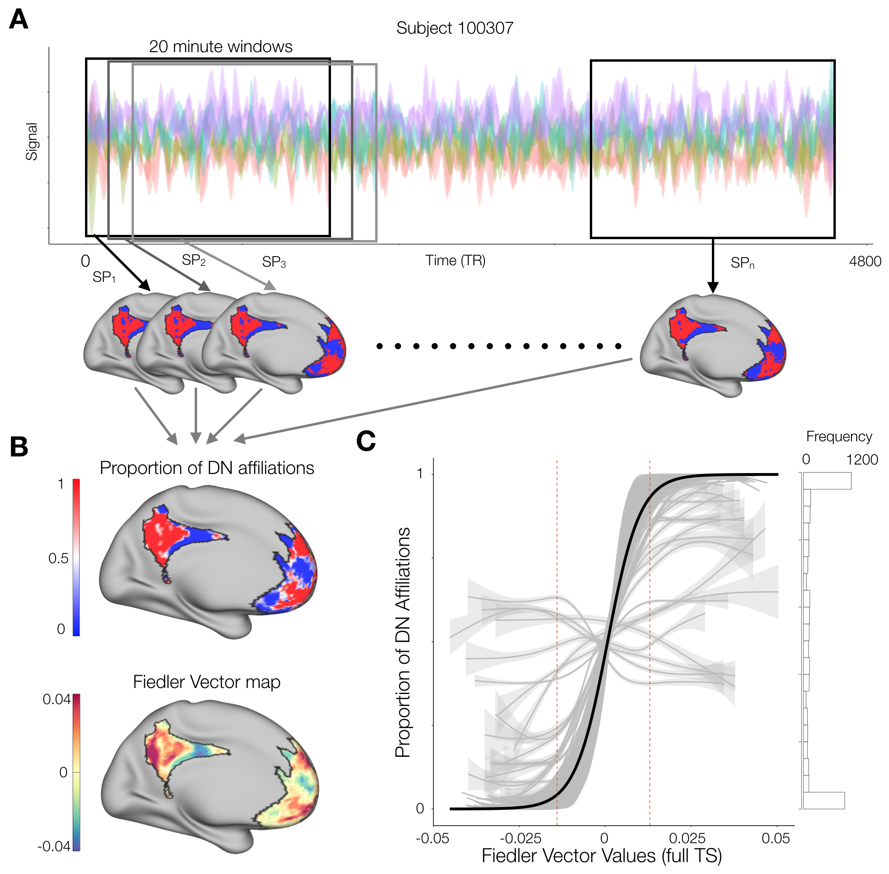

```{r setup, include = FALSE}
knitr::opts_chunk$set(echo = FALSE, warning = FALSE)
```

```{r Libraries and functions, include = FALSE, echo = FALSE}

Cols <- c("aquamarine4", "#D9541A", rgb(190,190,190,100, maxColorValue = 255)) 

# In case I want to visualize stuff in the brain
labelCoords_vertex <- read.csv2('labelCoords_vertex.csv', sep = ",")[, 2:6]
labelCoords_vertex <- transform(labelCoords_vertex, x = as.numeric(as.character(x)), y = as.numeric(as.character(y)), z = as.numeric(as.character(z)))

# general options
threshMaps <- TRUE # Whether to apply subject-wise thresholds on maps or not
permuting <- FALSE # show permutation progress?

# Libraries used for the whole process
library(tidyverse)
library(igraph)
library(pander)
library(ggnetwork)
library(ggplot2)
library(gridExtra)
library(data.table)
library(plyr)
library(mcclust)
library(lme4)
library(parallel)
library(corrplot)
library(DescTools)
library(knitr)


# produce one permutation instance of the meta-analysis (so it can be fed to mclapply for quicker results)
metaPerm <- function(list1 = studyList_sv, list2 = studyList_DN, labels = Yeo_labels, perm = 1) {
  
  # print every 100th permutation just to have a general sense of how far we are
  if ((perm %% 100) == 0) {sprintf("Permutation %s", perm)}
  
  # combine study lists
  allStudies <- c(studyList_sv, studyList_DN)
  
  # Sample all the studies and divide into 2 groups
  randPerm <- sample(allStudies)
  tmpSV <- randPerm[seq(length(list1))]
  tmpDN <- randPerm[-seq(length(list1))]
  
  # Count the number of times each region was reported in the literature
  tmpDF <- data.frame(Parcel = gsub("_", "", labels),
                      SV = sapply(labels, function(roi) {length(grep(roi, tmpSV))}),
                      DN = sapply(labels, function(roi) {length(grep(roi, tmpDN))}))
  
  # Perform the prop test for each pair and get the max chi-squared stat
  maxStat <- max(
    apply(tmpDF[, 2:3], 1, function(data) {
      prop.test(data, c(length(tmpSV), length(tmpDN)))$statistic
    }
    ), na.rm = T)
  
  return(maxStat)
  
}


## Cohen's D for 2 groups
# for a more flexible approach, make the data input to be a list with entries for n groups, 
# then do length(list) for the number of groups. 
cohenD <- function(group1 = 1, group2 = 2){
  
  # means
  mean1 <- mean(group1, na.rm = T)
  mean2 <- mean(group2, na.rm = T)
  
  # variance
  var1 <- var(group1, na.rm = T)
  var2 <- var(group2, na.rm = T)
  
  # equation
  out <- (mean1 - mean2) / sqrt((var1 + var2)/2)
  
  return(out)
  
}

## log-log degree distribution
logDegreeDist <- function(Graph = padjMat) {
  
  tempD <- degree(Graph)
  tempDD <- degree.distribution(Graph) # frequency of occurrencies of certain degrees
  d <- (0:(max(tempD)-1))
  ind <- (tempDD!=0)
  plot(d[ind], tempDD[ind], log = "xy", col = "blue", 
       xlab = "Log-Degree", ylab = "Log-Intensity",  
       main = "Log-Log Degree Distribution")
  
}


## Create correlation matrix between vertices of 2 ROIs
# Requires labeled time series matrix
vertexCorrMat <- function(ROI_1 = 'R_7m_ROI', ROI_2 = 'L_7m_ROI'){
  
  # extract the time series from the ROIs
  indexing_1 <- which(rownames(timeSeries)==as.character(ROI_1))
  indexing_2 <- which(rownames(timeSeries)==as.character(ROI_2))
  nVerts_1 <- length(indexing_1)
  nVerts_2 <- length(indexing_2)
  ROI_1_tseries <- timeSeries[indexing_1, ]
  ROI_2_tseries <- timeSeries[indexing_2, ]
  
  # Create empty matrix
  corrMat <- matrix(data = 0, nrow = nVerts_1, ncol = nVerts_2)
  
  # 
  for (vertex_1 in seq(nVerts_1)){
    
    # temp series 1
    tempOne <- ROI_1_tseries[vertex_1, ]
    
    for(vertex_2 in seq(nVerts_2)){
      
      # temp series 2
      tempTwo <- ROI_2_tseries[vertex_2, ]
      
      # store the Pearson correlation in the corr matrix
      corrMat[vertex_1, vertex_2] <- cor(tempOne, tempTwo, method = "pearson") 
      
    }
  }
  
  # name the dimensions of the matrix according to the surface vertex index
  rownames(corrMat) <- indexing_1
  colnames(corrMat) <- indexing_2
  
  # plot (optional?)  
  # unclustered heatmap
  heatmap(corrMat,
          Rowv = NA,
          Colv = NA,
          scale = "row",
          col = pallette(1000))
  
  # clustered heatmap
  heatmap(corrMat,
          scale = "row",
          col = pallette(1000))
  
  # print min-max corr vals
  print(range(corrMat))
  
  return(corrMat)
  
}


## Correlation matrix between an ROI and the Glasser parcels
parcelCorrMat <- function(ROI = 'R_7m_ROI', lbels = lookup$V1){
  
  # extract the time series from the ROIs
  indexing <- which(rownames(timeSeries)==as.character(ROI))
  nVerts <- length(indexing)
  ROI_tseries <- timeSeries[indexing, ]
  
  # create empty matrix to store values
  corrMat <- matrix(data = 0, nrow = nVerts, ncol = 360)
  
  # Loop through every combination of label and 7m vertex
  for (Parcel in lbels){
    
    # Get an ROI index to retrieve timeseries and store correlation vals
    indxROI <- which(lbels==as.character(Parcel))
    
    for(vertex in seq(nVerts)){
      
      # temp series
      tempROI <- as.numeric(ptSeries[indxROI, ])
      tempVertex <- ROI_tseries[vertex, ]
      
      # store the Pearson correlation in the corr matrix
      corrMat[vertex, indxROI] <- cor(tempROI, tempVertex, method = "pearson") 
      
    }
  }
  
  # name the columns according to labels
  colnames(corrMat) <- lbels
  rownames(corrMat) <- indexing
  
  # plot (optional?)  
  # unclustered heatmap
  heatmap(corrMat,
          Rowv = NA,
          Colv = NA,
          scale = "none",
          col = pallette(1000))
  
  # clustered heatmap
  heatmap(corrMat,
          scale = "none",
          col = pallette(1000))
  
  # print min-max corr vals
  print(range(corrMat))
  
  return(corrMat)
  
}


## Correlation matrix between an Parcel and every other grayordinate
# THIS CAN BE OPTIMIZED WITH A BETTER USE OF COR()
partoverCorrMat <- function(ROI = 'R_7m_ROI', lbels = verts[[1]]){
  
  # extract the time series from the ROI
  indexing <- which(rownames(ptSeries)==as.character(ROI))
  ROI_tseries <- as.numeric(ptSeries[indexing, ])
  
  # get the remaining number of vertices
  nVerts <- length(lbels) 
  
  # Create data frame to store values
  parcelIndx <- which(labelCoords_parcel$Label==ROI)
  corrVec <- data.frame(Seed = rep(ROI, nVerts),
                        Labels = lbels,
                        xstart = rep(labelCoords_parcel$x[parcelIndx], nVerts), # 7.33324 for R_7m
                        ystart = rep(labelCoords_parcel$y[parcelIndx], nVerts), # -63.142
                        zstart = rep(labelCoords_parcel$z[parcelIndx], nVerts)) # 42.5578
  
  for(vertex in seq(nVerts)){
    
    # temp series
    tempVertex <- timeSeries[vertex, ] 
    
    # store the Pearson correlation in the corr matrix
    #corrVec$Correlation[vertex] <- cor(ROI_tseries, tempVertex, method = "pearson") 
    
    # Another option, so that FDR can be applied
    tempCor <- cor.test(ROI_tseries, tempVertex, method = "pearson")
    corrVec$Correlation[vertex] <- tempCor$estimate
    corrVec$pval[vertex] <- tempCor$p.value
    
  }
  
  # Turn ROI vertices into 0s
  indexing <- which(corrVec$Labels==as.character(ROI))
  corrVec$Correlation[indexing] <- 0
  
  # Create a column with p-vals corrected for multiple comparisons
  corrVec$adjPval <- p.adjust(corrVec$pval, "BY")
  
  # normalize correlation vals for analysis (see below)
  tempTanh <- fisherTanh(Data = corrVec$Correlation)
  corrVec$tanhZ <- tempTanh$tanhZ
  corrVec$tanhPvals <- tempTanh$pvals
  corrVec$tanhPAdjusted <- tempTanh$adjustPvals
  
  return(corrVec)
  
}


## tanh-z transformation (variance stabilizing Fisher) and p-values (adjusted and not)
# This takes either a matrix of correlation values (vectors too, but manually compute pvals)
# Normalization approach suggested in network textbook (equation 7.20)
# This transformation is approximately normal with mean 0 and sd = sqrt(1 / (n - 3))
fisherTanh <- function(Data = padjMatrix, preThresh = NA){
  
  transformed <- list()
  
  if (is.numeric(preThresh)) {
    Data[Data == 1] <- 0.999
    Data[Data < preThresh] <- 0
    transformed$tanhZ <- 0.5 * log((1 + Data) / (1 - Data))
  } else {
    # tanh
    Data[Data == 1] <- 0.999
    transformed$tanhZ <- 0.5 * log((1 + Data) / (1 - Data))
    
    # p-vals
    if (is.matrix(Data)) {
      z.vec <- transformed$tanhZ[upper.tri(transformed$tanhZ)]
      n <- dim(Data)[1]
    } else if (is.vector(Data)) {
      z.vec <- transformed$tanhZ
      n <- length(Data)
    }
    transformed$pvals <- 2 * pnorm(abs(z.vec), 0 , sqrt(1 / (n-3)), lower.tail=F)
    
    # adjust pvals
    transformed$adjustPvals <- p.adjust(transformed$pvals, "BH")
    
    if (is.matrix(Data)) {
      # get pvals and their adjustment into a symetric matrix form
      # regular
      tempMat <- matrix(0, dim(Data)[1], dim(Data)[2])
      tempMat[upper.tri(tempMat)] <- transformed$pvals
      tempMat[lower.tri(tempMat)] <- transformed$pvals
      dimnames(tempMat) <- list(rownames(Data), rownames(Data))
      transformed$pvals <- tempMat
      
      # adjusted
      tempMat <- matrix(0, dim(Data)[1], dim(Data)[2])
      tempMat[upper.tri(tempMat)] <- transformed$adjustPvals
      tempMat[lower.tri(tempMat)] <- transformed$adjustPvals
      dimnames(tempMat) <- list(rownames(Data), rownames(Data))
      transformed$adjustPvals <- tempMat
      
      # retain only the significant adjusted pval Z scores
      transformed$tanhZ[transformed$adjustPvals > 0.05] <- 0
    }
  }
  
  return(transformed)
  
}


## Extract the centroid-most vertex from each parcel
parcelCentroid <- function(ROI = 'R_7m_ROI', all_coordinates = labelCoords_vertex){
  
  # The coordinate file must contain a Label column
  
  # Get the ROI-specific vertices
  indx <- grep(ROI, all_coordinates$Label)
  
  # Grab the coordinates
  tempCoords <- all_coordinates[indx, c("x","y","z")]
  rownames(tempCoords) <- indx
  
  # Compute the distance among all vertices, and turn into a matrix
  tempDist <- dist(tempCoords, diag = T)
  tempDist <- as.matrix(tempDist)
  
  # Compute the sum of distances for each vertex, and get the minimum
  sumDists <- colSums(tempDist)
  minDist <- which(sumDists == min(sumDists))
  minDist <- indx[minDist]
  
  return(minDist)
  
}


## This function takes the output from partoverCorrMat() and adds/removes the characteristics we decided on.
prepROItoVer <- function(Data = R_7m_allCorr, Coordinates = labelCoords_vertex){
  
  # Add vertex coordinates
  tempDframe <- cbind(Data, Coordinates[,1:3])
  
  # Remove rows with non-significant adjusted pvalues
  indx <- tempDframe$adjPval < 0.05
  tempDframe <- tempDframe[indx, ]
  
  # Characterize correlation direction and round up vals for plotting
  tempDframe$Relation <- ifelse(tempDframe$Correlation < 0, "Negative", "Positive")
  tempDframe$Correlation <- round(tempDframe$Correlation, digits = 2)
  
  # Add a column to differentiate between left/right hemispheres
  tempDframe$Hemisphere <- substring(tempDframe$Labels,1,1)
  
  return(tempDframe)
  
}


## Plot correlation from ROI to rest of vertices
plotROItoVertex <- function(Data = R_7m_allCorr, ROI = 'R_7m_ROI', ColRange = Cols, View = "Axial", Legends = TRUE){
  
  ROIindx <- grep(ROI, Data$Labels)
  ROIvertices <- Data[ROIindx,c("x","y","z")] # grab ROI-specific vertices to black out
  labelCoord <- ROIvertices[1,] # just to place the label
  
  if (View == "Axial") {
    ggplot() +
      geom_point(data = Data, aes(x=x, y=y, alpha=.5, color = Correlation), show.legend = Legends) +
      geom_point(data = labelCoords_vertex, aes(x=x, y=y), alpha=0.01) +
      geom_nodes(data = ROIvertices, aes(x=x, y=y)) +
      geom_nodelabel_repel(aes(x=labelCoord$x, y=labelCoord$y, label = sub("_ROI","",ROI))) +
      scale_color_gradient2(low = ColRange[1], mid = "white", high = ColRange[2], limits = c(-1,1)) +
      theme_blank()
  } else if (View == "Sagittal") {
    ggplot() +
      geom_point(data = Data, aes(x=y, y=z, alpha=.5, color = Correlation), show.legend = Legends) +
      geom_point(data = labelCoords_vertex, aes(x=y, y=z), alpha=0.01) +
      geom_nodes(data = ROIvertices, aes(x=y, y=z)) +
      geom_nodelabel_repel(aes(x=labelCoord$y, y=labelCoord$z, label = sub("_ROI","",ROI))) +
      scale_color_gradient2(low = ColRange[1], mid = "white", high = ColRange[2], limits = c(-1,1)) +
      theme_blank()
  } else if (View == "Coronal") {
    ggplot() +
      geom_point(data = Data, aes(x=x, y=z, alpha=.5, color = Correlation), show.legend = Legends) +
      geom_point(data = labelCoords_vertex, aes(x=x, y=z),  alpha=0.01) +
      geom_nodes(data = ROIvertices, aes(x=x, y=z), alpha=.5) +
      geom_nodelabel_repel(aes(x=labelCoord$x, y=labelCoord$z, label = sub("_ROI","",ROI))) +
      scale_color_gradient2(low = ColRange[1], mid = "white", high = ColRange[2], limits = c(-1,1)) +
      theme_blank()
  } else if (View == "Medial Right") {
    if (substring(ROI,1,1) == "R") {
      oneHemi <- Data[grep("R", Data$Hemisphere), ]
      oneHemi$Medial <- ifelse(oneHemi$x < 20, "Medial", "Other")
      medialHemi <- oneHemi[which(oneHemi$Medial=="Medial"), ]
      medialHemi$y <- medialHemi$y * -1
      ROIvertices$y <- ROIvertices$y * -1
      labelCoord$y <- labelCoord$y * -1
      oneHemi_all <- labelCoords_vertex[grep("R",labelCoords_vertex$Hemisphere), ] # whole surface
      oneHemi_all$Medial <- ifelse(oneHemi_all$x < 20, "Medial", "Other")
      medialHemi_all <- oneHemi_all[grep("Medial", oneHemi_all$Medial), ]
      medialHemi_all$y <- medialHemi_all$y * -1
      ggplot() +
        geom_point(data = medialHemi, aes(x=y, y=z, alpha=.1, color = Correlation), show.legend = Legends) +
        #geom_point(data = medialHemi_all, aes(x=y, y=z), alpha=0.07) +
        scale_color_gradient2(low = ColRange[1], mid = "white", high = ColRange[2], limits = c(-1,1)) +
        geom_nodes(data = ROIvertices, aes(x=y, y=z), alpha=.5) +
        geom_nodelabel_repel(aes(x=labelCoord$y, y=labelCoord$z, label = sub("_ROI","",ROI))) +
        theme_blank()
    } else {
      oneHemi <- Data[grep("R", Data$Hemisphere), ]
      oneHemi$Medial <- ifelse(oneHemi$x < 20, "Medial", "Other")
      medialHemi <- oneHemi[which(oneHemi$Medial=="Medial"), ]
      medialHemi$y <- medialHemi$y * -1
      ROIvertices$y <- ROIvertices$y * -1
      labelCoord$y <- labelCoord$y * -1
      oneHemi_all <- labelCoords_vertex[grep("R",labelCoords_vertex$Hemisphere), ] # whole surface
      oneHemi_all$Medial <- ifelse(oneHemi_all$x < 20, "Medial", "Other")
      medialHemi_all <- oneHemi_all[grep("Medial", oneHemi_all$Medial), ]
      medialHemi_all$y <- medialHemi_all$y * -1
      ggplot() +
        geom_point(data = medialHemi, aes(x=y, y=z, alpha=.1, color = Correlation), show.legend = Legends) +
        #geom_point(data = medialHemi_all, aes(x=y, y=z), alpha=0.07) +
        scale_color_gradient2(low = ColRange[1], mid = "white", high = ColRange[2], limits = c(-1,1)) +
        theme_blank()
    }
  } else if (View == "Medial Left") {
    if (substring(ROI,1,1) == "L") {
      oneHemi <- Data[grep("L", Data$Hemisphere), ]
      oneHemi$Medial <- ifelse(oneHemi$x > -20, "Medial", "Other")
      medialHemi <- oneHemi[which(oneHemi$Medial=="Medial"), ]
      oneHemi_all <- labelCoords_vertex[grep("R",labelCoords_vertex$Hemisphere), ] # whole surface
      oneHemi_all$Medial <- ifelse(oneHemi_all$x < 20, "Medial", "Other")
      medialHemi_all <- oneHemi_all[grep("Medial", oneHemi_all$Medial), ]
      ggplot() +
        geom_point(data = medialHemi, aes(x=y, y=z, alpha=.1, color = Correlation), show.legend = Legends) +
        #geom_point(data = medialHemi_all, aes(x=y, y=z), alpha=0.07) +
        scale_color_gradient2(low = ColRange[1], mid = "white", high = ColRange[2], limits = c(-1,1)) +
        geom_nodes(data = ROIvertices, aes(x=y, y=z), alpha=.5) +
        geom_nodelabel_repel(aes(x=labelCoord$y, y=labelCoord$z, label = sub("_ROI","",ROI))) +
        theme_blank()
    } else {
      oneHemi <- Data[grep("L", Data$Hemisphere), ]
      oneHemi$Medial <- ifelse(oneHemi$x > -20, "Medial", "Other")
      medialHemi <- oneHemi[which(oneHemi$Medial=="Medial"), ]
      oneHemi_all <- labelCoords_vertex[grep("R",labelCoords_vertex$Hemisphere), ] # whole surface
      oneHemi_all$Medial <- ifelse(oneHemi_all$x < 20, "Medial", "Other")
      medialHemi_all <- oneHemi_all[grep("Medial", oneHemi_all$Medial), ]
      ggplot() +
        geom_point(data = medialHemi, aes(x=y, y=z, alpha=.1, color = Correlation), show.legend = Legends) +
        #geom_point(data = medialHemi_all, aes(x=y, y=z), alpha=0.07) +
        scale_color_gradient2(low = ColRange[1], mid = "white", high = ColRange[2], limits = c(-1,1)) +
        theme_blank()
    }
  }
  
}


## Run a fastgreedy modularity community detection on ROIs
# This function relies on having the timeSeries data uploaded, and labelCoords_vertex 
# Extras dictates whether the community object + correlation matrix should also be extracted
communityDetection <- function(Data = parcelBins$First, ROIS = "None", Type = "vertex", extras = F) {
  
  print(paste('Computing modularity based on', Type))
  
  if (ROIS == "None"){
    
    # This will just do SP for now, for sliding window
    print("Previously concatenated data")
    
    corrMat <- cor(t(Data))
    corrMatrix <- corrMat
    transfMat <- fisherTanh(Data = corrMat)
    
    corrMat <- transfMat$tanhZ
    
    diag(transfMat$tanhZ) <- 0    
    diag(corrMat) <- 0
    
    corrMat <- exp(corrMat)
    corrMat[corrMat==1] <- 0
    transfMat$tanhZ <- corrMat
    
    tempGraph <- graph_from_adjacency_matrix(corrMat, weighted = T, mode = "undirected")
    tempLap <- laplacian_matrix(tempGraph, normalized=T)
    tempEigen <- eigen(tempLap)
    f.vec <- length(tempEigen$values) - 1
    tempEigen$binarized <-  as.factor(ifelse(tempEigen$vectors[,f.vec] > 0, 1, 0)) # binarized Fiedler Vector 
    
    summary <- data.frame(Label = colnames(corrMat),
                          Hemisphere = substring(colnames(corrMat),1,1),
                          EigenVal = tempEigen$values,
                          FiedlerVec = tempEigen$vectors[, (length(tempEigen$values) - 1)],
                          FiedlerBinary = tempEigen$binarized)
    
    ## Get the final components
    if (extras == T) {
      modularityResults <- list(CorrMatrix = corrMatrix,
                                TransfMatrix = transfMat,
                                Summary = summary)
    } else {
      modularityResults <- list(Summary = summary)
    }
    
  } else {
    
    if (Type == "vertex") {
      # To store the vertex indices corresponding to the ROIs
      indx <- numeric()
      
      # had to place dashes on each side because grep grabbed strings containing the names (i.e. 47m, a24pr)
      for (ROI in ROIS) {
        indx <- c(indx, grep(ROI, rownames(Data)))  
      }
      
      nVerts <- length(indx)
      ROI_tseries <- Data[indx, ]
      
      # This used to be done with the for loop, but it was too slow. cor() speeds up the process by a lot
      corrMat <- cor(t(ROI_tseries))
      
      # name the dimensions of the matrix according to the surface vertex index
      rownames(corrMat) <- indx
      
      # for storing later
      corrMatrix <- corrMat
      
      # transform to Fisher's (think of thresholding)
      transfMat <- fisherTanh(Data = corrMat)
      
      # Store Fisher transformed vals for graphing
      corrMat <- transfMat$tanhZ
      
      # diagonals of 1 could be interpreted as self-loops
      diag(transfMat$tanhZ) <- 0    
      diag(corrMat) <- 0
      
      # Exponentiate to preserve distribution while ensuring positive weights
      # I'm keeping corrMat and transfMat$tanhZ separate in case I want to uncorrect transfMat in the future
      corrMat <- exp(corrMat)
      corrMat[corrMat == 1] <- 0
      transfMat$tanhZ <- corrMat
      
      # community detection
      # I initially used the absolute value of the correlation, but the exp preserves the distribution 
      # Next, try using the fisher transform
      
      tempGraph <- graph_from_adjacency_matrix(corrMat, weighted = T, mode = "undirected")
      tempCommunity <- fastgreedy.community(tempGraph)
      
      # community object
      #modularityResults$community <- tempCommunity
      
      # correlation matrix with transformed values
      #modularityResults$corrMat <- corrMatrix
      
      # get coordinate info from selected regions (useful for ggplot)
      summary <- data.frame(Vertex = indx,
                            Label = tempCommunity$names,
                            Membership = tempCommunity$membership,
                            Modularity = tempCommunity$modularity,
                            x = labelCoords_vertex[indx, "x"],
                            y = labelCoords_vertex[indx, "y"],
                            z = labelCoords_vertex[indx, "z"],
                            Hemisphere = substring(tempCommunity$names,1,1))
      
      
    } else if (Type == "parcels") {
      
      # This used to be done with the for loop, but it was too slow. cor() speeds up the process by a lot
      corrMat <- cor(t(Data))
      
      # for storing later
      corrMatrix <- corrMat
      
      # transform to Fisher's (think of thresholding)
      transfMat <- fisherTanh(Data = corrMat)
      
      # Store Fisher transformed vals for graphing
      corrMat <- transfMat$tanhZ
      
      # diagonals of 1 could be interpreted as self-loops
      diag(transfMat$tanhZ) <- 0
      diag(corrMat) <- 0
      
      # Exponentiate to preserve distribution while ensuring positive weights
      # I'm keeping corrMat and transfMat$tanhZ separate in case I want to uncorrect transfMat in the future
      corrMat <- exp(corrMat)
      corrMat[corrMat==1] <- 0
      transfMat$tanhZ <- corrMat
      
      # community detection
      # I initially used the absolute value of the correlation, but the exp preserves the distribution 
      # Next, try thresholding it by the adjusted p-vals
      tempGraph <- graph_from_adjacency_matrix(corrMat, weighted = T, mode = "undirected")
      tempCommunity <- fastgreedy.community(tempGraph)
      
      # community object
      #modularityResults$community <- tempCommunity
      
      # correlation matrix with transformed values
      #modularityResults$corrMat <- corrMatrix
      
      # get coordinate info from selected regions (useful for ggplot)
      summary <- data.frame(Label = tempCommunity$names,
                            Membership = tempCommunity$membership,
                            Modularity = tempCommunity$modularity,
                            x = labelCoords_parcel[ ,"x"],
                            y = labelCoords_parcel[ ,"y"],
                            z = labelCoords_parcel[ ,"z"],
                            Hemisphere = substring(tempCommunity$names,1,1))
      
    }
    
    
    ## Get the final components
    modularityResults <- list(Community = tempCommunity,
                              CorrMatrix = corrMatrix,
                              TransfMatrix = transfMat,
                              Summary = summary)
    
  }
  
  return(modularityResults)
 
}


## plot the communities from communityDetection
plotCommunities <- function(Data = modularityResults, Hemi = "R", type = "Membership", Legends = T, bground=0.1, Cols = c("aquamarine4", "#D9541A")) {
  # This takes the output from the communityDetection function and plots them on the medial wall (since we're interested in medial now)
  # type is the name of the column to plot
  if (Hemi == "R") {
    # "Medial Right"
    oneHemi <- Data[grep("R", Data$Hemisphere), ] # from the ROIs
    oneHemi$Medial <- ifelse(oneHemi$x < 20, "Medial", "Other")
    medialHemi <- oneHemi[grep("Medial", oneHemi$Medial), ]
    medialHemi$y <- medialHemi$y * -1
    oneHemi_all <- labelCoords_vertex[grep("R",labelCoords_vertex$Hemisphere), ] # whole surface
    oneHemi_all$Medial <- ifelse(oneHemi_all$x < 20, "Medial", "Other")
    medialHemi_all <- oneHemi_all[grep("Medial", oneHemi_all$Medial), ]
    medialHemi_all$y <- medialHemi_all$y * -1
    ggplot() + 
      geom_point(data = medialHemi, aes_string(x="y", y="z", color = type), show.legend=Legends) +
      geom_point(data = medialHemi_all, aes(x=y, y=z), alpha=bground) +
      scale_color_gradient(low = Cols[1], high = Cols[2]) +
      theme_blank() 
  } else if (Hemi == "L") {
    # "Medial Left"
    oneHemi <- Data[grep("L", Data$Hemisphere), ]
    oneHemi$Medial <- ifelse(oneHemi$x > -20, "Medial", "Other")
    medialHemi <- oneHemi[which(oneHemi$Medial=="Medial"), ]
    oneHemi_all <- labelCoords_vertex[grep("L",labelCoords_vertex$Hemisphere), ] # whole surface
    oneHemi_all$Medial <- ifelse(oneHemi_all$x > -20, "Medial", "Other")
    medialHemi_all <- oneHemi_all[grep("Medial", oneHemi_all$Medial), ]
    ggplot() + 
      geom_point(data = medialHemi, aes_string(x="y", y="z", color = type), show.legend=Legends) +
      geom_point(data = medialHemi_all, aes(x=y, y=z), alpha=bground) +
      scale_color_gradient(low = Cols[1], high = Cols[2]) +
      theme_blank() 
  }
}


## get ROI coords & index
# The point here is to reduce the summary dframes from community detection to show only ROIs
# Should work for extracting any label-indexed dframe though
# I wanted to also get the index in case I want to extract specific rows from parcel/vertex coord dframes
getCoords <- function(Labels = DN_labels, Coords = labelCoords_parcel, TimeSeries = FALSE){
  
  indx <- numeric()
  
  # If you want to select time series from raw data
  if (TimeSeries == TRUE) {
    
    for (ROI in Labels) {
      indx <- c(indx, grep(ROI, rownames(Coords)))
    }
    
  } else { # for the summary output of the community detection output
    
    for (ROI in Labels) {
      indx <- c(indx, grep(ROI, Coords$Label))
    }
    
  }
  
  results <- list()
  results$Index <- indx
  results$Coords <- Coords[indx, ]
  
  return(results)
  
}


# eigen value community detection
eigenVals <- function(Data = binnedCommunities_p$First) {
  
  # This will produce a vector of values, ready to be plotted
  tempGraph <- graph_from_adjacency_matrix(Data$TransfMatrix$tanhZ, mode = "undirected", weighted = T)
  tempGraph <- laplacian_matrix(tempGraph, normalized=T)
  tempGraph <- eigen(tempGraph)
  f.vec <- length(tempGraph$values) - 1
  tempGraph$binarized <-  as.factor(ifelse(tempGraph$vectors[,f.vec] > 0, 1, 0)) # binarized Fiedler Vector
  
  return(tempGraph)
  
}


# Attempt at setting up data for confusion matrices and Jaccard index calculations
confusionMatrix <- function(partition1 = parcelCommunities[[1]]$Membership, partition2 = parcelCommunities[[1]]$FiedlerBinary) {
  
  # Divide partitions to evaluate
  # Usually 2 will be fiedler
  
  # Check if any partition has 0s (since I binarize the Fiedler vector)
  if (0 %in% partition1) {
    
    partition1[grep(0, partition1)] <- 1
    partition1[grep(1, partition1)] <- 2
    
  } 
  
  if (0 %in% partition2) {
    
    partition2[grep(1, partition2)] <- 2   
    partition2[grep(0, partition2)] <- 1
    
  }
  
  # Community sizes
  commSizes1 <- table(partition1)
  commSizes2 <- table(partition2)
  
  # Number of communities per partition
  nComms1 <- length(commSizes1)
  nComms2 <- length(commSizes2)
  
  # Number of vertices
  n <- length(partition1)
  
  # Putting together elements of the confusion matrix
  confMatrix <- matrix(nrow = nComms1,
                       ncol = nComms2)
  
  for (i in as.numeric(case.names(commSizes1))) {
    
    # Vertices belonging to community qX of partition X
    tempComm1 <- partition1 == i
    
    for (j in as.numeric(case.names(commSizes2))) {
      
      # Vertices belonging to community qY of partition Y
      tempComm2 <- partition2 == j
      
      # Populate matrix
      confMatrix[i,j] <- sum(tempComm1 & tempComm2) 
      
    }
  }
  
  if (sum(confMatrix) != n) {warning('Sum of the confusion matrix is not equal to number of vertices')}
  
  
  return(confMatrix)
  
}


# Permutation for 2 groups
permute <- function(group1 = 1, group2 = 2, statType = mean, nPerms = 5000, paired = FALSE){
  
  # prep data
  summaryPerm <- list()
  lOne <- length(group1)
  lTwo <- length(group2)
  bigSample <- c(group1,group2)  
  
  if (paired == FALSE) {
    
    
    for (i in 1:nPerms){
      
      # relabel samples
      tempBig <- sample(bigSample)
      tempOne <- tempBig[seq(lOne)]
      tempTwo <- tempBig[-seq(lOne)]
      
      # stats
      tempDiffs <- statType(tempOne,na.rm=T) - statType(tempTwo,na.rm=T)
      summaryPerm$jointDist[i] <- tempDiffs # statType(tempDiffs, na.rm = T) 
      
    }  
    
  } else {
    
    for (i in 1:nPerms){
      
      # shift labels in a pairwise fashion
      tempDiffs <- statType((-1)^rbinom(lOne,1,0.5) * (group1 - group2))
      summaryPerm$jointDist[i] <- tempDiffs
      
    }
    
  }
  
  # get the observed difference
  diffs <- statType(group1,na.rm=T) - statType(group2,na.rm=T)
  observedAbs <- abs(diffs) # maybe leave it as means here
  observed <- diffs
  summaryPerm$Pval <- 2 * (1 - ecdf(summaryPerm$jointDist)(observedAbs))
  if (length(unique(abs(summaryPerm$jointDist))) == 1) {summaryPerm$Pval <- 1} # if the difference is always the same, then p = 1
  summaryPerm$Observed <- observed
  
  return(summaryPerm)
  
}


# Non-parametric Bootstrap for a single group
bootstrap <- function(group = 1, statType = mean, B = 5000){
  
  # prep param
  bootStats <- rep(0,B)
  
  # iterate
  for(b in 1:B){
    
    # wait group
    x <- sample(group,length(group),replace=T)  
    bootStats[b] <- statType(x,na.rm = T)
    
  }
  
  return(bootStats)
  
}


# number of times a node changes affiliation in a time series
flexibility <- function(Data = cbind(1:10, 6:15)) {
  # Calculation of flexibility based on Garcia et al., 2018  
  # This function takes in a data frame or matrix in which columns are the community affiliation 
  # It needs at least 2 colums, although it's pointless for that  
  
  # How many jumps can there be?
  nJumps <- dim(Data)[2] - 1
  
  # Matrix to store jumps
  jumpCount <- matrix(nrow = dim(Data)[1], ncol = nJumps)
  
  # For each transition, get the which nodes changed affiliation
  for (jump in seq(nJumps)) {
    
    jumpCount[, jump] <- Data[, jump] != Data[, jump + 1]
    
  }
  
  # How many times did every node jump?
  totalJumps <- rowSums(jumpCount)
  
  # Calculate the flexibility per node
  flexibility <- totalJumps / nJumps
  
  return(flexibility)
  
}


# Sliding window
slidingWindow <- function(subjTS = ROI_timeSeries[[1]], mins = 15, jump = 1, Spectral = T, Modularity = F, ROIs = c("_7m_", vmPFC_labels)) {
  # This is a fairly specific function. It takes the time series from a participant and preps/runs community detection at each specified time window. 
  # Returns the summaries for each window (based on communityDetection function)
  # The selection of a window size is based on the fact that a TR = 0.720s and an hour is 5000 TRs (HCP-based)
  # Since each subject has a different amount of time points, and all are slightly under 1 hr, I chose to round down the number of window moves to avoid unevenness
  # 
  # Parameter definitions:
  #   
  #   subjTS: Subject time series. Note: if you want to look at more than vmpfc and 7m, add a parameter for the labels that can be passed to the community detection function
  # 
  #   mins: Size of the window that will slide through the data.
  #   
  #   jump: Steps (in mins) advanced per slide
  #   
  #   Spectral: Whether to compute spectral partitioning as well. Takes significantly longer, but might be more useful for bisections
  #
  # Right now this takes ~27 mins per subject to run. Think of ways to improve that.
  
  
  # Adapted so it works with the output from getCoords
  # One wouldn't really apply a full-brain analysis of this sort anyways, too computationally intensive
  indx <- subjTS$Index
  subjTS <- subjTS$Coords
  
  # Window sizing (length)
  # Think about incorporating custom TRs
  TS <- dim(subjTS)[2] # time series for the subject
  WS <- seq(834 * (mins/10)) # window from the first TR up to 834 (~10 mins) times the desired multiplier
  jump <- 84 * jump # 84 ~ 1 min, times the number of mins that the window moves
  nJumps <- floor((TS - length(WS)) / jump) # number of jumps to be performed, based on the selected parameters
  
  ##------- using lapply
  winData <- mclapply(seq(nJumps), function(x) subjTS[,WS+(jump*(x-1))])
  commTS <- mclapply(winData, communityDetection, ROIS = "None", Type = "vertex", thresh = T, extras = F)
  return(commTS)
  
}


# compare sliding window data to overall communities
slideCompare <- function(subjData = slideCommunities[[1]], template = vmpfc7mCommunities[[1]], func = "RI", comm = "Spectral") {
  # This function compares the community partition from each window slide to the one derived from the whole data set
  # 
  # Parameter definitions:
  #   
  #   subjData: A participant's output from slideCommunities
  #   
  #   template: The partition from the whole time series
  # 
  #   func: Which function to use for comparing ("RI" for adjusted RI, "VI" for variation of information)
  # 
  #   comm: The subject data might contain modularity and spectral partitions. Choose which to use.
  
  # For storing RIs or VIs
  tempComparison <- numeric()
  
  # How many jumps does the original data contain?
  nJumps <- length(subjData)
  
  # This loop is technically backwards. I should technically divide by function, then partition method, and then run the window comparisons
  # It's still really fast, so I won't worry.
  for (Win in seq(nJumps)) {
    if (comm == "Modularity") {
      if (func == "RI") {
        tempComparison[Win] <- arandi(subjData[[Win]]$Membership, template$Membership, adjust = T)
      } else if (func == "VI") {
        tempComparison[Win] <- vi.dist(subjData[[Win]]$Membership, template$Membership)
      }
    } else if (comm == "Spectral") {
      if (func == "RI") {
        tempComparison[Win] <- arandi(subjData[[Win]]$FiedlerBinary, template$FiedlerBinary, adjust = T)
      } else if (func == "VI") {
        tempComparison[Win] <- vi.dist(subjData[[Win]]$FiedlerBinary, template$FiedlerBinary)
      }
    }
  }
  
  return(tempComparison)
  
}

# Ensure that all spectral communities associated with 7m (i.e. DN) have the same label value of 1 
evenSpectral <- function(Data = slideCommunities[[1]][[7]]) {
  
  # Get only the values for 7m
  shortData <- Data[grep("_7m_", Data$Label), ]
  
  # Get 7m's most probable affiliation
  affil <- mean(as.numeric(shortData$FiedlerBinary)-1)
  
  # If it is close to 1, then invert the labeling. 
  # Note: This has no effect on RI or VI, since they are insensitive to actual labeling
  # This is for visualization purposes only
  if (affil < 0.5) {
    
    UD <- as.numeric(Data$FiedlerBinary) - 1
    Data$FiedlerBinary <- as.factor((UD - 1)^2)
    Data$FiedlerVec <- Data$FiedlerVec * -1
    
  }
  
  return(Data)
  
}

# Create a vector ready to be used for HCP data (32k CIFTI surface)
# The input should be the summary from community partitioning
# Once this is created, go to the terminal and input something like this
# wb_command -cifti-convert -from-text dataforCifti.txt 100307.MyelinMap_BC.32k_fs_LR.dscalar.nii testCifti.dscalar.nii
# Where the myelin file here is just a templace. It can be any dscalar.nii with the right surface size
HCPOut <- function(Data = DNval7mCommunities[[1]], MOI = "Membership", SubjID = "100307", padding = 0){
  
  nVertices <- 59412
  tempVec <- rep(padding, nVertices)
  temp <- grep(MOI, colnames(Data))
  tempVec[Data$Vertex] <- Data[[temp]]
  write.table(file = paste(SubjID,"_",MOI,'_dataforCifti.txt', sep=""), tempVec, row.names = F, col.names = F, dec = ".")
  
}

# Perform pairwise comparisons of clustering outcomes on all subjects
comparePartitions <- function(Data = DNval7mCommunities, MOI = "FiedlerBinary", Index = "VI", nSubjects = nSubj, subjNames = subjList) {
  # This function will compare the community partitions from all subjects and create a 'comparison matrix' for every pairwise combination of subjects
  # Alternatively, if a second MOI is added 
  # Inputs
  # 
  # Data: the list of summaries produced by the script
  # 
  # MOI: measure of interest (usually the binarized Fiedler vector). If a vector, compares across algorithms per subject
  # 
  # Index: VI for variation of information, RI for the adjusted rand index, Cor for a Pearson correlation
  # ARI can yield many decimals, thus inflating the ratios. I thus round at 4 decimals.
  
  # NOTES:
  # you can apply pairwise comparisons with outer: outer(tempList,tempList,FUN = Vectorize(arandi, SIMPLIFY = FALSE, USE.NAMES = FALSE))
  
  # Get the column position of the MOI(s)
  Columns <- colnames(Data[[1]])
  indx <- as.numeric(Columns %in% MOI)
  MOI_indx <- which(indx==1)
  
  if (length(MOI_indx) < 2) {
    # Combine the measures of interest
    allVecs <- do.call(cbind, lapply(Data, "[[", MOI))
    
    # Create empty matrix
    indexMatrix <- matrix(data = NA, nrow = nSubjects, ncol = nSubjects)
    dimnames(indexMatrix) <- list(subjNames, subjNames)
    
    # Run every pairwise comparison with the index of interest on the measure of interest
    if (Index == "VI") {
      for (subj in seq(nSubjects)) {
        for (subj2 in seq(nSubjects)) {
          indexMatrix[subj,subj2] <- vi.dist(allVecs[, subj], allVecs[, subj2])
        }
      }
    } else if (Index == "RI") {
      for (subj in seq(nSubjects)) {
        for (subj2 in seq(nSubjects)) {
          indexMatrix[subj,subj2] <- arandi(allVecs[, subj], allVecs[, subj2], adjust = T)
        }
      }
    } else if (Index == "Cor") {
      for (subj in seq(nSubjects)) {
        for (subj2 in seq(nSubjects)) {
          indexMatrix[subj,subj2] <- cor(allVecs[, subj], allVecs[, subj2], method = "spearman")
        }
      }
    }
    
    indexMatrix <- round(indexMatrix, digits = 4)
    
  } else {
    indexMatrix <- data.frame(SubjID = as.character(subjList),
                              Index = rep(0, nSubjects))
    # Run every pairwise comparison with the index of interest on the measure of interest
    if (Index == "VI") {
      for (subj in seq(nSubjects)) {
        indexMatrix$Index[subj] <- vi.dist(Data[[subj]][, MOI_indx[1]], Data[[subj]][, MOI_indx[2]])
      }
    } else if (Index == "RI") {
      for (subj in seq(nSubjects)) {
        indexMatrix$Index[subj] <- arandi(Data[[subj]][, MOI_indx[1]], Data[[subj]][, MOI_indx[2]], adjust = T)
      }
    } else if (Index == "Cor") {
      for (subj in seq(nSubjects)) {
        indexMatrix$Index[subj] <- cor(Data[[subj]][, MOI_indx[1]], Data[[subj]][, MOI_indx[2]], method = "spearman")
      }
    }
    
    indexMatrix$Index <- round(indexMatrix$Index, digits = 4)
  
  }
  
  return(indexMatrix) 
  
}

# Generate a matrix with submatrices of 1s of a given size along the diagonal
# Useful to extract specific portions of data from a similarity matrix
diagBlocks <- function(dims = 20, sqSize = 4) {
  div <- dims %/% sqSize
  finalMatrix<-matrix(0,nrow=dims,ncol=dims)
  index <- 1
  for(k in seq(div)){
    finalMatrix[index:(index + (sqSize-1)),index:(index + (sqSize-1))] <- 1
    index<-index + sqSize
  }
  finalMatrix <- finalMatrix == 1
  finalMatrix
}

# This function will select a two-tailed fiedler vector threshold with respect to the stability of the vertex
# The threshold will be based on proportion DN given by thresholdRange
threshFV <- function(Data, thresholdRange = c(0.01, 0.99), nthresh = 50) {

  ## Check if the proportions even go that low, otherwise replace by next most stable low/high value
  # get the 2 values with highest reports (this should be stable upper/lower proportions)
  stableExtremes <- sort(table(Data$slidePropDN), decreasing = T)[seq(2)]
  stableExtremes <- sort(as.numeric(names(stableExtremes)))
  
  
  # if the values are not extreme enough, replace the original threshold with the new stable ones
  if (thresholdRange[1] < stableExtremes[1]) {
    
    thresholdRange[1] <- stableExtremes[1]
    
  }
  
  if (thresholdRange[2] > stableExtremes[2]) {
    
    thresholdRange[2] <- stableExtremes[2]
    
  }
  
  ## Run the actual process
  # placeholder to be returned
  thresholds <- c(NA,NA)
  
  
  # start the counter at chance
  meanProp <- 0.5
  
  
  # select a range of FV values
  thresh <- seq(0, min(Data$FiedlerVec), length.out = nthresh)
  
  
  # Iterate over the possible FV until DN affiliations go below 1%
  count <- 1
  while (meanProp >= thresholdRange[1]) {
    
    # get the mean proportion of DN from remaining vertices based on putative threshold
    meanProp <- Data %>% filter(FiedlerVec <= thresh[count]) %>% summarize(mean(slidePropDN))
    
    # if a threshold meets requirement, store its value
    if (meanProp <= thresholdRange[1]) {
      thresholds[1] <- thresh[count]
    }

    count <- count + 1
    
  }
  
  
  # repeat for the upper threshold
  # restart parameters
  meanProp <- 0.5
  thresh <- seq(0, max(abs(Data$FiedlerVec)), length.out = nthresh)
  
  
  # Iterate over the possible FV until DN affiliations go over 99%
  count <- 1
  while (meanProp <= thresholdRange[2]) {
    
    # get the mean proportion of DN from remaining vertices based on putative threshold
    meanProp <- Data %>% filter(FiedlerVec > thresh[count]) %>% summarize(mean(slidePropDN))
    
    # if a threshold meets requirement, store its value
    if (meanProp >= thresholdRange[2]) {
      thresholds[2] <- thresh[count]
    }

    count <- count + 1
    
  }
  
  
  return(round(thresholds, digits = 5))

  
}
```

1.  Department of Psychological and Brain Sciences, Boston University, Boston, USA

2.  Graduate Program for Neuroscience, Boston University, Boston, USA

Corresponding author:

\newpage

## Abstract 

  Human medial prefrontal cortex (mPFC) and posterior cingulate cortex (PCC) are implicated in multiple cognitive functions, including subjective valuation processes and processes linked to the default network (DN). Our ability to interpret these seemingly co-localized effects is constrained by a limited understanding of the individual-level heterogeneity in mPFC/PCC functional organization. Here we used cortical surface-based meta-analysis to identify a parcel in human PCC that was preferentially implicated in DN effects relative to valuation. We then used resting-state fMRI data and a data-driven network analysis algorithm, spectral partitioning, to partition mPFC and PCC into "DN" and "non-DN" subdivisions in individual participants (n = 100 from the Human Connectome Project). The spectral partitioning algorithm efficiently identified individual-level cortical subdivisions that were reliable across test/retest sessions and varied markedly across individuals, especially in mPFC. Our results point toward a new generation of strategies for assessing whether distinct cognitive functions engage common or distinct mPFC subregions. 

**Keywords:** brain networks; DN; individual differences

\newpage

## Introduction

  Human medial prefrontal cortex (mPFC) and posterior cingulate cortex (PCC) are jointly associated with a large set of disparate cognitive functions [@Hiser2018; @Kragel2018]. One such function is subjective valuation during economic decision making. Both mPFC and PCC (together with ventral striatum) consistently show greater BOLD activity in response to more highly valued choice prospects and outcomes, relative to prospects and outcomes that are less highly valued [@Bartra2013; @Clithero2014; @Hiser2018; @Kable2007; @Levy2011]. These regions are also implicated in a set of functions associated with the default-mode network (DN). DN effects include a decrease in BOLD activity during cognitively demanding tasks compared with less-demanding task conditions or periods of rest [@Mckiernan2003; @Laird2009], as well as a distinctive pattern of inter-region correlations in resting-state fMRI data [@Greicius2003; @Fox2005; @Yeo2011].

  Coordinate-based meta-analyses of the fMRI literature show that valuation and DN effects occur in overlapping and largely indistinguishable regions of ventral mPFC [@Acikalin2017]. The two sets of effects diverge in other brain areas; a region of the striatum is preferentially associated with valuation, whereas bilateral temporoparietal junction is linked with the DN. Within PCC and adjacent precuneus, a more posterior subregion appears DN-specific, whereas a more anterior subregion is implicated in both effects. One possible interpretation of these findings is that mPFC and anterior PCC operate as common nodes within the distributed brain systems that subserve valuation and DN effects. The potential existence of common brain nodes has prompted theories positing psychological overlap between valuation and DN-related processes. For example, the two sets of processes might share elements of self-referential cognition, episodic memory, mental simulation, or monitoring and regulation of internal states [@Acikalin2017; @Clithero2014; @Northoff2012; @Reddan2018].
  
  However, strong conclusions about functional colocalization require consideration of individual-level heterogeneity in topographic patterns of brain activity. A recognized limitation of group averaging and meta-analysis is that individual-specific functional subdivisions can be blurred and overlooked [@Fedorenko2012; @Michalka2015; @Tobyne2018; @Wang2015; @Woo2014], potentially exaggerating the degree of overlap across domains. This concern is especially pronounced in mPFC, which is subject to considerable idiosyncratic cortical folding [@Mackey2014; @Zilles2013] and inter-subject functional variability [@Mueller2013a]. An alternative approach is to focus on analyses at the individual-participant level. Individual-level analyses of fMRI data have identified idiosyncratic, reliable, and valid patterns of functional organization that would be blurred in aggregative estimates [@Gordon2017; @Gratton2018b; @Laumann2015; @Tobyne2018]. Subject-specific network arrangements have been found to predict behavioral characteristics [@Kong2018]. Recent work has uncovered fine-grained subdivisions within the DN using both data-driven clustering and individually customized seed-based connectivity analysis [@Braga2017; @Braga2019]. It is therefore possible that the diffuse overlap of DN and valuation effects can be attributed to low effective spatial resolution, and that the organization of mPFC and PCC would be better understood at the individual level. An important first step, and the goal of the present paper, is to quantify the degree of topographic heterogeneity of DN effects within mPFC and PCC.

  A useful way to characterize individual-specific brain organization is to examine patterns of resting-state functional connectivity (rsFC; i.e. BOLD time-series correlations between pairs of locations in the brain). Connectome-based analyses of rsFC have been fruitful in characterizing individualized functional topologies that correspond well to task-induced activity [@Gordon2017; @Laumann2015; @Smith2009; @Tobyne2017]. A functional connectome can be represented in the form of a network, and graph theoretic methods can be applied to analyze the network's structure [@Bassett2017; @Rubinov2010]. In the context of network analysis, community detection algorithms subdivide brain networks into sets of nodes that share more connections with each other than with the rest of the network [@Fortunato2016; @Garcia2017]. Here we use the technique of spectral partitioning (SP), an efficient community detection algorithm that deterministically subdivides a network into two communities [@Belkin2003; @chung1997; @Fiedler1975]. SP has been used to characterize the posterior-anterior functional gradient of the insula using resting-state fMRI (rsfMRI) data [@Tian2018], and was shown to robustly and reliably separate both simulated and actual primate ECoG networks [@Toker2019]. We use SP here to identify subsets of nodes within mPFC and PCC that share spontaneously covarying temporal activation patterns during rest.

  In this study, we aimed to subdivide regions commonly attributed to both DN and subjective valuation into individual-specific DN and non-DN communities, and to quantify the degree of topographic heterogeneity present in this network within and across individuals. We did this by capitalizing on the respective strengths of meta-analytic and subject-specific analyses of brain networks. First, we established a search space by selecting parcels from an established brain atlas [@Glasser2016] that corresponded to previously defined DN and limbic networks along the medial cortical wall [@Yeo2011]. A cortical surface-based meta-analysis of the DN and valuation literatures identified a parcel in PCC that was DN-specific at the aggregate level. We then derived an rsFC network of all the surface vertices within the search space for each of `r length(dir(path = './Summary'))` individual resting-state fMRI data sets from the Human Connectome Project [HCP; @VanEssen2012], and used the SP algorithm to subdivide each individual's network into DN and non-DN communities (labeled according to which community included the meta-analytically identified DN-specific parcel in PCC). Focusing on individual vertices in the search space rather than the parcels (as is typical in brain network analyses) allowed us to finely delineate the topographic extent of each community. The resulting communities varied topographically across individuals, while also appearing to follow common organizational principles. Sliding window and test-retest analyses showed that these partitionings were highly similar across scanning days within (but not between) individuals, and that this idiosyncrasy was higher in mPFC. Partitionings obtained from the SP algorithm had higher test-retest reliability than did analogous results from seed-based functional connectivity. Lastly, we describe how the structure of the resulting automatically defined DN and non-DN communities aligns with a recently proposed scheme for the organization of DN subdivisions. [@Braga2017; @Braga2019]. Our work highlights the usefulness of estimating brain effects at the individual level in mPFC and PCC, and provides a new framework and tool set for future investigations of overlap across cognitive domains.


## Methods

### *Search space*

For all analyses, we defined our search space based on the 17-network parcellation proposed by Yeo et al. [-@Yeo2011]. First, we selected vertices on the medial cortical surface that were contained by the DN and limbic networks in HCP's 32,000 surface space (fs_LR_32k). Next, we overlaid those networks on a parcellated atlas of the human cortical surface (360 regions) [@Glasser2016], and retained a set of parcels that covered approximately the same brain regions. This resulted in a search space that consisted of 40 parcels across hemispheres (Supplementary Table 1). The search space was naturally divided into two spatially non-contiguous clusters that covered PCC and mPFC, facilitating the examination of each general region separately.

\bigskip

### *Meta-analysis*

We used a novel approach to cortical surface parcel-based meta-analysis to assess whether individual parcels within the search space were preferentially associated with valuation or DN effects. For subjective valuation, we gathered peak brain coordinates of activity from 200 studies that were associated with positive effects in contrasts of high-versus-low-value outcomes or prospects [@Bartra2013]. For DN, we acquired coordinates from 80 studies that were related to task-deactivation [@Laird2009]. These coordinates represent the areas that exceeded the statistical significance threshold in each original study. For each study, we created an indicator map in standard space (MNI152, 1 mm resolution) which contained values of 1 in a 10 mm radius sphere around each reported activation peak, and values of 0 elsewhere [@Wager2009]. The indicator map for each study was then projected to a standard cortical mesh (fsaverage, 160,000 vertices, projfrac-max from 0 to 1 by 0.25) using FreeSurfer's mri_vol2surf [@Fischl1999; @Dale1999] (http://surfer.nmr.mgh.harvard.edu/). We then resampled the Glasser et al. (2016) parcellation to fsaverage, and tallied how many studies had positive indicator values intersecting with each cortical parcel (the details of the resampling procedure are described in https://wiki.humanconnectome.org/display/PublicData/HCP+Users+FAQ#HCPUsersFAQ-9.HowdoImapdatabetweenFreeSurferandHCP, and were implemented using a custom script https://github.com/stobyne/Spherical-Surface-Swapper). Two studies from the subjective valuation corpus were removed because they did not contain cortical voxels, leaving a final number of 198 studies. 

To test for parcels that were significantly more strongly associated with one domain than the other, we performed per-parcel chi-squared tests comparing the proportion of studies with activation in that parcel between the two domains. We permuted the study domain labels (i.e. DN or valuation) 5000 times while preserving the total number of studies in each domain, and on each iteration stored the maximum resulting chi-squared statistic (across all parcels). This gave us a null distribution of 5000 maximum chi-squared values. The 95th percentile of this distribution served as an FWE-corrected significance threshold to evaluate unpermuted chi-squared values.   

### *fMRI Data*

``` {r fMRI data descriptives} 
# load file with the n of TRs and density data
corrCounts <- read.csv('corrCounts.csv')
```

Our fMRI analyses used resting-state fMRI data from the Human Connectome Project [@VanEssen2012] Q6 release (N = `r length(dir(path = './Summary'))`, randomly sampled from the total pool of 469 available subjects). Each subject's data was acquired over two days at Washington University in St. Louis on a Siemens CONNECTOM Skyra MRI scanner (Siemens, Erlangen, Germany). Four resting state runs (repetition time = 0.720 s, echo time = 33.1 ms, flip angle = 52, multiband factor = 8, 72 slices, 2 mm isotropic voxels) each comprised 1200 time points (14 min 24 s) for a total of 4800 time points. Two runs were acquired on each day, with the phase encoding direction set to left-right for one run and right-left for the other. Only subjects with both left-right and right-left phase encoding were included (i.e. subjects with four rsfMRI sessions). In addition, only datasets with low motion levels (under 1.5 mm) and less than 5% of points over 0.5 mm framewise displacement (FD) were used. See [@VanEssen2012] for more details about the data acquisition protocol.

Data initially underwent the HCP minimal preprocessing pipeline [@Glasser2013], which included gradient nonlinearity correction, motion correction, EPI distortion correction, high-pass filtering (0.0005 Hz threshold), MNI152-based normalization, surface reconstruction, and mapping of functional data to the a standardized cortical surface model (details can be found on Glasser et al., 2013). In addition, data underwent temporal denoising based on independent components [FIX; @Griffanti2014; @Salimi-Khorshidi2014]. Data were further preprocessed using an in-house pipeline described previously [@Tobyne2017]. Steps included linear interpolation across high motion timepoints with over 0.5 mm of framewise displacement, band-pass filtering (allowed frequencies ranged from 0.009 and 0.08 Hz), temporal denoising via mean grayordinate signal regression [@Burgess2016] and censoring of high-motion timepoints by deletion. Finally, data acquired on the same day (i.e. left-right and right-left phase encoding session) were temporally demeaned. The post-processed time series had a median of `r median(corrCounts$nTR)` time points (minimum = `r min(corrCounts$nTR)`) across participants. Each subject's brain was comprised of 32k standard grayordinates per hemisphere (combined in a CIFTI file). We retained only the cortical surfaces, which resulted in 59,412 total surface vertices per subject. 

### *Network Definition*

```{r Density calculation}
# Load density data
corrCounts <- corrCounts %>%
  mutate(prcntNS = NonSignificant / Total,
         prcntPos = SignificantPos / (Total - NonSignificant),
         prcntNeg = SignificantNeg / (Total - NonSignificant),
         density = 1 - prcntNS)

# density descriptives
mdAll <- mean(corrCounts$density)
sddAll <- sd(corrCounts$density)

# prcnt pos/neg
mPos <- round(mean(corrCounts$prcntPos), digits = 2)
sdPos <-round(sd(corrCounts$prcntPos), digits = 2)
mNeg <- round(mean(corrCounts$prcntNeg), digits = 2)
sdNeg <-round(sd(corrCounts$prcntNeg), digits = 2)
```

All network analyses were performed using the igraph package [v. 1.1.2; https://igraph.org/r/; @G.2006] in R [v. 3.4.1; https://www.r-project.org/; @RTeam2018]. To establish each subject's network, we selected all the vertices contained within the mPFC/PCC search space (n = 4,801 per subject; mPFC = 2854, PCC = 1947) and computed the Pearson correlation of the time series for every pair of vertices. This produced a weighted network for each subject, in which the nodes were surface vertices and the edges were the correlations among them. Next, we applied Fisher's r to z transformation, and performed a two-sided significance test to identify significant connections. The resulting p-values were corrected for multiple comparisons (FDR < 0.05), and edges with non-significant correlations were set to 0 (all other edges retained their respective z-values). The proportion of remaining edges (i.e. network density) was high for all individuals (mean = `r round(mdAll, digits = 2)`, SD = `r round(sddAll, digits = 3)`), and the retained edges mostly consisted of positive correlations (mean proportion positive = `r mPos`, sd = `r sdPos`). Next, we took the exponential of these values so that all weights were positive while maintaining the ordinal ranks of the original correlation distribution within the set of retained edges. Non-retained edges were reset to 0 to exclude them from the network analyses. We generated and analyzed network weight matrices at four levels: (1) for each subject's full dataset (4800 TRs total); (2) on each step of a sliding window analysis (see Partition Evaluation for more details); (3) for the concatenated time series for the two runs on each day (2400 TRs total); and (4) for each run separately (1200 TRs each).

### *Community Detection*

Communities (i.e. clusters) were identified using the SP algorithm [@Belkin2003; @chung1997; @Fiedler1975; @Higham2007]. First, each network was represented as an $n$ x $n$ network weight matrix $W$ as described above (where $n$ equals the number of vertices in the search space, 4,801). This matrix was then transformed into its symmetric normalized Laplacian form

$$\begin{aligned}
L = I - D^{-\frac{1}{2}}WD^{-\frac{1}{2}}
\end{aligned}$$

Where $I$ is an identity matrix of size $n$, and $D$ is a diagonal matrix containing the strength of each vertex (i.e. the sum of its edge weights with all other vertices). This resulted in a matrix wherein each entry was the negative normalized value of the connection (from 0 to 1) between any two vertices relative to their combined connectivity strength, and with ones along the diagonal. The transformation ensures that every row sums to zero. We then computed the eigenvalues and eigenvectors of the symmetric normalized Laplacian matrix, and used the eigenvector associated with the second-to-lowest eigenvalue to divide the network into two. This vector (traditionally called the 'Fiedler vector') provides a set of positive and negative values and is binarized by sign [@Fiedler1975]. This method partitions the network into two similarly-sized communities. In this way, SP avoids producing communities that are too small to be physiologically meaningful (for example, small sets of vertices that are spuriously correlated due to measurement noise). Given that this data-driven method does not label the two communities or establish correspondence across participants, we defined each individual's "DN" community as that which contained the DN-specific PCC parcel identified in our meta-analysis. The high density of the graphs ensured that spectral partitioning did not face the issues associated with its use in sparse networks [@Fortunato2016].

In order to evaluate the validity of the resulting partitionings across community-detection methods, we also estimated network communities using the more traditional approach of modularity maximization [@Garcia2017], based on the algorithm from Clauset et al. [-@Clauset2004]. This method compares the strength of the connection between any two vertices to their probability of being randomly connected to any other vertex in the network. The method heuristically iterates through many possible combinations of vertices, and selects the partitioning that maximizes the within-community edge weights, relative to a random network containing the same number of edges. Unlike SP, modularity can fractionate a network into more than two communities. Agreement between the partitions provided by the bounded and unbounded community detection methods would suggest the results are not distorted by the restriction of SP to binary partitionings..


### *Partition Evaluation*

We used the adjusted Rand index (ARI) to evaluate the stability and topographical heterogeneity of the communities within and across individuals [@Hubert1985], which was calculated using the "mcclust" package in R [@Arno2012]. The base of the ARI is computed by the formula

$$\frac{a + b}{a + b + c + d}$$

where $a$ is the number of pairs of nodes that were grouped together in both partitionings, $b$ is the number that were grouped separately, and $c$ and $d$ denote the number of nodes grouped together (separately) in one partitioning, but separately (together) in the other. Therefore, the ARI estimates the fraction of all possible node pairs that had the same status (connected or not) in both partitionings (with the denominator equal to $n(n - 1)/2$). The resulting ratio is adjusted against a baseline given by the expectation assuming independent partitionings. The index ranges from 0 to 1, where 0 denotes the value expected by chance. This means that even though clustering deviations are heavily penalized, positive ARI values compare favorably against chance clustering (and can take negative values if the index given by the formula above falls below the chance level). In short, the ARI determines the chance-corrected agreement between any two partitions while being agnostic to the labeling scheme.

We performed a number of comparisons among partitions. First, we computed the degree of agreement between SP and modularity per subject. SP and Modularity have been previously found to show underfitting and overfitting tendencies, respectively, in their community detection performance in a diverse number of network types [@Ghasemian2018], so alignment between the two algorithms would increase our confidence in the validity of the resulting partitionings. Next, we compared the subject-level SP partitionings across individuals, and calculated the mean pairwise ARI for the group. We then performed the same evaluation for PCC and mPFC separately, and examined whether there were mean differences in overall agreement within these regions by performing a paired permutation analysis (5000 iterations) on all pairwise ARI comparisons across subjects. Given that the functional heterogeneity of brain areas is unevenly distributed across the cortex [@Mueller2013a].

To estimate the degree of stability of partitionings per individual we performed a sliding window analysis (20 min windows, 1 min increments, median number of windows per subject = 37, range = 35 - 37), comparing each window's resulting partitioning against the partitioning derived from the whole subject's data. A 20-min window is typically adequate for identifying stable community features in brain networks [@Gordon2017]. We assessed whether the magnitude of the Fiedler vector value for a given vertex (for the full subject-level data set) was associated with the stability of that vertexs sub-network assignment across time windows. To do this, we fit a mixed effects logistic regression model, in which the dependent variable was the proportion of times each vertex participated in the DN community across windows, and the explanatory variables included a random effect of subject and a fixed effect of the Fiedler vector value for that vertex (derived from their full time series). Based on this relationship, we identified a threshold Fiedler vector value for each subject, such that above-threshold vertices were persistently associated with either DN or non-DN more than 99% of the time.

We then estimated the level of agreement between network partitions estimated using data across individual scan days (with 2 days per participant). If the functional organization estimated by SP is indeed individual-specific, we should see higher agreement within individual (test/re-test across days) than across individuals. We tested this idea by computing the ratio of the mean ARI within and between individuals. Ratios close to one denoted similar within-participant and across-participant alignment, whereas ratios considerably higher than one suggested that partitions were more similar within-participant than across participants. We then extended this idea by computing the agreement across individual runs (4 per subject). Similar to the day-based analysis, we assessed whether run-level data showed higher agreement within-subject than between subjects. 

### *Seed-based rsFC versus Community Detection*

We evaluated the performance of the SP algorithm in comparison to a simpler partitioning approach using seed-based functional connectivity. First, we estimated each subject's DN partition in mPFC based on its vertex-wise functional correlation (Pearson) with the average activity across all vertices in PCC for each day separately. We compared these seed-based maps with the unthresholded Fiedler vectors produced by SP across days in three ways: 1) between seed-based maps; 2) between SP-based maps; and 3) between seed- and SP-based maps. Because the values in the maps were continuous-valued (and not categorical labels, which would be amenable to ARI), we quantified the similarity between maps in terms of the spatial Spearman correlation across vertices. These spatial correlations were meant to determine the test/re-test reliability of each approach, as well as the overall level of agreement between them. For 3 subjects, the maps produced with one of the days' datasets insufficiently covered area 7m, and so the community labeling was reversed (for one additional subject, both daily maps were reverted). ARI is robust to these labeling issues, but this produced strong negative correlations of the Fiedler vector for these subjects, even though the topography was highly similar. We thus visually inspected these subjects (n = 7) and reverted the labeling when it was clear that the topologies aligned across days. 

The two methods were expected to produce somewhat similar results, but the one displaying greater within-subject agreement across days should be preferred (for a discussion on the stability of functional networks see [@Kong2018; @Gratton2018b]). We therefore compared the within-subject correlation coefficients produced by each method through a paired permutation analysis. For each of the 100 individuals, we computed the difference in inter-day correlations between methods, randomly alternated the sign of these values 5000 times, and computed the mean of these differences on each iteration. The empirical difference in means was then evaluated against this permuted distribution.

\bigskip

## Results

### *Meta-analysis*

``` {r Meta-analysis permutation, echo=FALSE, message = FALSE, cache = TRUE}
# Glasser parcels contained in Yeo's 17-net DN and limbic networks on the medial cortical wall
Yeo_labels <- c("L_25_ROI",
              "L_OFC_ROI",
              "L_10v_ROI",
              "R_25_ROI",
              "R_OFC_ROI",
              "R_10v_ROI",
              "L_s32_ROI",
              "L_RSC_ROI",
              "R_RSC_ROI",
              "R_23d_ROI",
              "R_d23ab_ROI",
              "R_31a_ROI",
              "R_31pv_ROI",
              "R_31pd_ROI",
              "R_7m_ROI",
              "R_v23ab_ROI",
              "R_p24_ROI",
              "R_d32_ROI",
              "R_9m_ROI",
              "R_p32_ROI",
              "R_a24_ROI",
              "R_10r_ROI",
              "R_10d_ROI",
              "L_23d_ROI",
              "L_d23ab_RO",
              "L_31a_ROI",
              "L_31pv_ROI",
              "L_31pd_ROI",
              "L_7m_ROI",
              "L_v23ab_ROI",
              "L_p24_ROI",
              "L_d32_ROI",
              "L_9m_ROI",
              "L_p32_ROI",
              "L_a24_ROI",
              "L_10r_ROI",
              "L_10d_ROI",
              "R_s32_ROI",
              "R_9a_ROI",
              "L_PCV_ROI") 

# Permutation analysis
# Note: this doesn't care whether a region was uni or bilaterally activated. Maybe do that.
# Load the coordinates as studies in a list, because for the contrast the studies are permuted
# Use table(unlist(list)) to get the counts in that case
setwd('./POS')
templist <- dir()
studyList_sv <- lapply(templist, readr::read_csv, col_names = F, col_types = cols())

setwd('../DN/')
templist <- dir()
studyList_DN <- lapply(templist, readr::read_csv, col_names = F, col_types = cols())

# raw counts for each area per literature
nRegions_sv <- do.call(rbind, studyList_sv) %>% count
nRegions_DN <- do.call(rbind, studyList_DN) %>% count
nRegions_all <- left_join(nRegions_sv, nRegions_DN, by = "X1")
 
# optional because it can take a long time to run
if (permuting) {
  
  # reported statistics are computed @ 5k, but it's computationally demanding to do that every time.
  nPerms <- 5000 
  
  # For each permutation, reassign the study labels, maintaining the original number of studies per condition
  nullDist <- mclapply(seq(nPerms), function(permutation) {metaPerm(perm = permutation)})
  nullDist <- do.call(rbind, nullDist)
  
  # Now do the same for the actual data, to see how it compares to the null dist
  tmpDF <- data.frame(Parcel = gsub("_", "", Yeo_labels),
                      SV = sapply(Yeo_labels, function(roi) {length(grep(roi, studyList_sv))}),
                      DN = sapply(Yeo_labels, function(roi) {length(grep(roi, studyList_DN))}),
                      propSV = sapply(Yeo_labels, function(roi) {length(grep(roi, studyList_sv))}) / length(studyList_sv),
                      propDN = sapply(Yeo_labels, function(roi) {length(grep(roi, studyList_DN))}) / length(studyList_DN))
  
  # Perform the prop test for each pair and get the max chi-squared stat + pvalue based on the computed null distribution
  tmpDF$Chi_squared <- apply(tmpDF[, 2:3], 1, function(data) {
    round(prop.test(data, c(length(studyList_sv), length(studyList_DN)))$statistic, digits = 2)
    })
  tmpDF$Pval <- 1 - ecdf(nullDist)(tmpDF$Chi_squared) # probability of finding a chi-squared stat at least as large as the observed under a permuted null distribution
  
  # ROIs that survived the threshold based on Chi-squared value 
  significantROIs <- tmpDF %>% filter(Chi_squared >= quantile(nullDist, 0.95))
  
}
# results!
# 25 bilateral (prportion sv = L: 0.42, R: 0.39; proportion DN = L: 0.18, R: 0.16, Chi = L: 12.91, R: 12.83, both p = 0.005)
# 7m bilateral (prportion sv = L: 0.17, R: 0.15; proportion DN = L: 0.36, R: 0.40, Chi = L: 10.07, R: 18.89, L: p = 0.02, R: p < 0.0001)
# v23ab right (proportion sv = 0.16; proportion DN = 0.36, chi = 11.51, p = 0.01)
# v23ab left (proportion sv = 0.16; proportion DN = 0.32, chi = 8.25, p = 0.06)
# null 95th-q chi <- 8.87 (varies; this was done ith 100 but resembles the 5k one)

```

We performed a coordinate-based meta-analysis to identify cortical surface parcels within mPFC and PCC that were preferentially associated with the DN or valuation literature. Volumetric coordinates from 80 studies with task deactivation contrasts and 198 studies with valuation contrasts were projected onto a cortical surface, and mapped to discrete parcels from a multimodal cortical parcellation [@Glasser2016] to produce a list of brain areas reported per study. The `r length(Yeo_labels)` parcels considered were limited to the medial portion of the default and limbic networks defined by the Yeo et al.'s [-@Yeo2011] 17-network parcellation. Domain-specificity was tested by first permuting the domain labels across studies (DN or valuation) to create a null distribution for the maximum chi-squared statistic in the search space (see Methods for details). The null distribution was used to identify regions that were reported significantly more often in one literature or the other. 

Figure 1 shows the proportion of times each parcel was reported for each domain, as well as the significant differences between domains. The 95th percentile of the permuted chi-squared distribution was 8.87. Based on this threshold, area 7m in PCC/precuneus was the only parcel to show a preferential association with the DN bilaterally (Left: observed $\chi^2$ = 10.07, *p* = 0.029; Right: observed $\chi^2$ = 18.89, *p* < 0.001). The adjacent area v23 exhibited a similar effect, albeit only unilaterally (Right: observed $\chi^2$ = 11.51, *p* = 0.011; Left: observed $\chi^2$ = 8.25, *p* = 0.067). There appeared to be a bilateral preference toward valuation effects in area 25 (Left: observed $\chi^2$ = 12.91, *p* = 0.005; Right: observed $\chi^2$ = 12.83, *p* = 0.005); however, closer inspection suggested this effect was driven by subcortical foci centered in adjacent ventral striatum. No other parcels were preferentially implicated in valuation relative to DN. We therefore selected area 7m as an interpretable, bilateral reference point for labeling DN and non-DN communities in the analyses that follow. We note that the area labeled 7m in the parcellation used here [@Glasser2016] is different from (and located inferiorly on the medial surface to) the non-DN area 7m discussed in previous work [@AndrewsHanna2010]. 

### *Individual-level DN and non-DN communities*

``` {r Load Summary Data}
# Load data
setwd('./Summary/')
temp <- list.files()
subjList <- sapply(temp, substring, first = 1, last = 6)
Summaries <- lapply(temp, read.csv)
nSubj <- length(Summaries)
nVertices <- nrow(Summaries[[1]]) # in case I need the number of vertices included per brain

```

Within the mPFC/PCC search space, we estimated the topography of the DN for each individual. Using each individual's full time series (approximately 4800 total TRs from four 14-min scanning runs acquired over two days), we calculated the full vertex-to-vertex correlation matrix for the `r nVertices` surface vertices in the search space. We represented each individual's correlation matrix in the form of a network, with cortical surface vertices as nodes and thresholded/transformed correlation values as edge weights. We then applied the SP community detection algorithm to partition the network into two cohesive functional communities.

Figure 2 shows a representative partitioning of the search space for a single participant (100307; additional examples are presented in Supplemental Figure 1). The SP algorithm subdivides a network according to the positive versus negative values in the Fiedler vector (the eigenvector related to the second-to-lowest eigenvalue of the network's Laplacian matrix, see Methods). Since this is a data-driven approach, there is no a priori labeling for the two communities. We assigned the DN label to the community that contained the DN-specific PCC parcel from the meta-analysis (7m). We oriented each individual's Fiedler vector to make sure positive values corresponded to the DN community, and were assigned a value of 1 in the binarized partitionings (with 0 denoting non-DN). In qualitative terms, the resulting patterns contained substantial DN coverage in posterior PCC (as dictated by our labeling strategy), with non-DN vertices in anterior PCC. The mPFC region tended to include DN vertices in its ventral-anterior and dorsal-anterior areas, with a persistent non-DN pocket between them. This non-DN section extended posteriorly into pregenual cinglate cortex (area a24). 

Before evaluating the degree of generazibility of this topographic pattern across individuals, we examined the validity of the partitionings by comparing them to results from an alternative community detection algorithm, modularity maximization [@Clauset2004]. Modularity seeks to find the set of communities that maximizes within-community connection weights relative to a null model. Since modularity is not constrained to a predetermined number of communities, it was capable of finding more than two in our data set. We quantified the cross-method agreement in terms of the Adjusted Rand Index (ARI; see Methods), which measures the proportion of node pairs in a network that were either clustered together or separately in both partitionings, while being agnostic to labeling schemes and controlling for chance clustering. The ARI takes values ranging from 0 to 1, with 0 indicating chance agreement.

``` {r Partition comparison: all 2, echo=FALSE, message = FALSE, cache = TRUE}
## Community number evaluation (across and within methods)
# ARI between methods
RI_all_within <- comparePartitions(Data = Summaries, Index = "RI", MOI = c("FiedlerBinary", "Membership"), nSubjects = nSubj, subjNames = subjList)

# Number of communities per subject for modularity
nModularity <- sapply(Summaries, function(data) {max(data$Membership)}) # n of estimated communities by modularity

# Median size of the extra (>2) communities estimated by modularity
modularityCounts <- lapply(Summaries, function(data) {sort(plyr::count(as.character(data$Membership))$freq, decreasing = T)})
modularityCounts_two <- sapply(modularityCounts, function(x) {sum(x[seq(2)], na.rm = T)})
modularityCounts_extra <- sapply(modularityCounts, function(x) {sum(x[3:4], na.rm = T)})

## Across subjects
# Note: the upper and lower triangles can totally be combined before plotting, instead of adding one corrplot over another. Might work on that eventually.
RI_all_between <- comparePartitions(Data = Summaries, Index = "RI", nSubjects = length(Summaries), subjNames = subjList)
RI_all_between_lowtri <- RI_all_between[lower.tri(RI_all_between)]

posteriorIndx <- Summaries[[1]]$y < 0
tempComm_PCC <- lapply(Summaries, "[", i = posteriorIndx, j =)
tempComm_PFC <- lapply(Summaries, "[", i = !posteriorIndx, j =)
RI_PFC <- comparePartitions(Data = tempComm_PFC, Index = "RI", nSubjects = length(Summaries), subjNames = subjList)
RI_PCC <- comparePartitions(Data = tempComm_PCC, Index = "RI", nSubjects = length(Summaries), subjNames = subjList)

# Let's compare stuff
testPCC <- RI_PCC[lower.tri(RI_PCC)]
testPFC <- RI_PFC[lower.tri(RI_PFC)]
Overall_PCCvsPFC_permTest <- permute(testPCC, testPFC, statType = mean, paired = T)
Overall_PCCvsPFC_ES <- cohenD(testPCC, testPFC) # caveat: maybe not ideal for bounded values, like RI. BUT VI yields similar results.
mPFCvs0_wilcox <- wilcox.test(testPFC) # is the mPFC agreement above chance?
mPFCvs0_ES <- DescTools::CohenD(testPFC)

```

The two clustering methods had high agreement (mean ARI = `r round(mean(RI_all_within$Index), digits = 2)`, SD = `r round(sd(RI_all_within$Index), digits = 2)`). Modularity showed a tendency to produce additional communities (median = `r median(nModularity)`, range = `r range(nModularity)`). However, the additional communities encompassed a small number of vertices (median = `r median(modularityCounts_extra)`, IQR = `r quantile(modularityCounts_extra, 0.25)` - `r quantile(modularityCounts_extra, 0.75)`) compared to the principal two (median = `r median(modularityCounts_two)`, IQR = `r quantile(modularityCounts_two, 0.25)` - `r quantile(modularityCounts_two, 0.75)`), suggesting that a binary partitioning could provide a reasonable approximation of the network's true community structure.   

Next, we examined the similarity of partitionings across individuals by computing the ARI between every pair of subjects, and found that there was moderate above-chance agreement overall (mean = `r round(mean(RI_all_between_lowtri), digits = 2)`, SD = `r round(sd(RI_all_between_lowtri), digits = 2)`). Qualitative inspection of the community topologies showed good alignment for PCC, with a topologically similar mPFC pattern that shifted topographically across subjects. To quantify this heterogeneity in mPFC, we performed the same analysis for each region separately (Figure 3). The functional topography of PCC was better maintained across individuals (mean = `r round(mean(testPCC), digits = 2)`, SD = `r round(sd(testPCC), digits = 2)`) than mPFC (mean = `r round(mean(testPFC), digits = 2)`, SD = `r round(sd(testPFC), digits = 2)`; paired permutation, *p* `r ifelse(Overall_PCCvsPFC_permTest$Pval == 0, "< 0.001", paste("=", Overall_PCCvsPFC_permTest$Pval))`; Cohen's D = `r round(Overall_PCCvsPFC_ES, digits = 2)`), but the mean ARI in mPFC still exceeded the chance value of zero (Wilcoxon signed rank test, *p* `r ifelse(mPFCvs0_wilcox$p.value == 0, "< 0.001", paste("=", mPFCvs0_wilcox$p.value))`; Cohen's D = `r round(mPFCvs0_ES, digits = 2)`). 

### *Pattern variability over time*


``` {r Variability per subject: Overall, echo=FALSE, message = FALSE, cache = TRUE}
# Load files
setwd('./Sliding_window/')
temp <- list.files(pattern = '*Comparisons.csv')
SC <- lapply(temp, read.csv2)
temp <- list.files(pattern = '*Values.csv')
SVals <- lapply(temp, read.csv2)

# concatenate all proportion of DN affiliations per node to produce (1) a histogram for fig 4C, and (2) % of node affiliated with either community > 99% over time
allPropDN <- sapply(Summaries, "[[", "slidePropDN")

# proportion of fully stable nodes per individual
prcntStable <- apply(allPropDN, 2, function(subj) {round(mean(subj %in% c(0, 1)), digits = 2)}) * 100

# put all summaries together for model fit
allSummaries <- do.call(rbind, Summaries)
allSummaries$SubjID <- rep(subjList, each = nVertices) 

# Do a mixed effects GLM (binomial, quasi unavailable on glmer) to estimate the relationship between Fiedler vec and propDN
SC_FVvPDN_model <- glmer(slidePropDN ~ FiedlerVec + (1 | SubjID), family = "binomial", data = allSummaries)
SC_FVvPDN_modelSummary <- summary(SC_FVvPDN_model)
allSummaries$FittedVals <- fitted(SC_FVvPDN_model)

# Create a smaller dataframe just to plot the fit
# Otherwise, plotting the thousands fitted can place an unnecessary burden on the document
# (at some point, knitting to pdf wouldn't show the logistic plot because of this)
FiedlerVector <- seq(min(allSummaries$FiedlerVec), max(allSummaries$FiedlerVec), length.out = nVertices)
formula <- SC_FVvPDN_modelSummary$coefficients[1,1] + (SC_FVvPDN_modelSummary$coefficients[2,1] * FiedlerVector)
Fitted_Proportion <- exp(formula) / (1 + exp(formula))
SC_FVvPDN_fits <- data.frame(FiedlerVector, Fitted_Proportion)
rm(FiedlerVector, formula, Fitted_Proportion)

```

We next sought to identify a set of temporally stable core nodes in each community. In order to estimate the stability of partitions over time, we performed a sliding window analysis on each subject's full time series (20 min windows shifting by 1 min). We compared the partitioning derived from each window with the partitioning computed using the entire time series (Figure 4). 

``` {r Variability per subject: PCC vs mPFC, fig.align="center", fig.width=10, fig.height=4, echo=FALSE, message = FALSE, cache = TRUE}
## Check stability for PCC and mPFC separately
# Get the sliding values for PCC and PFC separately
tempSW_PCC <- lapply(SVals, "[", i = posteriorIndx, j =)
tempSW_PFC <- lapply(SVals, "[", i = !posteriorIndx, j =)

SC_PCC <- data.frame()
SC_PFC <- data.frame()

for (subj in seq(nSubj)) {
  tempPCC <- numeric()
  tempPFC <- numeric()
  nWins <- ncol(tempSW_PCC[[subj]])
  for (Win in seq(nWins)) {
    tempPCC[Win] <- arandi(tempComm_PCC[[subj]]$FiedlerBinary, tempSW_PCC[[subj]][, Win], adjust = T)
    tempPFC[Win] <- arandi(tempComm_PFC[[subj]]$FiedlerBinary, tempSW_PFC[[subj]][, Win], adjust = T)
  }
  dfPCC <- data.frame(SubjID = rep(subjList[subj], nWins),
                      Window = seq(nWins),
                      Index = tempPCC)
  dfPFC <- data.frame(SubjID = rep(subjList[subj], nWins),
                      Window = seq(nWins),
                      Index = tempPFC)
  SC_PCC <- rbind(SC_PCC, dfPCC)
  SC_PFC <- rbind(SC_PFC, dfPFC)
}

SC_PCC_summary <- aggregate(SC_PCC$Index, by = list(SC_PCC$SubjID), FUN = mean)
SC_PCC_summary$SD <- aggregate(SC_PCC$Index, by = list(SC_PCC$SubjID), FUN = sd)$x
SC_PCC_summary$Region <- rep("PCC", nSubj)
SC_PFC_summary <- aggregate(SC_PFC$Index, by = list(SC_PFC$SubjID), FUN = mean)
SC_PFC_summary$SD <- aggregate(SC_PFC$Index, by = list(SC_PFC$SubjID), FUN = sd)$x
SC_PFC_summary$Region <- rep("mPFC", nSubj)
SC_PCCPFC_summary <- rbind(SC_PFC_summary, SC_PCC_summary)
colnames(SC_PCCPFC_summary) <- list("SubjID", "Index", "SD", "Region")
rm(SC_PCC_summary, SC_PFC_summary)

# Compare mean ARI of sliding windows between regions
SW_PCCvPFC_permuteTest <- permute(SC_PCCPFC_summary$Index[SC_PCCPFC_summary$Region == "PCC"], SC_PCCPFC_summary$Index[SC_PCCPFC_summary$Region == "mPFC"], paired = T)
SW_PCCvPFC_ES <- cohenD(SC_PCCPFC_summary$Index[SC_PCCPFC_summary$Region == "PCC"], SC_PCCPFC_summary$Index[SC_PCCPFC_summary$Region == "mPFC"])

```

The mean ARI along each subject's time series was high for both PCC (mean = `r round(mean(SC_PCCPFC_summary$Index[SC_PCCPFC_summary$Region=="PCC"]), digits = 2)`; SD = `r round(sd(SC_PCCPFC_summary$Index[SC_PCCPFC_summary$Region=="PCC"]), digits = 2)`) and mPFC (mean = `r round(mean(SC_PCCPFC_summary$Index[SC_PCCPFC_summary$Region=="mPFC"]), digits = 2)`; SD = `r round(sd(SC_PCCPFC_summary$Index[SC_PCCPFC_summary$Region=="mPFC"]), digits = 2)`), with significantly higher ARI for PCC (paired permutation, *p* `r ifelse(SW_PCCvPFC_permuteTest$Pval < 0.001, "< 0.001", paste("=", SW_PCCvPFC_permuteTest$Pval))`; Cohen's D = `r round(SW_PCCvPFC_ES, digits = 2)`). A subset of nodes showed exceptionally high stability, in that they were assigned to the same community in every time window. The percentage of stable nodes ranged from 0 to `r max(prcntStable)`% across individuals (median = `r median(prcntStable)`%, IQR = `r quantile(prcntStable, 0.25)`% - `r quantile(prcntStable, 0.75)`%).

We next tested whether the continuous-valued Fiedler vector (before binarization into discrete communities) carried information about the stability of individual nodes. There is precedent in the literature for the idea that the magnitude (and not just the sign) of the Fiedler vector values conveys important information about the role of each node in the network [@Gkantsidis2003; @Tian2018]. Therefore, we tested whether the magnitude of the eigenvector values was associated with the stability of nodes in time. Specifically, we estimated the proportion of DN affiliations per node as a function of Fiedler vector values, using a logistic mixed effects model (Figure 4). The model yielded a positive significant relationship between these features ($\beta$ = `r round(SC_FVvPDN_modelSummary$coefficients[2,1], digits = 2)`, SE = `r round(SC_FVvPDN_modelSummary$coefficients[2,2], digits = 2)`, *p* < 0.001), signifying that vertices with higher absolute Fiedler vector values were more persistent in their relationship with their corresponding community over time.

``` {r Threshold values}
# Get a FV threshold for each subject based on mean vertex stability
# Note, the mean resulting threshold is similar to the group's 25th and 75th quantiles
TFV <- safely(threshFV)
tempList <- lapply(Summaries, TFV)

# Store the FV thresholds for all subject 
threshDF <- data_frame(SubjID = substring(subjList, 1, 6),
                       Lower = NA,
                       Upper = NA)
for (i in seq_along(tempList)) {
  if (is.null(tempList[[i]]$result)) {
    # if there wass no clear threshold (i.e. noisy participants), then leave it as 0
    threshDF[i, 2:3] <- c(0, 0)
  } else {
    threshDF[i, 2] <- as.numeric(tempList[[i]]$result[1])
    threshDF[i, 3] <- as.numeric(tempList[[i]]$result[2])
  }
}

# get descriptives
threshDescriptives <- threshDF %>% 
                        filter(Lower < 0, Upper > 0) %>% 
                        summarize(mL = mean(Lower), 
                                  sdL = sd(Lower), 
                                  mU = mean(Upper), 
                                  sdU = sd(Upper)) %>% 
                        round(., digits = 4)

# number of subjects without stable vertices
nUnstable <- threshDF %>% 
                filter(Lower == 0, Upper == 0) %>% 
                nrow

# Apply threshold to Summaries
# IMPORTANT: THIS PROCESS OVERWRITES THE VARIABLES FROM THE FIRST COMPARISON SECTION
# THIS IS DONE FOR STORAGE-SAKE
if (threshMaps) {
  for (i in seq(nSubj)) {
  Summaries[[i]] <- Summaries[[i]] %>%
    mutate(FiedlerVec = ifelse(FiedlerVec > as.numeric(threshDF[i, 2]) & FiedlerVec < as.numeric(threshDF[i, 3]), 0, FiedlerVec)) %>%
    mutate(FiedlerBinary = ifelse(FiedlerVec > 0, 1, ifelse(FiedlerVec < 0, 0, 0.5)))
  }
}

# percent of stable nodes per subject
# this can be different from prcntStable because fully stable vertices can technically have low FV values
# the match between FV and Stability is strong, but not perfect
prcntSurvived <- sapply(Summaries, function(data) {mean(data$FiedlerBinary != 0.5)})

rm(tempList)

```

These analyses suggest that there is potential value in thresholding the Fiedler vector as a means to identify idiosyncratic and reliable DN and non-DN vertices on an individual subject basis. We therefore thresholded each subject's Fiedler vector to produce these refined maps. For each individual, we estimated the threshold by selecting the smallest absolute Fiedler vector value that yielded an average stability of 99%, for positive (mean = `r threshDescriptives[3]`, SD = `r threshDescriptives[4]`) and negative (mean = `r threshDescriptives[1]`, SD = `r threshDescriptives[2]`) values separately. Individuals without such stable nodes (n = `r nUnstable`) were not thresholded, and were included in the subsequent analyses in unthresholded form. The median proportion of retained vertices per individual was `r round(median(prcntSurvived), digits = 2)` (IQR = `r round(quantile(prcntSurvived, 0.25), digits = 2)` - `r round(quantile(prcntSurvived, 0.75), digits = 2)`). Sub-threshold vertices were set to zero in Fiedler vector maps and 0.5 in the binarized maps (so that they would not bias the calculation of averages). Figure 5 shows the thresholded partitioning for the same individual shown in Figure 2. The maps used in all subsequent analyses were thresholded by this individualized criterion. 

``` {r Partition comparison: all thresholded, echo=FALSE, message = FALSE, cache = TRUE}
## Compare partitionings
# Across subjects
# Note: the upper and lower triangles can totally be combined before plotting, instead of adding one corrplot over another. Might work on that eventually.
RI_all_between <- comparePartitions(Data = Summaries, Index = "RI", nSubjects = length(Summaries), subjNames = subjList)
RI_all_between_lowtri <- RI_all_between[lower.tri(RI_all_between)]

posteriorIndx <- Summaries[[1]]$y < 0
tempComm_PCC <- lapply(Summaries, "[", i = posteriorIndx, j =)
tempComm_PFC <- lapply(Summaries, "[", i = !posteriorIndx, j =)
RI_PFC <- comparePartitions(Data = tempComm_PFC, Index = "RI", nSubjects = length(Summaries), subjNames = subjList)
RI_PCC <- comparePartitions(Data = tempComm_PCC, Index = "RI", nSubjects = length(Summaries), subjNames = subjList)

# Let's compare stuff
testPCC <- RI_PCC[lower.tri(RI_PCC)]
testPFC <- RI_PFC[lower.tri(RI_PFC)]
Overall_PCCvsPFC_permTest <- permute(testPCC, testPFC, statType = mean, paired = T)
Overall_PCCvsPFC_ES <- cohenD(testPCC, testPFC) # caveat: maybe not ideal for bounded values, like RI. BUT VI yields similar results.

# To get the rate of stability per vertex across subjects
FB <- do.call(cbind, lapply(Summaries, "[[", "FiedlerBinary"))
FV <- do.call(cbind, lapply(Summaries, "[[", "FiedlerVec"))
FBS <- rowMeans(FB)
FBS[FBS < 0.5] <- 1 - FBS[FBS < 0.5]

```

With these thresholded partitions, we recomputed the overall similarity of their functional organization across participants. Compared to before, there was lower topographic agreement across individuals (mean ARI = `r round(mean(RI_all_between_lowtri), digits = 2)`, SD = `r round(sd(RI_all_between_lowtri), digits = 2)`). The same was true for both PCC (mean = `r round(mean(testPCC), digits = 2)`, SD = `r round(sd(testPCC), digits = 2)`) and mPFC (mean = `r round(mean(testPFC), digits = 2)`, SD = `r round(sd(testPFC), digits = 2)`) separately, although the significance of the differences between these areas was preserved (paired permutation, *p* `r ifelse(Overall_PCCvsPFC_permTest$Pval == 0, "< 0.001", paste("=", Overall_PCCvsPFC_permTest$Pval))`; Cohen's D = `r round(Overall_PCCvsPFC_ES, digits = 2)`). Figure 5 (bottom) shows the spatial average of the thresholded partitions across all participants, denoting the proportion of times a vertex was affiliated with the DN community. This summary illustrates the common organizational layout of both communities, but also highlights the considerable variability across individuals, especially in mPFC.

``` {r Noise Effects: Per-subject Fiedler by R-sqd, fig.align="center", fig.width=3, fig.height=3, fig.cap = "FORMER Figure 13. Fiedler vector values are linearly related to the total variance explained by each vertex with respect to the mean DN time series.", echo=FALSE, message = FALSE, cache = TRUE}
## next get the mean tSNR of PCC and mPFC before/after thresholding
# the first piece of code gets each subject's mean tSNR per region, and reduces to a single matrix
# the second one is similar, but filtering out vertices that didn't meet the threshold
# the third one applies summary stats to each list to create a summary table
snr_means <- list()

snr_means$pre_thresh <- lapply(Summaries, function(data) {
  data %>% 
    mutate(region = ifelse(y > 0, "mPFC", "PCC")) %>%
    group_by(region) %>% 
    dplyr::summarise(mean_tsnr = mean(tSNR)) %>%
    ungroup()
}) %>% reduce(left_join, by = "region")

snr_means$post_thresh <- lapply(Summaries, function(data) {
  data %>% 
    filter(FiedlerBinary != 0.5) %>%
    mutate(region = ifelse(y > 0, "mPFC", "PCC")) %>%
    group_by(region) %>% 
    dplyr::summarise(mean_tsnr = mean(tSNR)) %>%
    ungroup()
}) %>% reduce(left_join, by = "region")

# and compute summary stats on each 
snr_means$overall <- sapply(snr_means, function(x) {
  c(rowMeans(x[, -1]), apply(x[, -1], 1, sd))
})
rownames(snr_means$overall) <- c("mPFC_mean", "PCC_mean", "mPFC_SD", "PCC_SD")

# permutation pre vs post
tsnrPermute_mPFC <- permute(as.numeric(snr_means$pre_thresh[1, -1]), as.numeric(snr_means$post_thresh[1, -1]), paired = T)
tsnrPermute_PCC <- permute(as.numeric(snr_means$pre_thresh[2, -1]), as.numeric(snr_means$post_thresh[2, -1]), paired = T)
tsnrPermute_Post <- permute(as.numeric(snr_means$post_thresh[1, -1]), as.numeric(snr_means$post_thresh[2, -1]))

# effect size pre vs post
tsnrCohen_mPFC <- CohenD(as.numeric(snr_means$post_thresh[1, -1]), as.numeric(snr_means$pre_thresh[1, -1]))
tsnrCohen_PCC <- CohenD(as.numeric(snr_means$post_thresh[2, -1]), as.numeric(snr_means$pre_thresh[2, -1]))
tsnrCohen_Post <- CohenD(as.numeric(snr_means$post_thresh[1, -1]), as.numeric(snr_means$post_thresh[2, -1]))
```

To test the possibility that the higher inter-subject variability in mPFC was driven merely by lower signal quality in the retained vertices, we quantified the mean temporal signal to noise ratio (tSNR) for each region, both before and after thresholding. We calculated tSNR using time series that were not demeaned, but were otherwise equivalent to the data originally used. In terms of tSNR variability across vertices within each region, mPFC had overall greater standard deviation both before and after the threshold (mPFC: pre-threshold mean SD = 33.96, post-threshold mean SD = 30.15; PCC: pre-threshold mean SD = 15.28, post-threshold mean SD = 14.59). However, paired permutation analyses (5000 iterations) showed that the mean tSNR in mPFC significantly increased after thresholding (Pre: mean = `r round(snr_means$overall[1, 1], digits = 2)`, SD = `r round(snr_means$overall[3, 1], digits = 2)`; Post: mean = `r round(snr_means$overall[1, 2], digits = 2)`, SD = `r round(snr_means$overall[3, 2], digits = 2)`; paired permutation p-value `r ifelse(tsnrPermute_mPFC$Pval < 0.001, "< 0.001", paste("=", tsnrPermute_mPFC$Pval))`, Cohen's D = `r round(tsnrCohen_mPFC[1], digits = 2)`), whereas the mean signal quality in PCC was unchanged (Pre: mean = `r round(snr_means$overall[2, 1], digits = 2)`, SD = `r round(snr_means$overall[4, 1], digits = 2)`; Post: mean = `r round(snr_means$overall[2, 2], digits = 2)`, SD = `r round(snr_means$overall[4, 2], digits = 2)`; paired permutation p-value = `r tsnrPermute_PCC$Pval`, Cohen's D = `r round(tsnrCohen_PCC[1], digits = 2)`). tSNR after thresholding was significantly higher for mPFC (permutation p-value `r ifelse(tsnrPermute_Post$Pval < 0.001, "< 0.001", paste("=", tsnrPermute_Post$Pval))`, Cohen's D = `r round(tsnrCohen_Post[1], digits = 2)`).

### *Test/re-test reliability across days*

The relatively high inter-individual variability seen in the aggregate map could reflect at least three factors: (1) measurement noise, (2) dynamic variation in mPFC network organization, and (3) stable patterns of functional organization that differ across individuals. To evaluate the third possibility, we examined the test/re-test reliability of mPFC/PCC community structure across separate days of testing. Insofar as the observed variability reflects individual-specific brain organization, day to day ARI values should be consistently higher within-individual than between individuals (an example comparison for two individuals is provided in Supplemental Figure 2). Figure 6 shows pairwise comparisons among ten example subjects for PCC and mPFC separately (left). 

``` {r Partition comparison: halves, echo=FALSE, message = FALSE, cache = TRUE}
# Load data
setwd('./Summary_halves/')
temp <- list.files(pattern = "*_finalSummary.csv")
subjList_halves <- sapply(temp, substring, first=1, last=9)
Summaries_halves <- lapply(temp, read.csv)

# Before thresholding, capture within/between daily comparisons for FV vs correlation analysis (only for daily)
# Some subjects didn't have the correct labeling scheme in one of their days (see corr vs FV below), so we're manually reverting it after visual inspection
revertSubjs <- c("144226_H2", "165840_H1", "192843_H1", "303624_H1", "687163_H1", "108525_H2", "156637_H1", "156637_H1")
for (subj in revertSubjs) {
  indx <- grep(subj, subjList_halves)
  Summaries_halves[[indx]] <- transform(Summaries_halves[[indx]], FiedlerVec = FiedlerVec * -1)
}
Summaries_halves_unthresh <- Summaries_halves

# Some participants have strongly uncorrelated maps because 7m isn't fully covered on one of the days
# ARI doesn't mind this, so the results are fine
# But the Corr vs FV analysis below is badly affected
# For now I'm just selecting the individuals that have negatively correlated FVectors
# It might be worth visually inspecting each to see if a simple heuristic works (i.e. if corr < -0.5, then FV * -1 & 1 - FB)
# Although this doesn't adress which half is the culprit
unCorrParticipants <- data.frame(SubjID = subjList,
                                 Corrs = sapply(seq(1, nSubj *2, by = 2), function(x) {cor(Summaries_halves_unthresh[[x]]$FiedlerVec, Summaries_halves_unthresh[[x+1]]$FiedlerVec)})) %>%
  filter(Corrs < 0)

# Load the correlation-based maps from each day for analysis in a subsequent section
temp <- list.files(pattern = "*_corHalves.csv")
Correlation_halves <- lapply(temp, read.csv, header = F)

# Apply threshold to Summaries
if (threshMaps) {
  # create a vector of repeated indices, so each threshold is applied to each subject twice
  threshindex <- rep(seq(nSubj), each = 2)
  count <- 1
  for (i in threshindex) {
    Summaries_halves[[count]] <- Summaries_halves[[count]] %>%
            mutate(FiedlerVec = ifelse(FiedlerVec > as.numeric(threshDF[i,2]) & FiedlerVec < as.numeric(threshDF[i,3]), 0, FiedlerVec)) %>%
            mutate(FiedlerBinary = ifelse(FiedlerVec > 0, 1, ifelse(FiedlerVec < 0, 0, 0.5)))
    count <- count + 1
  }
}

# # Now recompute so that all network analyses are performed on thresholded data
# # Select subsection of subjects for plotting the similarity matrices
# Summaries_halves_plot <- Summaries_halves[selectSubj]
# subjList_halves_plot <- subjList_halves[selectSubj]

# # Compare all halves with RI (plot only)
# RI_all_between_halves_plot <- comparePartitions(Data = Summaries_halves_plot, Index = "RI", nSubjects = length(Summaries_halves_plot), subjNames = subjList_halves_plot)
# 
# # Compare PCC and PFC among all subjects (plot only)
# tempComm_PCC_halves_plot <- lapply(Summaries_halves_plot, "[", i = posteriorIndx, j =)
# tempComm_PFC_halves_plot <- lapply(Summaries_halves_plot, "[", i = !posteriorIndx, j =)
# RI_PFC_halves_plot <- comparePartitions(Data = tempComm_PFC_halves_plot, Index = "RI", nSubjects = length(Summaries_halves_plot), subjNames = subjList_halves_plot)
# RI_PCC_halves_plot <- comparePartitions(Data = tempComm_PCC_halves_plot, Index = "RI", nSubjects = length(Summaries_halves_plot), subjNames = subjList_halves_plot)
```

``` {r Partition comparison: halves ratios, echo=FALSE, message = FALSE, cache = TRUE}
## Now compare all possible pairs of subjects (for actual reporting)
# Compare all halves with RI
RI_all_between_halves <- comparePartitions(Data = Summaries_halves, Index = "RI", nSubjects = length(Summaries_halves), subjNames = subjList_halves)

# Compare PCC and PFC among all subjects
tempComm_PCC_halves <- lapply(Summaries_halves, "[", i = posteriorIndx, j =)
tempComm_PFC_halves <- lapply(Summaries_halves, "[", i = !posteriorIndx, j =)
RI_PFC_halves <- comparePartitions(Data = tempComm_PFC_halves, Index = "RI", nSubjects = length(Summaries_halves), subjNames = subjList_halves)
RI_PCC_halves <- comparePartitions(Data = tempComm_PCC_halves, Index = "RI", nSubjects = length(Summaries_halves), subjNames = subjList_halves)

## Let's compare stuff (not accounting for complex interdependencies in the observations)
## Overall differences in mean RI between PCC and mPFC
lowPCC_halves <- RI_PCC_halves[lower.tri(RI_PCC_halves)]
lowPFC_halves <- RI_PFC_halves[lower.tri(RI_PFC_halves)]
Halves_PCCvPFC_perm <- permute(lowPCC_halves, lowPFC_halves, statType = mean, paired = T)
Halves_PCCvPFC_ES <- cohenD(lowPCC_halves, lowPFC_halves) # caveat: maybe not ideal for bounded values, like RI. BUT VI yields similar results.


## Differences in RI values for sessions within vs between subjects (all subjects pooled together)
# create a selection matrix containing all within-subject session comparisons
template <- diagBlocks(ncol(RI_all_between_halves), 2) 
lowTemplate <- template[lower.tri(template)]

# Overall
# First list element is the within subject values, second is the between subject values
lowRIHalves <- RI_all_between_halves[lower.tri(RI_all_between_halves)]
Halves_overallComparison <- list(lowRIHalves[lowTemplate],
                                lowRIHalves[!lowTemplate])
Halves_overallComparison[[3]] <- permute(Halves_overallComparison[[1]], Halves_overallComparison[[2]])
Halves_overallComparison[[4]] <- cohenD(Halves_overallComparison[[1]], Halves_overallComparison[[2]])

# PCC 
Halves_PCCComparison <- list(lowPCC_halves[lowTemplate],
                           lowPCC_halves[!lowTemplate])
Halves_PCCComparison[[3]] <- permute(Halves_PCCComparison[[1]], Halves_PCCComparison[[2]])
Halves_PCCComparison[[4]] <- cohenD(Halves_PCCComparison[[1]], Halves_PCCComparison[[2]])

# mPFC
Halves_PFCComparison <- list(lowPFC_halves[lowTemplate],
                           lowPFC_halves[!lowTemplate])
Halves_PFCComparison[[3]] <- permute(Halves_PFCComparison[[1]], Halves_PFCComparison[[2]])
Halves_PFCComparison[[4]] <- cohenD(Halves_PFCComparison[[1]], Halves_PFCComparison[[2]])


## Ratio of mean within subject sessions over between subject ones (per-subject)
# Overall
# Split the within-subject session RI values per subject
withinSubjVals <- RI_all_between_halves[lower.tri(RI_all_between_halves)][lowTemplate]

# Now grab the columns from the similarity matrix for a subject
betweenSubjVals <- lapply(seq(1, ncol(RI_all_between_halves), by = 2), function(x) RI_all_between_halves[-(x:(x+1)), x:(x+1)])

# And get a vector of the meanWithin / meanBetween ratio per subject
Halves_RIRatios_overall <- sapply(seq(nSubj), function(i) {withinSubjVals[[i]] / mean(betweenSubjVals[[i]])})


# PCC
# Split the within-subject session RI values per subject
withinSubjVals <- RI_PCC_halves[lower.tri(RI_PCC_halves)][lowTemplate]

# Now grab the columns from the similarity matrix for a subject
betweenSubjVals <- lapply(seq(1, ncol(RI_PCC_halves), by = 2), function(x) RI_PCC_halves[-(x:(x+1)), x:(x+1)])

# And get a vector of the meanWithin / meanBetween ratio per subject
Halves_RIRatios_PCC <- sapply(seq(nSubj), function(i) {withinSubjVals[[i]] / mean(betweenSubjVals[[i]])})

# PFC
# Split the within-subject session RI values per subject
withinSubjVals <- RI_PFC_halves[lower.tri(RI_PFC_halves)][lowTemplate]

# Now grab the columns from the similarity matrix for a subject
betweenSubjVals <- lapply(seq(1, ncol(RI_PFC_halves), by = 2), function(x) RI_PFC_halves[-(x:(x+1)), x:(x+1)])

# And get a vector of the meanWithin / meanBetween ratio per subject
Halves_RIRatios_PFC <- sapply(seq(nSubj), function(i) {withinSubjVals[[i]] / mean(betweenSubjVals[[i]])})


# Summarize for plotting
Halves_RIRatios_summary <- data.frame(Region = c(rep("PCC", nSubj), rep("mPFC", nSubj)),
                                      RI = c(Halves_RIRatios_PCC, Halves_RIRatios_PFC))


## Stats
# one-sample signed rank per region
Halves_PCC_ratioTest <- wilcox.test(Halves_RIRatios_PCC, mu = 1, alternative = "greater")
Halves_PFC_ratioTest <- wilcox.test(Halves_RIRatios_PFC, mu = 1, alternative = "greater")

# between regions
Halves_mPFCvPCC_permTest <- permute(Halves_RIRatios_PFC, Halves_RIRatios_PCC, paired = T, statType = median)
Halves_mPFCvPCC_ES <- cohenD(Halves_RIRatios_PFC, Halves_RIRatios_PCC)


# Select a submatrix with the best-performing subjects to show on the matrix figures
# These will be also displayed on the session matrix
# This way I don't have to recompute stuff
tmp <- data_frame(SubjID = subjList,
                  DailyARI = Halves_PFCComparison[[1]])
best <- tmp %>% top_n(10, wt = DailyARI) 
bestindx <- substr(subjList_halves,1,6) %in% best$SubjID

RI_all_between_halves_plot <- RI_all_between_halves[bestindx, bestindx]
RI_PFC_halves_plot <- RI_PFC_halves[bestindx, bestindx]
RI_PCC_halves_plot <- RI_PCC_halves[bestindx, bestindx]

# Get the same subsection of participants for the correlation plots
Correlation_halves_plot <- Correlation_halves[bestindx] 

# Save unthresholded subjects for comparing and plotting against correlation maps
unthreshComm_PFC_halves_plot <- lapply(Summaries_halves_unthresh[bestindx], "[", i = !posteriorIndx, j =)
unthreshComm_PFC_halves <- lapply(Summaries_halves_unthresh, "[", i = !posteriorIndx, j =)
```

Once again we found low alignment across individuals for PCC (mean = `r round(mean(Halves_PCCComparison[[2]]), digits = 2)`, SD = `r round(sd(Halves_PCCComparison[[2]]), digits = 2)`) and mPFC (mean = `r round(mean(Halves_PFCComparison[[2]]), digits = 2)`, SD = `r round(sd(Halves_PFCComparison[[2]]), digits = 2)`), but both areas showed comparatively high levels of within-individual agreement (PCC: mean = `r round(mean(Halves_PCCComparison[[1]]), digits = 2)`, SD = `r round(sd(Halves_PCCComparison[[1]]), digits = 2)`; mPFC: mean = `r round(mean(Halves_PFCComparison[[1]]), digits = 2)`, SD = `r round(sd(Halves_PFCComparison[[1]]), digits = 2)`). We calculated an index of relative specificity by computing the ratio of each individuals across-day (within-participant) ARI to the mean of all between-participant ARI values involving that individual. The index is expected to take on a value near 1 if partitionings are well aligned across individuals and/or are subject to a common level of measurement noise. It is expected to exceed 1 insofar as functional network organization is reliable and individual-specific. This index is intended to factor out the potential contributions of measurement noise or dynamic instability, which would introduce variability both across individuals and across days.

Figure 6 shows ARI ratios for PCC and mPFC. A signed-rank test showed evidence for specificity (i.e. ratios > 1) in both mPFC (median = `r round(median(Halves_RIRatios_PFC), digits = 2)`, IQR = `r round(quantile(Halves_RIRatios_PFC, 0.25), digits = 2)` - `r round(quantile(Halves_RIRatios_PFC, 0.75), digits = 2)`, V = `r Halves_PFC_ratioTest$statistic`, *p* `r ifelse(Halves_PFC_ratioTest$p.value < 0.001, "< 0.001", paste("=", Halves_PFC_ratioTest$p.value))`) and PCC (median = `r round(median(Halves_RIRatios_PCC), digits = 2)`, IQR = `r round(quantile(Halves_RIRatios_PCC, 0.25), digits = 2)` - `r round(quantile(Halves_RIRatios_PCC, 0.75), digits = 2)`, V = `r Halves_PCC_ratioTest$statistic`, *p* `r ifelse(Halves_PCC_ratioTest$p.value < 0.001, "< 0.001", paste("=", Halves_PCC_ratioTest$p.value))`). Moreover, the ratios for mPFC  were significantly greater than those for PCC when compared with a paired permutation test (*p* `r ifelse(Halves_mPFCvPCC_permTest$Pval < 0.001, "< 0.001", paste("=", Halves_mPFCvPCC_permTest$Pval))`; Cohen's D = `r round(Halves_mPFCvPCC_ES, digits = 2)`). These test/retest results suggest that the topographic variability seen in mPFC arises at least in part from stable and subject-specific organizational patterns.

### *Test/re-test reliability across runs*

We extended the analysis of per-day data by examining whether the organization of the DN could be extracted using per-run data only. The duration of each run (approximately 14 mins long) falls below a previously suggested stability threshold for fMRI-based modularity estimations [@Gordon2017]. Nonetheless, high ARI ratios would indicate that the SP algorithm can reliably estimate individual-specific patterns of DN organization from only a single run of data.

``` {r Partition comparison: session similarity matrices, echo=FALSE, message = FALSE, cache = TRUE}
# Load data
setwd('./Summary_sess/')
temp <- list.files()
subjList_sess <- sapply(temp, substring, first = 1, last = 9)
Summaries_sess <- lapply(temp, read.csv)

# Apply threshold to Summaries
if (threshMaps) {
  # create a vector of repeated indices, so each threshold is applied to each subject twice
  threshindex <- rep(seq(nSubj), each = 4)
  count <- 1
  for (i in threshindex) {
    Summaries_sess[[count]] <- Summaries_sess[[count]] %>%
            mutate(FiedlerVec = ifelse(FiedlerVec > as.numeric(threshDF[i,2]) & FiedlerVec < as.numeric(threshDF[i,3]), 0, FiedlerVec)) %>%
            mutate(FiedlerBinary = ifelse(FiedlerVec > 0, 1, ifelse(FiedlerVec < 0, 0, 0.5)))
    count <- count + 1
  }
}

# # Select 10 subjects from the sample to plot
# selectSubj <- seq(40)
# subjList_sess_plot <- subjList_sess[selectSubj]
# Summaries_sess_plot <- Summaries_sess[selectSubj]
# 
# 
# # Across subjects (just for plotting)
# RI_all_between_sess_plot <- comparePartitions(Data = Summaries_sess_plot, Index = "RI", nSubjects = length(Summaries_sess_plot), subjNames = subjList_sess_plot)
# tempComm_PCC_sess <- lapply(Summaries_sess_plot, "[", i = posteriorIndx, j =)
# tempComm_PFC_sess <- lapply(Summaries_sess_plot, "[", i = !posteriorIndx, j =)
# RI_PFC_sess_plot <- comparePartitions(Data = tempComm_PFC_sess, Index = "RI", nSubjects = length(Summaries_sess_plot), subjNames = subjList_sess_plot)
# RI_PCC_sess_plot <- comparePartitions(Data = tempComm_PCC_sess, Index = "RI", nSubjects = length(Summaries_sess_plot), subjNames = subjList_sess_plot)
```

``` {r Partition comparison: session compare all, echo=FALSE, message = FALSE, cache = TRUE}
# Now run comparisons among all subjects (for actual reporting)
RI_all_between_sess <- comparePartitions(Data = Summaries_sess, Index = "RI", nSubjects = length(Summaries_sess), subjNames = subjList_sess)
tempComm_PCC_sess <- lapply(Summaries_sess, "[", i = posteriorIndx, j =)
tempComm_PFC_sess <- lapply(Summaries_sess, "[", i = !posteriorIndx, j =)
RI_PFC_sess <- comparePartitions(Data = tempComm_PFC_sess, Index = "RI", nSubjects = length(Summaries_sess), subjNames = subjList_sess)
RI_PCC_sess <- comparePartitions(Data = tempComm_PCC_sess, Index = "RI", nSubjects = length(Summaries_sess), subjNames = subjList_sess)

## Let's compare stuff (not accounting for complex interdependencies in the observations)
## Overall differences in mean RI between PCC and mPFC
lowPCC_sess <- RI_PCC_sess[lower.tri(RI_PCC_sess)]
lowPFC_sess <- RI_PFC_sess[lower.tri(RI_PFC_sess)]
Sess_PCCvPFC_perm <- permute(lowPCC_sess, lowPFC_sess, statType = mean, paired = T)
Sess_PCCvPFC_ES <- cohenD(lowPCC_sess, lowPFC_sess) # caveat: maybe not ideal for bounded values, like RI. BUT VI yields similar results.


## Differences in RI values for sessions within vs between subjects (all subjects pooled together)

# create a selection matrix containing all within-subject session comparisons
template <- diagBlocks(ncol(RI_all_between_sess), 4) 
lowTemplate <- template[lower.tri(template)]

# Overall
# First list element is the within subject values, second is the between subject values
lowRISess <- RI_all_between_sess[lower.tri(RI_all_between_sess)]
Sess_overallComparison <- list(lowRISess[lowTemplate],
                               lowRISess[!lowTemplate])
Sess_overallComparison[[3]] <- permute(Sess_overallComparison[[1]], Sess_overallComparison[[2]])
Sess_overallComparison[[4]] <- cohenD(Sess_overallComparison[[1]], Sess_overallComparison[[2]])

# PCC 
Sess_PCCComparison <- list(lowPCC_sess[lowTemplate],
                           lowPCC_sess[!lowTemplate])
Sess_PCCComparison[[3]] <- permute(Sess_PCCComparison[[1]], Sess_PCCComparison[[2]])
Sess_PCCComparison[[4]] <- cohenD(Sess_PCCComparison[[1]], Sess_PCCComparison[[2]])

# mPFC
Sess_PFCComparison <- list(lowPFC_sess[lowTemplate],
                           lowPFC_sess[!lowTemplate])
Sess_PFCComparison[[3]] <- permute(Sess_PFCComparison[[1]], Sess_PFCComparison[[2]])
Sess_PFCComparison[[4]] <- cohenD(Sess_PFCComparison[[1]], Sess_PFCComparison[[2]])

# Select the best performing for plotting, from daily performance
bestindx <- substr(subjList_sess,1,6) %in% best$SubjID
RI_all_between_sess_plot <- RI_all_between_sess[bestindx, bestindx]
RI_PFC_sess_plot <- RI_PFC_sess[bestindx, bestindx]
RI_PCC_sess_plot <- RI_PCC_sess[bestindx, bestindx]
```

Run-specific SP results could still capture a subject's unique organizational pattern to some degree, even though the overall levels of agreement decreased (PCC between subjects: mean = `r round(mean(Sess_PCCComparison[[2]]), digits = 2)`, SD = `r round(sd(Sess_PCCComparison[[2]]), digits = 2)`; mPFC between subjects: mean = `r round(mean(Sess_PFCComparison[[2]]), digits = 2)`, SD = `r round(sd(Sess_PFCComparison[[2]]), digits = 2)`; PCC within subjects: mean = `r round(mean(Sess_PCCComparison[[1]]), digits = 2)`, SD = `r round(sd(Sess_PCCComparison[[1]]), digits = 2)`; mPFC within subjects: mean = `r round(mean(Sess_PFCComparison[[1]]), digits = 2)`, SD = `r round(sd(Sess_PFCComparison[[1]]), digits = 2)`). We again computed each subject's ARI ratio in order to quantify the specificity of the partitions, this time using the mean of 6 across-run (within-participant) ARI values in the numerator of the ratio (Figure 6, right). 

``` {r Partition comparison: session ratios, echo=FALSE, message = FALSE, cache = TRUE}
## Brain storming:
## Within-subject comparisons would be more interesting? Like, comparing the mean RI within-between per subject
## Perhaps a more interresting idea would be to generate an index of variance within/between subject
## These are just attempts at that are not perfect:

# 1) Ratio of mean within subject sessions over between subject ones (per-subject)
# Overall
# Split the within-subject session RI values per subject
temp <- ceiling(seq_along(Sess_overallComparison[[1]])/6)
withinSubjVals <- split(Sess_overallComparison[[1]], temp) 

# Now grab the columns from the similarity matrix for a subject
betweenSubjVals <- lapply(seq(1, ncol(RI_all_between_sess), by = 4), function(x) RI_all_between_sess[-(x:(x+3)), x:(x+3)])

# And get a vector of the meanWithin / meanBetween ratio per subject
Sess_RIRatios_overall <- sapply(seq(nSubj), function(i) {mean(withinSubjVals[[i]]) / mean(betweenSubjVals[[i]])})

# PCC
temp <- ceiling(seq_along(Sess_PCCComparison[[1]])/6)
withinSubjVals <- split(Sess_PCCComparison[[1]], temp) 

# Now grab the columns from the similarity matrix for a subject
betweenSubjVals <- lapply(seq(1, ncol(RI_PCC_sess), by = 4), function(x) RI_PCC_sess[-(x:(x+3)), x:(x+3)])

# And get a vector of the meanWithin / meanBetween ratio per subject
Sess_RIRatios_PCC <- sapply(seq(nSubj), function(i) {mean(withinSubjVals[[i]]) / mean(betweenSubjVals[[i]])})

# PFC
temp <- ceiling(seq_along(Sess_PFCComparison[[1]])/6)
withinSubjVals <- split(Sess_PFCComparison[[1]], temp) 

# Now grab the columns from the similarity matrix for a subject
betweenSubjVals <- lapply(seq(1, ncol(RI_PFC_sess), by = 4), function(x) RI_PFC_sess[-(x:(x+3)), x:(x+3)])

# And get a vector of the meanWithin / meanBetween ratio per subject
Sess_RIRatios_PFC <- sapply(seq(nSubj), function(i) {mean(withinSubjVals[[i]]) / mean(betweenSubjVals[[i]])})

# Summarize for plotting
Sess_RIRatios_summary <- data.frame(Region = c(rep("PCC", nSubj), rep("mPFC", nSubj)),
                                    RI = c(Sess_RIRatios_PCC, Sess_RIRatios_PFC))

## Stats
# one-sample signed rank per region
Sess_PCC_ratioTest <- wilcox.test(Sess_RIRatios_PCC, mu = 1, alternative = "greater")
Sess_PFC_ratioTest <- wilcox.test(Sess_RIRatios_PFC, mu = 1, alternative = "greater")

# between
Sess_mPFCvPCC_permTest <- permute(Sess_RIRatios_PFC, Sess_RIRatios_PCC, paired = T, statType = median)
Sess_mPFCvPCC_ES <- cohenD(Sess_RIRatios_PFC, Sess_RIRatios_PCC)
```

As before, a signed rank test showed that both regions had ARI ratios significantly greater than 1 (mPFC: median = `r round(median(Sess_RIRatios_PFC), digits = 2)`, IQR = `r round(quantile(Sess_RIRatios_PFC, 0.25), digits = 2)` - `r round(quantile(Sess_RIRatios_PFC, 0.75), digits = 2)`, V = `r Sess_PFC_ratioTest$statistic`, *p* `r ifelse(Sess_PFC_ratioTest$p.value < 0.001, "< 0.001", paste("=", Sess_PFC_ratioTest$p.value))`; PCC: median = `r round(median(Sess_RIRatios_PCC), digits = 2)`, IQR = `r round(quantile(Sess_RIRatios_PCC, 0.25), digits = 2)` - `r round(quantile(Sess_RIRatios_PCC, 0.75), digits = 2)`, V = `r Sess_PCC_ratioTest$statistic`, *p* `r ifelse(Sess_PFC_ratioTest$p.value < 0.001, "< 0.001", paste("=", Sess_PCC_ratioTest$p.value))`), and ratios for mPFC were higher than those of PCC (permutation *p* = `r ifelse(Sess_mPFCvPCC_permTest$Pval < 0.001, "< 0.001", paste("=", Sess_mPFCvPCC_permTest$Pval))`; Cohen's D = `r round(Sess_mPFCvPCC_ES, digits = 2)`). This result further confirms that the intrinsic functional organization of mPFC is uniquely arranged per individual, and provides evidence that information about such patterns can be extracted from relatively small amounts of data.

### *Correlation vs community detection in mPFC*

``` {r Correlation vs community detection: compute, fig.align="center", echo=FALSE, message = FALSE, cache = TRUE}
## Between halves analysis for correlation and communities (mPFC only)
# Spearman to avoid issues with the differences in value ranges
unthreshComm_PFC_halves_plot <- lapply(seq_along(unthreshComm_PFC_halves_plot), function(x) cbind(unthreshComm_PFC_halves_plot[[x]], Correlation_halves_plot[[x]]))
D1 <- unthreshComm_PFC_halves_plot
D2 <- lapply(unthreshComm_PFC_halves_plot, function(data) transform(data, V1 = FiedlerVec)) # the comparison function can only take 1 column name for this stuff
Data <- c(D1,D2)
subjList_halves_plot <- rep(best$SubjID, each = 2)
allHalfCombs <- comparePartitions(Data = Data, MOI = "V1", nSubjects = 40, Index = "Cor", subjNames = c(subjList_halves_plot, subjList_halves_plot))

```

``` {r Correlation vs community detection: comparison, fig.align="center", echo=FALSE, message = FALSE, cache = TRUE}
# Compare correlation with community approach on mPFC
tempComm <- sapply(seq(1, length(unthreshComm_PFC_halves), by = 2), function(x) cor(unthreshComm_PFC_halves[[x]]$FiedlerVec, unthreshComm_PFC_halves[[x+1]]$FiedlerVec))
tempCor <- sapply(seq(1, length(unthreshComm_PFC_halves), by = 2), function(x) cor(Correlation_halves[[x]]$V1, Correlation_halves[[x+1]]$V1))
tempBoth <- sapply(seq(1, length(unthreshComm_PFC_halves), by = 2), function(x) cor(unthreshComm_PFC_halves[[x]]$FiedlerVec, Correlation_halves[[x+1]]$V1))
prepostComp <- data.frame(Community = tempComm, Correlation = tempCor, Between = tempBoth)
prepostComp <- melt(prepostComp)
colnames(prepostComp) <- c("Approach", "Correlation")
prepostComp_permTest <- permute(tempComm, tempCor, paired = T)
prepostComp_ES <- cohenD(tempComm, tempCor)
```

We next explored the possible advantage of community detection relative to a typical seed-based functional connectivity analysis for estimating the individual-specific functional topography of mPFC. We examined whether maps generated with SP were more similar per participant across days than those computed from seed-based correlations. We generated a seed time-series by averaging all vertices in the PCC region of our search space, and calculated its correlation with the activity of each vertex in mPFC. We compared the map of correlation values in mPFC to the map of unthresholded Fiedler vector values using Spearman correlations. Pairwise spatial correlations were calculated among maps computed for each day and method from all individuals. Figure 7 (left) shows that these pairwise comparisons resemble those from the day-to-day comparisons above, and suggests good alignment between methods, but particularly high agreement within subject and method.

Figure 7 (right) shows the test/re-test reliability across days for patterns dervied using community detection, seed-based correlation, and across methods (e.g. Day 1 community detection versus Day 2 seed-based correlation). While both approaches were reliable, community detection displayed a significantly higher mean correlation coefficient across days than seed-based correlation (Community: mean = `r round(mean(tempComm), digits = 2)`, SD = `r round(sd(tempComm), digits = 2)`; Seed-based: mean = `r round(mean(tempCor), digits = 2)`, SD = `r round(sd(tempCor), digits = 2)`; paired permutation *p* `r ifelse(prepostComp_permTest$Pval < 0.001, "< 0.001", paste("=", prepostComp_permTest$Pval))`; Cohen's D = `r round(prepostComp_ES, digits = 2)`). Agreement across methods was fair (mean = `r round(mean(tempBoth), digits = 2)`, SD = `r round(sd(tempBoth), digits = 2)`), signifying that the two approaches identified similar topographic features but also had systematic differences. These findings suggest that graph-theoretic community detection algorithms are advantageous for detecting stable functional topologies.

### *mPFC community structure resembles a proposed DN sub-network organization*

The thresholded partitions in our work qualitatively resembled the topographical arrangement of DN sub-networks A and B proposed by Braga and Buckner [-@Braga2017]. We explored this similarity by reproducing their seed-based connectivity approach in three of our subjects. In their original work, Braga and Buckner manually selected individual vertices in areas including the dorsolateral prefrontal cortex (DLPFC), temporo-parietal junction (TPJ), and parahippocampal cortex (PHC) that produced two spatially anticorrelated networks [@Braga2017; @Braga2019]. Therefore, we hypothesized that if the communities we identified on the medial wall matched their proposed networks, we should be able to reproduce our partitionings by selecting seeds in these diagnostic areas. For functional connectomes from two individuals (100307 and 101006), we selected seeds for networks A and B in TPJ (seed indices), and confirmed their placement based on functional connectivity patterns observed in TPJ, PCC, DLPFC, and PHC. The whole-brain seed-based functional connectivity maps for two individuals are juxtaposed with the corresponding community detection results in Figure 8.

Visual inspection of these networks shows a remarkable similarity between our DN community and the previously reported sub-network A. However, the non-DN community filled areas not covered by either DN-A or DN-B, further evidencing its disentanglement from DN processes. Subthreshold vertices from the DN community overlaped with DN-B vertices, suggesting that this network could act as a dynamic intermediary between DN-A and other networks. 

Understanding the interaction of these three networks will require future examination. Nevertheless, these qualitative similarities are important, as they collectively suggest that: (1) canonical DN regions can be topographically fractionated into DN and non-DN; (2) the DN community can be further partitioned into two sub-networks; (3) the SP algorithm is a useful and reliable tool for identifying this refined topography; and (4) the topographic organization of the communities is variable across a large sample of participants, especially in mPFC.

## Discussion

A considerable amount of meta-analytic work has been dedicated to pinpointing the spatial embedding of behavioral constructs in medial prefrontal cortex (mPFC), revealing both dissociable and overlapping activation across psychological phenomena [@DelaVega2016; @Kragel2018; @Hiser2018]. In particular, the effects elicited by the subjective value of an option and the default network (DN) have been suggested to be inseparable in this area, an overlap that partially extends to posterior cingulate cortex (PCC) [@Acikalin2017; @Bartra2013; @Clithero2014; @Laird2009]. This apparent neural overlap has important implications, as it has motivated theoretical proposals about ways in which these seemingly dissimilar cognitive domains might recruit a shared set of core cognitive processes [@Northoff2012]. 

However, the interpretation of overlap in group-level data depends on the degree to which functional organization is heterogeneous across individuals. Recent studies have shown that heteromodal brain regions have considerable variability in functional connectivity across individuals [@Muller2013a], individual-specific functional topography can be occluded in aggregative estimations [@Braga2017; @Gordon2017; @Michalka2015; @Tobyne2018], and overlap in functional activation can vanish with increases in spatial precision [@Woo2014]. These findings suggest that group-level and meta-analysis-level overlap does not necessarily imply overlap in individual brains. However, our understanding of the individual-level heterogeneity in the functional topography of mPFC has been mostly descriptive so far. Therefore, affirming the extent of overlap among psychological processes in this area first requires: 1) a method to reliably and precisely capture its functional topography in isolated individuals; and 2) quantifying the degree of heterogeneity of its intrinsic functional organization in a large group of individuals.

Here we address these challenges by using spectral partitioning, a graph-theoretic clustering algorithm, to reliably subdivide brain regions that show overlap of DN and valuation effects into DN and non-DN in 100 individuals. Restricting our analyses to this general mPFC/PCC search space made it appropriate to use a technique that identified a vertex-wise, binary partitioning. This contrasts with whole-brain network analyses, which need to allow for multiple sub-networks and which often use coarser-grained parcels as the units of analysis. Unlike some popular clustering algorithms, SP has the advantage of determinisitcally partitioning networks. Comparisons with modularity maximization suggested the binary partitioning was appropriate.

The community structure identified by SP was idiosyncratic across individuals, and stable across test/re-test evaluations within-individuals. We also show that spectral partitioning is capable of identifying these sub-networks in isolated individuals better than more direct seed-based functional connectivity approaches. 


Outline:

  - The community structure identified by SP was reliable across test/re-test and was heterogeneous across individuals. The heterogeneity was especially large in mPFC. 

  - There are various potential sources of the heterogeneity. Could be gross anatomy (varying sulcal patterns; Mackey). Could also be shifts in function relative to anatomy (Haxby hyperalignment). Could be connectivity (Passingham, Mars, Tobyne). A good goal for future work would be to assess whether the network layout in this region can be predicted on the basis of aspects of brain structure, such as sulcal morphology, myeloarchitecture (Glasser), or structural connectivity/white matter microstructure (Saygin & Kanwisher). 

   - SP is data-driven and the communities don't come with labels. We applied labels based on the meta-analysis. We were able to apply group-level labels on the basis of the topography in PCC, where functional organization was more consistent across individuals. Because each community spanned both mPFC and PCC, the labels extended to mPFC where topography was more heterogeneous. 

  - Our results are complementary with previous studies that described individual-specific brain organization using a different data aspect ratio (fewer individuals and more data per individual; Gordon, Braga, Poldrack). We've been able to quantify the variability in a large sample, and our method does not require massively multi-session data acquisition. 

  - We found SP results could be made more stable by thresholding the underlying Fiedler vector. We used temporal stability to apply a custom threshold per subject, but there might be ways to use a generalized threshold in the future. 

  - SP outperformed seed-based correlation. This makes sense, since it makes use of more information (n(n-1)/2 pairwise correlations, rather than n correlations with the seed). 

  - Our work is complementary with Braga & Buckner. They identified subdivisions, whereas we've identified variable topography for the DN as a whole. 

  - Limitations. Our approach is (by design) more anatomically focal. A binary partitioning is undoubtedly only an approximation of the ground truth. Etc. 

  - Future directions. This could be used to identify individualized units of analysis (ROIs) for task activation studies. This might be useful in clinical studies, or in studies aiming to dissociate different forms of valuation, or to reach a stronger conclusion as to whether valuation and DMN processes are topographically segregable or colocalized. 
  
  
<!--
- Summarize the results
- Ours are not the first to show variability across individuals, but previous studies have focused on a relatively small number of subjects and often rely on qualitative assessment of these differences. They also use parcellations for networks, whereas we focused on individual vertices to gain spatial finesse. Also, to the best of our knowledge we are the first to quantify the organizational heterogeneity of these areas in the human brain. 
- We are also not the first to show functional subdivision of DN [@Kernbach2018] (but that's using group averages on parcellated data), or this particular individualized pattern of subdivision (braga). Our results are complementary in the sense that we show similar outcomes in 100 subjects. The major discrepancy is that we assign meaning to the communities based on their coverage of regions identified through a meta-analysis.
- Stability within subject has also been shown before. This work was done using either parcellations and oversampling though. [@Laumann2015; @Gordon2017; @Braga2017; @Gratton2018b; @Kong2018]
- Talk about SP as a way to identify an individual's partition: deterministic, with simple diagnostics, and requires less data requirements.
- Similarity with B&B: One way in which our results are at odds with those from Braga and Buckner is the functional labeling of these sub-networks. Based on our criteria, network B would more closely identify with DN (per 7m affiliation), while we currently do not have enough evidence to label network A. These discrepancies should be addressed with explicit behavioral manipulations in the future. Also our search space is limited compared to theirs, thus making the patterns only partially similar.
- The main gap is mapping behavior to functional organization, but we will do that with behavioral manipulations of subjective value in the future. Instead, we focus on understanding the importance of individualized mapping in these areas first, as a baseline.
- Clinical implications: individualized targets, and more accurate estimation of impacts based on assessment of individual patients. Similarly, our approach focuses on individual estimations without group priors, so it's well fit to address the problem of low n in clinical research. Also, SP can produce these effects with moderate amounts of data. Previous results suggest impractical amounts.

For clinical implications, see Hiser & Koenigs 2018. In short, being able to identify functional idiosyncrasies without much data can yield important insights in diagnosis (meh, we always say that..) of a variety of psychological diseases associated with mPFC. It would be more interesting to identify the repercussions of damage in mPFC per individual. They mention that subgenual vmPFC is a common target for deep brain stimulation (or TMS) as a depression treatment. The refinement of the technique is thus coupled to being able to identify personalized functional topologies. They list a number of results related to mPFC functional connectivity too. In the end, their suggestions for clinical implications of mPFC studies rely on the individual measure of functional expanse. (note that social-relevant areas in their meta analysis look similar to our patterns, and the emotion part to Barbas' latest)

It will also be good to note that there is concurrent debate on the ground truth of community detection. In other fields, identifying a community structure is not necessarily associated with the true organization of the network. What happens is that you might find a tangential grouping that gives you information different from your original goal [@Clauset2004]. In our case, however, averaging everyone's partitions produces organizational maps that resemble those from previous work (e.g. Margulies).

Talk about how there are other community detection algorithms, and that modularity and SP over and underfit, respectively. However, SP eigenmaps have been found to provide relevant functional information. In addition, both modularity and SP rely on connectivity strength, and thus is amenable to the correlative nature of functional connectivity.


And write a portion on the lack of subcortical reward-related regions (i.e. striatum). Say something like 'incorporating the ventral striatum did not refine these partitions through either method. This could be due to the lack of signal modulation of this area at rest, and should be examined through behavioral manipulations of value in the future. Instead, here we focus on capturing the intrinsic functional heterogeneity of mPFC as a way to pave the path to refined analyses aimed at disentangling DN and SV'. It is worth noting that the SV-only area from the meta-analysis tends to land in non-DN, although it ends up in no-ones land when thresholding the maps.

It might also be worth mentioning that previous work has established the shift in network types during rest through hidden Markov models (Vidaurre et al., 2016?). While this suggests that we should see fluctuations in affiliation, and not stability, Vidaurre's work establishes the dynamics of prevalent function among networks, and not their topologies. Our work focuses on the topographical arrangement of the DN network, which can be active or not while maintaining its form. So, the two works are compatible. Note, I played a bit with AR and MA processes per subject to try to understand the autocorrelation in the sliding window. First, both acf/pacf and arima (order = n,0,n) R functions suggested that the data was better fit by AR. Moreover, ARs from 1 to 10 had neglegible differences, so I stuck with 1 results for simplicity. As expected the data is significantly autocorrelated, and when I checked plotted the residuals they were mostly within the 0.15 bound (normally distributed). Coefficients ranged from 0.6 to 1. So, there is clear rythmicity in the agreement between each window and the overall pattern. However, the intercepts from the ARn processes gave more or less the same estimates as the mean rand index over all the windows. This is mostly expected, as we saw that the standard deviation of the rand index was low across participants. I am currently interpreting this as a signal that there is clear periodicity that is otherwise harmless for our results: in the end, the agreement remains stable throughout the 4800 TRs.

In terms of noise, there are a handful of things to keep in mind. First is that yes, mPFC is noisier overall, but that did not preclude the relatively high levels of agreement across days and sessions per subject, even though ARI heavily penalizes discrepancies (less than linearly). Second, low $R^2$ values were found all throughout the z-axis, meaning that variance explained is not strictly determined by the cardinal position of the vertex (and while the correlation was significant due to the sheer number of items, the coefficient was relatively low). Right now this might be ok as a way to bypass noise comments, but it would also be interesting to take advantage of the Fiedler vector here. Since it's linearly related to $R^2$ per subject, perhaps finding a way to threshold these values would provide cleaner and even more consistent maps. 

So what's the advantage of this work over previous ones? Gratton, Gordon, and Kong have already found some degree of subject stability and intersubject variability. Ours complements these findings by looking at the vertex level, not just mean parcel activity (this made sense for them, as they were looking at the whole brain). Also, most of these analyses rely on a small set of oversampled subjects (i.e. MSC). Here we extend this to 100, giving credit to individualize examinations even without oversampling. 

Make sure to emphasize that the high overlap between sliding windows makes it more likely that differences are due to noise in the signal, and not strong variability. Like, you wouldn't expect the actual network distribution to shift that much after shifting the time series by 1 minute.
-->

\newpage
## Acknowledgements

We thank Lauren DiNicola, Daniel Reznik, Xavier Guell, and David Somers for helpful discussions, and Dan Sussman for initial guidance on community detection and evaluation methods. This work was supported by grants from the National Science Foundation (BCS-1755757 and BCS-1625552) and the Office of Naval Research (MURI awards N00014-16-1-2832 and N00014-17-1-2304). Data were provided [in part] by the Human Connectome Project, WU-Minn Consortium (Principal Investigators: David Van Essen and Kamil Ugurbil; 1U54MH091657) funded by the 16 NIH Institutes and Centers that support the NIH Blueprint for Neuroscience Research; and by the McDonnell Center for Systems Neuroscience at Washington University.


## Figures

```{r Meta-analysis ROIs (Fig. 1), out.width = "50%", fig.align = "center", fig.cap= "Meta-analysis results. A: Proportion of times each ROI was reported in the valuation and DN literatures. B: Regions identified in permutation-based chi-squared tests contrasting the two literatures (see text for details)."}
# Change to inflated eventually
include_graphics("./Images/ROIS4.png")
```

\bigskip

```{r Representative partitioning (Fig. 2), out.width = "50%", fig.align = "center", fig.cap = "Brain partition for an example subject (100307). Fiedler vector values (top) are mapped onto the brain surface, dividing it into positive and negative communities. The bottom brain shows the binarized Fiedler vector, with yellow areas denoting the DN community (as indicated by coverage of area 7m, bordered)."}
# if you want to rescale the range of values, use scales::rescale(vecot, c(min, max))

```

\bigskip

``` {r Partitioning comparison: all (Fig. 3), fig.align="center", out.width = "50%", fig.cap = "Similarity matrix showing ARI values among all subjects for PCC (lower triangle) and mPFC (upper triangle) separately. Functional topographic patterns were better aligned across individuals in PCC than mPFC.", echo=FALSE, message = FALSE}
# code to produce the plot
# par(xpd = T)
# corrplot(abs(RI_PCC), # absolute for display purposes only, as it avoids the couple of negative ARIs and evens out the color bar
#          is.corr = F, 
#          method = "color",
#          type = "lower", 
#          tl.pos = "n", 
#          tl.cex = 0.1, 
#          cl.lim = c(0,1),
#          cl.length = 3,
#          #addgrid.col = "grey99",
#          cl.pos = "r",
#          mar = c(1,1,2,0))
# corrplot(RI_PFC, 
#          is.corr = F, 
#          method = "color", 
#          type = "upper", 
#          tl.pos = "n", 
#          tl.cex = 0.1,
#          cl.pos = "n",
#          #addgrid.col = "grey90",
#          mar = c(1,1,2,0), 
#          add = T)
# segments(0.5,0.5,0.5,100.5, lwd = 2)
# segments(0.5,0.5,100.5,0.5, lwd = 2)
# segments(0.5,100.5,100.5,100.5, lwd = 2)
# segments(100.5,0.5,100.5,100.5, lwd = 2)
# mtext(expression(bold("Subject Partitions")), line = 3)
# mtext(expression(bold("Subject Partitions")), side = 2, line = -0.8)
# mtext(expression(bold("mPFC")), line = 2, at = par("usr")[1]+0.73*diff(par("usr")[1:2]), col = "steelblue4")
# mtext(expression(bold("PCC")), side = 1, line = 4, at = par("usr")[1]+0.18*diff(par("usr")[1:2]), col = "steelblue4")

include_graphics("./Images/similarity_all.png")

```

\bigskip

``` {r Variability per subject: Fiedler vector vs prop. DN plot (Fig 4), fig.align="center", fig.width=3, fig.height=3, fig.cap = "A: For each individual, we produced partitions for each 20 minute sliding window (1 min shift, i.e. ~84 TRs). B: Proportion of times each vertex was affiliated with the DN community across windows (upper), and the continuous Fiedler vector map for the current subject using their full time series (bottom). The maps share considerable qualitative similarities in their gradients along the cortical surface. C: Relationship between the magnitude of Fiedler vector values and the proportion of DN affiliations. Grey lines display each subject's association, while the black line shows the fit from a mixed-effects logistic regression. Dashed red lines indicate the mean FV value at which maps were thresholded. The histogram displays the frequency distribution of y-axis values.", echo=FALSE, message = FALSE}
# code to generate plots

# # time series
# # this one uses the actual subject's loaded time series (not included due to space)
# n <- 4 # n of vertices to include
# tr <- 4800 
# ts <- data.matrix(t1[sample(59000, n), 1:tr])
# df <- tibble(vertex = rep(seq(n), each = tr),
#              Time = floor(rep(seq(0, tr, length.out = tr), n)),
#              Signal = matrix(ts, ncol = 1) + rep(seq(-1, 1, length.out = n), each = tr)) %>%
#   ggplot(data = df, aes(Time, Signal, group = vertex, color = as.character(vertex))) +
#     geom_line(show.legend = F, lwd = 0.2, alpha = 0.6) +
#     theme_classic()
# 
# # Fiedler Vector x proportion of times a vertex was affiliated with DN
# SC_FVvPDN_plot <- ggplot(data = allSummaries) +
#   geom_smooth(aes(FiedlerVec, slidePropDN, group = SubjID), color = "gray", fill = "gray", show.legend = F, alpha = 0.3) +
#   geom_line(data = SC_FVvPDN_fits, aes(FiedlerVector, Fitted_Proportion), lwd = 2) +
#   geom_vline(xintercept = c(-0.014, 0.013), linetype = "dashed", color = Cols[2]) +
#   labs(x = "Fiedler Vector Values", y = "Proportion of DN Affiliations") +
#   scale_y_continuous(limits = c(0,1)) +
#   theme_classic()
# 
# SC_FVvPDN_plot
#
# # histogram on 4 C
# hist(allPropDN)



```

\bigskip

```{r Thresholded maps (Fig 5), out.width = "50%", fig.align = "center", fig.cap= "A: Thresholded Fiedler vector maps for subject 100307 (top), and its binarized form (bottom). Subthreshold values effectively formed a third community of high-variability vertices. B: mean of the binarized maps across all participants, indicating the proportion of DN affiliations per vertex in our sample. This aggregate map shows the common organizational principle of the DN and non-DN communities, while also showing the relatively high level of variability in mPFC."}

include_graphics("./Images/thresholded.png")

```

\bigskip

``` {r Partition comparison: halves and runs (Fig. 6), fig.align="center", out.width = "100%", fig.cap = "Left: Similarity matrix for 10 example participants (2 scanning days each), showing pattern agreement across days and subjects for PCC and mPFC separately. Middle: ratio of within-subject ARI to between-subject mean ARI for all individuals across days suggests idiosyncrasies in community arrangement for both PCC and mPFC (ratios > 1, solid line), with higher subject-specificity in mPFC. Right: within-to-between subject mean ARI ratios for run-specific partitionings again show higher subject-specific organization for mPFC.", echo=FALSE, message = FALSE}
### code for plots in this fig

## similarity matrix
# corrplot(abs(RI_PCC_halves_plot), # absolute to get rid of that annoying -0.02 that messes up the limits. This is just for example.
#          is.corr = F,     
#          method = "color",
#          type = "lower", 
#          tl.pos = "n", 
#          cl.lim = c(0,1),
#          cl.pos = "r",
#          addgrid.col = "grey90",
#          cl.length = 3)
# corrplot(RI_PFC_halves_plot, 
#          is.corr = F, 
#          method = "color",
#          type = "upper", 
#          tl.pos = "n", 
#          cl.pos = "n", 
#          addgrid.col = "grey90",
#          add = T)
#mtext(expression(bold("Subjects (Day 1 and Day 2)")), line = 1)
#mtext(expression(bold("mPFC")), line = -0.15, at = par("usr")[1]+0.8*diff(par("usr")[1:2]), col = "steelblue4")
#mtext(expression(bold("PCC")), side = 1, line = 0.6, at = par("usr")[1]+0.09*diff(par("usr")[1:2]), col = "steelblue4")

## ARI for days
# ggplot(data = Halves_RIRatios_summary, aes(Region, RI, fill = Region)) + 
#   geom_boxplot(show.legend = F) +
#   scale_fill_manual(values = Cols[seq(2)]) + 
#   ylim(0, 20) +
#   geom_hline(yintercept = 1) +
#   labs(y = "ARI Ratio", x = "") + 
#   theme_classic(base_size = 14)

## ARI for session
# ggplot(data = Sess_RIRatios_summary, aes(Region, RI, fill = Region)) + 
#   geom_boxplot(show.legend = F) +
#   scale_fill_manual(values = Cols[seq(2)]) + 
#   ylim(0, 20) +
#   geom_hline(yintercept = 1) +
#   labs(y = "ARI Ratio", x = "") + 
#   theme_classic(base_size = 14)


include_graphics("./Images/ratios.png")


```

\bigskip

``` {r Correlation vs community detection (Fig. 7), fig.align="center", fig.cap = "A: Correlation matrix comparing the across-day spatial stability of mPFC maps derived from seed-based functional connectivity (using a PCC seed) and the Fiedler vector for 10 example subjects. The top-left quadrant represents seed-based FC maps, and the bottom-right the Fiedler vector. The upper-right and lower-left quadrants show across-method agreement. B: Day 1 vs Day 2 correlation coefficients for each method, as well as between methods. Community detection through spectral partitioning provided more stable estimates, even though both methods showed good level of agreement.", echo = FALSE, message = FALSE}
# code to produce the plots

# correlation matrix
# corrplot(allHalfCombs,
#          #title = "Comparing All Community and Correlation mPFC Partitions \n Across All Subjects",
#          method = "color",
#          #tl.col = "black",
#          #tl.cex = 0.6,
#          addgrid.col = "grey90",
#          tl.pos = "n",
#          cl.pos = "r",
#          cl.length = 3,
#          mar = c(1,2,2,0))
# segments(0.5,0.5,0.5,40.5, lwd = 2)
# segments(0.5,0.5,40.5,0.5, lwd = 2)
# segments(0.5,40.5,40.5,40.5, lwd = 2)
# segments(40.5,0.5,40.5,40.5, lwd = 2)
# segments(0.5,20.5,40.5,20.5, lwd = 2)
# segments(20.5,0.5,20.5,40.5, lwd = 2)
# mtext(expression(bold("Subject Partitions (Day 1 and Day 2)")), line = 3, at = par("usr")[1]+0.45*diff(par("usr")[1:2]))
# mtext(expression(bold("Subject Partitions (Day 1 and Day 2)")), side = 2, line = 3)
# mtext(expression(bold("Fiedler")), line = 1.5, at = par("usr")[1]+0.68*diff(par("usr")[1:2]))
# mtext(expression(bold("Correlation")), line = 1.5, at = par("usr")[1]+0.23*diff(par("usr")[1:2]))
# mtext(expression(bold("Fiedler")), side = 2, line = 2, at = par("usr")[1]+0.25*diff(par("usr")[1:2]))
# mtext(expression(bold("Correlation")), side = 2, line = 2, at = par("usr")[1]+0.68*diff(par("usr")[1:2]))
# 
# # Day 1 vs Day 2 Spatial Correlation Comparison
# prepostComp_plot <- ggplot(data = prepostComp, aes(Approach, Correlation, fill = Approach)) +
#   geom_boxplot(show.legend = F) +
#   labs(x = "", y = "Correlation Coefficient") +
#   ylim(0,1) +
#   theme(text = element_text(size=35)) +
#   theme_classic()
# prepostComp_plot


```

\bigskip

```{r BandB comparison (Figure 8), out.width = "100%", fig.align = "center", fig.cap= "Qualitative comparison between DN sub-networks A and B from Braga et al. (2019) and SP communities for two individuals. Upper: networks A and B produced by selecting seeds in TPJ, with our search space delineated by black borders. Bottom: thresholded communities (indicated by borders) show strong resemblance between the DN community and network A. The non-DN community covers sections of cortex not associated with either DN sub-network."}

# Change to inflated eventually
include_graphics("./Images/braga_comparison.png")

```

\pagebreak

## Supplemental Materials

``` {r Subdivide search space into hemi-region for table, echo = FALSE, message = FALSE} 
# based on a subject's data, create a region vector for PCC and mPFC
# then split by region and hemisphere into a list (length = 4), and retain the unique (and stripped) labels for display
searchSpace <- Summaries[[1]] %>%
                  mutate(region = ifelse(y < 0, "PCC", "mPFC"),
                         Label = str_remove(substr(Label, 3, 20), "_ROI")) %>%
                  select(Hemisphere, region, Label) %>% # unneeded, but makes it easier to examine the df
                  split(list(.$Hemisphere, .$region)) %>%
                  lapply(., function(x) {unique(x$Label)})

```

### *Table 1. Parcels from Glasser et al. (2016) contained in the search space.*
| Hemisphere      |             mPFC             |              PCC            |
| :-------------- | :--------------------------- | :-------------------------- |
| Left            | `r sort(searchSpace$L.mPFC)` | `r sort(searchSpace$L.PCC)` |
| --------------- | ---------------------------- | --------------------------- |
| Right           | `r sort(searchSpace$R.mPFC)` | `r sort(searchSpace$R.PCC)` |
|                 |                              |                             |

\bigskip

```{r Extra examples (supplemental fig 1), out.width = "50%", fig.align = "center", fig.cap = "Additional examples of individualized partitionings, with their binarized forms. A common organizational principle is visible, even though it shifts topographically across individuals."}

```

\bigskip

```{r ARI Comparison (supplemental fig 2), out.width = "50%", fig.align = "center", fig.cap = "Example of a day-to-day comparison using ARI for two subjects (100307 and 100408). This reflects how qualitatively similar, individual-specific partitionings can have relatively low values, and how partitionings across individuals are much closer to chance (i.e. 0)"}

```

\newpage 

## References


