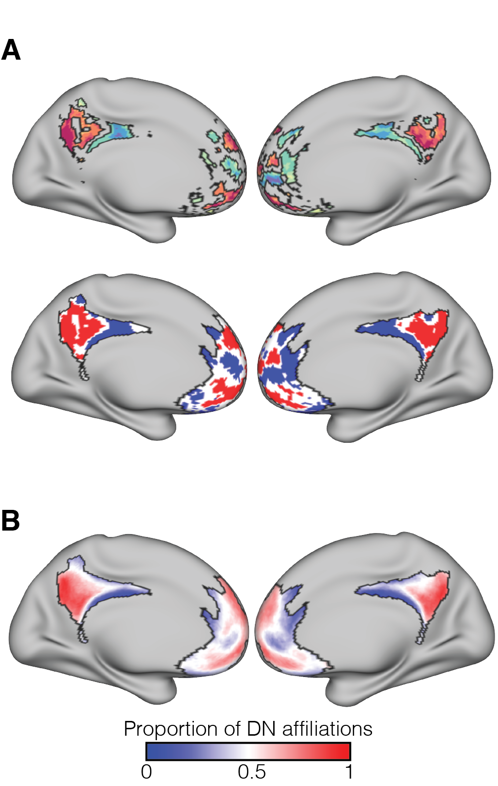
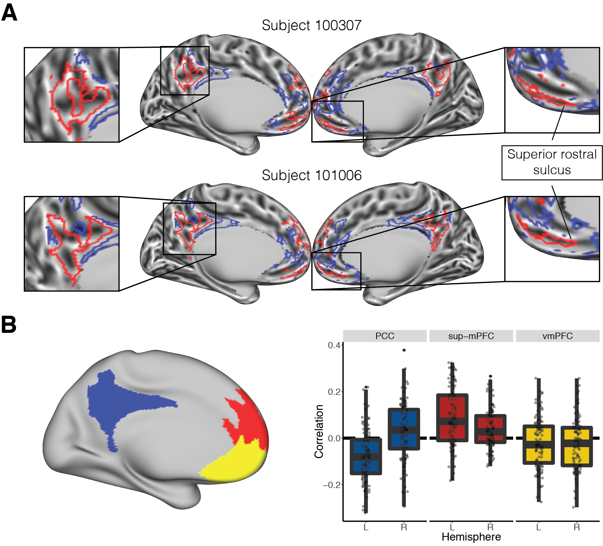

```{r setup, include = FALSE}
knitr::opts_chunk$set(echo = FALSE, warning = FALSE, fig.pos = 'H')
```

```{r Libraries, functions, and setups, include = FALSE, echo = FALSE}

# color scheme
Cols <- c("aquamarine4", "#D9541A", rgb(190, 190, 190, 100, maxColorValue = 255)) 

# In case I want to visualize stuff in the brain
labelCoords_vertex <- read.csv2('labelCoords_vertex.csv', sep = ",")[, 2:6]
labelCoords_vertex <- transform(labelCoords_vertex, 
                                x = as.numeric(as.character(x)), 
                                y = as.numeric(as.character(y)), 
                                z = as.numeric(as.character(z)))

# general options
threshMaps <- TRUE # Whether to apply subject-wise thresholds on maps or not
Permute <- FALSE # show meta-analysis permutation progress? (SLOW)

# Libraries used for the whole process
library(tidyverse)
library(ggplot2)
library(data.table) 
library(mcclust) 
library(lme4)
library(parallel) 
library(corrplot)
library(DescTools)
library(knitr)


## produce one permutation instance of the meta-analysis (so it can be fed to mclapply for faster results)
metaPerm <- function(list1 = studyList_sv, list2 = studyList_DN, labels = Yeo_labels, perm = 1) {
  
  # print every 100th permutation just to have a general sense of how far we are
  if ((perm %% 100) == 0) {sprintf("Permutation %s", perm)}
  
  # combine study lists
  allStudies <- c(studyList_sv, studyList_DN)
  
  # Sample all the studies and divide into 2 groups
  randPerm <- sample(allStudies)
  tmpSV <- randPerm[seq(length(list1))]
  tmpDN <- randPerm[-seq(length(list1))]
  
  # Count the number of times each region was reported in the literature
  tmpDF <- data.frame(Parcel = gsub("_", "", labels),
                      SV = sapply(labels, function(roi) {length(grep(roi, tmpSV))}),
                      DN = sapply(labels, function(roi) {length(grep(roi, tmpDN))}))
  
  # Perform the prop test for each pair and get the max chi-squared stat
  maxStat <- max(
    apply(tmpDF[, 2:3], 1, function(data) {
      prop.test(data, c(length(tmpSV), length(tmpDN)))$statistic
    }
    ), na.rm = T)
  
  return(maxStat)
  
}


## Cohen's D for 2 groups
# for a more flexible approach, make the data input to be a list with entries for n groups, 
# then do length(list) for the number of groups. 
cohenD <- function(group1 = 1, group2 = 2){
  
  # means
  mean1 <- mean(group1, na.rm = T)
  mean2 <- mean(group2, na.rm = T)
  
  # variance
  var1 <- var(group1, na.rm = T)
  var2 <- var(group2, na.rm = T)
  
  # equation
  out <- (mean1 - mean2) / sqrt((var1 + var2)/2)
  
  return(out)
  
}


## get ROI coords & index
# The point here is to reduce the summary dframes from community detection to show only ROIs
# Should work for extracting any label-indexed dframe though
# I wanted to also get the index in case I want to extract specific rows from parcel/vertex coord dframes
getCoords <- function(Labels = DN_labels, Coords = labelCoords_parcel, TimeSeries = FALSE){
  
  indx <- numeric()
  
  # If you want to select time series from raw data
  if (TimeSeries == TRUE) {
    
    for (ROI in Labels) {
      indx <- c(indx, grep(ROI, rownames(Coords)))
    }
    
  } else { # for the summary output of the community detection output
    
    for (ROI in Labels) {
      indx <- c(indx, grep(ROI, Coords$Label))
    }
    
  }
  
  results <- list()
  results$Index <- indx
  results$Coords <- Coords[indx, ]
  
  return(results)
  
}


## Permutation for 2 groups
permute <- function(group1, group2, statType = mean, nPerms = 5000, paired = FALSE, na.rm = FALSE){
  
  # remove NAs? in case of paired, remove the same measure in both groups 
  # (not for independent samples, for which NAs are removed by default)
  if (na.rm & paired) {
    g1 <- which(is.na(group1))
    g2 <- which(is.na(group2))
    nas <- c(g1, g2)
    
    if (length(nas) > 0) {
      group1 <- group1[-nas]
      group2 <- group2[-nas]
    }
  }
  
  # prep data
  summaryPerm <- list()
  lOne <- length(group1)
  lTwo <- length(group2)
  bigSample <- c(group1,group2)  
  
  if (paired == FALSE) {
    for (i in 1:nPerms){
      
      # relabel samples
      tempBig <- sample(bigSample)
      tempOne <- tempBig[seq(lOne)]
      tempTwo <- tempBig[-seq(lOne)]
      
      # stats
      tempDiffs <- statType(tempOne, na.rm = T) - statType(tempTwo, na.rm = T)
      summaryPerm$jointDist[i] <- tempDiffs # statType(tempDiffs, na.rm = T) 
    }  
  } else {
    for (i in 1:nPerms){
      # shift labels in a pairwise fashion
      tempDiffs <- statType((-1)^rbinom(lOne,1,0.5) * (group1 - group2))
      summaryPerm$jointDist[i] <- tempDiffs
    }
  }
  
  # get the observed difference
  diffs <- statType(group1, na.rm=T) - statType(group2, na.rm=T)
  observedAbs <- abs(diffs) # maybe leave it as means here
  observed <- diffs
  summaryPerm$Pval <- 2 * (1 - ecdf(summaryPerm$jointDist)(observedAbs))
  if (length(unique(abs(summaryPerm$jointDist))) == 1) {summaryPerm$Pval <- 1} # if the difference is always the same, then p = 1
  summaryPerm$Observed <- observed
  
  return(summaryPerm)
  
}


## Non-parametric Bootstrap for a single group
bootstrap <- function(group = 1, statType = mean, B = 5000){
  
  # prep param
  bootStats <- rep(0,B)
  
  # iterate
  for(b in 1:B){
    
    # wait group
    x <- sample(group,length(group),replace=T)  
    bootStats[b] <- statType(x,na.rm = T)
    
  }
  
  return(bootStats)
  
}


# Create a vector ready to be used for HCP data (32k CIFTI surface)
# The input should be the summary from community partitioning
# Once this is created, go to the terminal and input something like this
# wb_command -cifti-convert -from-text dataforCifti.txt testSubj.dscalar.nii testCifti.dscalar.nii
# testSubj can be found under the `Basic_files` in the repo
HCPOut <- function(Data = DNval7mCommunities[[1]], MOI = "Membership", SubjID = "100307", padding = 0){
  
  nVertices <- 59412
  tempVec <- rep(padding, nVertices)
  temp <- grep(MOI, colnames(Data))
  tempVec[Data$Vertex] <- Data[[temp]]
  write.table(file = paste(SubjID,"_",MOI,'_dataforCifti.txt', sep=""), tempVec, row.names = F, col.names = F, dec = ".")
  
}


# Perform pairwise comparisons of clustering outcomes on all subjects
comparePartitions <- function(Data = DNval7mCommunities, MOI = "FiedlerBinary", Index = "VI", nSubjects = nSubj, subjNames = subjList) {
  # This function will compare the community partitions from all subjects and create a 'comparison matrix' for every pairwise combination of subjects
  # Alternatively, if a second MOI is added 
  # Inputs
  # 
  # Data: the list of summaries produced by the script
  # 
  # MOI: measure of interest (usually the binarized Fiedler vector). If a vector, compares across algorithms per subject
  # 
  # Index: VI for variation of information, RI for the adjusted rand index, Cor for a Pearson correlation
  # ARI can yield many decimals, thus inflating the ratios. I thus round at 4 decimals.
  
  # NOTES:
  # you can apply pairwise comparisons with outer: outer(tempList,tempList,FUN = Vectorize(arandi, SIMPLIFY = FALSE, USE.NAMES = FALSE))
  
  # Get the column position of the MOI(s)
  Columns <- colnames(Data[[1]])
  indx <- as.numeric(Columns %in% MOI)
  MOI_indx <- which(indx==1)
  
  if (length(MOI_indx) < 2) {
    # Combine the measures of interest
    allVecs <- do.call(cbind, lapply(Data, "[[", MOI))
    
    # Create empty matrix
    indexMatrix <- matrix(data = NA, nrow = nSubjects, ncol = nSubjects)
    dimnames(indexMatrix) <- list(subjNames, subjNames)
    
    # Run every pairwise comparison with the index of interest on the measure of interest
    if (Index == "VI") {
      for (subj in seq(nSubjects)) {
        for (subj2 in seq(nSubjects)) {
          indexMatrix[subj, subj2] <- vi.dist(allVecs[, subj], allVecs[, subj2])
        }
      }
    } else if (Index == "RI") {
      for (subj in seq(nSubjects)) {
        for (subj2 in seq(nSubjects)) {
          indexMatrix[subj, subj2] <- arandi(allVecs[, subj], allVecs[, subj2], adjust = T)
        }
      }
    } else if (Index == "Cor") {
      for (subj in seq(nSubjects)) {
        for (subj2 in seq(nSubjects)) {
          indexMatrix[subj, subj2] <- cor(allVecs[, subj], allVecs[, subj2], method = "spearman")
        }
      }
    }
    
    indexMatrix <- round(indexMatrix, digits = 4)
    
  } else {
    indexMatrix <- data.frame(SubjID = as.character(subjList),
                              Index = rep(0, nSubjects))
    # Run every pairwise comparison with the index of interest on the measure of interest
    if (Index == "VI") {
      for (subj in seq(nSubjects)) {
        indexMatrix$Index[subj] <- vi.dist(Data[[subj]][, MOI_indx[1]], Data[[subj]][, MOI_indx[2]])
      }
    } else if (Index == "RI") {
      for (subj in seq(nSubjects)) {
        indexMatrix$Index[subj] <- arandi(Data[[subj]][, MOI_indx[1]], Data[[subj]][, MOI_indx[2]], adjust = T)
      }
    } else if (Index == "Cor") {
      for (subj in seq(nSubjects)) {
        indexMatrix$Index[subj] <- cor(Data[[subj]][, MOI_indx[1]], Data[[subj]][, MOI_indx[2]], method = "spearman")
      }
    }
    
    indexMatrix$Index <- round(indexMatrix$Index, digits = 4)
  
  }
  
  return(indexMatrix) 
  
}


# Generate a matrix with submatrices of 1s of a given size along the diagonal
# Useful to extract specific portions of data from a similarity matrix
diagBlocks <- function(dims = 20, sqSize = 4) {
  div <- dims %/% sqSize
  finalMatrix<-matrix(0,nrow=dims,ncol=dims)
  index <- 1
  for(k in seq(div)){
    finalMatrix[index:(index + (sqSize-1)),index:(index + (sqSize-1))] <- 1
    index<-index + sqSize
  }
  finalMatrix <- finalMatrix == 1
  finalMatrix
}


# This function will select a two-tailed fiedler vector threshold with respect to the stability of the vertex
# The threshold will be based on proportion DN given by thresholdRange
threshFV <- function(Data, thresholdRange = c(0.01, 0.99), nthresh = 50) {

  ## Check if the proportions even go that low, otherwise replace by next most stable low/high value
  # get the 2 values with highest reports (this should be stable upper/lower proportions)
  stableExtremes <- sort(table(Data$slidePropDN), decreasing = T)[seq(2)]
  stableExtremes <- sort(as.numeric(names(stableExtremes)))
  
  
  # if the values are not extreme enough, replace the original threshold with the new stable ones
  if (thresholdRange[1] < stableExtremes[1]) {
    
    thresholdRange[1] <- stableExtremes[1]
    
  }
  
  if (thresholdRange[2] > stableExtremes[2]) {
    
    thresholdRange[2] <- stableExtremes[2]
    
  }
  
  ## Run the actual process
  # placeholder to be returned
  thresholds <- c(NA,NA)
  
  
  # start the counter at chance
  meanProp <- 0.5
  
  
  # select a range of FV values
  thresh <- seq(0, min(Data$FiedlerVec), length.out = nthresh)
  
  
  # Iterate over the possible FV until DN affiliations go below 1%
  count <- 1
  while (meanProp >= thresholdRange[1]) {
    
    # get the mean proportion of DN from remaining vertices based on putative threshold
    meanProp <- Data %>% filter(FiedlerVec <= thresh[count]) %>% summarize(mean(slidePropDN))
    
    # if a threshold meets requirement, store its value
    if (meanProp <= thresholdRange[1]) {
      thresholds[1] <- thresh[count]
    }

    count <- count + 1
    
  }
  
  
  # repeat for the upper threshold
  # restart parameters
  meanProp <- 0.5
  thresh <- seq(0, max(abs(Data$FiedlerVec)), length.out = nthresh)
  
  
  # Iterate over the possible FV until DN affiliations go over 99%
  count <- 1
  while (meanProp <= thresholdRange[2]) {
    
    # get the mean proportion of DN from remaining vertices based on putative threshold
    meanProp <- Data %>% filter(FiedlerVec > thresh[count]) %>% summarize(mean(slidePropDN))
    
    # if a threshold meets requirement, store its value
    if (meanProp >= thresholdRange[2]) {
      thresholds[2] <- thresh[count]
    }

    count <- count + 1
    
  }
  
  
  return(round(thresholds, digits = 5))

  
}
```

1.  Department of Psychological and Brain Sciences, Boston University, Boston, USA

2.  Center for Systems Neuroscience, Boston University, Boston, USA

3.  Graduate Program for Neuroscience, Boston University, Boston, USA

\bigskip

Corresponding authors: Claudio Toro-Serey (ctoro@bu.edu) & Joseph T. McGuire (jtmcg@bu.edu)

\bigskip

## Highlights:

- Medial Default Network overlaps topographically with task effects such as valuation.

- Overlap at the group level could be due to variability across individuals.

- Individual subject level Default Networks were identified with Spectral Partitioning.

- Topographical organization is highly idiosyncratic, especially in frontal regions.

- Group-level overlap may be spurious and should be examined at the individual level.


\newpage

## Abstract 

  Regions of human medial prefrontal cortex (mPFC) and posterior cingulate cortex (PCC) are part of the default network (DN), and additionally are implicated in diverse cognitive functions ranging from autobiographical memory to subjective valuation. Our ability to interpret the apparent co-localization of these effects is constrained by a limited understanding of the individual-level heterogeneity in mPFC/PCC functional organization. Here we used cortical surface-based meta-analysis to identify a parcel in human PCC that was more strongly associated with the DN than with valuation effects. We then used resting-state fMRI data and a data-driven network analysis algorithm, spectral partitioning, to partition mPFC and PCC into "DN" and "non-DN" subdivisions in individual participants (n = 100 from the Human Connectome Project). The spectral partitioning algorithm identified individual-level cortical subdivisions that were reliable across test/retest datasets and varied markedly across individuals, especially in mPFC. Our results point toward a new generation of strategies for assessing whether distinct cognitive functions engage common or distinct mPFC subregions, especially at the individual level. 

Keywords: functional connectivity, default network, individual differences, network neuroscience, medial prefrontal cortex, spectral partitioning

\newpage

## 1. Introduction

  Human medial prefrontal cortex (mPFC) and posterior cingulate cortex (PCC) are jointly associated with a diverse set of cognitive processes [@Hiser2018; @Kragel2018], and contain subregions that are part of the brain's default network [DN; @Buckner2008; @Buckner2019]. DN regions are characterized by a decrease in BOLD activity during externally oriented tasks  that require attention or cognitive control, in comparison with less-demanding task conditions or periods of rest [@Buckner2008; @Laird2009; @Mckiernan2003]. The DN can also be identified on the basis of a distinctive pattern of inter-region correlations in resting-state fMRI data [@Buckner2008; @Fox2005; @Greicius2003; @Yeo2011].

Many different cognitive task manipulations evoke patterns of brain activity that overlap with DN regions in ventral/anterior mPFC and in PCC. Examples include manipulations of self-referential thinking [@Gusnard2001; @Mitchell2005], memory [@Euston2012; @Schacter2007], affective regulation [@Reddan2018; @Schiller2008], and subjective valuation [@Bartra2013; @Clithero2014; @Kable2007; @Levy2011]. Some of these task-related effects are thought to reflect processes integral to the functional role of the DN, such as internally oriented cognition, scene construction, and self-projection [@Hassabis2007]. For other task-related effects, such as subjective valuation (i.e., greater BOLD activity in response to more highly valued choice prospects and outcomes, relative to prospects and outcomes that are less highly valued), the degree of overlap with DN regions is only partial and the reason for the overlap is less obvious [@Acikalin2017]. Insofar as the DN shares a subset of nodes in common with the distributed brain system that supports valuation and other functions, this has potential to inform our theoretical understanding of the cognitive operations involved in those functions [@Northoff2012]. As a result, there is widespread interest in understanding the degree to which DN regions overlap topographically with task-related effects [@Buckner2019; @Dinicola2019; @Spreng2012].
  
  However, strong conclusions about functional colocalization require consideration of individual-level heterogeneity in topographic patterns of brain activity. A recognized limitation of group averaging and meta-analysis is that the functional topography of individual brains can be misaligned and blurred [@Fedorenko2012; @Guntupalli2018a; @Michalka2015; @Tobyne2018; @Wang2015; @Woo2014], exaggerating the apparent overlap across domains. This concern is especially pronounced in ventral mPFC, which is subject to considerable idiosyncratic cortical folding [@Lopez2019; @Mackey2014; @Zilles2013] and inter-subject functional variability [@Mueller2013]. An alternative approach is to focus on analyses at the individual-participant level. Individual-level analyses of fMRI data have identified idiosyncratic, reliable, and valid patterns of functional organization that would be blurred in aggregative estimates [@Gordon2017; @Gratton2018b; @Laumann2015; @Michalka2015; @Tobyne2018], and subject-specific network arrangements have been found to predict behavioral characteristics [@Kong2018]. Recent work has uncovered fine-grained subdivisions within the DN using both data-driven clustering and individually customized seed-based connectivity analysis [@Braga2017; @Braga2019]. It is therefore possible that the previously reported overlap of the DN with task-related effects could, in some cases, be attributed to low effective spatial resolution, and that the organization of mPFC and PCC would be better understood at the individual level. An important first step, and the goal of the present paper, is to quantify the degree of variability in the topography of the DN within mPFC and PCC across a large sample of individuals. The methods we propose for individual-level identification of DN regions have potential to benefit future investigations of the overlap between DN regions and task-related activity.

  A useful way to characterize individual-specific brain organization is to examine patterns of resting-state functional connectivity. Connectome-based analyses of resting-state functional connectivity have been fruitful in identifying individualized functional subregions that correspond well to task-induced activity patterns [@Gordon2017; @Laumann2015; @Smith2009; @Tobyne2018]. A functional connectome can be represented in the form of a network, and graph theoretic methods can be applied to analyze the network's structure [@Bassett2017; @Rubinov2010]. In the context of network analysis, community detection algorithms subdivide brain networks into sets of nodes that share more connections with each other than with the rest of the network [@Fortunato2016; @Garcia2017]. Here we use the technique of spectral partitioning (SP), an efficient community detection algorithm that deterministically subdivides a network into two communities [@Belkin2003; @chung1997; @Fiedler1975]. SP has previously been used to characterize the posterior-anterior functional gradient of the insula using resting-state fMRI data [@Tian2018], and was shown to robustly and reliably separate both simulated and actual primate ECoG networks [@Toker2019]. We use SP here to identify subsets of nodes within mPFC and PCC that share spontaneously covarying temporal activation patterns during rest.

  In this study, we aimed to subdivide mPFC and PCC into individual-specific DN and non-DN communities, and to quantify the degree of topographic heterogeneity in the resulting community structure over time and across individuals. We did this by capitalizing on the respective strengths of meta-analysis and subject-specific analyses of brain networks. We used a data-driven network-analysis procedure to identify two communities that each spanned both mPFC and PCC in each individual participant. We found that the resulting communities had a stereotyped topographic layout within PCC (according to a label-agnostic similarity metric), whereas their layout in mPFC was variable across individuals but stable across test/re-test. We took advantage of the more consistent configuration within PCC to assign meta-analysis-derived labels to the two communities. Because our data-driven method established correspondence between PCC subregions and mPFC subregions, the labels defined in PCC could then be indexed into the more heterogeneous community structure of mPFC in each individual.
  
  The outline of our paper is as follows. First, we defined a search space by selecting parcels from an established brain atlas [@Glasser2016] that corresponded to previously defined DN and limbic networks on the medial cortical wall [@Yeo2011]. A cortical surface-based meta-analysis of the DN and valuation literatures identified a parcel in PCC that was DN-specific at the aggregate level. Valuation was selected as a domain in which task-related activity patterns overlap extensively with DN regions on the medial surface, despite being segregable elsewhere [@Acikalin2017]. We then derived a functional connectivity network of all the surface vertices within the search space for each of `r length(dir(path = './Summary'))` individual resting-state fMRI data sets from the Human Connectome Project [HCP; @VanEssen2012], and used the SP algorithm to subdivide each individual's network into DN and non-DN communities (labeled according to which community included the meta-analytically identified DN-specific parcel in PCC). Focusing on individual vertices in the search space rather than the parcels (as is typical in brain network analyses) allowed us to finely delineate the topographic extent of each community. The resulting communities varied topographically across individuals, while also appearing to follow common organizational principles. Test-retest analyses showed that these partitionings were similar across scanning days within (but not between) individuals, and that individual-level idiosyncrasy was greater in mPFC. Partitionings obtained from the SP algorithm had higher test-retest reliability than did analogous results from seed-based functional connectivity. We found that the DN community was likely to be located within principal sulci in ventral mPFC and left PCC, but in gyri within superior mPFC and right PCC. Lastly, we describe how the structure of the resulting automatically defined DN and non-DN communities both aligns with and differs from a recently proposed scheme for identifying subdivisions within the DN [@Braga2017; @Braga2019]. Our work highlights the usefulness of estimating brain effects at the individual level in mPFC and PCC, provides a new framework and tool set for future investigations of overlap across cognitive domains.

## 2. Material and Methods

### 2.1. *Data and Code Accessibility Statement*

All code used in this study is openly available at [https://github.com/ctoroserey/mPFC_partitioning](https://github.com/ctoroserey/mPFC_partitioning). Resting-state fMRI data was acquired from the Human Connectome Project [@VanEssen2012].

### 2.2. *Search space*

For all analyses, we defined our search space based on the 17-network parcellation proposed by Yeo et al. [-@Yeo2011]. First, we selected vertices on the medial cortical surface that were contained by the DN and limbic networks in HCP's 32,000 vertex surface space (fs_LR_32k). Next, we overlaid those networks on a parcellated atlas of the human cortical surface [360 regions; @Glasser2016], and retained a set of parcels that covered approximately the same brain regions (visually inspected, retaining parcels that appeared to have at least 15% overlap). This resulted in a search space that consisted of 40 parcels across hemispheres (Supplementary Table 1). The search space in each hemisphere was naturally divided into two spatially non-contiguous clusters in PCC and mPFC, facilitating the examination of each region separately.

\bigskip

### 2.3. *Meta-analysis*

We used a novel approach to cortical surface parcel-based meta-analysis to assess whether individual parcels within the search space were preferentially associated with subjective valuation or with decreased activity during externally oriented tasks, which served to operationalize the DN. For subjective valuation, we gathered peak activation coordinates from 200 studies that reported positive effects in contrasts of higher-value minus lower-value outcomes or prospects [@Bartra2013]. For the DN, we acquired coordinates from 80 studies that reported reductions in BOLD during externally directed tasks compared to a baseline [@Laird2009]. The coordinates represent areas that exceeded the statistical significance threshold in each original study. For each study, we created an indicator map in standard volumetric space (MNI152, 1 mm resolution) which contained values of 1 in a 10 mm radius sphere around each reported activation peak, and values of 0 elsewhere [@Wager2009]. The indicator map for each study was then projected to a standard cortical mesh (fsaverage, 160,000 vertices, projfrac-max from 0 to 1 by 0.25, registered using mni152.register.dat) using FreeSurfer's mri_vol2surf [@Fischl1999; @Dale1999] (http://surfer.nmr.mgh.harvard.edu/). We then resampled the Glasser et al. (2016) parcellation to fsaverage, and tallied how many studies had positive indicator values intersecting with each cortical parcel (the details of the resampling procedure are described in https://wiki.humanconnectome.org/display/PublicData/HCP+Users+FAQ#HCPUsersFAQ-9.HowdoImapdatabetweenFreeSurferandHCP, and were implemented using a custom script available at https://github.com/stobyne/Spherical-Surface-Swapper). Two studies from the subjective valuation corpus were removed because they did not contain activation peaks that overlapped with cortex, leaving a final number of 198 studies. 

To test for parcels that were significantly more strongly associated with one domain than the other, we performed per-parcel chi-squared tests comparing the proportion of studies with activation in that parcel between the two domains. We permuted the study domain labels (DN or valuation) 5000 times while preserving the total number of studies in each domain, and on each iteration stored the maximum resulting chi-squared statistic across all parcels. This gave us a null distribution of 5000 maximum chi-squared values. The 95th percentile of this distribution served as an FWE-corrected significance threshold to evaluate unpermuted chi-squared values.   

### 2.4. *Resting-state fMRI Data*

``` {r fMRI data descriptives} 
# load file with the n of TRs and density data
corrCounts <- read.csv('corrCounts.csv')
```

Our fMRI analyses used resting-state fMRI data from the Human Connectome Project [@VanEssen2012] Q6 release (N = `r length(dir(path = './Summary'))`, randomly sampled from the total pool of 469 available subjects). The Washington University Institutional Review Board approved all experimental procedures, and all subjects provided written informed consent in accordance with the guidelines set by the institution. Each subject's data was acquired over two days at Washington University in St. Louis on a Siemens CONNECTOM Skyra MRI scanner (Siemens, Erlangen, Germany). Four resting state runs (repetition time = 0.720 s, echo time = 33.1 ms, flip angle = 52°, multiband factor = 8, 72 slices, 2 mm isotropic voxels) each comprised 1200 time points (14 min 24 s) for a total of 4800 time points. Two runs were acquired on each day, with the phase encoding direction set to left-right for one run and right-left for the other. Only subjects with both left-right and right-left phase encoding for each day were included (i.e. subjects with four resting-state fMRI sessions). In addition, only datasets with low motion levels (under 1.5 mm) and less than 5% of points over 0.5 mm framewise displacement [FD; @Power2014] were used. See [@VanEssen2012] for more details about the data acquisition protocol.

Data initially underwent the HCP minimal preprocessing pipeline [@Glasser2013], which included gradient nonlinearity correction, motion correction, EPI distortion correction, high-pass filtering (0.0005 Hz threshold), MNI152-based normalization, surface reconstruction, and mapping of functional data to a standardized cortical surface model (details can be found in Glasser et al., 2013). In addition, data underwent temporal denoising based on independent components [FMRIB's ICA-based X-noiseifier, FIX; @Griffanti2014; @Salimi-Khorshidi2014]. Data were further preprocessed using an in-house pipeline described previously [@Tobyne2017]. Steps (in order) included linear interpolation across high motion timepoints with over 0.5 mm of FD, band-pass filtering (allowed frequencies ranged from 0.009 and 0.08 Hz), and temporal denoising via mean grayordinate signal regression [@Burgess2016]. Interpolation of high motion time points is performed to avoid temporal smoothing of noisy signal from head motion into the filtered signal during the bandpass procedure. After filtering and denoising, the interpolated high-motion time points were censored by deletion and each run was temporally de-meaned. The processed time series had a median of `r median(corrCounts$nTR)` time points (minimum = `r min(corrCounts$nTR)`) across participants. Each subject's brain was comprised of 32k standard grayordinates per hemisphere (combined in a CIFTI file). We retained only the cortical surfaces, which resulted in 59,412 total surface vertices per subject. 

### 2.5. *Network Definition*

```{r Density calculation}
# Load density data
corrCounts <- corrCounts %>%
  mutate(prcntPos = Positive / Total,
         prcntNeg = Negative / Total)

# prcnt pos/neg
mPos <- round(mean(corrCounts$prcntPos), digits = 2)
sdPos <-round(sd(corrCounts$prcntPos), digits = 2)
mNeg <- round(mean(corrCounts$prcntNeg), digits = 2)
sdNeg <-round(sd(corrCounts$prcntNeg), digits = 2)
```

All network analyses were performed using the igraph package [v. 1.1.2; https://igraph.org/r/; @G.2006] in R [v. 3.4.1; https://www.r-project.org/; @RTeam2018]. To establish each subject's network, we selected all the vertices contained within the mPFC/PCC search space (n = 4,801 per subject; mPFC = 2854, PCC = 1947) and computed the Pearson correlation of the time series for every pair of vertices. All correlation values were transformed using Fisher's r to z. This produced a weighted network for each subject, in which the nodes were surface vertices and the edge weights were the correlations among them. Edges mostly consisted of positive correlations (mean proportion positive = `r mPos`, SD = `r sdPos`). We chose not to threshold the network, as the SP algorithm is well equipped to operate on complete (i.e. fully-connected) weighted graphs [@chung1997]. However, our results are unchanged if we cut all non-significant correlations from the weight matrices (uncorrected). Next, we took the exponential of the z-transformed correlations so that all weights became positive while maintaining their ordinal ranks. Ensuring that all edges were positive facilitated the construction of the graph Laplacian (see below), which requires all off-diagonal elements to have the same sign by design. We generated and analyzed network weight matrices at four levels: (1) for each subject's full concatenated dataset (up to 4800 TRs); (2) on each step of a sliding window analysis (see Partition Evaluation for more details); (3) for the concatenated time series for the two runs on each day (up to 2400 TRs); and (4) for each run separately (up to 1200 TRs).

### 2.6. *Community Detection*

Communities (i.e. clusters) were identified using the SP algorithm [@Belkin2003; @chung1997; @Fiedler1975; @Higham2007]. First, each network was represented as an $n$ x $n$ network weight matrix $W$ as described above (where $n$ equals the number of vertices in the search space, 4,801). The matrix was then transformed into its symmetric normalized Laplacian form

$$\begin{aligned}
L = I - D^{-\frac{1}{2}}WD^{-\frac{1}{2}}
\end{aligned}$$

Where $I$ is an identity matrix of size $n$, and $D$ is a diagonal matrix containing the strength of each vertex (i.e. the sum of its edge weights with all other vertices). This resulted in a matrix wherein each entry was the negative normalized value of the connection (from 0 to 1) between any two vertices relative to their combined connectivity strength, and with ones along the diagonal. The transformation ensures that every row sums to zero. We then computed the eigenvalues and eigenvectors of the symmetric normalized Laplacian matrix, and used the eigenvector associated with the second-to-lowest eigenvalue (traditionally called the 'Fiedler vector') to divide the network into two. The Fiedler vector consists of a set of positive and negative values and is binarized by sign to partition the network into two similarly-sized communities [@Fiedler1975]. In this way, SP avoids producing communities that are too small to be physiologically meaningful (for example, small sets of vertices that are spuriously correlated due to measurement noise). Given that this data-driven method does not label the two communities or establish correspondence across participants, we defined each individual's "DN" community as that which contained the majority of the vertices in the DN-specific PCC parcel identified in our meta-analysis (area 7m). The completeness of the graphs ensured that SP did not face the issues associated with its use in sparse networks [@Fortunato2016].

In order to evaluate the validity of the resulting partitionings across community-detection methods, we also estimated network communities using the more traditional approach of modularity maximization [@Garcia2017], based on the algorithm from Clauset et al. [-@Clauset2004]. The method heuristically iterates through many possible combinations of vertices, and selects the partitioning that maximizes the within-community edge weights, relative to a random network containing the same number of edges and communities. Unlike SP, modularity can fractionate a network into more than two communities. Agreement between the partitions provided by the bounded (SP) and unbounded (modularity) community detection methods would suggest the results are not distorted by the restriction of SP to binary partitionings.


### 2.7. *Partition Evaluation*

We used the Adjusted Rand index (ARI) to evaluate the stability and topographical heterogeneity of the communities within and across individuals [@Hubert1985], which was calculated using the "mcclust" package in R [@Arno2012]. The ARI is a metric that quantifies the similarity between two alternative clusterings of the same data. The base of the ARI is computed by the formula

$$\frac{a + b}{a + b + c + d}$$

where $a$ is the number of pairs of nodes that were grouped together in both partitionings, $b$ is the number that were grouped separately, and $c$ and $d$ denote the number of pairs grouped together (separately) in one partitioning, but separately (together) in the other. Therefore, the ARI estimates the fraction of all possible node pairs that had the same status (connected or not) in both partitionings (with the denominator equal to $n(n - 1)/2$). The resulting ratio is adjusted against a baseline given by the expectation assuming independent partitionings to yield an index that ranges from 0 to 1, where 0 denotes the value expected by chance. This means that even though differences are heavily penalized, positive ARI values compare favorably against chance clustering (and the index can take negative values if the ratio given by the formula above falls below the chance level). In short, the ARI quantifies the chance-corrected agreement between any two partitions while being agnostic to the labeling scheme.

We performed a number of comparisons among partitions. First, we computed the degree of agreement between SP and modularity per subject. SP and Modularity have been previously found to show a tendency for underfitting and overfitting, respectively, in their community detection performance in a diverse set of network types [@Ghasemian2018], so alignment between the two algorithms would increase our confidence in the validity of the resulting partitionings. Next, we compared the subject-level SP partitionings across individuals, and calculated the mean pairwise ARI for the group. We then performed the same evaluation for PCC and mPFC separately, and examined whether there were differences in overall agreement within these regions by performing a paired permutation analysis. For each individual and region we got the mean ARI with all 99 other individuals, then took the difference between regions to get an ARI difference per subject. On each of 5000 permutations each subject’s ARI difference was independently sign-flipped and the mean difference across subjects was added to a null distribution. The empirical difference in mean pairwise ARI between regions was then evaluated against this permuted distribution.

To identify vertices whose community assignment was more stable or more variable, we performed a sliding window analysis (20 min windows, 1 min increments, median number of windows per subject = 37, range = 35 - 37), comparing each window's resulting partitioning against the partitioning derived from the subject's whole data set. A 20-min window has previously been found to yield relatively stable and unbiased estimates of individual-level brain network characteristics [@Gordon2017]. We assessed whether the magnitude of the Fiedler vector value for a given vertex (for the full subject-level data set) was associated with the stability of that vertex’s sub-network assignment across time windows. To do this, we fit a mixed effects logistic regression model, in which the dependent variable was the proportion of times each vertex participated in the DN community across windows, and the explanatory variables included a random effect of subject and a fixed effect of the Fiedler vector value for that vertex (derived from their full time series). Based on this significant relationship, we identified a threshold Fiedler vector value for each subject, such that empirical above-threshold vertices were persistently associated with either DN or non-DN more than 99% of the time.

We then estimated the level of agreement between network partitions estimated using data across individual scan days (with 2 days per participant). If the functional organization estimated by SP is indeed individual-specific, we should see higher agreement within individual (test/re-test across days) than across individuals. We tested this idea by computing the ratio of the mean ARI within and between individuals. Ratios close to one would denote similar within-participant and across-participant alignment, whereas ratios considerably higher than one would suggest that partitions were more similar within-participant than across participants. We then extended this idea by computing the agreement across individual runs (4 per subject). Similar to the day-based analysis, we assessed whether run-level data showed higher agreement within-subject than between subjects. 

### 2.8. *Seed-based Resting-state Functional Connectivity versus Community Detection*

We evaluated the performance of the SP algorithm in comparison to a simpler partitioning approach based on seed-based functional connectivity. Independently for each day (2 per individual), we estimated each subject's DN partition in mPFC based on its vertex-wise functional correlations (Pearson) with the spatially averaged activity across all vertices in the PCC search space. We used the whole PCC region because it is traditionally thought to be part of the DN [@Buckner2008], it is a common area for researchers to place seeds for vertex- and volume-based connectivity analyses [@Fox2005], and it was often dominated by the DN community. We compared these seed-based maps with the unthresholded Fiedler vectors produced by SP, with the sign of the Fiedler vector oriented so the DN community was marked by positive values in every subject. We calculated three sets of across-day similarity values for each individual: 1) between the two seed-based maps; 2) between the two SP-based maps; and 3) between seed- and SP-based maps. Because the values in the maps were continuous-valued (and not categorical labels, which would be amenable to ARI), we quantified the similarity between maps in terms of the spatial Spearman correlation across vertices. These spatial correlations were meant to determine the test/re-test reliability of each approach, as well as the overall level of agreement between them. For 8 subjects, the communities produced with one of the days' data sets had split coverage of area 7m, and so our community labeling scheme for the Fiedler vector produced a sign mismatch across days. ARI is robust to such labeling issues, but the inconsistency produced strong negative correlations of the Fiedler vector across days for these individuals. Visual inspection showed that the community layout was well aligned across days, and so we matched the labeling of their partitionings based on the day that sufficiently covered area 7m. 

The two methods were expected to produce somewhat similar results, but the one displaying greater within-subject agreement across days should be preferred (for a discussion on the stability of functional networks see Kong et al. [-@Kong2018] and Gratton et al. [-@Gratton2018b]). We therefore compared the within-subject spatial correlation coefficients produced by each method through a paired permutation analysis. For each of the 100 individuals, we computed the difference in inter-day correlations between methods, randomized the sign of these values 5000 times, and computed the mean of these differences on each iteration. The empirical difference in means was then evaluated against this permuted distribution.


\bigskip

### 2.9. *Associations with sulcal morphology*

Next we asked whether the location of the DN and non-DN communities was systematically related to sulcal morphology. Based on a previous report of individual alignment of DN within sulci in ventral mPFC [vmPFC; @Lopez2019], we subdivided our search space into three regions: vmPFC, which matched the ROI used by Lopez-Persem and colleagues (2019; areas 25, s32, a24, 10v, 10r, p32, and OFC); superior mPFC (sup-mPFC), encompassing the remaining dorsal areas in our mPFC space; and all of the PCC search space. We used each subject's curvature maps from the HCP (transformed to fs_LR 32k space), in which cortical depth is quantified by negative numbers for sulci and positive numbers for gyri. For each individual, we computed the Spearman correlation between curvature and the unthresholded Fiedler vector values in each region and hemisphere separately (6 correlations per individual). Since the DN was indicated by positive FV values, negative correlations meant that the DN was more likely to be contained in sulci, with non-DN located in gyri. Finally, we collected all individual correlations for each combination of hemisphere and region, and performed a one-sample t-test on each set to determine whether correlations were significantly different from 0 in our group (6 tests total).

\bigskip

## 3. Results

### 3.1. *Meta-analysis*

``` {r Meta-analysis permutation, echo = FALSE, message = FALSE, cache = TRUE}
# Glasser parcels contained in Yeo's 17-net DN and limbic networks on the medial cortical wall
Yeo_labels <- c("L_25_ROI",
              "L_OFC_ROI",
              "L_10v_ROI",
              "R_25_ROI",
              "R_OFC_ROI",
              "R_10v_ROI",
              "L_s32_ROI",
              "L_RSC_ROI",
              "R_RSC_ROI",
              "R_23d_ROI",
              "R_d23ab_ROI",
              "R_31a_ROI",
              "R_31pv_ROI",
              "R_31pd_ROI",
              "R_7m_ROI",
              "R_v23ab_ROI",
              "R_p24_ROI",
              "R_d32_ROI",
              "R_9m_ROI",
              "R_p32_ROI",
              "R_a24_ROI",
              "R_10r_ROI",
              "R_10d_ROI",
              "L_23d_ROI",
              "L_d23ab_RO",
              "L_31a_ROI",
              "L_31pv_ROI",
              "L_31pd_ROI",
              "L_7m_ROI",
              "L_v23ab_ROI",
              "L_p24_ROI",
              "L_d32_ROI",
              "L_9m_ROI",
              "L_p32_ROI",
              "L_a24_ROI",
              "L_10r_ROI",
              "L_10d_ROI",
              "R_s32_ROI",
              "R_9a_ROI",
              "L_PCV_ROI") 

## Permutation analysis
# load parcels reported per study for each corpus
setwd('./Meta_coords/metaresultsPOS')
templist <- dir()
studyList_sv <- lapply(templist, readr::read_csv, col_names = F, col_types = cols())

setwd('../metaresultsDN/')
templist <- dir()
studyList_DN <- lapply(templist, readr::read_csv, col_names = F, col_types = cols())

# raw counts for each area per literature
nRegions_sv <- do.call(rbind, studyList_sv) %>% count(X1)
nRegions_DN <- do.call(rbind, studyList_DN) %>% count(X1)
nRegions_all <- left_join(nRegions_sv, nRegions_DN, by = "X1")
 
# optional because it can take a long time to run
if (Permute) {
  
  # reported statistics are computed @ 5k, but it's computationally demanding to do that every time.
  nPerms <- 5000 
  
  # For each permutation, reassign the study labels, maintaining the original number of studies per condition
  nullDist <- mclapply(seq(nPerms), function(permutation) {metaPerm(perm = permutation)})
  nullDist <- do.call(rbind, nullDist)
  
  # Now do the same for the actual data, to see how it compares to the null dist
  tmpDF <- data.frame(Parcel = gsub("_", "", Yeo_labels),
                      SV = sapply(Yeo_labels, function(roi) {length(grep(roi, studyList_sv))}),
                      DN = sapply(Yeo_labels, function(roi) {length(grep(roi, studyList_DN))}),
                      propSV = sapply(Yeo_labels, function(roi) {length(grep(roi, studyList_sv))}) / length(studyList_sv),
                      propDN = sapply(Yeo_labels, function(roi) {length(grep(roi, studyList_DN))}) / length(studyList_DN))
  
  # Perform the prop test for each pair and get the max chi-squared stat + pvalue based on the computed null distribution
  tmpDF$Chi_squared <- apply(tmpDF[, 2:3], 1, function(data) {
    round(prop.test(data, c(length(studyList_sv), length(studyList_DN)))$statistic, digits = 2)
    })
  tmpDF$Pval <- 1 - ecdf(nullDist)(tmpDF$Chi_squared) # probability of finding a chi-squared stat at least as large as the observed under a permuted null distribution
  
  # ROIs that survived the threshold based on Chi-squared value 
  significantROIs <- tmpDF %>% filter(Chi_squared >= quantile(nullDist, 0.95))
  
}

## results!
# 25 bilateral (prportion sv = L: 0.42, R: 0.39; proportion DN = L: 0.18, R: 0.16, Chi = L: 12.91, R: 12.83, both p = 0.005)
# 7m bilateral (prportion sv = L: 0.17, R: 0.15; proportion DN = L: 0.36, R: 0.40, Chi = L: 10.07, R: 18.89, L: p = 0.02, R: p < 0.0001)
# v23ab right (proportion sv = 0.16; proportion DN = 0.36, chi = 11.51, p = 0.01)
# v23ab left (proportion sv = 0.16; proportion DN = 0.32, chi = 8.25, p = 0.06)
# null 95th-q chi <- 8.87 (varies; this was done ith 100 but resembles the 5k one)

```

We performed a coordinate-based meta-analysis to identify cortical surface parcels within mPFC and PCC that were preferentially associated with the DN or with subjective valuation. Volumetric coordinates from 80 studies with task deactivation contrasts and 198 studies with valuation contrasts were projected onto a cortical surface, and mapped to discrete parcels from a multimodal cortical parcellation [@Glasser2016] to produce a list of brain areas reported per study. The `r length(Yeo_labels)` parcels considered were limited to the medial portion of the default and limbic networks defined by the Yeo et al. [-@Yeo2011] 17-network parcellation. Domain-specificity was tested by first permuting the domain labels across studies (DN or valuation) to create a null distribution for the maximum chi-squared statistic in the search space (see Methods for details). The null distribution was used to identify regions that were reported significantly more often in one literature or the other. 

Figure 1 shows the proportion of times each parcel was reported for each domain, as well as the significant differences between domains. The 95th percentile of the permuted chi-squared distribution was 8.87. Based on this threshold, area 7m in PCC/precuneus was the only parcel to show a preferential association with the DN bilaterally (Left: observed $\chi^2$ = 10.07, *p* = 0.029; Right: observed $\chi^2$ = 18.89, *p* < 0.001). The adjacent area v23 exhibited a similar effect, albeit only unilaterally (Right: observed $\chi^2$ = 11.51, *p* = 0.011; Left: observed $\chi^2$ = 8.25, *p* = 0.067). There appeared to be a bilateral preference toward valuation effects in mPFC area 25 (Left: observed $\chi^2$ = 12.91, *p* = 0.005; Right: observed $\chi^2$ = 12.83, *p* = 0.005); however, closer inspection suggested this effect was driven by subcortical foci centered in adjacent ventral striatum. No other parcels were preferentially implicated in valuation relative to DN. We therefore selected area 7m as an interpretable, bilateral reference point for labeling DN and non-DN communities in the analyses that follow. We note that the area labeled 7m in the parcellation used here [@Glasser2016] is different from (and located inferiorly on the medial surface to) the non-DN area 7m discussed in previous work [@AndrewsHanna2010]. 

```{r Meta-analysis ROIs (Fig. 1), out.width = "50%", fig.align = "center", fig.cap= "Figure 1. Meta-analysis results. A: Proportion of times each ROI was reported in the valuation and DN literatures. B: Regions identified in permutation-based chi-squared tests contrasting the two literatures. Area 25 (in red) was disregarded because of the possible confound with projections from spheres located in ventral striatum (see text for details). Areas in blue represent the remainder of the search space."}
# brain images were produced using the HCP wb_view. 
# see the function HCPOut for details on how they were transferred from R to CIFTI

```

### 3.2. *Individual-level DN and non-DN communities*

``` {r Load Summary Data}
# Load data, create a subject list, get the total n, and the number of vertices
setwd('Summary/')
temp <- list.files()
subjList <- sapply(temp, substring, first = 1, last = 6)
Summaries <- lapply(temp, read.csv)
nSubj <- length(Summaries)
nVertices <- nrow(Summaries[[1]])

```

Within the mPFC/PCC search space, we estimated the topography of the DN for each individual. Using each individual's full time series (approximately 4800 total TRs from four 14-min scanning runs acquired over two days), we calculated the full vertex-to-vertex correlation matrix for the `r nVertices` surface vertices in the search space. We represented each individual's correlation matrix in the form of a network, with cortical surface vertices as nodes and thresholded/transformed correlation values as edge weights. We then applied the SP community detection algorithm to partition the network into two cohesive functional communities.

Figure 2 shows a representative partitioning of the search space for a single participant (100307; additional examples are presented in the first two columns of Supplemental Figure 1). The SP algorithm subdivides a network according to the positive versus negative values in the Fiedler vector (the eigenvector related to the second-to-lowest eigenvalue of the network's normalized Laplacian matrix, see Methods). Since this is a data-driven approach, there is no a priori labeling for the two communities. We assigned the DN label to the community that contained the majority of the DN-specific PCC parcel from the meta-analysis (7m). We oriented each individual's Fiedler vector so positive values corresponded to the DN community [@Nenning2017], and were assigned a value of 1 in the binarized partitionings (with 0 denoting non-DN). In qualitative terms, the resulting patterns contained substantial DN coverage in posterior PCC (as dictated by our labeling strategy), with non-DN vertices in anterior PCC. The mPFC region tended to include DN vertices in its ventral-anterior and dorsal-anterior areas, with a persistent non-DN pocket between them. This non-DN section extended posteriorly into pregenual cinglate cortex (area a24). We note that the addition of restrosplenial cortex (an area commonly regarded as part of canonical DN) to the search space did not change these results; as expected, that the area tended to be largely assigned to the DN community (Supplemental Figure 1). 


```{r Representative partitioning (Fig. 2), out.width = "50%", fig.align = "center", fig.cap = "Figure 2. Brain partition for an example subject (100307). Fiedler vector values (top) are mapped onto the brain surface, dividing it into positive and negative communities. The bottom brain shows the binarized Fiedler vector, with red areas denoting the DN community (as indicated by coverage of area 7m, bordered)."}

```

Before evaluating the degree of generalizibility of this topographic pattern across individuals, we examined the validity of the partitionings by comparing them to results from an alternative community detection algorithm, modularity maximization [@Clauset2004]. Modularity seeks to find the set of communities that maximizes within-community connection weights relative to a null model. Since modularity is not constrained to a predetermined number of communities, it was capable of finding more than two in our data set. We quantified the cross-method agreement in terms of the Adjusted Rand Index (ARI; see Methods), which measures the proportion of node pairs in a network that were either clustered together or separately in both partitionings, while being agnostic to labeling schemes and controlling for chance clustering. The ARI normally takes values ranging from 0 to 1, with 0 indicating chance agreement (but can take negative values if the similarity falls below chance). Supplemental Figure 2 contains examples of ARI values in real and simulated contexts.

``` {r Partition comparison: all 2, echo = FALSE, message = FALSE, cache = TRUE}
## Community number evaluation (across and within methods)
# ARI between methods (membership = modularity assignment)
RI_all_within <- comparePartitions(Data = Summaries, Index = "RI", MOI = c("FiedlerBinary", "Membership"), nSubjects = nSubj, subjNames = subjList)

# Number of communities per subject for modularity
nModularity <- sapply(Summaries, function(data) {max(data$Membership)}) 

# Median size of the extra (>2) communities estimated by modularity
modularityCounts <- lapply(Summaries, function(data) {sort(plyr::count(as.character(data$Membership))$freq, decreasing = T)})
modularityCounts_two <- sapply(modularityCounts, function(x) {sum(x[seq(2)], na.rm = T)})
modularityCounts_extra <- sapply(modularityCounts, function(x) {sum(x[3:4], na.rm = T)})

# ARI among individuals
# Note: the upper and lower triangles can totally be combined before plotting, instead of adding one corrplot over another. Might work on that eventually.
RI_all_between <- comparePartitions(Data = Summaries, Index = "RI", nSubjects = length(Summaries), subjNames = subjList)
RI_all_between_lowtri <- RI_all_between[lower.tri(RI_all_between)]

# and now ARI among individuals per region (PCC or mPFC)
posteriorIndx <- Summaries[[1]]$y < 0
tempComm_PCC <- lapply(Summaries, "[", i = posteriorIndx, j =)
tempComm_PFC <- lapply(Summaries, "[", i = !posteriorIndx, j =)
RI_PFC <- comparePartitions(Data = tempComm_PFC, Index = "RI", nSubjects = length(Summaries), subjNames = subjList)
RI_PCC <- comparePartitions(Data = tempComm_PCC, Index = "RI", nSubjects = length(Summaries), subjNames = subjList)

# Let's sttistically compare stuff
testPCC <- RI_PCC[lower.tri(RI_PCC)]
testPFC <- RI_PFC[lower.tri(RI_PFC)]
Overall_PCCvsPFC_permTest <- permute(testPCC, testPFC, statType = mean, paired = T)
Overall_PCCvsPFC_ES <- cohenD(testPCC, testPFC) 
mPFCvs0_wilcox <- wilcox.test(testPFC) # is the mPFC agreement above chance?
mPFCvs0_ES <- DescTools::CohenD(testPFC)

```

The two clustering methods had high agreement (mean ARI = `r round(mean(RI_all_within$Index), digits = 2)`, SD = `r round(sd(RI_all_within$Index), digits = 2)`). Modularity showed a tendency to produce additional communities (median = `r median(nModularity)`, range = `r range(nModularity)`). However, the additional communities encompassed a small number of vertices (median = `r median(modularityCounts_extra)`, IQR = `r quantile(modularityCounts_extra, 0.25)` - `r quantile(modularityCounts_extra, 0.75)`) compared to the principal two (median = `r median(modularityCounts_two)`, IQR = `r quantile(modularityCounts_two, 0.25)` - `r quantile(modularityCounts_two, 0.75)`), suggesting that a binary partitioning provided a reasonable approximation of the network's true community structure.

Next, we examined the similarity of SP-based partitionings across individuals by computing the ARI between every pair of subjects, and found modestly above-chance agreement overall (mean = `r round(mean(RI_all_between_lowtri), digits = 2)`, SD = `r round(sd(RI_all_between_lowtri), digits = 2)`). Qualitative inspection of the community organization showed good alignment for PCC, whereas the pattern in mPFC was consistent but shifted topographically across subjects. To quantify this heterogeneity in mPFC, we calculated the between-subject ARI for each region separately (Figure 3). The functional topography of PCC was better aligned across individuals (mean = `r round(mean(testPCC), digits = 2)`, SD = `r round(sd(testPCC), digits = 2)`) than mPFC (mean = `r round(mean(testPFC), digits = 2)`, SD = `r round(sd(testPFC), digits = 2)`; paired permutation, *p* `r ifelse(Overall_PCCvsPFC_permTest$Pval == 0, "< 0.001", paste("=", Overall_PCCvsPFC_permTest$Pval))`; Cohen's D = `r round(Overall_PCCvsPFC_ES, digits = 2)`), although the mean ARI in mPFC still exceeded the chance value of zero (Wilcoxon signed rank test, *p* `r ifelse(mPFCvs0_wilcox$p.value == 0, "< 0.001", paste("=", mPFCvs0_wilcox$p.value))`; Cohen's D = `r round(mPFCvs0_ES, digits = 2)`). 

``` {r Partitioning comparison: all (Fig. 3), fig.align="center", out.width = "50%", fig.cap = "Figure 3. Similarity matrix showing ARI values among all subjects for PCC (lower triangle) and mPFC (upper triangle) separately. Functional topographic patterns were better aligned across individuals in PCC than mPFC.", echo=FALSE, message = FALSE}
# code to produce the plot
# par(xpd = T)
# corrplot(abs(RI_PCC), # absolute for display purposes only, as it avoids the couple of negative ARIs and evens out the color bar
#          is.corr = F, 
#          method = "color",
#          type = "lower", 
#          tl.pos = "n", 
#          tl.cex = 0.1, 
#          cl.lim = c(0,1),
#          cl.length = 3,
#          #addgrid.col = "grey99",
#          cl.pos = "r",
#          mar = c(1,1,2,0))
# corrplot(RI_PFC, 
#          is.corr = F, 
#          method = "color", 
#          type = "upper", 
#          tl.pos = "n", 
#          tl.cex = 0.1,
#          cl.pos = "n",
#          #addgrid.col = "grey90",
#          mar = c(1,1,2,0), 
#          add = T)
# segments(0.5,0.5,0.5,100.5, lwd = 2)
# segments(0.5,0.5,100.5,0.5, lwd = 2)
# segments(0.5,100.5,100.5,100.5, lwd = 2)
# segments(100.5,0.5,100.5,100.5, lwd = 2)
# mtext(expression(bold("Subject Partitions")), line = 3)
# mtext(expression(bold("Subject Partitions")), side = 2, line = -0.8)
# mtext(expression(bold("mPFC")), line = 2, at = par("usr")[1]+0.73*diff(par("usr")[1:2]), col = "steelblue4")
# mtext(expression(bold("PCC")), side = 1, line = 4, at = par("usr")[1]+0.18*diff(par("usr")[1:2]), col = "steelblue4")


```

### 3.3. *Pattern variability over time*

``` {r Variability per subject: Overall, echo = FALSE, message = FALSE, cache = TRUE}
# Load files
# these include the community assignment per window, as well as the agreement per window vs total partitioning
setwd('./Sliding_window/')
temp <- list.files(pattern = '*Comparisons.csv')
SC <- lapply(temp, read.csv2)
temp <- list.files(pattern = '*Values.csv')
SVals <- lapply(temp, read.csv2)

# concatenate all proportion of DN affiliations per node to produce (1) a histogram for fig 4C, and (2) % of node affiliated with either community > 99% over time
allPropDN <- sapply(Summaries, "[[", "slidePropDN")

# proportion of fully stable nodes per individual
prcntStable <- apply(allPropDN, 2, function(subj) {round(mean(subj %in% c(0, 1)), digits = 2)}) * 100

# put all summaries together for model fit
allSummaries <- do.call(rbind, Summaries)
allSummaries$SubjID <- rep(subjList, each = nVertices) 

# Do a mixed effects GLM (binomial, quasi unavailable on glmer) to estimate the relationship between Fiedler vec and propDN
SC_FVvPDN_model <- glmer(slidePropDN ~ FiedlerVec + (1 | SubjID), family = "binomial", data = allSummaries)
SC_FVvPDN_modelSummary <- summary(SC_FVvPDN_model)
allSummaries$FittedVals <- fitted(SC_FVvPDN_model)

# Create a smaller dataframe just to plot the fit
# Otherwise, plotting the thousands fitted can place an unnecessary burden on the document
# (at some point, knitting to pdf wouldn't show the logistic plot because of this)
FiedlerVector <- seq(min(allSummaries$FiedlerVec), max(allSummaries$FiedlerVec), length.out = nVertices)
formula <- SC_FVvPDN_modelSummary$coefficients[1,1] + (SC_FVvPDN_modelSummary$coefficients[2,1] * FiedlerVector)
Fitted_Proportion <- exp(formula) / (1 + exp(formula))
SC_FVvPDN_fits <- data.frame(FiedlerVector, Fitted_Proportion)
rm(FiedlerVector, formula, Fitted_Proportion)

```

We next sought to estimate whether individual vertices had a stable or unstable community affiliation over time. We did so by performing a sliding window analysis on each subject's full time series (20 min windows shifting by 1 min). We compared the partitioning derived from each window with the partitioning computed using the entire time series (Figure 4). Our focus here was not on the overall level of agreement (which is expected to be high given the use of overlapping data), but on differences in stability across nodes. The sliding window analysis provided a means to identify nodes that were highly variable, and allowed us to determine whether these variable nodes followed a specific spatial structure.

``` {r Variability per subject: Fiedler vector vs prop. DN plot (Fig 4), fig.align="center", fig.width=3, fig.height=3, fig.cap = "Figure 4. A: For each individual, we produced partitions for each 20 minute sliding window (84 TRs). B: Proportion of times each vertex was affiliated with the DN community across windows (upper), and the continuous Fiedler vector map for the current subject using their full time series (lower). The maps share considerable qualitative similarities in their gradients along the cortical surface. C: Relationship between the magnitude of Fiedler vector values and the proportion of DN affiliations. Grey lines display data for each subject, and the black line shows the fit from a mixed-effects logistic regression. Dashed red lines indicate the mean FV value at which maps were thresholded. The histogram displays the mean frequency distribution of y-axis values.", echo=FALSE, message = FALSE}
# code to generate plots

# # time series
# # this one uses the actual subject's loaded time series (not included due to space)
# n <- 4 # n of vertices to include
# tr <- 4800 
# ts <- data.matrix(t1[sample(59000, n), 1:tr])
# df <- tibble(vertex = rep(seq(n), each = tr),
#              Time = floor(rep(seq(0, tr, length.out = tr), n)),
#              Signal = matrix(ts, ncol = 1) + rep(seq(-1, 1, length.out = n), each = tr)) %>%
#   ggplot(data = df, aes(Time, Signal, group = vertex, color = as.character(vertex))) +
#     geom_line(show.legend = F, lwd = 0.2, alpha = 0.6) +
#     theme_classic()
# 
# # Fiedler Vector x proportion of times a vertex was affiliated with DN
# (SC_FVvPDN_plot <- ggplot(data = allSummaries) +
#   geom_smooth(aes(FiedlerVec, slidePropDN, group = SubjID), color = "gray", fill = "gray", show.legend = F, alpha = 0.3) +
#   geom_line(data = SC_FVvPDN_fits, aes(FiedlerVector, Fitted_Proportion), lwd = 2) +
#   geom_vline(xintercept = c(-0.014, 0.013), linetype = "dashed", color = Cols[2]) +
#   labs(x = "Fiedler Vector Values", y = "Proportion of DN Affiliations") +
#   scale_y_continuous(limits = c(0,1)) +
#   theme_classic())
# 
#
# # histogram on 4 C
# hist(allPropDN)


```

``` {r Variability per subject: PCC vs mPFC, echo = FALSE, message = FALSE, cache = TRUE}
## Check variability for PCC and mPFC separately
tempSW_PCC <- lapply(SVals, "[", i = posteriorIndx, j =)
tempSW_PFC <- lapply(SVals, "[", i = !posteriorIndx, j =)

SC_PCC <- data.frame()
SC_PFC <- data.frame()

# compare the PCC and mPFC partitionings with those produced per window
for (subj in seq(nSubj)) {
  tempPCC <- numeric()
  tempPFC <- numeric()
  nWins <- ncol(tempSW_PCC[[subj]])
  for (Win in seq(nWins)) {
    tempPCC[Win] <- arandi(tempComm_PCC[[subj]]$FiedlerBinary, tempSW_PCC[[subj]][, Win], adjust = T)
    tempPFC[Win] <- arandi(tempComm_PFC[[subj]]$FiedlerBinary, tempSW_PFC[[subj]][, Win], adjust = T)
  }
  dfPCC <- data.frame(SubjID = rep(subjList[subj], nWins),
                      Window = seq(nWins),
                      Index = tempPCC)
  dfPFC <- data.frame(SubjID = rep(subjList[subj], nWins),
                      Window = seq(nWins),
                      Index = tempPFC)
  SC_PCC <- rbind(SC_PCC, dfPCC)
  SC_PFC <- rbind(SC_PFC, dfPFC)
}

# and get descriptives for all individuals
SC_PCC_summary <- aggregate(SC_PCC$Index, by = list(SC_PCC$SubjID), FUN = mean)
SC_PCC_summary$SD <- aggregate(SC_PCC$Index, by = list(SC_PCC$SubjID), FUN = sd)$x
SC_PCC_summary$Region <- rep("PCC", nSubj)
SC_PFC_summary <- aggregate(SC_PFC$Index, by = list(SC_PFC$SubjID), FUN = mean)
SC_PFC_summary$SD <- aggregate(SC_PFC$Index, by = list(SC_PFC$SubjID), FUN = sd)$x
SC_PFC_summary$Region <- rep("mPFC", nSubj)
SC_PCCPFC_summary <- rbind(SC_PFC_summary, SC_PCC_summary)
colnames(SC_PCCPFC_summary) <- list("SubjID", "Index", "SD", "Region")
rm(SC_PCC_summary, SC_PFC_summary)

# Compare mean ARI of sliding windows between regions
SW_PCCvPFC_permuteTest <- permute(SC_PCCPFC_summary$Index[SC_PCCPFC_summary$Region == "PCC"], SC_PCCPFC_summary$Index[SC_PCCPFC_summary$Region == "mPFC"], paired = T)
SW_PCCvPFC_ES <- cohenD(SC_PCCPFC_summary$Index[SC_PCCPFC_summary$Region == "PCC"], SC_PCCPFC_summary$Index[SC_PCCPFC_summary$Region == "mPFC"])

```

The mean ARI along each subject's time series was significantly higher for PCC (mean = `r round(mean(SC_PCCPFC_summary$Index[SC_PCCPFC_summary$Region=="PCC"]), digits = 2)`; SD = `r round(sd(SC_PCCPFC_summary$Index[SC_PCCPFC_summary$Region=="PCC"]), digits = 2)`) than mPFC (mean = `r round(mean(SC_PCCPFC_summary$Index[SC_PCCPFC_summary$Region=="mPFC"]), digits = 2)`; SD = `r round(sd(SC_PCCPFC_summary$Index[SC_PCCPFC_summary$Region=="mPFC"]), digits = 2)`; paired permutation, *p* `r ifelse(SW_PCCvPFC_permuteTest$Pval < 0.001, "< 0.001", paste("=", SW_PCCvPFC_permuteTest$Pval))`; Cohen's D = `r round(SW_PCCvPFC_ES, digits = 2)`). A subset of nodes showed exceptionally high stability, in that they were assigned to the same community in every time window. The percentage of stable nodes ranged from 0 to `r max(prcntStable)`% across individuals (median = `r median(prcntStable)`%, IQR = `r quantile(prcntStable, 0.25)`% - `r quantile(prcntStable, 0.75)`%).

We next tested whether the continuous-valued Fiedler vector (before binarization into discrete communities) carried information about the stability of individual nodes. There is precedent in the literature for the idea that the magnitude (and not just the sign) of the Fiedler vector values conveys important information about the role of each node in the network [@Gkantsidis2003; @Tian2018]. Therefore, we tested whether the magnitude of the eigenvector values was associated with the stability of nodes over time. Specifically, we estimated the proportion of DN affiliations per node as a function of Fiedler vector values, using a logistic mixed effects model (Figure 4). The model identified a positive significant relationship between these features ($\beta$ = `r round(SC_FVvPDN_modelSummary$coefficients[2,1], digits = 2)`, SE = `r round(SC_FVvPDN_modelSummary$coefficients[2, 2], digits = 2)`, *p* < 0.001), signifying that vertices with higher absolute Fiedler vector values were more persistent in their relationship with their corresponding community over time.

``` {r Threshold values, echo = FALSE, message = FALSE}
# Get a FV threshold for each subject based on mean vertex stability
# Note, the mean resulting threshold is similar to the group's 25th and 75th quantiles
TFV <- safely(threshFV)
tempList <- lapply(Summaries, TFV)

# Store the FV thresholds for all subject 
threshDF <- data_frame(SubjID = substring(subjList, 1, 6),
                       Lower = NA,
                       Upper = NA)
for (i in seq_along(tempList)) {
  if (is.null(tempList[[i]]$result)) {
    # if there wass no clear threshold (i.e. noisy participants), then leave it as 0
    threshDF[i, 2:3] <- c(0, 0)
  } else {
    threshDF[i, 2] <- as.numeric(tempList[[i]]$result[1])
    threshDF[i, 3] <- as.numeric(tempList[[i]]$result[2])
  }
}

# get descriptives
threshDescriptives <- threshDF %>% 
                        filter(Lower < 0, Upper > 0) %>% 
                        summarize(mL = mean(Lower), 
                                  sdL = sd(Lower), 
                                  mU = mean(Upper), 
                                  sdU = sd(Upper)) %>% 
                        round(., digits = 4)

# number of subjects without stable vertices
nUnstable <- threshDF %>% 
                filter(Lower == 0, Upper == 0) %>% 
                nrow

# Apply threshold to Summaries
# IMPORTANT: THIS PROCESS OVERWRITES THE VARIABLES FROM THE FIRST COMPARISON SECTION
# THIS IS DONE FOR STORAGE-SAKE
if (threshMaps) {
  for (i in seq(nSubj)) {
  Summaries[[i]] <- Summaries[[i]] %>%
    mutate(FiedlerVec = ifelse(FiedlerVec > as.numeric(threshDF[i, 2]) & FiedlerVec < as.numeric(threshDF[i, 3]), 0, FiedlerVec)) %>%
    mutate(FiedlerBinary = ifelse(FiedlerVec > 0, 1, ifelse(FiedlerVec < 0, 0, 0.5)))
  }
}

# percent of stable nodes per subject
# this can be different from prcntStable because fully stable vertices can technically have low FV values
# the match between FV and Stability is strong, but not perfect
prcntSurvived <- sapply(Summaries, function(data) {mean(data$FiedlerBinary != 0.5)})

rm(tempList)

```

These analyses suggest that there is potential value in thresholding the Fiedler vector as a means to identify reliable DN and non-DN vertices on an individual subject basis. We therefore thresholded each subject's Fiedler vector to produce these refined maps. For each individual, we estimated the threshold by selecting the empirical smallest absolute Fiedler vector value that yielded an average stability across suprathreshold nodes of 99%, for positive (mean = `r threshDescriptives[3]`, SD = `r threshDescriptives[4]`) and negative (mean = `r threshDescriptives[1]`, SD = `r threshDescriptives[2]`) values separately. Individuals without such stable nodes (n = `r nUnstable`) were not thresholded, and were included in the subsequent analyses in unthresholded form. The median proportion of retained vertices per individual was `r round(median(prcntSurvived), digits = 2)` (IQR = `r round(quantile(prcntSurvived, 0.25), digits = 2)` - `r round(quantile(prcntSurvived, 0.75), digits = 2)`). Sub-threshold vertices were set to zero in Fiedler vector maps and 0.5 in the binarized maps (so that they would not bias the calculation of averages). Figure 5A shows the thresholded partitioning for the same individual shown in Figure 2. The maps used in all subsequent analyses were thresholded by this individualized criterion. 

```{r Thresholded maps (Fig 5), out.height = "50%", fig.align = "center", fig.cap= "Figure 5. A: Thresholded Fiedler vector map for subject 100307 (top), and its binarized form (bottom). Subthreshold values effectively formed a third community of high-variability vertices. B: Mean of the binarized maps across all participants, indicating the proportion of DN affiliations per vertex in our sample. Colors represent PCC-based labels ('DN' versus 'non-DN'), which were applied in a subsequent step following the data-driven community-detection analysis and which were necessarily well-aligned in PCC. This aggregate map shows the common organizational principle of the DN and non-DN communities, while also showing the high level of variability in mPFC."}



```

``` {r Partition comparison: all thresholded, echo = FALSE, message = FALSE, cache = TRUE}
## Compare partitionings
# Across subjects
# Note: the upper and lower triangles can totally be combined before plotting, instead of adding one corrplot over another. Might work on that eventually.
RI_all_between <- comparePartitions(Data = Summaries, Index = "RI", nSubjects = length(Summaries), subjNames = subjList)
RI_all_between_lowtri <- RI_all_between[lower.tri(RI_all_between)]

# ARI among subjects for each region separately
posteriorIndx <- Summaries[[1]]$y < 0
tempComm_PCC <- lapply(Summaries, "[", i = posteriorIndx, j =)
tempComm_PFC <- lapply(Summaries, "[", i = !posteriorIndx, j =)
RI_PFC <- comparePartitions(Data = tempComm_PFC, Index = "RI", nSubjects = length(Summaries), subjNames = subjList)
RI_PCC <- comparePartitions(Data = tempComm_PCC, Index = "RI", nSubjects = length(Summaries), subjNames = subjList)

# Let's statistically compare stuff
testPCC <- RI_PCC[lower.tri(RI_PCC)]
testPFC <- RI_PFC[lower.tri(RI_PFC)]
Overall_PCCvsPFC_permTest <- permute(testPCC, testPFC, statType = mean, paired = T)
Overall_PCCvsPFC_ES <- cohenD(testPCC, testPFC) 

# To get the rate of stability per vertex across subjects (used for plotting)
FB <- do.call(cbind, lapply(Summaries, "[[", "FiedlerBinary"))
FV <- do.call(cbind, lapply(Summaries, "[[", "FiedlerVec"))
FBS <- rowMeans(FB)
FBS[FBS < 0.5] <- 1 - FBS[FBS < 0.5]

```

With these thresholded partitions, we recomputed the overall similarity across participants. Compared to before, there was lower topographic agreement across individuals (mean ARI = `r round(mean(RI_all_between_lowtri), digits = 2)`, SD = `r round(sd(RI_all_between_lowtri), digits = 2)`). The same was true for both PCC (mean = `r round(mean(testPCC), digits = 2)`, SD = `r round(sd(testPCC), digits = 2)`) and mPFC (mean = `r round(mean(testPFC), digits = 2)`, SD = `r round(sd(testPFC), digits = 2)`) separately, although the significance of the differences between areas was preserved (paired permutation, *p* `r ifelse(Overall_PCCvsPFC_permTest$Pval == 0, "< 0.001", paste("=", Overall_PCCvsPFC_permTest$Pval))`; Cohen's D = `r round(Overall_PCCvsPFC_ES, digits = 2)`). Figure 5B shows the average of the thresholded partitions across all participants, denoting the proportion of times a vertex was affiliated with the DN community. This summary illustrates the common organizational layout of both communities, but also highlights the considerable variability across individuals.

``` {r tSNR evaluation, echo = FALSE, message = FALSE, cache = TRUE}
## next get the mean tSNR of PCC and mPFC before/after thresholding
# the first piece of code gets each subject's mean tSNR per region, and reduces to a single matrix
# the second one is similar, but filtering out vertices that didn't meet the threshold
# the third one applies summary stats to each list to create a summary table
snr_means <- list()

snr_means$pre_thresh <- lapply(Summaries, function(data) {
  data %>% 
    mutate(region = ifelse(y > 0, "mPFC", "PCC")) %>%
    group_by(region) %>% 
    dplyr::summarise(mean_tsnr = mean(tSNR, na.rm = T)) %>%
    ungroup()
}) %>% reduce(left_join, by = "region")

snr_means$post_thresh <- lapply(Summaries, function(data) {
  data %>% 
    filter(FiedlerBinary != 0.5) %>%
    mutate(region = ifelse(y > 0, "mPFC", "PCC")) %>%
    group_by(region) %>% 
    dplyr::summarise(mean_tsnr = mean(tSNR, na.rm = T)) %>%
    ungroup()
}) %>% reduce(left_join, by = "region")

# and compute summary stats on each 
snr_means$overall <- sapply(snr_means, function(x) {
  c(rowMeans(x[, -1], na.rm = T), apply(x[, -1], 1, sd, na.rm = T))
})
rownames(snr_means$overall) <- c("mPFC_mean", "PCC_mean", "mPFC_SD", "PCC_SD")

# permutation pre vs post
tsnrPermute_mPFC <- permute(as.numeric(snr_means$pre_thresh[1, -1]), as.numeric(snr_means$post_thresh[1, -1]), paired = T, na.rm = T)
tsnrPermute_PCC <- permute(as.numeric(snr_means$pre_thresh[2, -1]), as.numeric(snr_means$post_thresh[2, -1]), paired = T, na.rm = T)
tsnrPermute_Post <- permute(as.numeric(snr_means$post_thresh[1, -1]), as.numeric(snr_means$post_thresh[2, -1]), na.rm = T)

# effect size pre vs post
tsnrCohen_mPFC <- CohenD(as.numeric(snr_means$post_thresh[1, -1]), as.numeric(snr_means$pre_thresh[1, -1]), na.rm = T)
tsnrCohen_PCC <- CohenD(as.numeric(snr_means$post_thresh[2, -1]), as.numeric(snr_means$pre_thresh[2, -1]), na.rm = T)
tsnrCohen_Post <- CohenD(as.numeric(snr_means$post_thresh[1, -1]), as.numeric(snr_means$post_thresh[2, -1]), na.rm = T)
```

To test the possibility that the higher inter-subject variability in mPFC was driven merely by lower signal quality in the retained vertices, we quantified the temporal signal to noise ratio (tSNR) for each region, both before and after thresholding. We calculated tSNR using time series that were not demeaned, but were otherwise equivalent to the data originally used. A map of the mean tSNR across individuals can be found in Supplemental Figure 3. In terms of tSNR variability across vertices within each region, mPFC had overall greater spatial standard deviation both before and after thresholding (mPFC: pre-threshold mean spatial SD = 33.96, post-threshold mean spatial SD = 30.15; PCC: pre-threshold mean spatial SD = 15.28, post-threshold mean spatial SD = 14.59). However, mean tSNR after thresholding was significantly higher for mPFC than PCC (mPFC: mean = `r round(snr_means$overall[1, 2], digits = 2)`, SD = `r round(snr_means$overall[3, 2], digits = 2)`; PCC: mean = `r round(snr_means$overall[2, 2], digits = 2)`, SD = `r round(snr_means$overall[4, 2], digits = 2)`; permutation p-value `r ifelse(tsnrPermute_Post$Pval < 0.001, "< 0.001", paste("=", tsnrPermute_Post$Pval))`, Cohen's D = `r round(tsnrCohen_Post[1], digits = 2)`). This reflected a significant increase in mean tSNR in mPFC as a result of the thresholding step (pre-threshold mean = `r round(snr_means$overall[1, 1], digits = 2)`, SD = `r round(snr_means$overall[3, 1], digits = 2)`; paired permutation p-value `r ifelse(tsnrPermute_mPFC$Pval < 0.001, "< 0.001", paste("=", tsnrPermute_mPFC$Pval))`, Cohen's D = `r round(tsnrCohen_mPFC[1], digits = 2)`), whereas the mean signal quality in PCC was unchanged (pre-threshold mean = `r round(snr_means$overall[2, 1], digits = 2)`, SD = `r round(snr_means$overall[4, 1], digits = 2)`; paired permutation p-value = `r tsnrPermute_PCC$Pval`, Cohen's D = `r round(tsnrCohen_PCC[1], digits = 2)`). In short, mPFC had higher overall tSNR, albeit with greater variability across nodes. Applying the thresholding step allowed us to focus the analysis on vertices with high signal quality. 

### 3.4. *Test/re-test reliability across days*

The relatively high inter-individual variability seen in the aggregate map could reflect at least three factors: (1) measurement noise, (2) dynamic variation in mPFC network organization, and (3) stable patterns of functional organization that differ across individuals. To arbitrate among these possibilities, we examined the test/re-test reliability of mPFC/PCC community structure across separate days of testing. Insofar as the observed variability reflects individual-specific brain organization, across-day ARI values should be consistently higher within-individual than between individuals (an example comparison for two individuals is provided in Supplemental Figure 2). Figure 6 shows pairwise comparisons among ten example subjects for PCC and mPFC separately (left).

``` {r Partition comparison: halves and runs (Fig. 6), fig.align="center", out.width = "100%", fig.cap = "Figure 6. Left: Similarity matrix for 10 example participants (2 scanning days each), showing pattern agreement across days and subjects for PCC and mPFC separately. Color scale represents the ARI, which quantifies topographic similarity irrespective of how the communities are labeled. The block-diagonal structure is indicative of test-retest reliability across days within an individual. Middle: ratio of within-subject ARI to between-subject mean ARI for all individuals across days suggests idiosyncratic community arrangement for both PCC and mPFC (ratios > 1, solid line), with greater subject-specificity in mPFC. Right: within-to-between subject mean ARI ratios for run-specific partitionings again show greater subject-specific organization for mPFC.", echo=FALSE, message = FALSE}
### code for plots in this fig

## similarity matrix
# corrplot(abs(RI_PCC_halves_plot), # absolute to get rid of that annoying -0.02 that messes up the limits. This is just for example.
#          is.corr = F,     
#          method = "color",
#          type = "lower", 
#          tl.pos = "n", 
#          cl.lim = c(0,1),
#          cl.pos = "r",
#          addgrid.col = "grey90",
#          cl.length = 3)
# corrplot(RI_PFC_halves_plot, 
#          is.corr = F, 
#          method = "color",
#          type = "upper", 
#          tl.pos = "n", 
#          cl.pos = "n", 
#          addgrid.col = "grey90",
#          add = T)
#mtext(expression(bold("Subjects (Day 1 and Day 2)")), line = 1)
#mtext(expression(bold("mPFC")), line = -0.15, at = par("usr")[1]+0.8*diff(par("usr")[1:2]), col = "steelblue4")
#mtext(expression(bold("PCC")), side = 1, line = 0.6, at = par("usr")[1]+0.09*diff(par("usr")[1:2]), col = "steelblue4")

# ## ARI for days
# ggplot(data = Halves_RIRatios_summary, aes(Region, RI, fill = Region)) +
#   geom_boxplot(show.legend = F) +
#   scale_fill_manual(values = Cols[seq(2)]) +
#   ylim(0, 20) +
#   geom_hline(yintercept = 1) +
#   labs(y = "ARI Ratio", x = "") +
#   theme_classic(base_size = 14)
# 
# ## ARI for session
# ggplot(data = Sess_RIRatios_summary, aes(Region, RI, fill = Region)) +
#   geom_boxplot(show.legend = F) +
#   scale_fill_manual(values = Cols[seq(2)]) +
#   ylim(0, 20) +
#   geom_hline(yintercept = 1) +
#   labs(y = "ARI Ratio", x = "") +
#   theme_classic(base_size = 14)


```

``` {r Partition comparison: halves, echo = FALSE, message = FALSE, cache = TRUE}
# Load data
setwd('./Summary_halves/')
temp <- list.files(pattern = "*_finalSummary.csv")
subjList_halves <- sapply(temp, substring, first = 1, last = 9)
Summaries_halves <- lapply(temp, read.csv)

# Before thresholding, capture within/between daily comparisons for FV vs correlation analysis (only for daily)
# Some subjects didn't have the correct labeling scheme in one of their days (see corr vs FV below), so we manually reverted it after visual inspection
revertSubjs <- c("102816_H2", "144226_H2", "192843_H1", "211720_H1", "303624_H1", "386250_H1", "687163_H1", "108525_H2")
for (subj in revertSubjs) {
  indx <- grep(subj, subjList_halves)
  Summaries_halves[[indx]] <- transform(Summaries_halves[[indx]], FiedlerVec = FiedlerVec * -1)
}
Summaries_halves_unthresh <- Summaries_halves

# Some participants have strongly uncorrelated maps because 7m isn't fully covered on one of the days
# ARI doesn't mind this, so the results are fine
# But the Corr vs FV analysis below is badly affected
unCorrParticipants <- data.frame(SubjID = subjList,
                                 Corrs = sapply(seq(1, nSubj * 2, by = 2), function(x) {cor(Summaries_halves_unthresh[[x]]$FiedlerVec, Summaries_halves_unthresh[[x+1]]$FiedlerVec)})) %>%
  filter(Corrs < 0)

# Load the correlation-based maps from each day for analysis in a subsequent section
temp <- list.files(pattern = "*_corHalves.csv")
Correlation_halves <- lapply(temp, read.csv, header = F)

# Apply threshold to Summaries
if (threshMaps) {
  # create a vector of repeated indices, so each threshold is applied to each subject twice
  threshindex <- rep(seq(nSubj), each = 2)
  count <- 1
  for (i in threshindex) {
    Summaries_halves[[count]] <- Summaries_halves[[count]] %>%
            mutate(FiedlerVec = ifelse(FiedlerVec > as.numeric(threshDF[i, 2]) & FiedlerVec < as.numeric(threshDF[i, 3]), 0, FiedlerVec)) %>%
            mutate(FiedlerBinary = ifelse(FiedlerVec > 0, 1, ifelse(FiedlerVec < 0, 0, 0.5)))
    count <- count + 1
  }
}

```

``` {r Partition comparison: halves ratios, echo = FALSE, message = FALSE, cache = TRUE}
## Now compare all possible pairs of subjects (for actual reporting)
# Compare all halves with ARI
RI_all_between_halves <- comparePartitions(Data = Summaries_halves, Index = "RI", nSubjects = length(Summaries_halves), subjNames = subjList_halves)

# Compare PCC and PFC among all subjects
tempComm_PCC_halves <- lapply(Summaries_halves, "[", i = posteriorIndx, j =)
tempComm_PFC_halves <- lapply(Summaries_halves, "[", i = !posteriorIndx, j =)
RI_PFC_halves <- comparePartitions(Data = tempComm_PFC_halves, Index = "RI", nSubjects = length(Summaries_halves), subjNames = subjList_halves)
RI_PCC_halves <- comparePartitions(Data = tempComm_PCC_halves, Index = "RI", nSubjects = length(Summaries_halves), subjNames = subjList_halves)

## Let's compare stuff (not accounting for complex interdependencies in the observations)
## Overall differences in mean RI between PCC and mPFC
lowPCC_halves <- RI_PCC_halves[lower.tri(RI_PCC_halves)]
lowPFC_halves <- RI_PFC_halves[lower.tri(RI_PFC_halves)]
Halves_PCCvPFC_perm <- permute(lowPCC_halves, lowPFC_halves, statType = mean, paired = T)
Halves_PCCvPFC_ES <- cohenD(lowPCC_halves, lowPFC_halves) # caveat: maybe not ideal for bounded values, like RI. BUT VI yields similar results.


## Differences in RI values for sessions within vs between subjects (all subjects pooled together)
# create a selection matrix containing all within-subject session comparisons
template <- diagBlocks(ncol(RI_all_between_halves), 2) 
lowTemplate <- template[lower.tri(template)]

# Overall
# First list element is the within subject values, second is the between subject values
lowRIHalves <- RI_all_between_halves[lower.tri(RI_all_between_halves)]
Halves_overallComparison <- list(lowRIHalves[lowTemplate],
                                lowRIHalves[!lowTemplate])
Halves_overallComparison[[3]] <- permute(Halves_overallComparison[[1]], Halves_overallComparison[[2]])
Halves_overallComparison[[4]] <- cohenD(Halves_overallComparison[[1]], Halves_overallComparison[[2]])

# PCC 
Halves_PCCComparison <- list(lowPCC_halves[lowTemplate],
                           lowPCC_halves[!lowTemplate])
Halves_PCCComparison[[3]] <- permute(Halves_PCCComparison[[1]], Halves_PCCComparison[[2]])
Halves_PCCComparison[[4]] <- cohenD(Halves_PCCComparison[[1]], Halves_PCCComparison[[2]])

# mPFC
Halves_PFCComparison <- list(lowPFC_halves[lowTemplate],
                           lowPFC_halves[!lowTemplate])
Halves_PFCComparison[[3]] <- permute(Halves_PFCComparison[[1]], Halves_PFCComparison[[2]])
Halves_PFCComparison[[4]] <- cohenD(Halves_PFCComparison[[1]], Halves_PFCComparison[[2]])


## Ratio of mean within subject sessions over between subject ones (per-subject)
# Overall
# Split the within-subject session RI values per subject
withinSubjVals <- RI_all_between_halves[lower.tri(RI_all_between_halves)][lowTemplate]

# Now grab the columns from the similarity matrix for a subject
betweenSubjVals <- lapply(seq(1, ncol(RI_all_between_halves), by = 2), function(x) RI_all_between_halves[-(x:(x+1)), x:(x+1)])

# And get a vector of the meanWithin / meanBetween ratio per subject
Halves_RIRatios_overall <- sapply(seq(nSubj), function(i) {withinSubjVals[[i]] / mean(betweenSubjVals[[i]])})


# PCC
# Split the within-subject session RI values per subject
withinSubjVals <- RI_PCC_halves[lower.tri(RI_PCC_halves)][lowTemplate]

# Now grab the columns from the similarity matrix for a subject
betweenSubjVals <- lapply(seq(1, ncol(RI_PCC_halves), by = 2), function(x) RI_PCC_halves[-(x:(x+1)), x:(x+1)])

# And get a vector of the meanWithin / meanBetween ratio per subject
Halves_RIRatios_PCC <- sapply(seq(nSubj), function(i) {withinSubjVals[[i]] / mean(betweenSubjVals[[i]])})

# PFC
# Split the within-subject session RI values per subject
withinSubjVals <- RI_PFC_halves[lower.tri(RI_PFC_halves)][lowTemplate]

# Now grab the columns from the similarity matrix for a subject
betweenSubjVals <- lapply(seq(1, ncol(RI_PFC_halves), by = 2), function(x) RI_PFC_halves[-(x:(x+1)), x:(x+1)])

# And get a vector of the meanWithin / meanBetween ratio per subject
Halves_RIRatios_PFC <- sapply(seq(nSubj), function(i) {withinSubjVals[[i]] / mean(betweenSubjVals[[i]])})


# Summarize for plotting
Halves_RIRatios_summary <- data.frame(Region = c(rep("PCC", nSubj), rep("mPFC", nSubj)),
                                      RI = c(Halves_RIRatios_PCC, Halves_RIRatios_PFC))


## Stats
# one-sample signed rank per region
Halves_PCC_ratioTest <- wilcox.test(Halves_RIRatios_PCC, mu = 1, alternative = "greater")
Halves_PFC_ratioTest <- wilcox.test(Halves_RIRatios_PFC, mu = 1, alternative = "greater")

# between regions
Halves_mPFCvPCC_permTest <- permute(Halves_RIRatios_PFC, Halves_RIRatios_PCC, paired = T, statType = median)
Halves_mPFCvPCC_ES <- cohenD(Halves_RIRatios_PFC, Halves_RIRatios_PCC)


# Select a submatrix with the best-performing subjects to show on the matrix figures
# These will be also displayed on the session matrix
# This way I don't have to recompute stuff
tmp <- data_frame(SubjID = subjList,
                  DailyARI = Halves_PFCComparison[[1]])
best <- tmp %>% top_n(10, wt = DailyARI) 
bestindx <- substr(subjList_halves, 1, 6) %in% best$SubjID

RI_all_between_halves_plot <- RI_all_between_halves[bestindx, bestindx]
RI_PFC_halves_plot <- RI_PFC_halves[bestindx, bestindx]
RI_PCC_halves_plot <- RI_PCC_halves[bestindx, bestindx]

# Get the same subsection of participants for the correlation plots
Correlation_halves_plot <- Correlation_halves[bestindx] 

# Save unthresholded subjects for comparing and plotting against correlation maps
unthreshComm_PFC_halves_plot <- lapply(Summaries_halves_unthresh[bestindx], "[", i = !posteriorIndx, j =)
unthreshComm_PFC_halves <- lapply(Summaries_halves_unthresh, "[", i = !posteriorIndx, j =)


## RI ratio analysis for Modularity
# bottom line: the ratios are notably smaller but still above one, and the diffs between mPFC and PCC remain
RI_PFC_halves_Modularity <- comparePartitions(Data = tempComm_PFC_halves, Index = "RI", nSubjects = length(Summaries_halves), subjNames = subjList_halves, MOI = "Membership")
RI_PCC_halves_Modularity <- comparePartitions(Data = tempComm_PCC_halves, Index = "RI", nSubjects = length(Summaries_halves), subjNames = subjList_halves, MOI = "Membership")

# PCC
# Split the within-subject session RI values per subject
withinSubjVals <- RI_PCC_halves_Modularity[lower.tri(RI_PCC_halves_Modularity)][lowTemplate]

# Now grab the columns from the similarity matrix for a subject
betweenSubjVals <- lapply(seq(1, ncol(RI_PCC_halves_Modularity), by = 2), function(x) RI_PCC_halves_Modularity[-(x:(x+1)), x:(x+1)])

# And get a vector of the meanWithin / meanBetween ratio per subject
Halves_RIRatios_PCC_Modularity <- sapply(seq(nSubj), function(i) {withinSubjVals[[i]] / mean(betweenSubjVals[[i]])})

# PFC
# Split the within-subject session RI values per subject
withinSubjVals <- RI_PFC_halves_Modularity[lower.tri(RI_PFC_halves_Modularity)][lowTemplate]

# Now grab the columns from the similarity matrix for a subject
betweenSubjVals <- lapply(seq(1, ncol(RI_PFC_halves_Modularity), by = 2), function(x) RI_PFC_halves_Modularity[-(x:(x+1)), x:(x+1)])

# And get a vector of the meanWithin / meanBetween ratio per subject
Halves_RIRatios_PFC_Modularity <- sapply(seq(nSubj), function(i) {withinSubjVals[[i]] / mean(betweenSubjVals[[i]])})


# Summarize for plotting
Halves_RIRatios_summary_Modularity <- data.frame(Region = c(rep("PCC", nSubj), rep("mPFC", nSubj)),
                                      RI = c(Halves_RIRatios_PCC_Modularity, Halves_RIRatios_PFC_Modularity))

# stats between regions
Halves_mPFCvPCC_Modularity_permTest <- permute(Halves_RIRatios_PFC_Modularity, Halves_RIRatios_PCC_Modularity, paired = T, statType = median)
Halves_mPFCvPCC_Modularity_ES <- cohenD(Halves_RIRatios_PFC_Modularity, Halves_RIRatios_PCC_Modularity)

```

Once again we found low alignment across individuals for PCC (mean = `r round(mean(Halves_PCCComparison[[2]]), digits = 2)`, SD = `r round(sd(Halves_PCCComparison[[2]]), digits = 2)`) and mPFC (mean = `r round(mean(Halves_PFCComparison[[2]]), digits = 2)`, SD = `r round(sd(Halves_PFCComparison[[2]]), digits = 2)`), but both areas showed comparatively high levels of within-individual agreement (PCC: mean = `r round(mean(Halves_PCCComparison[[1]]), digits = 2)`, SD = `r round(sd(Halves_PCCComparison[[1]]), digits = 2)`; mPFC: mean = `r round(mean(Halves_PFCComparison[[1]]), digits = 2)`, SD = `r round(sd(Halves_PFCComparison[[1]]), digits = 2)`). We calculated an index of relative specificity by computing the ratio of each individual’s across-day (within-participant) ARI to the mean of all between-participant ARI values involving that individual. The index is expected to take on a value near 1 if partitionings are well aligned across individuals and/or are subject to a common level of measurement noise. It is expected to exceed 1 insofar as functional network organization is reliable and individual-specific. This index is intended to factor out the potential contributions of measurement noise or dynamic instability, which would introduce variability both across individuals and across days.

Figure 6 shows ARI ratios for PCC and mPFC. A signed-rank test showed evidence for specificity (i.e. ratios > 1) in both mPFC (median = `r round(median(Halves_RIRatios_PFC), digits = 2)`, IQR = `r round(quantile(Halves_RIRatios_PFC, 0.25), digits = 2)` - `r round(quantile(Halves_RIRatios_PFC, 0.75), digits = 2)`, V = `r Halves_PFC_ratioTest$statistic`, *p* `r ifelse(Halves_PFC_ratioTest$p.value < 0.001, "< 0.001", paste("=", Halves_PFC_ratioTest$p.value))`) and PCC (median = `r round(median(Halves_RIRatios_PCC), digits = 2)`, IQR = `r round(quantile(Halves_RIRatios_PCC, 0.25), digits = 2)` - `r round(quantile(Halves_RIRatios_PCC, 0.75), digits = 2)`, V = `r Halves_PCC_ratioTest$statistic`, *p* `r ifelse(Halves_PCC_ratioTest$p.value < 0.001, "< 0.001", paste("=", Halves_PCC_ratioTest$p.value))`). Moreover, the ratios for mPFC were significantly greater than those for PCC when compared in a paired permutation test (*p* `r ifelse(Halves_mPFCvPCC_permTest$Pval < 0.001, "< 0.001", paste("=", Halves_mPFCvPCC_permTest$Pval))`; Cohen's D = `r round(Halves_mPFCvPCC_ES, digits = 2)`). This pattern was mostly unchanged when computed using modularity maximization to detect the communities, showing that the results persist even without a forced binarization (mPFC: median = `r round(median(Halves_RIRatios_PFC_Modularity), digits = 2)`, IQR = `r round(quantile(Halves_RIRatios_PFC_Modularity, 0.25), digits = 2)` - `r round(quantile(Halves_RIRatios_PFC_Modularity, 0.75), digits = 2)`; PCC:  median = `r round(median(Halves_RIRatios_PCC_Modularity), digits = 2)`, IQR = `r round(quantile(Halves_RIRatios_PCC_Modularity, 0.25), digits = 2)` - `r round(quantile(Halves_RIRatios_PCC_Modularity, 0.75), digits = 2)`; difference: *p* `r ifelse(Halves_mPFCvPCC_Modularity_permTest$Pval < 0.001, "< 0.001", paste("=", Halves_mPFCvPCC_Modularity_permTest$Pval))`; Cohen's D = `r round(Halves_mPFCvPCC_Modularity_ES, digits = 2)`). These test/retest results suggest that the topographic variability seen in mPFC arises at least in part from stable and subject-specific organizational patterns (examples of these partitionings can be found in Supplemental Figure 4). We stress that our similarity metric, the ARI, measured the similarity of partitionings in a label-agnostic manner. The greater inter-individual consistency in PCC was therefore not merely an artifact of having used a PCC subregion as the basis for label assignment. 

### 3.5. *Test/re-test reliability across runs*

We extended the analysis of per-day data by examining whether the organization of the DN could be extracted using per-run data only. The duration of each run (approximately 14 min) falls well below a previously suggested stability threshold for fMRI-based modularity estimations [@Gordon2017]. Nonetheless, high ARI ratios could indicate that the SP algorithm can still obtain information about individual-specific patterns of DN organization from a single run of data.

``` {r Partition comparison: session similarity matrices, echo = FALSE, message = FALSE, cache = TRUE}
# Load data
setwd('./Summary_sess/')
temp <- list.files()
subjList_sess <- sapply(temp, substring, first = 1, last = 9)
Summaries_sess <- lapply(temp, read.csv)

# Apply threshold to Summaries
if (threshMaps) {
  # create a vector of repeated indices, so each threshold is applied to each subject twice
  threshindex <- rep(seq(nSubj), each = 4)
  count <- 1
  for (i in threshindex) {
    Summaries_sess[[count]] <- Summaries_sess[[count]] %>%
            mutate(FiedlerVec = ifelse(FiedlerVec > as.numeric(threshDF[i,2]) & FiedlerVec < as.numeric(threshDF[i,3]), 0, FiedlerVec)) %>%
            mutate(FiedlerBinary = ifelse(FiedlerVec > 0, 1, ifelse(FiedlerVec < 0, 0, 0.5)))
    count <- count + 1
  }
}

```

``` {r Partition comparison: session compare all, echo = FALSE, message = FALSE, cache = TRUE}
# Now run comparisons among all subjects (for actual reporting)
RI_all_between_sess <- comparePartitions(Data = Summaries_sess, Index = "RI", nSubjects = length(Summaries_sess), subjNames = subjList_sess)
tempComm_PCC_sess <- lapply(Summaries_sess, "[", i = posteriorIndx, j =)
tempComm_PFC_sess <- lapply(Summaries_sess, "[", i = !posteriorIndx, j =)
RI_PFC_sess <- comparePartitions(Data = tempComm_PFC_sess, Index = "RI", nSubjects = length(Summaries_sess), subjNames = subjList_sess)
RI_PCC_sess <- comparePartitions(Data = tempComm_PCC_sess, Index = "RI", nSubjects = length(Summaries_sess), subjNames = subjList_sess)

## Let's compare stuff (not accounting for complex interdependencies in the observations)
## Overall differences in mean RI between PCC and mPFC
lowPCC_sess <- RI_PCC_sess[lower.tri(RI_PCC_sess)]
lowPFC_sess <- RI_PFC_sess[lower.tri(RI_PFC_sess)]
Sess_PCCvPFC_perm <- permute(lowPCC_sess, lowPFC_sess, statType = mean, paired = T, na.rm = T)
Sess_PCCvPFC_ES <- cohenD(lowPCC_sess, lowPFC_sess) # caveat: maybe not ideal for bounded values, like RI. BUT VI yields similar results.


## Differences in RI values for sessions within vs between subjects (all subjects pooled together)

# create a selection matrix containing all within-subject session comparisons
template <- diagBlocks(ncol(RI_all_between_sess), 4) 
lowTemplate <- template[lower.tri(template)]

# Overall
# First list element is the within subject values, second is the between subject values
lowRISess <- RI_all_between_sess[lower.tri(RI_all_between_sess)]
Sess_overallComparison <- list(lowRISess[lowTemplate],
                               lowRISess[!lowTemplate])
Sess_overallComparison[[3]] <- permute(Sess_overallComparison[[1]], Sess_overallComparison[[2]])
Sess_overallComparison[[4]] <- cohenD(Sess_overallComparison[[1]], Sess_overallComparison[[2]])

# PCC 
Sess_PCCComparison <- list(lowPCC_sess[lowTemplate],
                           lowPCC_sess[!lowTemplate])
Sess_PCCComparison[[3]] <- permute(Sess_PCCComparison[[1]], Sess_PCCComparison[[2]])
Sess_PCCComparison[[4]] <- cohenD(Sess_PCCComparison[[1]], Sess_PCCComparison[[2]])

# mPFC
Sess_PFCComparison <- list(lowPFC_sess[lowTemplate],
                           lowPFC_sess[!lowTemplate])
Sess_PFCComparison[[3]] <- permute(Sess_PFCComparison[[1]], Sess_PFCComparison[[2]])
Sess_PFCComparison[[4]] <- cohenD(Sess_PFCComparison[[1]], Sess_PFCComparison[[2]])

# Select the best performing for plotting, from daily performance
bestindx <- substr(subjList_sess,1,6) %in% best$SubjID
RI_all_between_sess_plot <- RI_all_between_sess[bestindx, bestindx]
RI_PFC_sess_plot <- RI_PFC_sess[bestindx, bestindx]
RI_PCC_sess_plot <- RI_PCC_sess[bestindx, bestindx]
```

Run-specific SP results captured unique organizational patterns to some degree, even though the overall levels of agreement decreased (PCC between subjects: mean = `r round(mean(Sess_PCCComparison[[2]]), digits = 2)`, SD = `r round(sd(Sess_PCCComparison[[2]]), digits = 2)`; mPFC between subjects: mean = `r round(mean(Sess_PFCComparison[[2]]), digits = 2)`, SD = `r round(sd(Sess_PFCComparison[[2]]), digits = 2)`; PCC within subjects: mean = `r round(mean(Sess_PCCComparison[[1]], na.rm = T), digits = 2)`, SD = `r round(sd(Sess_PCCComparison[[1]], na.rm = T), digits = 2)`; mPFC within subjects: mean = `r round(mean(Sess_PFCComparison[[1]]), digits = 2)`, SD = `r round(sd(Sess_PFCComparison[[1]]), digits = 2)`). Supplemental Figure 4 shows that even though the community estimates were indeed less reliable within-individuals than those captured using per-day data (and sometimes even failed to produce meaningful partitionings), the layout of DN and non-DN was still observable in many cases, and was comparable to the organization seen using larger amounts of data. We again computed each subject's ARI ratio in order to quantify the specificity of the partitions, this time using the mean of 6 across-run (within-participant) ARI values in the numerator of the ratio (Figure 6, right). 

``` {r Partition comparison: session ratios, echo = FALSE, message = FALSE, cache = TRUE}
# Ratio of mean within subject sessions over between subject ones (per-subject)
# Overall
# Split the within-subject session RI values per subject
temp <- ceiling(seq_along(Sess_overallComparison[[1]])/6)
withinSubjVals <- split(Sess_overallComparison[[1]], temp) 

# Now grab the columns from the similarity matrix for a subject
betweenSubjVals <- lapply(seq(1, ncol(RI_all_between_sess), by = 4), function(x) RI_all_between_sess[-(x:(x+3)), x:(x+3)])

# And get a vector of the meanWithin / meanBetween ratio per subject
Sess_RIRatios_overall <- sapply(seq(nSubj), function(i) {mean(withinSubjVals[[i]], na.rm = T) / mean(betweenSubjVals[[i]], na.rm = T)})

# PCC
temp <- ceiling(seq_along(Sess_PCCComparison[[1]])/6)
withinSubjVals <- split(Sess_PCCComparison[[1]], temp) 

# Now grab the columns from the similarity matrix for a subject
betweenSubjVals <- lapply(seq(1, ncol(RI_PCC_sess), by = 4), function(x) RI_PCC_sess[-(x:(x+3)), x:(x+3)])

# And get a vector of the meanWithin / meanBetween ratio per subject
Sess_RIRatios_PCC <- sapply(seq(nSubj), function(i) {mean(withinSubjVals[[i]], na.rm = T) / mean(betweenSubjVals[[i]], na.rm = T)})

# PFC
temp <- ceiling(seq_along(Sess_PFCComparison[[1]])/6)
withinSubjVals <- split(Sess_PFCComparison[[1]], temp) 

# Now grab the columns from the similarity matrix for a subject
betweenSubjVals <- lapply(seq(1, ncol(RI_PFC_sess), by = 4), function(x) RI_PFC_sess[-(x:(x+3)), x:(x+3)])

# And get a vector of the meanWithin / meanBetween ratio per subject
Sess_RIRatios_PFC <- sapply(seq(nSubj), function(i) {mean(withinSubjVals[[i]], na.rm = T) / mean(betweenSubjVals[[i]], na.rm = T)})

# Summarize for plotting
Sess_RIRatios_summary <- data.frame(Region = c(rep("PCC", nSubj), rep("mPFC", nSubj)),
                                    RI = c(Sess_RIRatios_PCC, Sess_RIRatios_PFC))

## Stats
# one-sample signed rank per region
Sess_PCC_ratioTest <- wilcox.test(Sess_RIRatios_PCC, mu = 1, alternative = "greater")
Sess_PFC_ratioTest <- wilcox.test(Sess_RIRatios_PFC, mu = 1, alternative = "greater")

# between
Sess_mPFCvPCC_permTest <- permute(Sess_RIRatios_PFC, Sess_RIRatios_PCC, paired = T, statType = median, na.rm = T)
Sess_mPFCvPCC_ES <- cohenD(Sess_RIRatios_PFC, Sess_RIRatios_PCC)
```

As before, a signed rank test showed that both regions had ARI ratios significantly greater than 1 (mPFC: median = `r round(median(Sess_RIRatios_PFC), digits = 2)`, IQR = `r round(quantile(Sess_RIRatios_PFC, 0.25, na.rm = T), digits = 2)` - `r round(quantile(Sess_RIRatios_PFC, 0.75, na.rm = T), digits = 2)`, V = `r Sess_PFC_ratioTest$statistic`, *p* `r ifelse(Sess_PFC_ratioTest$p.value < 0.001, "< 0.001", paste("=", Sess_PFC_ratioTest$p.value))`; PCC: median = `r round(median(Sess_RIRatios_PCC, na.rm = T), digits = 2)`, IQR = `r round(quantile(Sess_RIRatios_PCC, 0.25, na.rm = T), digits = 2)` - `r round(quantile(Sess_RIRatios_PCC, 0.75, na.rm = T), digits = 2)`, V = `r Sess_PCC_ratioTest$statistic`, *p* `r ifelse(Sess_PFC_ratioTest$p.value < 0.001, "< 0.001", paste("=", Sess_PCC_ratioTest$p.value))`), and ratios for mPFC were higher than those of PCC (permutation *p* = `r ifelse(Sess_mPFCvPCC_permTest$Pval < 0.001, "< 0.001", paste("=", Sess_mPFCvPCC_permTest$Pval))`; Cohen's D = `r round(Sess_mPFCvPCC_ES, digits = 2)`). This result further confirms that the intrinsic functional organization of mPFC is uniquely arranged per individual, and provides evidence that information about such patterns can be extracted from relatively small amounts of data.

### 3.6. *Correlation vs community detection in mPFC*

``` {r Correlation vs community detection: compute, fig.align = "center", echo = FALSE, message = FALSE, cache = TRUE}
## Between halves analysis for correlation and communities (mPFC only)
# Spearman to avoid issues with the differences in value ranges
unthreshComm_PFC_halves_plot <- lapply(seq_along(unthreshComm_PFC_halves_plot), function(x) cbind(unthreshComm_PFC_halves_plot[[x]], Correlation_halves_plot[[x]]))
D1 <- unthreshComm_PFC_halves_plot
D2 <- lapply(unthreshComm_PFC_halves_plot, function(data) transform(data, V1 = FiedlerVec)) # the comparison function can only take 1 column name for this stuff
Data <- c(D1, D2)
subjList_halves_plot <- rep(best$SubjID, each = 2)
allHalfCombs <- comparePartitions(Data = Data, MOI = "V1", nSubjects = 40, Index = "Cor", subjNames = c(subjList_halves_plot, subjList_halves_plot))

```

``` {r Correlation vs community detection: comparison, fig.align = "center", echo = FALSE, message = FALSE, cache = TRUE}
# Compare correlation with community approach on mPFC
# correlations among methods
tempComm <- sapply(seq(1, length(unthreshComm_PFC_halves), by = 2), function(x) cor(unthreshComm_PFC_halves[[x]]$FiedlerVec, unthreshComm_PFC_halves[[x+1]]$FiedlerVec))
tempCor <- sapply(seq(1, length(unthreshComm_PFC_halves), by = 2), function(x) cor(Correlation_halves[[x]]$V1, Correlation_halves[[x+1]]$V1))
tempBoth <- sapply(seq(1, length(unthreshComm_PFC_halves), by = 2), function(x) cor(unthreshComm_PFC_halves[[x]]$FiedlerVec, Correlation_halves[[x+1]]$V1))

# put together in a data frame
prepostComp <- data.frame(Community = tempComm, Correlation = tempCor, Between = tempBoth)
prepostComp <- melt(prepostComp)
colnames(prepostComp) <- c("Approach", "Correlation")

# paired permutations and effect sizes for within-subj perm vs corr (8 subjs reversed)
prepostComp_permTest <- permute(tempComm, tempCor, statType = median, paired = T)
prepostComp_ES <- cohenD(tempComm, tempCor)
```

We next explored the possible advantage of community detection relative to a more conventional seed-based functional connectivity analysis for estimating the individual-specific functional topography of mPFC. We examined whether maps generated with SP were more similar per participant across days than those computed from seed-based correlations. We generated a seed time-series by averaging all vertices in the PCC region of our search space, and calculated its correlation with the activity of each vertex in mPFC. The use of the whole PCC region (instead of just 7m) was meant to echo the way seed-based connectivity is often employed, relying on the group-average location of canonical DN regions. We compared the map of correlation values in mPFC to the map of unthresholded Fiedler vector values using Spearman correlations across vertices. Pairwise spatial correlations were calculated among maps computed for each day and method from all individuals. Figure 7A shows that these pairwise comparisons resembled those from the across-day comparisons above, and suggested good alignment between methods, but particularly high agreement within subject and method.

``` {r Correlation vs community detection (Fig. 7), fig.align = "center", fig.cap = "Figure 7. A: Correlation matrix comparing the across-day spatial stability of mPFC maps derived from seed-based functional connectivity (using a PCC seed) and the Fiedler vector for 10 example subjects. The top-left quadrant represents seed-based FC maps, and the bottom-right the Fiedler vector, with two single-day-based maps per individual. The upper-right and lower-left quadrants show across-method agreement. B: Day 1 vs Day 2 within-subject correlation coefficients for each method, as well as between methods. Community detection through spectral partitioning provided more stable estimates, even though both methods showed good levels of agreement.", echo = FALSE, message = FALSE}
# code to produce the plots

# correlation matrix
# corrplot(allHalfCombs,
#          #title = "Comparing All Community and Correlation mPFC Partitions \n Across All Subjects",
#          method = "color",
#          #tl.col = "black",
#          #tl.cex = 0.6,
#          addgrid.col = "grey90",
#          tl.pos = "n",
#          cl.pos = "r",
#          cl.length = 3,
#          mar = c(1,2,2,0))
# segments(0.5,0.5,0.5,40.5, lwd = 2)
# segments(0.5,0.5,40.5,0.5, lwd = 2)
# segments(0.5,40.5,40.5,40.5, lwd = 2)
# segments(40.5,0.5,40.5,40.5, lwd = 2)
# segments(0.5,20.5,40.5,20.5, lwd = 2)
# segments(20.5,0.5,20.5,40.5, lwd = 2)
# mtext(expression(bold("Subject Partitions (Day 1 and Day 2)")), line = 3, at = par("usr")[1]+0.45*diff(par("usr")[1:2]))
# mtext(expression(bold("Subject Partitions (Day 1 and Day 2)")), side = 2, line = 3)
# mtext(expression(bold("Fiedler")), line = 1.5, at = par("usr")[1]+0.68*diff(par("usr")[1:2]))
# mtext(expression(bold("Correlation")), line = 1.5, at = par("usr")[1]+0.23*diff(par("usr")[1:2]))
# mtext(expression(bold("Fiedler")), side = 2, line = 2, at = par("usr")[1]+0.25*diff(par("usr")[1:2]))
# mtext(expression(bold("Correlation")), side = 2, line = 2, at = par("usr")[1]+0.68*diff(par("usr")[1:2]))
# 
# # Day 1 vs Day 2 Spatial Correlation Comparison
# ggplot(data = prepostComp, aes(Approach, Correlation, fill = Approach)) +
#   geom_boxplot(show.legend = F, size = 1.5) +
#   labs(x = "", y = "Correlation Coefficient") +
#   ylim(NA,1) +
#   geom_hline(yintercept = 0, linetype = "dashed", size = 1.2) +
#   theme(legend.position = c(0.85, 0.7),
#         legend.key=element_blank(),
#         panel.grid.major = element_blank(),
#         panel.grid.minor = element_blank(),
#         panel.background = element_blank(),
#         axis.line = element_line(colour = "black"),
#         text = element_text(size = 22))


```

Figure 7B shows the test/re-test reliability across days for patterns derived using community detection, seed-based correlation, and across methods (e.g. Day 1 community detection versus Day 2 seed-based correlation). While both approaches were reliable, community detection displayed a significantly higher median correlation coefficient across days than seed-based correlation (Community: median = `r round(median(tempComm), digits = 2)`, SD = `r round(sd(tempComm), digits = 2)`; Seed-based: median = `r round(mean(tempCor), digits = 2)`, SD = `r round(sd(tempCor), digits = 2)`; paired permutation *p* `r ifelse(prepostComp_permTest$Pval < 0.001, "< 0.001", paste("=", round(prepostComp_permTest$Pval, digits = 3)))`; Cohen's D = `r round(prepostComp_ES, digits = 2)`). Agreement across methods was fair (median = `r round(median(tempBoth), digits = 2)`, SD = `r round(sd(tempBoth), digits = 2)`), signifying that the two approaches identified similar topographic features but also had systematic differences. These findings suggest that graph-theoretic community detection algorithms are advantageous for detecting stable functional topologies, in addition to their other advantages of being data-driven, unbiased and observer agnostic.

### 3.7. *Relationship between functional organization and sulcal morphology*

``` {r sulcal comparison, echo = FALSE, message = FALSE, cache = TRUE}
# reload summaries, as this is done on unthresholded data
# Load data, create a subject list, get the total n, and the number of vertices
setwd('Summary/')
temp <- list.files()
subjList <- sapply(temp, substring, first = 1, last = 6)
Summaries_curv <- lapply(temp, read.csv)

# load curvature data and retain only the relevant subjects
setwd('../Curvature')
files <- list.files(pattern = "curvature")
curvList <- substr(files, 1, 6)
files <- files[curvList %in% subjList]

# select vmPFC like Lopez-Persem
# select bilateral parcels that cover the mask seen in fig. 4B in Lopez-Persem et al. 2019
# the parcels surrounding sulci ROS-S and SU-ROS are: a24, p32, s32, 10r
persemROI <- c("_25_", "_s32_", "_a24_", "_10v_", "_10r_", "_p32_", "_OFC_")

indx <- getCoords(Labels = persemROI, Coords = Summaries_curv[[1]])$Index
vmpfc <- rep(0, nVertices)
vmpfc[indx] <- 1

# update Summaries dfs, and reduce to vmPFC only
curvData <- lapply(files, function(file) {read.table(file, header = F)$V1[Summaries_curv[[1]]$Vertex]})
for (i in seq(nSubj)) {
  Summaries_curv[[i]]$Curvature <- curvData[[i]]
  Summaries_curv[[i]]$SubjID <- subjList[[i]]
  Summaries_curv[[i]]$vmpfc <- vmpfc
  Summaries_curv[[i]] <- Summaries_curv[[i]] %>% mutate(region = case_when(
    y < 0 ~ "PCC",
    vmpfc == 1 ~ "vmPFC",
    TRUE ~ "sup-mPFC"
  ),
  sulcus = ifelse(Curvature < 0, 1, 0))
}


# correlation 
# binned correlations
curvCors <- do.call(rbind, Summaries_curv) %>%
  # mutate(Curvature = round(Curvature, digits = 1)) %>%
  # group_by(SubjID, Hemisphere, region, Curvature) %>%
  # summarise(mFV = median(FiedlerVec, na.rm = T)) %>%
  group_by(SubjID, Hemisphere, region) %>%
  dplyr::summarize(cor(Curvature, FiedlerVec, method = "spearman")) %>%
  rename(Correlation = `cor(Curvature, FiedlerVec, method = "spearman")`) 

# stats: one sample t's per hemisphere/region
curvStats <- curvCors %>% 
                group_by(region, Hemisphere) %>% 
                summarise(meanCor = mean(Correlation),
                          seCor = sd(Correlation) / sqrt(nSubj),
                          TStat = round(t.test(Correlation)$statistic, digits = 2),
                          p_unc = t.test(Correlation)$p.val,
                          Sig = p < 0.05,
                          ES = DescTools::CohenD(Correlation))

# FDR correction
curvStats$p <- round(p.adjust(curvStats$p_unc, method = "BY"), digits = 3)

# stats: paired t on PCC between hemispheres
t <- curvCors %>% 
  filter(region == "PCC") %>% 
  spread(Hemisphere, Correlation)

curvPCC_t <- t.test(t$L, t$R, paired = T)
curvPCC_ES <- DescTools::CohenD(t$L, t$R)

```

Next, we asked if the idiosyncratic organization of the DN was corresponded to patterns of sulcal morphology. Several previous studies have provided evidence that sulcal and gyral organization informs the location of functional effects [@Amiez2013; @Amiez2014; @Zlatkina2016]. Recent work has suggested that DN regions in individuals lie mostly within sulci in vmPFC [@Lopez2019]. We sought to reproduce this relationship using the SP communities, and interrogated whether it persisted in PCC and more superior mPFC regions. 

Figure 8A shows a qualitative comparison between the thresholded DN and non-DN communities and curvature maps for two individuals. In agreement with findings from Lopez-Persem and colleagues [-@Lopez2019], the DN community appeared to overlap with the superior rostral sulcus in vmPFC in these individuals, whereas the non-DN community included both gyri and sulci. A similar trend was observable in left PCC, where the DN community traced sulcal layouts and non-DN was more likely to appear in gyri. 

```{r Association with sulci (Fig. 8), fig.align = "center", fig.cap = "Figure 8. A: Correspondence between SP communities and sulcal morphology in two example individuals. Zoomed-in boxes show areas in PCC and ventral mPFC where the DN community appears to be guided by sulcal organization. This relationship is less defined in superior mPFC. The superior rostral sulcus aligned with the DN community, in agreement with findings by Lopez-Persem et al. (2019). B: Correlations between cortical curvature and the unthresholded Fiedler values. We divided the search space into three areas (left): ventral mPFC (yellow), superior mPFC (sup-mPFC, red), and PCC (blue). Boxplots on the right show the distribution of correlation values across individuals for each combination of region and hemisphere, indicating that DN (defined by positive FV values) tended to be represented in vmPFC sulci, but was likely located in gyri within sup-dmPFC. PCC showed evidence of an opposite association across hemispheres."}
# # box plot
# curvCors %>%  ggplot(aes(Hemisphere, Correlation, fill = region)) +
#   geom_hline(yintercept = 0, linetype = "dashed", size = 1.2) +
#   geom_boxplot(show.legend = F, size = 1.5) +
#   geom_jitter(width=0.1, alpha = 0.3, show.legend = F) +
#   scale_fill_manual(values = c("dodgerblue4", "firebrick", "gold2")) +
#   labs(y = "Correlation") +
#   guides(color = F) +
#   facet_wrap(vars(region), ncol = 3) +
#   theme(legend.position = c(0.85, 0.7),
#         legend.key=element_blank(),
#         panel.grid.major = element_blank(),
#         panel.grid.minor = element_blank(),
#         panel.background = element_blank(),
#         axis.line = element_line(colour = "black"),
#         text = element_text(size = 22))


```

We quantified these observations by dividing the search space into three regions: a ventral mPFC area corresponding to the region tested by Lopez-Persem et al. [-@Lopez2019], a superior mPFC area (sup-mPFC) that contained the remaining mPFC regions, and PCC (Figure 8B, left). For each individual, we correlated the unthresholded Fiedler vector with cortical curvature for each combination of region and hemisphere. Negative correlations in this context imply that the DN was found in sulci and non-DN in gyri. Results are shown in Figure 8B. Correlations tended to be slightly negative in vmPFC, both on the left (mean correlation = `r round(curvStats$meanCor[5], digits = 2)`, SE = `r round(curvStats$seCor[5], digits = 2)`) and right (mean correlation = `r round(curvStats$meanCor[6], digits = 2)`, SE = `r round(curvStats$seCor[6], digits = 2)`); the distribution was only significantly different from zero in the right hemisphere, and weakly so (one sample t-test: t = `r curvStats$TStat[6]`, *p* `r ifelse(curvStats$p[6] < 0.001, "< 0.001", paste("=", curvStats$p[6]))`, FDR corrected; Cohen's D = `r round(curvStats$ES[6], digits = 2)`). Correlations between FV and curvature were positive and significantly different from zero in sup-mPFC, both on the left (mean correlation = `r round(curvStats$meanCor[3], digits = 2)`, SE = `r round(curvStats$seCor[3], digits = 2)`; one sample t-test: t = `r curvStats$TStat[3]`, *p* `r ifelse(curvStats$p[3] < 0.001, "< 0.001", paste("=", curvStats$p[3]))`; Cohen's D = `r round(curvStats$ES[3], digits = 2)`) and right (mean correlation = `r round(curvStats$meanCor[4], digits = 2)`, SE = `r round(curvStats$seCor[4], digits = 2)`; one sample t-test: t = `r curvStats$TStat[4]`, *p* `r ifelse(curvStats$p[4] < 0.001, "< 0.001", paste("=", curvStats$p[4]))`; Cohen's D = `r round(curvStats$ES[4], digits = 2)`). Correlations in PCC were negative and significantly different from zero in the left hemisphere (mean correlation = `r round(curvStats$meanCor[1], digits = 2)`, SE = `r round(curvStats$seCor[1], digits = 2)`; one sample t-test: t = `r curvStats$TStat[1]`, *p* `r ifelse(curvStats$p[1] < 0.001, "< 0.001", paste("=", curvStats$p[1]))`; Cohen's D = `r round(curvStats$ES[1], digits = 2)`), but significantly above zero in the right hemisphere (mean correlation = `r round(curvStats$meanCor[2], digits = 2)`, SE = `r round(curvStats$seCor[2], digits = 2)`; one sample t-test: t = `r curvStats$TStat[2]`, *p* `r ifelse(curvStats$p[2] < 0.001, "< 0.001", paste("=", curvStats$p[2]))`; Cohen's D = `r round(curvStats$ES[2], digits = 2)`). The difference across hemispheres was significant (paired t-test: t = `r round(curvPCC_t$statistic, digits = 2)`, *p* `r ifelse(curvPCC_t$p.val < 0.001, "< 0.001", paste("=", curvPCC_t$p.val))`; Cohen's D = `r round(curvPCC_ES, digits = 2)`). These results provide preliminary indictations that the association between function and structure is heterogenous across subregions of the canonical DN. 

### 3.8. *Alignment of mPFC community structure with a proposed DN sub-network organization*

The thresholded partitions we identified had conceptual and topographic similarities to DN sub-networks A and B proposed by Braga and Buckner [-@Braga2017]. We explored the relationship between the two sets of sub-regions by reproducing their seed-based connectivity approach in two of our subjects. In their work, Braga and Buckner [-@Braga2017; @Braga2019] manually selected individual vertices in dorsolateral prefrontal cortex (DLPFC) that produced two spatially anticorrelated, interdigitated networks with distinctive patterns in the temporo-parietal junction (TPJ), inferior parietal lobule (IPL), parahippocampal cortex, mPFC, and PCC. We hypothesized that if the SP communities corresponded to one or both of the previously proposed sub-networks, our partitionings should match networks A and B generated by seed-based functional connectivity in these diagnostic areas. For whole-brain functional connectomes from two individuals (100307 and 101006), we evaluated seeds in each diagnostic region that reproduced networks A and B (correlation coefficients thesholded at 0.2), and confirmed their placement based on functional connectivity patterns observed in the remaining areas. In both individuals, seeds in posterior IPL and TPJ most clearly identified networks A and B, respectively. The whole-brain seed-based functional connectivity maps for the two individuals are juxtaposed with the corresponding community detection results in Figure 9. It is worth noting that a few distinguishing features are missing due to below-threshold correlation values (e.g. network B in right PCC of 100307).

Visual inspection of these networks showed high similarity between our DN community and the previously reported sub-network A. However, the non-DN community filled areas not covered by either DN-A or DN-B. Since this three-network configuration is at odds with the two-network solution suggested in our previous analyses (i.e. comparison with modularity), we ran additional evaluations to confirm its existence. First, we reproduced the whole-brain k-means clustering analysis (12 clusters, 100 iterations) performed by Braga et al. [-@Braga2019] using the full time series for two subjects (Supplemental Figure 5A). In addition to identifying DN networks A and B through this approach (in line with previous findings), we found a third cluster that aligned well with the non-DN community. To understand why modularity maximization did not identify the same three discrete clusters within the search space, we performed a silhouette analysis to determine the ideal number of clusters in our search space (Supplemental Figure 5B). For all 100 individuals, we ran k-means clusterings restricted to the mPFC/PCC search space with a specified number of clusters ranging from 2 to 5, and computed a silhouette score for each solution (higher silhouette scores indicate a better fit). Scores decreased as the number of clusters increased beyond 2 for all individuals, suggesting that a bisection was indeed the best solution. Paired permutations comparing silhouette scores across individuals indicated that the difference between two (mean = 0.042, SE = 0.001) and three (mean = 0.032, SE = 0.0009) cluster solutions was significant (*p* < 0.0001, Cohen's D = 0.96). Visualization of a two-cluster k-means revealed a close match with partitionings estimated through modularity, and are comparable to those produced by SP prior to thresholding (Supplemental Figure 5A, bottom rows). These analyses suggest that SP isolated DN-A and the non-DN community as the dominant opposite signals within our search space, but that DN-B is observable once we take advantage of the continuous information contained in the Fiedler vector.

These results support the idea that the two approaches serve complementary purposes. Whereas Braga and colleagues [-@Braga2017; -@Braga2019] identified subdivisions within the DN, the present community detection approach might be better understood as partitioning DN from non-DN cortex. Furthermore, they show that our approach, through its continuous-valued information, provides a way to estimate the location of the three networks in PCC and mPFC in a way that is less computationally demanding than full-brain clustering.

```{r BandB comparison (Figure 9), out.width = "100%", fig.align = "center", fig.cap= "Figure 9. Qualitative comparison between DN sub-networks A and B (estimated based on descriptions from Braga et al. (2019)) and SP communities for two individuals. Panel A: Whole-brain networks A and B produced by selecting seeds in TPJ, with our community detection search space delineated by black borders. Correlation values are thresholded at 0.2. Panel B: thresholded communities (indicated by borders) show strong resemblance between the DN community and network A. The non-DN community covers sections of cortex not associated with either SP sub-network."}

# Change to inflated eventually


```

## 4. Discussion

A considerable amount of meta-analytic work has been dedicated to characterizing the brain activity patterns associated with psychological processes in medial prefrontal cortex (mPFC), revealing both dissociable and overlapping activation across domains [@DelaVega2016; @Kragel2018; @Hiser2018]. For example, activation patterns associated with subjective valuation and with the default network (DN) have been suggested to be indistinguishable in mPFC, with overlap also partially extending to posterior cingulate cortex (PCC) [@Acikalin2017; @Bartra2013; @Clithero2014; @Laird2009]. This apparent overlap of task-related effects with DN regions has important implications, as it has motivated theoretical proposals about ways in which these superficially dissimilar domains might involve a shared set of core cognitive processes [@Acikalin2017; @Clithero2014; @Northoff2012]. 

However, the interpretation of overlap in group-level data depends on the degree to which functional organization is heterogeneous across individuals. Recent studies have shown that heteromodal brain regions have considerable variability in functional connectivity across individuals [@Mueller2013], individual-specific functional topography can be occluded in aggregative estimations [@Braga2017; @Gordon2017; @Michalka2015; @Tobyne2018], and overlap in functional activation can vanish with increases in spatial precision [@Woo2014]. These findings suggest that group-level and meta-analysis-level overlap does not necessarily imply overlap in individual brains. To date, our understanding of the individual-level heterogeneity in the functional topography of mPFC has been mostly descriptive [@Braga2017; @Braga2019; @Gordon2017]. A strong test of the overlap between task-related effects and DN regions would require a method to reliably and precisely capture the functional topography of mPFC in isolated individuals, as well as a quantitative estimate of the degree of topographic heterogeneity across a large group of individuals.

Here we address these challenges by using spectral partitioning (SP), a graph-theoretic community detection algorithm that efficiently separates a network into two [@Fiedler1975; @Higham2007; @Toker2019]. For each of 100 individuals, we subdivided canonical DN regions into DN and non-DN communities. Restricting our analyses to a general mPFC/PCC search space made it appropriate to use a technique that identified a vertex-wise, binary partitioning that was sensitive to the complex topography of the brain. This contrasts with whole-brain network analyses, which need to allow for multiple sub-networks and which often use parcels that are several orders of magnitude larger than vertices as the units of analysis. Partitioning an individual's brain network through SP has a number of advantages, including identifying communities deterministically, constraining communities to contain a similar number of vertices (i.e. preventing the allocation of most vertices to a single community), providing continuous values that relate to the strength of a node's community affiliation, and the ability to diagnose the connectedness of a network through examination of its resulting eigenvalues [@chung1997; @Higham2007]. Comparisons with partitionings formed by modularity maximization, which heuristically determines the ideal number of communities [@Garcia2017], as well as a silhouette analysis, suggested the binary partitioning was appropriate.

We found a generalizable pattern across individual partitionings, in which the DN community covered ventral and anterior/superior mPFC and posterior PCC, with the non-DN community concentrated in pregenual ACC and anterior PCC. The precise spatial positioning of this general community structure was highly heterogenous across individuals, yet stable across test/re-test evaluations within-individual. The idiosyncrasy in functional topography was particularly pronounced in mPFC, and was identified in both run-based and day-based analyses. Individual-specificity could theoretically arise from a variety of sources. For example, individual variability could be due to shifts in functional organization that are independent of structural features [@Haxby2013; @Nenning2017], and could relate to the pattern of functional connections with the rest of the brain [@Mars2018; @Passingham2002; @Tobyne2018]. Alternatively, the functional topography of mPFC could be governed by its underlying sulcal and gyral organization, which has been shown to vary systematically across individuals [@Mackey2014]. Our results offer some support for this idea, echoing previous findings that DN is contained within sulci (in particular the superior rostral sulcus) in vmPFC [@Lopez2019]. Structure/function associations were heterogeneous in other regions; DN tended to be located in gyri in more superior mPFC regions, whereas the association differed across hemispheres in PCC. Future studies should further characterize this heterogeneous relationship. Another important goal for future work will be to assess whether the network layout in these regions can also be predicted on the basis of other aspects of brain structure, such as myeloarchitecture [@Glasser2016] or structural connectivity [@Osher2016; @Saygin2011; @Saygin2016]. 

Network-partitioning methods such as SP are data-driven, and therefore provide no labeling information about the resulting communities. We circumvented this issue by independently identifying the DN community based on its coverage of area 7m, a region in PCC that was preferentially associated with the DN relative to subjective valuation in our meta-analysis. We were able to apply labels derived from this group-level approach on the basis of the topography in PCC, where functional organization was more consistent across individuals. Because each community spanned both mPFC and PCC, the labels extended to mPFC where topography was more heterogeneous. 

Our results extend previous work that described individual-specific brain organization. Several recent investigations have identified topographic heterogeneity using a different data aspect ratio than we used here [a small number of individuals and a large number of scanning sessions per individual; @Braga2017; @Braga2019; @Gordon2017]. Previous work has also shown that functional correlations among pre-defined cortical parcels are highly stable within an individual [@Gratton2018b; @Kong2018]. Here we were able to quantify the variability and stability of functional topography in a large sample at a fine, vertex-level spatial granularity, using moderately low amounts of data (down to a single 14 minute scan, although estimates based on more data were more reliable). The motivation to subdivide DN also stems from recent work by Kernbach et al. [-@Kernbach2018], which identified specialized communication of parcels within DN with the rest of the brain in a large pool of individuals.
  
In addition to the technical advantages noted above, the SP algorithm offers analytical advantages specific to neuroscience. We found that SP outperformed a traditional seed-based correlation approach in capturing idiosyncratic functional topography. Community detection methods such as SP are stabilized by relying on  all pairwise correlations among cortical vertices (rather than correlations with an individual seed). In addition, we found we could threshold the underlying Fiedler vector on the basis of the temporal stability of SP results. The magnitude of Fiedler vector values has been recently used to characterize the continuous connectivity profile of the insula with the rest of the brain, challenging the notion of discrete parcellations in that region [@Tian2018]. The combination of discrete classification and graded information yielded by SP provides additional flexibility and richness relative to some other clustering algorithms. 
  
The community organization of PCC and mPFC was congruent with DN sub-networks A and B proposed by Braga & Buckner [-@Braga2017; @Braga2019]. The topography of our thresholded DN community closely matched network A, whereas our non-DN community included cortical territory that was not part of either DN network. Subthreshold vertices from the SP communities in turn overlapped with DN-B vertices. Our findings therefore complement the initial identification of DN sub-networks by quantifying the systematic variability of their underlying topography in a larger group of people. Understanding the interaction of networks DN-A, DN-B, and non-DN is an important goal for future research. SP is related to methods that have gained traction recently for distinguishing functional cortical gradients [@Margulies2016; @Huntenburg2018]. A valuable goal for future work would be to asses whether DN-A and DN-B form part of a gradual information processing sequence, or if their functions can be discretized. Regardless, this set of results collectively suggested that canonical DN regions can be topographically partitioned into DN and non-DN communities, and that the DN community can in turn be further divided into sub-networks A and B. 

### 4.1. *Conclusion*

Our findings show that the functional topography of mPFC is variable across a large pool of individuals, and that the SP algorithm is a useful tool for identifying individualized topography in a data-driven way. The ability to capture an individual's functional topography without the need for group priors is clinically relevant, as it could help characterize heterogenous changes in mPFC activity in disorders such as depression and schizophrenia [@Hiser2018]. It will be beneficial for future task-based fMRI experiments to be able to characterize where task-evoked activity is situated relative to an individual's overall mPFC organization. Our work is relevant to interpreting the overlap of DN regions with task-related brain activity in numerous cognitive domains, including valuation [@Acikalin2017; @Shenhav2019], memory [@Euston2012], and self-referential thought [@Mitchell2005]. An individualized frame of reference will enhance the ability of future studies to gauge similarities and differences among brain activity patterns associated with diverse psychological domains.

\newpage
## Acknowledgements

We thank Lauren DiNicola, Daniel Reznik, Xavier Guell, and David Somers for helpful discussions, and Daniel Sussman for initial guidance on community detection and evaluation methods. This work was supported by grants from the National Science Foundation (BCS-1755757 and BCS-1625552) and the Office of Naval Research (MURI award N00014-16-1-2832 and DURIP award N00014-17-1-2304). Data were provided by the Human Connectome Project, WU-Minn Consortium (Principal Investigators: David Van Essen and Kamil Ugurbil; 1U54MH091657) funded by the 16 NIH Institutes and Centers that support the NIH Blueprint for Neuroscience Research; and by the McDonnell Center for Systems Neuroscience at Washington University.

\newpage


\bigskip

\newpage

## Supplemental Materials

\beginsupplement

``` {r Subdivide search space into hemi-region for table, echo = FALSE, message = FALSE} 
# based on a subject's data, create a region vector for PCC and mPFC
# then split by region and hemisphere into a list (length = 4), and retain the unique (and stripped) labels for display
searchSpace <- Summaries[[1]] %>%
                  mutate(region = ifelse(y < 0, "PCC", "mPFC"),
                         Label = str_remove(substr(Label, 3, 20), "_ROI")) %>%
                  select(Hemisphere, region, Label) %>% # unneeded, but makes it easier to examine the df
                  split(list(.$Hemisphere, .$region)) %>%
                  lapply(., function(x) {unique(x$Label)})

```

### *Table 1. Parcels from Glasser et al. (2016) contained in the search space.*
| Hemisphere      |             mPFC             |              PCC            |
| :-------------- | :--------------------------- | :-------------------------- |
| Left            | `r sort(searchSpace$L.mPFC)` | `r sort(searchSpace$L.PCC)` |
| --------------- | ---------------------------- | --------------------------- |
| Right           | `r sort(searchSpace$R.mPFC)` | `r sort(searchSpace$R.PCC)` |
|                 |                              |                             |

\newpage

```{r Extra examples (supplemental fig 1), out.width = "100%", fig.align = "center", fig.cap = "Supplemental Figure 1. Additional examples of individualized partitionings. The first two columns show both Fiedler vector values  and binarized communities, respectively. A common organizational principle is visible, even though it shifts topographically across individuals. The organization is also evident when using Modularity (third column), even though some isolated vertices were sometimes placed in a small third community (see subject 100408). The fourth column shows Fiedler vector maps after adding retrosplenial cortex (a common component of canonincal DN affected by task-deactivation). The addition of this area to the search space does not alter the original results, and the retrosplenial region tends to be included in the DN community."}
include_graphics("./Images/SFIG1.png")
```

\newpage

```{r ARI Comparison (supplemental fig 2), out.width = "100%", fig.align = "center", fig.cap = "Supplemental Figure 2. A: Example of an across-day comparison using ARI for two subjects (100307 and 100408). This reflects how qualitatively similar, within-subject partitionings can have relatively small ARI values (here 0.24-0.25), and how partitionings across individuals are much closer to the chance level of zero. B: Simulated comparison between two binary partitionings. The allegiance of each node is progressively switched, and the agreement between the new vector and the original one is computed on each change. The x-axis shows the number of nodes switched. Comparing the increasingly dissimilar maps by computing the proportion of equal cluster labelings (EQ) shows the expected linear decrease in similarity. The unadjusted form of the ARI (RI) displays an exponentially decaying similarity, and increases after reaching 50% as a result of node pairs once again being grouped in the same/different clusters (making the index label-agnostic). The ARI decays more dramatically as a function of increasing dissimilarity, reaching 0 at chance levels. Low ARI values can therefore still occur when there is systematic agreement between partitionings."}


# # the second plot (simulation), showing decay of similarity as differences increase
# library(mcclust)
# library(reshape2)
# 
# # Produce a random vector with 100 binary classifications
# n <- 4801
# v1 <- rbinom(n = n, size = 1, prob = 0.5)
# 
# # Data frame to store evaluations
# evals <- data.frame(Diffs = seq(n),
#                     ARI = rep(0,n),
#                     RI = rep(0,n),
#                     EQ = rep(0,n))
# 
# # Check the degree of agreement per metric for each incremental switch in affiliation
# for (i in seq(n)) {
#   
#   # Switch affiliation up to the ith node
#   ifelse(i < n, v2temp <- c((1 - v1[seq(i)]), v1[(i+1):n]), v2temp <- v1)
#   
#   # Evaluate
#   evals$ARI[i] <- arandi(v1,v2temp)
#   evals$RI[i] <- arandi(v1,v2temp, adjust = F)
#   evals$EQ[i] <- mean(v1 == v2temp)
#   
# }
# 
# # Make the data.frame long instead of wide for ggplot
# evals <- melt(evals[seq(n-1),], id.vars = "Diffs")
# 
# # And plot
# ggplot(data = evals, aes(Diffs, value, group = variable, color = variable)) + 
#   geom_line(size = 1.5) +
#   labs(x = "Number of Class Differences", y = "Similarity Value") +
#   scale_color_discrete(name = "Method") +
#   scale_x_continuous(breaks = c(seq(0, 4000, by = 1000), 4801)) +
#   theme(legend.position = c(0.9, 0.32),
#         legend.key=element_blank(),
#         panel.grid.major = element_blank(), 
#         panel.grid.minor = element_blank(), 
#         panel.background = element_blank(), 
#         axis.line = element_line(colour = "black"),
#         text = element_text(size = 22))
```

\newpage

```{r tSNR (supplemental fig 3), out.width = "100%", fig.align = "center", fig.cap = "Supplemental Figure 3. BOLD signal quality in the mPFC and PCC search space. Left: Surface map displaying the vertex-wise mean tSNR across individuals. Right: Mean tSNR for mPFC and PCC across individuals."}
# To get the box plot:
#   
# allSnr <- list()
# 
# for (i in seq_along(Summaries)) {
#   
#   allSnr[[i]] <- Summaries[[i]] %>% 
#                   mutate(region = ifelse(y > 0, "mPFC", "PCC")) %>%
#                   group_by(region) %>%
#                   summarise(mtSNR = mean(tSNR))
#                 
# }
# 
# allSnr <- do.call(rbind, allSnr)
# 
# ggplot(data = allSnr, aes(region, mtSNR, fill = region)) + 
#   geom_boxplot(show.legend = F) +
#   scale_fill_manual(values = Cols[seq(2)]) +
#   labs(x = "", y = "mean tSNR") +
#   theme(legend.position = c(0.9, 0.32),
#         legend.key=element_blank(),
#         panel.grid.major = element_blank(),
#         panel.grid.minor = element_blank(),
#         panel.background = element_blank(),
#         axis.line = element_line(colour = "black"),
#         text = element_text(size = 22))


```

\newpage

```{r day- and run-wise brain comparisons (supplemental fig 4), out.width = "100%", fig.align = "center", fig.cap = "Supplemental Figure 4. Visual examples of idiosyncratic organization across days and runs. Left: Thresholded partitionings captured with SP were highly similar across days within individuals, but were topographically distinct across individuals. The organization estimated for each day was generally similar to that captured using the full time series (Supplemental Figure 1). Right: Thresholded partitionings estimated using the first scanning run from day 1, and the last scanning run from day 2. As expected, the considerable reduction in the amount of data used decreased the reliability of the community localization across single scanning runs, which were in some cases irrecoverable (e.g. subjects 100408 and 687163). Even so, the general location of DN and non-DN was still observable in many cases, and is comparable to the organization seen using larger amounts of data. This shows that even with notably noisier estimates and lower within-individual ARI values from working with less data, it was possible to gain information about the general location of DN and non-DN in individuals."}
include_graphics("./Images/SFIG4.png")
```

\newpage

```{r extra B&B checks with silhouette (supplemental fig 5), out.width = "100%", fig.align = "center", fig.cap = "Supplemental Figure 5. Additional checks to confirm the match between our findings and Braga et al. (2019). A: DN sub-networks A and B identified through whole-brain k-means clustering were congruent with the existence of a third sub-network, which matched the non-DN SP community (top rows). Limiting k-means to two clusters within the search space aligned with results from modularity (bottom two rows). B: K-means based silhouette scores were computed per individual to determine the appropriate number of clusters within the search space (the higher the score, the better). This showed that two networks produced the preferred solution."}
# # produce the silhouette plot
# setwd('Silhouette')
# 
# # load data and get the overall plus mean (+SE) silhouette scores per cluster x subject
# files <- list.files()
# data <- lapply(files, read_csv) %>% reduce(full_join)
# data2 <- data %>%
#   group_by(Clusters) %>%
#   summarise(mSil = mean(Silhouette),
#             seSil = sd(Silhouette) / sqrt(length(Silhouette)))
# 
# # plot
# ggplot() +
#   geom_line(data = data, aes(Clusters, Silhouette, group = SubjID), show.legend = F, alpha = 0.09, size = 1.5) +
#   #geom_line(data = data2, aes(Clusters, mSil), show.legend = F, size = 1.2) +
#   geom_errorbar(data = data2, aes(Clusters, ymin = mSil - seSil, ymax = mSil + seSil), width = 0.1, size = 1) +
#   geom_point(data = data2, aes(Clusters, mSil), show.legend = F, size = 2) +
#   labs(x = "Number of Clusters", y = "Silhouette Score") +
#   theme(legend.key = element_blank(),
#         panel.grid.major = element_blank(),
#         panel.grid.minor = element_blank(),
#         panel.background = element_blank(),
#         axis.line = element_line(colour = "black"),
#         text = element_text(size = 22))
# 
# # paired permutation comparing the median silhouete score between 2 and 3 clusters
# t <- data %>% 
#   filter(Clusters == 2:3) %>% 
#   spread(Clusters, Silhouette)
# silhPerm <- permute(t$`2`, t$`3`, paired = T, statType = mean)
# silhES <- cohenD(t$`2`, t$`3`)


```

\newpage 

## References


