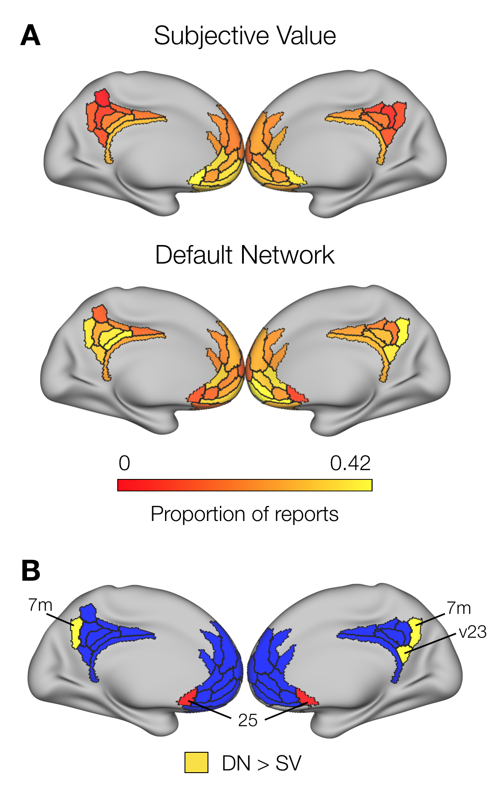

```{r setup, include=FALSE}
knitr::opts_chunk$set(echo = FALSE, warning = FALSE)
```

``` {r Libraries and functions, include = FALSE, fig.align="center", fig.width=6, fig.height=4, echo=FALSE}

Cols <- c("aquamarine4","#D9541A",rgb(190,190,190,100, maxColorValue = 255)) # left, right, interhemisphere

# In case I want to visualize stuff in the brain
labelCoords_vertex <- read.csv2('labelCoords_vertex.csv')[,2:6]
labelCoords_vertex <- transform(labelCoords_vertex, x = as.numeric(as.character(x)), y = as.numeric(as.character(y)), z = as.numeric(as.character(z)))

library(igraph)
library(pander)
library(ggnetwork)
library(ggplot2)
library(gridExtra)
library(data.table)
library(plyr)
library(mcclust)
library(lme4)
library(parallel)
library(corrplot)
library(DescTools)
library(knitr)


## Cohen's D for 2 groups
# for a more flexible approach, make the data input to be a list with entries for n groups, 
# then do length(list) for the number of groups. 
cohenD <- function(group1 = 1, group2 = 2){
  
  # means
  mean1 <- mean(group1, na.rm = T)
  mean2 <- mean(group2, na.rm = T)
  
  # variance
  var1 <- var(group1, na.rm = T)
  var2 <- var(group2, na.rm = T)
  
  # equation
  out <- (mean1 - mean2) / sqrt((var1 + var2)/2)
  
  return(out)
  
}

## log-log degree distribution
logDegreeDist <- function(Graph = padjMat) {
  
  tempD <- degree(Graph)
  tempDD <- degree.distribution(Graph) # frequency of occurrencies of certain degrees
  d <- (0:(max(tempD)-1))
  ind <- (tempDD!=0)
  plot(d[ind], tempDD[ind], log = "xy", col = "blue", 
       xlab = "Log-Degree", ylab = "Log-Intensity",  
       main = "Log-Log Degree Distribution")
  
}


## Create correlation matrix between vertices of 2 ROIs
# Requires labeled time series matrix
vertexCorrMat <- function(ROI_1 = 'R_7m_ROI', ROI_2 = 'L_7m_ROI'){
  
  # extract the time series from the ROIs
  indexing_1 <- which(rownames(timeSeries)==as.character(ROI_1))
  indexing_2 <- which(rownames(timeSeries)==as.character(ROI_2))
  nVerts_1 <- length(indexing_1)
  nVerts_2 <- length(indexing_2)
  ROI_1_tseries <- timeSeries[indexing_1, ]
  ROI_2_tseries <- timeSeries[indexing_2, ]
  
  # Create empty matrix
  corrMat <- matrix(data = 0, nrow = nVerts_1, ncol = nVerts_2)
  
  # 
  for (vertex_1 in seq(nVerts_1)){
    
    # temp series 1
    tempOne <- ROI_1_tseries[vertex_1, ]
    
    for(vertex_2 in seq(nVerts_2)){
      
      # temp series 2
      tempTwo <- ROI_2_tseries[vertex_2, ]
      
      # store the Pearson correlation in the corr matrix
      corrMat[vertex_1, vertex_2] <- cor(tempOne, tempTwo, method = "pearson") 
      
    }
  }
  
  # name the dimensions of the matrix according to the surface vertex index
  rownames(corrMat) <- indexing_1
  colnames(corrMat) <- indexing_2
  
  # plot (optional?)  
  # unclustered heatmap
  heatmap(corrMat,
          Rowv = NA,
          Colv = NA,
          scale = "row",
          col = pallette(1000))
  
  # clustered heatmap
  heatmap(corrMat,
          scale = "row",
          col = pallette(1000))
  
  # print min-max corr vals
  print(range(corrMat))
  
  return(corrMat)
  
}


## Correlation matrix between an ROI and the Glasser parcels
parcelCorrMat <- function(ROI = 'R_7m_ROI', lbels = lookup$V1){
  
  # extract the time series from the ROIs
  indexing <- which(rownames(timeSeries)==as.character(ROI))
  nVerts <- length(indexing)
  ROI_tseries <- timeSeries[indexing, ]
  
  # create empty matrix to store values
  corrMat <- matrix(data = 0, nrow = nVerts, ncol = 360)
  
  # Loop through every combination of label and 7m vertex
  for (Parcel in lbels){
    
    # Get an ROI index to retrieve timeseries and store correlation vals
    indxROI <- which(lbels==as.character(Parcel))
    
    for(vertex in seq(nVerts)){
      
      # temp series
      tempROI <- as.numeric(ptSeries[indxROI, ])
      tempVertex <- ROI_tseries[vertex, ]
      
      # store the Pearson correlation in the corr matrix
      corrMat[vertex, indxROI] <- cor(tempROI, tempVertex, method = "pearson") 
      
    }
  }
  
  # name the columns according to labels
  colnames(corrMat) <- lbels
  rownames(corrMat) <- indexing
  
  # plot (optional?)  
  # unclustered heatmap
  heatmap(corrMat,
          Rowv = NA,
          Colv = NA,
          scale = "none",
          col = pallette(1000))
  
  # clustered heatmap
  heatmap(corrMat,
          scale = "none",
          col = pallette(1000))
  
  # print min-max corr vals
  print(range(corrMat))
  
  return(corrMat)
  
}


## Correlation matrix between an Parcel and every other grayordinate
# THIS CAN BE OPTIMIZED WITH A BETTER USE OF COR()
partoverCorrMat <- function(ROI = 'R_7m_ROI', lbels = verts[[1]]){
  
  # extract the time series from the ROI
  indexing <- which(rownames(ptSeries)==as.character(ROI))
  ROI_tseries <- as.numeric(ptSeries[indexing, ])
  
  # get the remaining number of vertices
  nVerts <- length(lbels) 
  
  # Create data frame to store values
  parcelIndx <- which(labelCoords_parcel$Label==ROI)
  corrVec <- data.frame(Seed = rep(ROI, nVerts),
                        Labels = lbels,
                        xstart = rep(labelCoords_parcel$x[parcelIndx], nVerts), # 7.33324 for R_7m
                        ystart = rep(labelCoords_parcel$y[parcelIndx], nVerts), # -63.142
                        zstart = rep(labelCoords_parcel$z[parcelIndx], nVerts)) # 42.5578
  
  for(vertex in seq(nVerts)){
    
    # temp series
    tempVertex <- timeSeries[vertex, ] 
    
    # store the Pearson correlation in the corr matrix
    #corrVec$Correlation[vertex] <- cor(ROI_tseries, tempVertex, method = "pearson") 
    
    # Another option, so that FDR can be applied
    tempCor <- cor.test(ROI_tseries, tempVertex, method = "pearson")
    corrVec$Correlation[vertex] <- tempCor$estimate
    corrVec$pval[vertex] <- tempCor$p.value
    
  }
  
  # Turn ROI vertices into 0s
  indexing <- which(corrVec$Labels==as.character(ROI))
  corrVec$Correlation[indexing] <- 0
  
  # Create a column with p-vals corrected for multiple comparisons
  corrVec$adjPval <- p.adjust(corrVec$pval, "BY")
  
  # normalize correlation vals for analysis (see below)
  tempTanh <- fisherTanh(Data = corrVec$Correlation)
  corrVec$tanhZ <- tempTanh$tanhZ
  corrVec$tanhPvals <- tempTanh$pvals
  corrVec$tanhPAdjusted <- tempTanh$adjustPvals
  
  return(corrVec)
  
}


## tanh-z transformation (variance stabilizing Fisher) and p-values (adjusted and not)
# This takes either a matrix of correlation values (vectors too, but manually compute pvals)
# Normalization approach suggested in network textbook (equation 7.10)
fisherTanh <- function(Data = padjMatrix){
  
  transformed <- list()
  
  # tanh
  transformed$tanhZ <- 0.5 * log((1 + Data) / (1 - Data))
  
  # p-vals
  if (is.matrix(Data)) {
    z.vec <- transformed$tanhZ[upper.tri(transformed$tanhZ)]
    n <- dim(Data)[1]
  } else if (is.vector(Data)) {
    z.vec <- transformed$tanhZ
    n <- length(Data)
  }
  transformed$pvals <- 2 * pnorm(abs(z.vec), 0 , sqrt(1 / (n-3)), lower.tail=F)
  
  # adjust pvals
  transformed$adjustPvals <- p.adjust(transformed$pvals, "BH")
  
  if (is.matrix(Data)) {
    # get pvals and their adjustment into a symetric matrix form
    # regular
    tempMat <- matrix(0, dim(Data)[1], dim(Data)[2])
    tempMat[upper.tri(tempMat)] <- transformed$pvals
    tempMat[lower.tri(tempMat)] <- transformed$pvals
    dimnames(tempMat) <- list(rownames(Data), rownames(Data))
    transformed$pvals <- tempMat
    
    # adjusted
    tempMat <- matrix(0, dim(Data)[1], dim(Data)[2])
    tempMat[upper.tri(tempMat)] <- transformed$adjustPvals
    tempMat[lower.tri(tempMat)] <- transformed$adjustPvals
    dimnames(tempMat) <- list(rownames(Data), rownames(Data))
    transformed$adjustPvals <- tempMat
  }
  
  return(transformed)
  
}


## Extract the centroid-most vertex from each parcel
parcelCentroid <- function(ROI = 'R_7m_ROI', all_coordinates = labelCoords_vertex){
  
  # The coordinate file must contain a Label column
  
  # Get the ROI-specific vertices
  indx <- grep(ROI, all_coordinates$Label)
  
  # Grab the coordinates
  tempCoords <- all_coordinates[indx, c("x","y","z")]
  rownames(tempCoords) <- indx
  
  # Compute the distance among all vertices, and turn into a matrix
  tempDist <- dist(tempCoords, diag = T)
  tempDist <- as.matrix(tempDist)
  
  # Compute the sum of distances for each vertex, and get the minimum
  sumDists <- colSums(tempDist)
  minDist <- which(sumDists == min(sumDists))
  minDist <- indx[minDist]
  
  return(minDist)
  
}


## This function takes the output from partoverCorrMat() and adds/removes the characteristics we decided on.
prepROItoVer <- function(Data = R_7m_allCorr, Coordinates = labelCoords_vertex){
  
  # Add vertex coordinates
  tempDframe <- cbind(Data, Coordinates[,1:3])
  
  # Remove rows with non-significant adjusted pvalues
  indx <- tempDframe$adjPval < 0.05
  tempDframe <- tempDframe[indx, ]
  
  # Characterize correlation direction and round up vals for plotting
  tempDframe$Relation <- ifelse(tempDframe$Correlation < 0, "Negative", "Positive")
  tempDframe$Correlation <- round(tempDframe$Correlation, digits = 2)
  
  # Add a column to differentiate between left/right hemispheres
  tempDframe$Hemisphere <- substring(tempDframe$Labels,1,1)
  
  return(tempDframe)
  
}


## Plot correlation from ROI to rest of vertices
plotROItoVertex <- function(Data = R_7m_allCorr, ROI = 'R_7m_ROI', ColRange = Cols, View = "Axial", Legends = TRUE){
  
  ROIindx <- grep(ROI, Data$Labels)
  ROIvertices <- Data[ROIindx,c("x","y","z")] # grab ROI-specific vertices to black out
  labelCoord <- ROIvertices[1,] # just to place the label
  
  if (View == "Axial") {
    ggplot() +
      geom_point(data = Data, aes(x=x, y=y, alpha=.5, color = Correlation), show.legend = Legends) +
      geom_point(data = labelCoords_vertex, aes(x=x, y=y), alpha=0.01) +
      geom_nodes(data = ROIvertices, aes(x=x, y=y)) +
      geom_nodelabel_repel(aes(x=labelCoord$x, y=labelCoord$y, label = sub("_ROI","",ROI))) +
      scale_color_gradient2(low = ColRange[1], mid = "white", high = ColRange[2], limits = c(-1,1)) +
      theme_blank()
  } else if (View == "Sagittal") {
    ggplot() +
      geom_point(data = Data, aes(x=y, y=z, alpha=.5, color = Correlation), show.legend = Legends) +
      geom_point(data = labelCoords_vertex, aes(x=y, y=z), alpha=0.01) +
      geom_nodes(data = ROIvertices, aes(x=y, y=z)) +
      geom_nodelabel_repel(aes(x=labelCoord$y, y=labelCoord$z, label = sub("_ROI","",ROI))) +
      scale_color_gradient2(low = ColRange[1], mid = "white", high = ColRange[2], limits = c(-1,1)) +
      theme_blank()
  } else if (View == "Coronal") {
    ggplot() +
      geom_point(data = Data, aes(x=x, y=z, alpha=.5, color = Correlation), show.legend = Legends) +
      geom_point(data = labelCoords_vertex, aes(x=x, y=z),  alpha=0.01) +
      geom_nodes(data = ROIvertices, aes(x=x, y=z), alpha=.5) +
      geom_nodelabel_repel(aes(x=labelCoord$x, y=labelCoord$z, label = sub("_ROI","",ROI))) +
      scale_color_gradient2(low = ColRange[1], mid = "white", high = ColRange[2], limits = c(-1,1)) +
      theme_blank()
  } else if (View == "Medial Right") {
    if (substring(ROI,1,1) == "R") {
      oneHemi <- Data[grep("R", Data$Hemisphere), ]
      oneHemi$Medial <- ifelse(oneHemi$x < 20, "Medial", "Other")
      medialHemi <- oneHemi[which(oneHemi$Medial=="Medial"), ]
      medialHemi$y <- medialHemi$y * -1
      ROIvertices$y <- ROIvertices$y * -1
      labelCoord$y <- labelCoord$y * -1
      oneHemi_all <- labelCoords_vertex[grep("R",labelCoords_vertex$Hemisphere), ] # whole surface
      oneHemi_all$Medial <- ifelse(oneHemi_all$x < 20, "Medial", "Other")
      medialHemi_all <- oneHemi_all[grep("Medial", oneHemi_all$Medial), ]
      medialHemi_all$y <- medialHemi_all$y * -1
      ggplot() +
        geom_point(data = medialHemi, aes(x=y, y=z, alpha=.1, color = Correlation), show.legend = Legends) +
        #geom_point(data = medialHemi_all, aes(x=y, y=z), alpha=0.07) +
        scale_color_gradient2(low = ColRange[1], mid = "white", high = ColRange[2], limits = c(-1,1)) +
        geom_nodes(data = ROIvertices, aes(x=y, y=z), alpha=.5) +
        geom_nodelabel_repel(aes(x=labelCoord$y, y=labelCoord$z, label = sub("_ROI","",ROI))) +
        theme_blank()
    } else {
      oneHemi <- Data[grep("R", Data$Hemisphere), ]
      oneHemi$Medial <- ifelse(oneHemi$x < 20, "Medial", "Other")
      medialHemi <- oneHemi[which(oneHemi$Medial=="Medial"), ]
      medialHemi$y <- medialHemi$y * -1
      ROIvertices$y <- ROIvertices$y * -1
      labelCoord$y <- labelCoord$y * -1
      oneHemi_all <- labelCoords_vertex[grep("R",labelCoords_vertex$Hemisphere), ] # whole surface
      oneHemi_all$Medial <- ifelse(oneHemi_all$x < 20, "Medial", "Other")
      medialHemi_all <- oneHemi_all[grep("Medial", oneHemi_all$Medial), ]
      medialHemi_all$y <- medialHemi_all$y * -1
      ggplot() +
        geom_point(data = medialHemi, aes(x=y, y=z, alpha=.1, color = Correlation), show.legend = Legends) +
        #geom_point(data = medialHemi_all, aes(x=y, y=z), alpha=0.07) +
        scale_color_gradient2(low = ColRange[1], mid = "white", high = ColRange[2], limits = c(-1,1)) +
        theme_blank()
    }
  } else if (View == "Medial Left") {
    if (substring(ROI,1,1) == "L") {
      oneHemi <- Data[grep("L", Data$Hemisphere), ]
      oneHemi$Medial <- ifelse(oneHemi$x > -20, "Medial", "Other")
      medialHemi <- oneHemi[which(oneHemi$Medial=="Medial"), ]
      oneHemi_all <- labelCoords_vertex[grep("R",labelCoords_vertex$Hemisphere), ] # whole surface
      oneHemi_all$Medial <- ifelse(oneHemi_all$x < 20, "Medial", "Other")
      medialHemi_all <- oneHemi_all[grep("Medial", oneHemi_all$Medial), ]
      ggplot() +
        geom_point(data = medialHemi, aes(x=y, y=z, alpha=.1, color = Correlation), show.legend = Legends) +
        #geom_point(data = medialHemi_all, aes(x=y, y=z), alpha=0.07) +
        scale_color_gradient2(low = ColRange[1], mid = "white", high = ColRange[2], limits = c(-1,1)) +
        geom_nodes(data = ROIvertices, aes(x=y, y=z), alpha=.5) +
        geom_nodelabel_repel(aes(x=labelCoord$y, y=labelCoord$z, label = sub("_ROI","",ROI))) +
        theme_blank()
    } else {
      oneHemi <- Data[grep("L", Data$Hemisphere), ]
      oneHemi$Medial <- ifelse(oneHemi$x > -20, "Medial", "Other")
      medialHemi <- oneHemi[which(oneHemi$Medial=="Medial"), ]
      oneHemi_all <- labelCoords_vertex[grep("R",labelCoords_vertex$Hemisphere), ] # whole surface
      oneHemi_all$Medial <- ifelse(oneHemi_all$x < 20, "Medial", "Other")
      medialHemi_all <- oneHemi_all[grep("Medial", oneHemi_all$Medial), ]
      ggplot() +
        geom_point(data = medialHemi, aes(x=y, y=z, alpha=.1, color = Correlation), show.legend = Legends) +
        #geom_point(data = medialHemi_all, aes(x=y, y=z), alpha=0.07) +
        scale_color_gradient2(low = ColRange[1], mid = "white", high = ColRange[2], limits = c(-1,1)) +
        theme_blank()
    }
  }
  
}


## Run a fastgreedy modularity community detection on ROIs
# This function relies on having the timeSeries data uploaded, and labelCoords_vertex 
# Extras dictates whether the community object + correlation matrix should also be extracted
communityDetection <- function(Data = parcelBins$First, ROIS = "None", Type = "vertex", thresh = F, extras = F) {
  
  print(paste('Computing modularity based on', Type))
  
  if (ROIS == "None"){
    
    # This will just do SP for now, for sliding window
    print("Previously concatenated data")
    
    corrMat <- cor(t(Data))
    corrMatrix <- corrMat
    transfMat <- fisherTanh(Data = corrMat)
    if (thresh == T) {
      transfMat$tanhZ[transfMat$adjustPvals > 0.05] <- 0
    }
    corrMat <- transfMat$tanhZ
    
    diag(transfMat$tanhZ) <- 0    
    diag(corrMat) <- 0
    
    corrMat <- exp(corrMat)
    corrMat[corrMat==1] <- 0
    transfMat$tanhZ <- corrMat
    
    tempGraph <- graph_from_adjacency_matrix(corrMat, weighted = T, mode = "undirected")
    tempLap <- laplacian_matrix(tempGraph, normalized=T)
    tempEigen <- eigen(tempLap)
    f.vec <- length(tempEigen$values) - 1
    tempEigen$binarized <-  as.factor(ifelse(tempEigen$vectors[,f.vec] > 0, 1, 0)) # binarized Fiedler Vector 
    
    summary <- data.frame(Label = colnames(corrMat),
                          Hemisphere = substring(colnames(corrMat),1,1),
                          EigenVal = tempEigen$values,
                          FiedlerVec = tempEigen$vectors[, (length(tempEigen$values) - 1)],
                          FiedlerBinary = tempEigen$binarized)
    
    ## Get the final components
    if (extras == T) {
      modularityResults <- list(CorrMatrix = corrMatrix,
                                TransfMatrix = transfMat,
                                Summary = summary)
    } else {
      modularityResults <- list(Summary = summary)
    }
    
  } else {
    
    if (Type == "vertex") {
      # To store the vertex indices corresponding to the ROIs
      indx <- numeric()
      
      # had to place dashes on each side because grep grabbed strings containing the names (i.e. 47m, a24pr)
      #ROIS <- c("_7m_", vmPFC_labels) # c("_a24_", "_7m_")
      for (ROI in ROIS) {
        indx <- c(indx, grep(ROI, rownames(Data)))  
      }
      
      nVerts <- length(indx)
      ROI_tseries <- Data[indx, ]
      
      # This used to be done with the for loop, but it was too slow. cor() speeds up the process by a lot
      corrMat <- cor(t(ROI_tseries))
      
      # name the dimensions of the matrix according to the surface vertex index
      rownames(corrMat) <- indx
      
      # for storing later
      corrMatrix <- corrMat
      
      # transform to Fisher's (think of thresholding)
      transfMat <- fisherTanh(Data = corrMat)
      
      # Determine if edges should be thresholded or not
      if (thresh == T) {
        transfMat$tanhZ[transfMat$adjustPvals > 0.05] <- 0
      }
      
      # Store Fisher transformed vals for graphing
      corrMat <- transfMat$tanhZ
      
      # diagonals of 1 could be interpreted as self-loops
      diag(transfMat$tanhZ) <- 0    
      diag(corrMat) <- 0
      
      # Exponentiate to preserve distribution while ensuring positive weights
      # I'm keeping corrMat and transfMat$tanhZ separate in case I want to uncorrect transfMat in the future
      corrMat <- exp(corrMat)
      corrMat[corrMat==1] <- 0
      transfMat$tanhZ <- corrMat
      
      # community detection
      # I initially used the absolute value of the correlation, but the exp preserves the distribution 
      # Next, try using the fisher transform
      
      tempGraph <- graph_from_adjacency_matrix(corrMat, weighted = T, mode = "undirected")
      tempCommunity <- fastgreedy.community(tempGraph)
      
      # community object
      #modularityResults$community <- tempCommunity
      
      # correlation matrix with transformed values
      #modularityResults$corrMat <- corrMatrix
      
      # get coordinate info from selected regions (useful for ggplot)
      summary <- data.frame(Vertex = indx,
                            Label = tempCommunity$names,
                            Membership = tempCommunity$membership,
                            Modularity = tempCommunity$modularity,
                            x = labelCoords_vertex[indx, "x"],
                            y = labelCoords_vertex[indx, "y"],
                            z = labelCoords_vertex[indx, "z"],
                            Hemisphere = substring(tempCommunity$names,1,1))
      
      
    } else if (Type == "parcels") {
      
      # This used to be done with the for loop, but it was too slow. cor() speeds up the process by a lot
      corrMat <- cor(t(Data))
      
      # for storing later
      corrMatrix <- corrMat
      
      # transform to Fisher's (think of thresholding)
      transfMat <- fisherTanh(Data = corrMat)
      
      # Determine if edges should be thresholded or not
      if (thresh == T) {
        transfMat$tanhZ[transfMat$adjustPvals > 0.05] <- 0
      }
      
      # Store Fisher transformed vals for graphing
      corrMat <- transfMat$tanhZ
      
      # diagonals of 1 could be interpreted as self-loops
      diag(transfMat$tanhZ) <- 0
      diag(corrMat) <- 0
      
      # Exponentiate to preserve distribution while ensuring positive weights
      # I'm keeping corrMat and transfMat$tanhZ separate in case I want to uncorrect transfMat in the future
      corrMat <- exp(corrMat)
      corrMat[corrMat==1] <- 0
      transfMat$tanhZ <- corrMat
      
      # community detection
      # I initially used the absolute value of the correlation, but the exp preserves the distribution 
      # Next, try thresholding it by the adjusted p-vals
      tempGraph <- graph_from_adjacency_matrix(corrMat, weighted = T, mode = "undirected")
      tempCommunity <- fastgreedy.community(tempGraph)
      
      # community object
      #modularityResults$community <- tempCommunity
      
      # correlation matrix with transformed values
      #modularityResults$corrMat <- corrMatrix
      
      # get coordinate info from selected regions (useful for ggplot)
      summary <- data.frame(Label = tempCommunity$names,
                            Membership = tempCommunity$membership,
                            Modularity = tempCommunity$modularity,
                            x = labelCoords_parcel[ ,"x"],
                            y = labelCoords_parcel[ ,"y"],
                            z = labelCoords_parcel[ ,"z"],
                            Hemisphere = substring(tempCommunity$names,1,1))
      
    }
    
    
    ## Get the final components
    modularityResults <- list(Community = tempCommunity,
                              CorrMatrix = corrMatrix,
                              TransfMatrix = transfMat,
                              Summary = summary)
    
  }
  
  return(modularityResults)
  
}


## plot the communities from communityDetection
plotCommunities <- function(Data = modularityResults, Hemi = "R", type = "Membership", Legends = T, bground=0.1, Cols = c("aquamarine4", "#D9541A")) {
  # This takes the output from the communityDetection function and plots them on the medial wall (since we're interested in medial now)
  # type is the name of the column to plot
  if (Hemi == "R") {
    # "Medial Right"
    oneHemi <- Data[grep("R", Data$Hemisphere), ] # from the ROIs
    oneHemi$Medial <- ifelse(oneHemi$x < 20, "Medial", "Other")
    medialHemi <- oneHemi[grep("Medial", oneHemi$Medial), ]
    medialHemi$y <- medialHemi$y * -1
    oneHemi_all <- labelCoords_vertex[grep("R",labelCoords_vertex$Hemisphere), ] # whole surface
    oneHemi_all$Medial <- ifelse(oneHemi_all$x < 20, "Medial", "Other")
    medialHemi_all <- oneHemi_all[grep("Medial", oneHemi_all$Medial), ]
    medialHemi_all$y <- medialHemi_all$y * -1
    ggplot() + 
      geom_point(data = medialHemi, aes_string(x="y", y="z", color = type), show.legend=Legends) +
      geom_point(data = medialHemi_all, aes(x=y, y=z), alpha=bground) +
      scale_color_gradient(low = Cols[1], high = Cols[2]) +
      theme_blank() 
  } else if (Hemi == "L") {
    # "Medial Left"
    oneHemi <- Data[grep("L", Data$Hemisphere), ]
    oneHemi$Medial <- ifelse(oneHemi$x > -20, "Medial", "Other")
    medialHemi <- oneHemi[which(oneHemi$Medial=="Medial"), ]
    oneHemi_all <- labelCoords_vertex[grep("L",labelCoords_vertex$Hemisphere), ] # whole surface
    oneHemi_all$Medial <- ifelse(oneHemi_all$x > -20, "Medial", "Other")
    medialHemi_all <- oneHemi_all[grep("Medial", oneHemi_all$Medial), ]
    ggplot() + 
      geom_point(data = medialHemi, aes_string(x="y", y="z", color = type), show.legend=Legends) +
      geom_point(data = medialHemi_all, aes(x=y, y=z), alpha=bground) +
      scale_color_gradient(low = Cols[1], high = Cols[2]) +
      theme_blank() 
  }
}


## get ROI coords & index
# The point here is to reduce the summary dframes from community detection to show only ROIs
# Should work for extracting any label-indexed dframe though
# I wanted to also get the index in case I want to extract specific rows from parcel/vertex coord dframes
getCoords <- function(Labels = DMN_labels, Coords = labelCoords_parcel, TimeSeries = FALSE){
  
  indx <- numeric()
  
  # If you want to select time series from raw data
  if (TimeSeries == TRUE) {
    
    for (ROI in Labels) {
      indx <- c(indx, grep(ROI, rownames(Coords)))
    }
    
  } else { # for the summary output of the community detection output
    
    for (ROI in Labels) {
      indx <- c(indx, grep(ROI, Coords$Label))
    }
    
  }
  
  results <- list()
  results$Index <- indx
  results$Coords <- Coords[indx, ]
  
  return(results)
  
}


# eigen value community detection
eigenVals <- function(Data = binnedCommunities_p$First) {
  
  # This will produce a vector of values, ready to be plotted
  tempGraph <- graph_from_adjacency_matrix(Data$TransfMatrix$tanhZ, mode = "undirected", weighted = T)
  tempGraph <- laplacian_matrix(tempGraph, normalized=T)
  tempGraph <- eigen(tempGraph)
  f.vec <- length(tempGraph$values) - 1
  tempGraph$binarized <-  as.factor(ifelse(tempGraph$vectors[,f.vec] > 0, 1, 0)) # binarized Fiedler Vector
  
  return(tempGraph)
  
}


# Attempt at setting up data for confusion matrices and Jaccard index calculations
confusionMatrix <- function(partition1 = parcelCommunities[[1]]$Membership, partition2 = parcelCommunities[[1]]$FiedlerBinary) {
  
  # Divide partitions to evaluate
  # Usually 2 will be fiedler
  
  # Check if any partition has 0s (since I binarize the Fiedler vector)
  if (0 %in% partition1) {
    
    partition1[grep(0, partition1)] <- 1
    partition1[grep(1, partition1)] <- 2
    
  } 
  
  if (0 %in% partition2) {
    
    partition2[grep(1, partition2)] <- 2   
    partition2[grep(0, partition2)] <- 1
    
  }
  
  # Community sizes
  commSizes1 <- table(partition1)
  commSizes2 <- table(partition2)
  
  # Number of communities per partition
  nComms1 <- length(commSizes1)
  nComms2 <- length(commSizes2)
  
  # Number of vertices
  n <- length(partition1)
  
  # Putting together elements of the confusion matrix
  confMatrix <- matrix(nrow = nComms1,
                       ncol = nComms2)
  
  for (i in as.numeric(case.names(commSizes1))) {
    
    # Vertices belonging to community qX of partition X
    tempComm1 <- partition1 == i
    
    for (j in as.numeric(case.names(commSizes2))) {
      
      # Vertices belonging to community qY of partition Y
      tempComm2 <- partition2 == j
      
      # Populate matrix
      confMatrix[i,j] <- sum(tempComm1 & tempComm2) 
      
    }
  }
  
  if (sum(confMatrix) != n) {warning('Sum of the confusion matrix is not equal to number of vertices')}
  
  
  return(confMatrix)
  
}


# Permutation for 2 groups
permute <- function(group1 = 1, group2 = 2, statType = mean, nPerms = 5000, paired = FALSE){
  
  # prep data
  summaryPerm <- list()
  lOne <- length(group1)
  lTwo <- length(group2)
  bigSample <- c(group1,group2)  
  
  if (paired == FALSE) {
    
    
    for (i in 1:nPerms){
      
      # relabel samples
      tempBig <- sample(bigSample)
      tempOne <- tempBig[1:lOne]
      tempTwo <- tempBig[(lOne+1):length(bigSample)]
      
      # stats
      tempDiffs <- statType(tempOne,na.rm=T) - statType(tempTwo,na.rm=T)
      summaryPerm$jointDist[i] <- tempDiffs # statType(tempDiffs, na.rm = T) 
      
    }  
    
  } else {
    
    for (i in 1:nPerms){
      
      # shift labels in a pairwise fashion
      tempDiffs <- statType((-1)^rbinom(lOne,1,0.5) * (group1 - group2))
      summaryPerm$jointDist[i] <- tempDiffs
      
    }
    
  }
  
  # get the observed difference
  diffs <- statType(group1,na.rm=T) - statType(group2,na.rm=T)
  observedAbs <- abs(diffs) # maybe leave it as means here
  observed <- diffs
  summaryPerm$Pval <- 2 * (1 - ecdf(summaryPerm$jointDist)(observedAbs))
  if (length(unique(abs(summaryPerm$jointDist))) == 1) {summaryPerm$Pval <- 1} # if the difference is always the same, then p = 1
  summaryPerm$Observed <- observed
  
  return(summaryPerm)
  
}


# Non-parametric Bootstrap for a single group
bootstrap <- function(group = 1, statType = mean, B = 5000){
  
  # prep param
  bootStats <- rep(0,B)
  
  # iterate
  for(b in 1:B){
    
    # wait group
    x <- sample(group,length(group),replace=T)  
    bootStats[b] <- statType(x,na.rm = T)
    
  }
  
  return(bootStats)
  
}


# number of times a node changes affiliation in a time series
flexibility <- function(Data = cbind(1:10, 6:15)) {
  # Calculation of flexibility based on Garcia et al., 2018  
  # This function takes in a data frame or matrix in which columns are the community affiliation 
  # It needs at least 2 colums, although it's pointless for that  
  
  # How many jumps can there be?
  nJumps <- dim(Data)[2] - 1
  
  # Matrix to store jumps
  jumpCount <- matrix(nrow = dim(Data)[1], ncol = nJumps)
  
  # For each transition, get the which nodes changed affiliation
  for (jump in seq(nJumps)) {
    
    jumpCount[, jump] <- Data[, jump] != Data[, jump + 1]
    
  }
  
  # How many times did every node jump?
  totalJumps <- rowSums(jumpCount)
  
  # Calculate the flexibility per node
  flexibility <- totalJumps / nJumps
  
  return(flexibility)
  
}


# Sliding window
slidingWindow <- function(subjTS = ROI_timeSeries[[1]], mins = 15, jump = 1, Spectral = T, Modularity = F, ROIs = c("_7m_", vmPFC_labels)) {
  # This is a fairly specific function. It takes the time series from a participant and preps/runs community detection at each specified time window. 
  # Returns the summaries for each window (based on communityDetection function)
  # The selection of a window size is based on the fact that a TR = 0.720s and an hour is 5000 TRs (HCP-based)
  # Since each subject has a different amount of time points, and all are slightly under 1 hr, I chose to round down the number of window moves to avoid unevenness
  # 
  # Parameter definitions:
  #   
  #   subjTS: Subject time series. Note: if you want to look at more than vmpfc and 7m, add a parameter for the labels that can be passed to the community detection function
  # 
  #   mins: Size of the window that will slide through the data.
  #   
  #   jump: Steps (in mins) advanced per slide
  #   
  #   Spectral: Whether to compute spectral partitioning as well. Takes significantly longer, but might be more useful for bisections
  #
  # Right now this takes ~27 mins per subject to run. Think of ways to improve that.
  
  
  # Adapted so it works with the output from getCoords
  # One wouldn't really apply a full-brain analysis of this sort anyways, too computationally intensive
  indx <- subjTS$Index
  subjTS <- subjTS$Coords
  
  # Window sizing (length)
  # Think about incorporating custom TRs
  TS <- dim(subjTS)[2] # time series for the subject
  WS <- seq(834 * (mins/10)) # window from the first TR up to 834 (~10 mins) times the desired multiplier
  jump <- 84 * jump # 84 ~ 1 min, times the number of mins that the window moves
  nJumps <- floor((TS - length(WS)) / jump) # number of jumps to be performed, based on the selected parameters
  
  ##------- using lapply
  winData <- mclapply(seq(nJumps), function(x) subjTS[,WS+(jump*(x-1))])
  commTS <- mclapply(winData, communityDetection, ROIS = "None", Type = "vertex", thresh = T, extras = F)
  return(commTS)
  
}


# compare sliding window data to overall communities
slideCompare <- function(subjData = slideCommunities[[1]], template = vmpfc7mCommunities[[1]], func = "RI", comm = "Spectral") {
  # This function compares the community partition from each window slide to the one derived from the whole data set
  # 
  # Parameter definitions:
  #   
  #   subjData: A participant's output from slideCommunities
  #   
  #   template: The partition from the whole time series
  # 
  #   func: Which function to use for comparing ("RI" for adjusted RI, "VI" for variation of information)
  # 
  #   comm: The subject data might contain modularity and spectral partitions. Choose which to use.
  
  # For storing RIs or VIs
  tempComparison <- numeric()
  
  # How many jumps does the original data contain?
  nJumps <- length(subjData)
  
  # This loop is technically backwards. I should technically divide by function, then partition method, and then run the window comparisons
  # It's still really fast, so I won't worry.
  for (Win in seq(nJumps)) {
    if (comm == "Modularity") {
      if (func == "RI") {
        tempComparison[Win] <- arandi(subjData[[Win]]$Membership, template$Membership, adjust = T)
      } else if (func == "VI") {
        tempComparison[Win] <- vi.dist(subjData[[Win]]$Membership, template$Membership)
      }
    } else if (comm == "Spectral") {
      if (func == "RI") {
        tempComparison[Win] <- arandi(subjData[[Win]]$FiedlerBinary, template$FiedlerBinary, adjust = T)
      } else if (func == "VI") {
        tempComparison[Win] <- vi.dist(subjData[[Win]]$FiedlerBinary, template$FiedlerBinary)
      }
    }
  }
  
  return(tempComparison)
  
}

# Ensure that all spectral communities associated with 7m (i.e. DMN) have the same label value of 1 
evenSpectral <- function(Data = slideCommunities[[1]][[7]]) {
  
  # Get only the values for 7m
  shortData <- Data[grep("_7m_", Data$Label), ]
  
  # Get 7m's most probable affiliation
  affil <- mean(as.numeric(shortData$FiedlerBinary)-1)
  
  # If it is close to 1, then invert the labeling. 
  # Note: This has no effect on RI or VI, since they are insensitive to actual labeling
  # This is for visualization purposes only
  if (affil < 0.5) {
    
    UD <- as.numeric(Data$FiedlerBinary) - 1
    Data$FiedlerBinary <- as.factor((UD - 1)^2)
    Data$FiedlerVec <- Data$FiedlerVec * -1
    
  }
  
  return(Data)
  
}

# Create a vector ready to be used for HCP data (32k CIFTI surface)
# The input should be the summary from community partitioning
# Once this is created, go to the terminal and input something like this
# wb_command -cifti-convert -from-text dataforCifti.txt 100307.MyelinMap_BC.32k_fs_LR.dscalar.nii testCifti.dscalar.nii
# Where the myelin file here is just a templace. It can be any dscalar.nii with the right surface size
HCPOut <- function(Data = dmnval7mCommunities[[1]], MOI = "Membership", SubjID = "100307"){
  
  nVertices <- 59412
  tempVec <- rep(-1, nVertices)
  temp <- grep(MOI, colnames(Data))
  tempVec[Data$Vertex] <- Data[[temp]]
  write.table(file = paste(SubjID,"_",MOI,'_dataforCifti.txt', sep=""), tempVec, row.names = F, col.names = F, dec = ".")
  
}

# Perform pairwise comparisons of clustering outcomes on all subjects
comparePartitions <- function(Data = dmnval7mCommunities, MOI = "FiedlerBinary", Index = "VI", nSubjects = nSubj, subjNames = subjList) {
  # This function will compare the community partitions from all subjects and create a 'comparison matrix' for every pairwise combination of subjects
  # Alternatively, if a second MOI is added 
  # Inputs
  # 
  # Data: the list of summaries produced by the script
  # 
  # MOI: measure of interest (usually the binarized Fiedler vector). If a vector, compares across algorithms per subject
  # 
  # Index: VI for variation of information, RI for the adjusted rand index, Cor for a Pearson correlation
  
  # Get the column position of the MOI(s)
  Columns <- colnames(Data[[1]])
  indx <- as.numeric(Columns %in% MOI)
  MOI_indx <- which(indx==1)
  
  if (length(MOI_indx) < 2) {
    # Combine the measures of interest
    allVecs <- do.call(cbind, lapply(Data, "[[", MOI))
    
    # Create empty matrix
    indexMatrix <- matrix(data = NA, nrow = nSubjects, ncol = nSubjects)
    dimnames(indexMatrix) <- list(subjNames, subjNames)
    
    # Run every pairwise comparison with the index of interest on the measure of interest
    if (Index == "VI") {
      for (subj in seq(nSubjects)) {
        for (subj2 in seq(nSubjects)) {
          indexMatrix[subj,subj2] <- vi.dist(allVecs[, subj], allVecs[, subj2])
        }
      }
    } else if (Index == "RI") {
      for (subj in seq(nSubjects)) {
        for (subj2 in seq(nSubjects)) {
          indexMatrix[subj,subj2] <- arandi(allVecs[, subj], allVecs[, subj2], adjust = T)
        }
      }
    } else if (Index == "Cor") {
      for (subj in seq(nSubjects)) {
        for (subj2 in seq(nSubjects)) {
          indexMatrix[subj,subj2] <- cor(allVecs[, subj], allVecs[, subj2])
        }
      }
    }
  } else {
    indexMatrix <- data.frame(SubjID = as.character(subjList),
                              Index = rep(0, nSubjects))
    # Run every pairwise comparison with the index of interest on the measure of interest
    if (Index == "VI") {
      for (subj in seq(nSubjects)) {
        indexMatrix$Index[subj] <- vi.dist(Data[[subj]][, MOI_indx[1]], Data[[subj]][, MOI_indx[2]])
      }
    } else if (Index == "RI") {
      for (subj in seq(nSubjects)) {
        indexMatrix$Index[subj] <- arandi(Data[[subj]][, MOI_indx[1]], Data[[subj]][, MOI_indx[2]], adjust = T)
      }
    } else if (Index == "Cor") {
      for (subj in seq(nSubjects)) {
        indexMatrix$Index[subj] <- cor(Data[[subj]][, MOI_indx[1]], Data[[subj]][, MOI_indx[2]])
      }
    }
  }
  
  return(indexMatrix)
  
}

# Generate a matrix with submatrices of 1s of a given size along the diagonal
# Useful to extract specific portions of data from a similarity matrix
diagBlocks <- function(dims = 20, sqSize = 4) {
  div <- dims %/% sqSize
  finalMatrix<-matrix(0,nrow=dims,ncol=dims)
  index <- 1
  for(k in seq(div)){
    finalMatrix[index:(index + (sqSize-1)),index:(index + (sqSize-1))] <- 1
    index<-index + sqSize
  }
  finalMatrix <- finalMatrix == 1
  finalMatrix
}


```

``` {r For HCP data, fig.align="center", echo=FALSE, message = FALSE}
# setwd('./For_HCP')
# temp <- list.files(pattern = '*Binary*')
# FB <- lapply(temp, read.table)
# Summed <- do.call(cbind, lapply(FB, "[[", 'V1')) - 1
# FB_Means <- rowMeans(Summed)
# 
# write.table(file = 'propDMN_all.txt', FB_Means, row.names = F, col.names = F, dec = ".")
```

  
## Abstract

  Valuation effects are consistently observed in medial prefrontal and posterior cingulate cortex (mPFC and PCC). The spatial extent of these effects is mostly indistinguishable from the default mode network (DMN) in existing meta-analyses. However, little is known about how valuation effects fit within the broader functional architecture of mPFC and PCC, or whether that architecture is consistent or idiosyncratic across individuals. Here we complement a meta-analysis with fMRI-based graph theoretic approaches to subdivide mPFC and PCC at the single-subject level. Our results suggest the functional topography of mPFC has substantial variability across individuals. This highlights the potential usefulness of estimating brain effects at the individual level in this region, and points to limitations of aggregative methods such as coordinate-based meta-analysis in determining whether valuation and DMN effects emerge from common or separable brain systems. Our approach shows promise in addressing this issue through future manipulations of valuation.


## Introduction

  Studies of decision making have consistently associated activity in ventromedial prefrontal cortex (vmPFC) with the subjective value assigned to decision outcomes (Bartra, McGuire, & Kable, 2010; Clithero & Rangel, 20??; Hiser & Koenigs, 2017; Kable & Glimcher, 2007; Levy et al., 2011). However, the distributed cortical valuation system also includes posterior cingulate and more extended mPFC regions, which collectively show significant spatial overlap with the default mode network (DMN) along the medial wall (Fox et al., 2005; Laird et al., 2009; Yeo et al., 2011). This shared neural coverage has prompted the question of whether (and to what extent) these two systems can be dissociated.

  Previous meta-analytic work has provided important insights on the psychological phenomena attributed to mPFC subregions. Independent coordinate-based meta-analyses have found mirroring spatial coverage in mPFC for valuation (Bartra et al., 2010) and DMN (Laird et al., 2009). Whole brain analyses have shown that while more ventral mPFC regions are increasingly associated with reward-related elements of decision making, vmPFC strongly coactivates with DMN regions across the literature, with no clear topographical distinction between these phenomena (de la Vega et al., 2016). More focused meta-analytic work aimed at disentangling DMN from subjective value has determined that these systems are inseparable within mPFC (Acikalin, Gorgolewski, & Poldrack, 2017). These findings highlight the multifaceted embedding of psychological constructs in subregions of mPFC, and suggest that DMN and valuation might indeed be subserved by the same system. However, recent activation-based meta-analytic work has demonstrated considerable domain specificity in this area (Kragel et al., 2018). While informative, a key limitation in distinguishing constructs through this approach is that meta-analyses often rely on information derived from group-averaged data. Averaging has traditionally been beneficial in identifying tendencies in brain function and organization when faced with short scanning sessions per subject. However, it has been shown that mPFC is subject to considerable idiosyncratic cortical folding (Zilles, Palomero- Gallagher, & Amunts, 2013) and inter-subject functional variability (Mueller et al., 2013) compared to the rest of the brain, thus making group-averaging studies difficult to interpret. 
  
  Seeking to remedy these shortcomings, recent work has prescribed relevance to the analysis of single subjects in fMRI. Individual analyses of fMRI data have identified idiosyncratic, reliable, and valid functional organization that would otherwise be blurred in aggregative estimations (Laumann et al., 2015; Gordon et al., 2017; Gratton et al., 2018). Furthermore, subject-specific network arrangements have been found to predict behavioral characteristics (Yeo et al., 2018). In regards to DMN, the trend of individualized analyses has led to finer idiosyncratic subdivisions of the DMN through careful selection of seed-based functional connectivity (Braga & Buckner, 2018). It is thus possible that the indisitinguishable overlap of DMN and valuation effects can be attributed to a lack of spatial resolution that is better understood at the individual level. With this in mind, an important first step in disentangling these phenomena would be to determine the degree of topological heterogeneity of the DMN present within mPFC.

  A persistent issue in analyzing mPFC in individuals is the various factors inducing signal dropout in its more ventral segments (Logothetis, 2008). As such, there is value in examining all possible sources of covariation that compose DMN, instead of estimating topologies one seed at a time. Connectome-based analyses of resting state functional connectivity (rsFC) have been fruitful in characterizing individualized functional topologies that match task-induced activity (Gordon et al., 2017; Laumann et al., 2015; Tobyne et al., 2018). A popular approach to analyze these connectomes is to rely on graph theoretic methods, which provide an organic avenue to understand brain network dynamics (Bassett, Zurn, & Gold, 2018). From these, community detection algorithms have been successfully utilized to section brain networks into cohesive substructures (Garcia, Ashourvan, Muldoon, Vettel, & Bassett, 2018). Such communities represent clusters of network nodes that are more connected with each other than with the rest of the network (Fortunato & Hric, 2016). Among the algorithms used to estimate these communities, modularity has been widely effective in subsectioning brain networks into multiple groups (Garcia et al., 2018). However, in attempting to refine the DMN topology at the individual level, dividing these regions into what belongs and does not belong to DMN makes dissection through spectral partitioning a more valuable option. In short, spectral partitioning performs eigenvalue decompositon on an adjusted form of a correlation matrix (Laplacian matrix). The resulting eigenvector corresponding to the second-to-last eigenvalue (i.e. the Fiedler Vector) provides values to divide the network into a positive and a negative community (Fiedler, 1975). This method can thus capture a refined group of brain regions that more cohesively share activation patterns during rest.

  In this study, we aim to subsection regions commonly attributed to both DMN and subjective value into subject-specific DMN and non-DMN partitions, quantifying the degree of topographical heterogeneity present in this network within and across individuals. This description will allow researchers to generate more precise topographic targets for future studies of decision making. We do this by capitalizing on the respective strengths of meta-analytic and subject-specific analyses of brain data. First, we define regions of interest (ROI) by identifying overlapping activation throughout the literature projected to an established brain atlas (Glasser et al., 2013). We then produce a rsFC networks of all the surface vertices within these ROIs for each individual resting state dataset from the Human Connectome Project (HCP; citation), and estimate the extent of DMN coverage through spectral partitioning. The resulting patterns are then evaluated for consistency across methods, throughout each individual's time series, and across subjects. Finally, we show some interesting properties of SP related to the stability of brain networks.


## Methods

**Meta-analysis**
We used data from metan-alyses that gathered peak brain coordinates of activity from studies of valuation (Bartra et al., 2010) (n = 27 studies) and DMN (Laird et al., 2009) (n = 77). These represent the surviving areas post-statistical thresholding from each study. For each peak volumetric coordinate, 10 mm sphere masks were generated and then projected to a standard cortical mesh (fs_average, 32,000 vertices) using FreeSurfer. The sphere sections that overlapped with the cortex (should I add the details of the overlap?) were mapped to an atlas of the human cortical surface (Glasser et al., 2016). This produced a list of standardized parcels that were reported on each study. 

With these lists, we identified the areas that were more consistently shared between DMN and valuation. For each literature, we summed the number of times each parcel was reported across studies, and performed a one-way chi-squared test of proportions on each parcel with a null probability equivalent to the bootstrapped (5000 iterations) mean of each literature's report counts. In other words, we checked which regions were significantly (p < 0.05) more reported in their respective literatures than their counterparts. Regions of interest were then determined based on which of the remaining regions were common across literatures.

Next, we identified areas that were solely related to either literature. We limited the search space to the parcels that were contained within the DMN parcellation defined by Yeo et al. (2011). We permuted the label of every study (i.e. DMN or valuation) 5000 times while preseving the total number of studies observed in each domain, and on each iteration stored the maximum statistic from a ROI-wise chi-squared test of proportions on the number of prmuted studies that had reported each ROI. This gave us a null distribution of chi-squared values that was used to determine which ROIs were more significantly prevalent on each literature. 

**fMRI Data**
In order to quantify the intrinsic connectivity of these ROIs in the brain, we acquired resting-state fMRI data from the Human Connectome Project (HCP; Van Essen et al., 2013; www.humanconnectome.org) Q6 release (n = 80, randomly sampled from the total pool of 469 available subjects). Each subject's data was acquired over two days at Washington University in St. Louis on a Siemens CONNECTOM Skyra MRI scanner (Siemens, Erlangen, Germany). Four resting state sessions (TR = 0.720 s, TE = 33.1 ms, FA = 52°, multiband factor = 8, 72 slices, 2 mm isotropic voxels) were each comprised of 1200 TRs for a total scan time of 14 min 33 s, with left-right and left-right phase encoding implemented on each day. We used this scanning structure to estimate each subject's topology based on session, day, and overall data (4800 TRs). 

Beyond the in-house minimally preprocessed pipeline from HCP (Glasser et al., 2013), which includes considerable motion correction, temporal denoising, highpass filtering (0.0005 Hz threshold), and MNI152-based normalization, all scans went through a number of additional refinements (Tobyne et al., 2017). These included band-pass filtering (allowed frequencies ranged from 0.009 and 0.08 Hz), as well as mean greyordinate signal regression (MGSR; Burgess et al., 2016). Only subjects with both left-right and right-left phase encoding were included (i.e. subjects with four rsfMRI sessions). In addition, only datasets with either low motion levels (under 1.5mm) or under 0.5 mm mean framewise displacement (FD) were used. Volumes that displayed an FD of over 0.5 mm were considered as spikes and removed from the subject's dataset, and subjects whose spike counts were above 5% of their total data were excluded from analyses. Finally, data acquired on the same day (i.e. left-right and right-left phase encoding session) were temporally demeaned. Each subject's brain was comprised of 32k vertices per hemisphere. We retained only the cortical surfaces, which resulted in 59,412 total surface vertices per subject. 

**Within-ROI Network Definition**
To establish each subject's network, we selected all the vertices contained within the ROIs (n = 5,564 per subject) and computed the Pearson correlation of the time series for every pair of vertices. This produced a weighted network for each subject, where surface vertices were the nodes, and edges the correlations among all of them. Next, we took the exponential of the correlations, Fisher transformed them (i.e. tanh) so that all weights were positive while maintaining the shape of the original correlation distribution, and retained the edges whose adjusted p-values remained significant after correction for multiple tests (FDR < 0.05). As part of the evaluation step, this procedure (and the community detection outlined below) was applied at four levels: 1) each session separately; 2) the concatenated timeseries from each pair of daily sessions; 3) each subject's dataset; and 4) on each step of a sliding window analysis (see Evaluation for more details).

**Community Detection**

Communities (i.e. clusters) were identified by means of spectral partitioning (SP; Fiedler, 1975). First, each adjusted network was represented as an n x n correlation matrix (where n = number of vertices within the ROIs, 5,564). This matrix was then transformed into its normalized Laplacian form

$$\begin{aligned}
L = I - D^{-\frac{1}{2}}AD^{-\frac{1}{2}}
\end{aligned}$$

Where I is the identity matrix, D is a diagonal matrix containing the strength of each vertex (i.e. the sum of its correlations with every other vertex), and A is the correlation matrix. We then computed the eigenvalues and eigenvectors of the normalized Laplacian, and used the eigenvector associated with the second-to-lowest eigenvalue to divide the network into two. This vector (from now on called the 'Fiedler Vector') provides a set of positive and negative values to binarize the network with, and guarantees that the resulting communities are connected (Fiedler, 1975). Given that this data-driven method is agnostic to the prevalent function of each community (i.e. DMN or not DMN), we defined the DMN community as the one containing the one DMN-specific area from the meta-analysis. Importantly, given the high density of these networks (**Add to results**), spectral partitioning was unlikely to face the issues associated with its use in sparse networks (Fortunato & Hric, 2016).

In order to evaluate the validity of the resulting partitions, we also estimated these communities using the more traditional approach of modularity maximization (using the algorithm from Clauset et al., XXXX). This method maximizes a quality function that compares the strength of the connection between any two vertices against a null model of their probability of being randomly connected to any other vertex in the network. The method heuristically iterates through many possible combination of vertices, and selects the clustering that maximizes the network's modularity. Thus, unlike SP, modularity can subdivide a network into many functional groups. If the partitions from the bounded and unbounded methods show high level of agreement, we can gain confidence in that we are indeed fractioning the ROIs into those belonging to DMN and not.

**Partition Evaluation**
To quantify the agreement between partitions, we computed both the adjusted rand index and variation of information distance. The adjusted rand index denotes the proportion of vertices that coincide in affiliation across partitions, and compares this score to a baseline given by the expectation based on a random vertex assignment for an equal number of clusters across partitions. On the other hand, variation of information gives a general sense of the amount of information to be gained by the complementary community partitioning (Meila, 2007), measured by the addition of the conditional entropies per combination of clusters across partitions. While the rand index is more easily interpreted, it suffers from the assumption that the baseline should have an equal number of vertices per cluster across partitions, which is not necessarily the case. Therefore, I used variation of information as a more robust similarity metric (Fortunato & Hric, 2016).

 However, this time I also used the rand index to quantify the community correspondence between subjects. Specifically, I divided each subject’s spectrally- partitioned brain into PCC and mPFC topographical zones (posterior and frontal brain, respectively), and computed the index of each region between subjects. The high cross-subject heterogeneity of cortical folding of mPFC should produce relatively low rand indices, while the more homogeneous PCC should display the opposite pattern. This analysis was meant to tackle the subject-specific limitations discussed above. The final patterns were inspected visually.


## Results
## Meta-analysis

Figure 1 shows the resulting ROIs from the meta-analysis. Areas in blue denote the 17 overlapping ROIs, which landed mostly on the medial wall, as well as a region in IPL and TPJ. Area 7m (in red) was the only one to show unique affiliation, which was significant for DMN. 

```{r Meta-analysis ROIs, out.width="60%", out.height="40%", fig.align = "center"}
# 
```

## Partition Comparison: Full Datasets

The following shows a stereotypical subdivision of the ROIs for a single subject (100307) using spectral partitioning.

```{r Template partition, out.width="50%", out.height="30%", fig.align = "center"}
# Load data
setwd('./Summary/')
temp <- list.files()
subjList <- sapply(temp, substring, first=1, last=6)
Summaries <- lapply(temp, read.csv)
nSubj <- length(Summaries)

#include_graphics("./Images/template.png")
```

This first step just gives an idea of the level of agreement within and between subjects. As a first measure, we use the adjusted rand index (RI) to estimate the level of agreement between partitions. RI measures the proportion of pairs of nodes in a network that were either clustered together or separately in both partitions, over all possible affiliation changes (e.g. clustered together in partition 1, but separately in 2). It is worth noting that the adjusted rand index has well known limitations (Fortunato & Hric, 2016). To compensate for this, we also performed all the upcoming analyses with the variation of information index (VI). This distance measure denotes how much information is gained by adding the second partition (thus, lower values are better), and is known for its robustness. Both RI and VI analyses agreed in the results they yielded, but we only report RI due to its easier interpretability. This first plot shows the distribution of RI values between modularity and spectral partitioning for each subject.

``` {r Partition comparison: all cross-method agreement, fig.align="center", fig.width=4, fig.height=4, echo=FALSE, message = FALSE, cache = TRUE}
# Cross-method
# Don't worry about plotting, since that's mainly for a general visualization
RI_all_within <- comparePartitions(Data = Summaries, Index = "RI", MOI = c("FiedlerBinary","Membership"), nSubjects = length(Summaries), subjNames = subjList)

RI_within_plot <- ggplot(data = RI_all_within, aes(Index)) + 
        geom_density(fill = Cols[3]) + 
        xlim(0,1) + 
        labs(x = "Adj. Rand Index") +
        theme_classic()
RI_within_plot
```

The total number of subjects is `r nSubj`. The distribution suggests that both clustering methods were in high agreement across subjects (mean = `r round(mean(RI_all_within$Index), digits = 2)` sd = `r round(sd(RI_all_within$Index), digits = 2)`). The importance of this results lies in that while spectral partitioning forces a bipartition of the network, modularity does not. This adds evidence to the division of these areas into DMN and non-DMN during rest. Due to this high agreement, we focus on results using spectral partitioning, as it paints a clearer picture of the division of interest. 

Next, we examine how similar the partitions for PCC and mPFC are across subjects. Qualitative inspection of the brain community topologies shows good alignment for PCC, with a topologically similar mPFC pattern that shifts topographically across subjects. The following similarity matrix shows RIs for every pairwise comparison among all subjects for PCC (lower matrix) and PFC (upper) separately. Each row/column element is a single subject.
 
\bigskip

``` {r Partition comparison: all 2, fig.align="center", echo=FALSE, message = FALSE, cache = TRUE}
# Across subjects
# Note: the upper and lower triangles can totally be combined before plotting, instead of adding one corrplot over another. Might work on that eventually.
RI_all_between <- comparePartitions(Data = Summaries, Index = "RI", nSubjects = length(Summaries), subjNames = subjList)
posteriorIndx <- Summaries[[1]]$y < 0
tempComm_PCC <- lapply(Summaries, "[", i = posteriorIndx, j =)
tempComm_PFC <- lapply(Summaries, "[", i = !posteriorIndx, j =)
RI_PFC <- comparePartitions(Data = tempComm_PFC, Index = "RI", nSubjects = length(Summaries), subjNames = subjList)
RI_PCC <- comparePartitions(Data = tempComm_PCC, Index = "RI", nSubjects = length(Summaries), subjNames = subjList)
# par(mfrow = c(1,2))
# corrplot(RI_all_between,
#          is.corr = F, 
#          method = "color", 
#          tl.pos = "n", 
#          tl.col = "black", 
#          cl.lim = c(0,1),
#          cl.pos = "b",
#          cl.length = 3)
# mtext("Subjects", side = 2, line = -4.5, cex = 1.5)
# mtext("Subjects", side = 3, line = 4.5, cex = 1.5)
corrplot(RI_PCC,
         is.corr = F, 
         method = "color",
         type = "lower", 
         tl.pos = "n", 
         tl.col = "black", 
         cl.lim = c(0,1),
         cl.length = 3,
         cl.pos = "b")
corrplot(RI_PFC, 
         is.corr = F, 
         method = "color", 
         type = "upper", 
         tl.pos = "n", 
         tl.col = "black",
         cl.pos = "n", 
         add = T)

# Let's compare stuff
testPCC <- RI_PCC[lower.tri(RI_PCC)]
testPFC <- RI_PFC[lower.tri(RI_PFC)]
Overall_PCCvsPFC_permTest <- permute(testPCC, testPFC, statType = mean, paired = T)
Overall_PCCvsPFC_ES <- cohenD(testPCC, testPFC) # caveat: maybe not ideal for bounded values, like RI. BUT VI yields similar results.

```

The results match the qualitative observations mentioned above, with overall higher agreement for PCC (paired permutation, p = `r Overall_PCCvsPFC_permTest$Pval`; Cohen's D = `r round(Overall_PCCvsPFC_ES, digits = 2)`). However, the heterogeneity of mPFC could arise from noise in the signal. As a way to test for subject specificity, we used each subject's session data to compare day 1 vs day 2 clusters, as well as a session-based analysis.

\bigskip
\bigskip

## Partition Comparison: Day 1 vs Day 2

HCP resting state data is separated into 4 runs (2 per day of scanning). This section explores how much agreement there is between partitions computed on each day. The similarity matrix on the left shows the pairwise level of agreement for the overall data among the example subjects, while the right one divides this data into PCC and mPFC.

``` {r Partition comparison: halves, fig.align="center", echo=FALSE, message = FALSE, cache = TRUE}
# Select 10 subjects from the sample to display
selectSubj <- seq(1,20)

# Load
setwd('./Summary_halves/')
temp <- list.files(pattern = "*_finalSummary.csv")
subjList_halves <- sapply(temp, substring, first=1, last=9)
Summaries_halves <- lapply(temp, read.csv)
Summaries_halves_plot <- Summaries_halves[selectSubj]
subjList_halves_plot <- subjList_halves[selectSubj]

temp <- list.files(pattern = "*_corHalves.csv")
Correlation_halves <- lapply(temp, read.csv, header = F)
Correlation_halves_plot <- Correlation_halves[selectSubj]

# Compare all halves with RI
RI_all_between_halves <- comparePartitions(Data = Summaries_halves_plot, Index = "RI", nSubjects = length(Summaries_halves_plot), subjNames = subjList_halves_plot)

# Compare PCC and PFC among all subjects
tempComm_PCC_halves_plot <- lapply(Summaries_halves_plot, "[", i = posteriorIndx, j =)
tempComm_PFC_halves_plot <- lapply(Summaries_halves_plot, "[", i = !posteriorIndx, j =)
RI_PFC_halves <- comparePartitions(Data = tempComm_PFC_halves_plot, Index = "RI", nSubjects = length(Summaries_halves_plot), subjNames = subjList_halves_plot)
RI_PCC_halves <- comparePartitions(Data = tempComm_PCC_halves_plot, Index = "RI", nSubjects = length(Summaries_halves_plot), subjNames = subjList_halves_plot)

# plots
par(mfrow=c(1,2))
corrplot(RI_all_between_halves, 
         is.corr = F, 
         method = "color",
         tl.pos = "n", 
         tl.col = "black",
         tl.cex = 0.8,
         cl.pos = "b",
         cl.length = 3)
corrplot(RI_PCC_halves, 
         is.corr = F,     
         method = "color",
         type = "lower", 
         tl.pos = "n", 
         tl.col = "black", 
         tl.cex = 0.8,
         cl.lim = c(-0.03,1),
         cl.length = 3)
corrplot(RI_PFC_halves, 
         is.corr = F, 
         method = "color",
         type = "upper", 
         tl.pos = "n", 
         tl.col = "black",
         tl.cex = 0.8,
         cl.pos = "n", 
         add = T)

```

So far both visualizations show considerable subject specificity, and the regional division agrees with the whole-data similarity matrix. Importantly, this indicates that both PCC and mPFC partitions were more similar within- than between-subjects (e.g. RI values higher for each 2x2 diagonal submatrix than the off-diagonals). Now, how do we check whether the within subject consistency is significantly higher than across subjects? One way is to divide each subject's RI-agreement between days by the RI values with the days from the other subjects. This gives an RI ratio per subject that denotes the relative specificity of their partition. That means, partitions that align well across subjects should yield ratios close to 1, while subject-consistent and unique partitions would produce high ratios. 

``` {r Partition comparison: halves ratios, fig.align="center", fig.width = 4, fig.height = 4, echo=FALSE, message = FALSE, cache = TRUE}
# Now compare all possible pairs of subjects
# Compare all halves with RI
RI_all_between_halves <- comparePartitions(Data = Summaries_halves, Index = "RI", nSubjects = length(Summaries_halves), subjNames = subjList_halves)

# Compare PCC and PFC among all subjects
tempComm_PCC_halves <- lapply(Summaries_halves, "[", i = posteriorIndx, j =)
tempComm_PFC_halves <- lapply(Summaries_halves, "[", i = !posteriorIndx, j =)
RI_PFC_halves <- comparePartitions(Data = tempComm_PFC_halves, Index = "RI", nSubjects = length(Summaries_halves), subjNames = subjList_halves)
RI_PCC_halves <- comparePartitions(Data = tempComm_PCC_halves, Index = "RI", nSubjects = length(Summaries_halves), subjNames = subjList_halves)


## Ratio of mean within subject sessions over between subject ones (per-subject)
# Selection of submatrices
template <- diagBlocks(ncol(RI_all_between_halves), 2) 
lowTemplate <- template[lower.tri(template)]


# Overall
# Split the within-subject session RI values per subject
withinSubjVals <- RI_all_between_halves[lower.tri(RI_all_between_halves)][lowTemplate]

# Now grab the columns from the similarity matrix for a subject
betweenSubjVals <- lapply(seq(1, ncol(RI_all_between_halves), by = 2), function(x) RI_all_between_halves[-(x:(x+1)), x:(x+1)])

# And get a vector of the meanWithin / meanBetween ratio per subject
Halves_RIRatios_overall <- sapply(seq(nSubj), function(i) {withinSubjVals[[i]] / mean(betweenSubjVals[[i]])})


# PCC
withinSubjVals <- RI_PCC_halves[lower.tri(RI_PCC_halves)][lowTemplate]

# Now grab the columns from the similarity matrix for a subject
betweenSubjVals <- lapply(seq(1, ncol(RI_PCC_halves), by = 2), function(x) RI_PCC_halves[-(x:(x+1)), x:(x+1)])

# And get a vector of the meanWithin / meanBetween ratio per subject
Halves_RIRatios_PCC <- sapply(seq(nSubj), function(i) {withinSubjVals[[i]] / mean(betweenSubjVals[[i]])})


# PFC
withinSubjVals <- RI_PFC_halves[lower.tri(RI_PFC_halves)][lowTemplate]

# Now grab the columns from the similarity matrix for a subject
betweenSubjVals <- lapply(seq(1, ncol(RI_PFC_halves), by = 2), function(x) RI_PFC_halves[-(x:(x+1)), x:(x+1)])

# And get a vector of the meanWithin / meanBetween ratio per subject
Halves_RIRatios_PFC <- sapply(seq(nSubj), function(i) {withinSubjVals[[i]] / mean(betweenSubjVals[[i]])})


# Summarize for plotting
Halves_RIRatios_summary <- data.frame(Region = c(rep("PCC", nSubj), rep("mPFC", nSubj)),
                                      RI = c(Halves_RIRatios_PCC, Halves_RIRatios_PFC))

# Stats
Halves_mPFCvPCC_permTest <- permute(Halves_RIRatios_PFC, Halves_RIRatios_PCC)
Halves_mPFCvPCC_ES <- cohenD(Halves_RIRatios_PFC, Halves_RIRatios_PCC)

# plot
ggplot(data = Halves_RIRatios_summary, aes(Region, RI, fill = Region)) + 
          geom_boxplot(show.legend = F) +
          scale_fill_manual(values = Cols[seq(2)]) + 
          ylim(0, max(Halves_RIRatios_summary$RI)) +
          geom_hline(yintercept = 1) +
          labs(y = "RI Ratio", x = "") + 
          theme_classic()
```

As expected, we see that while both regions had good specificity (ratios > 1, denoted by the horizontal line), the ratios for PCC were significantly smaller than mPFC for all subjects (permutation, p = `r Halves_mPFCvPCC_permTest$Pval`; Cohen's D = `r Halves_mPFCvPCC_ES`). However, the denominator is given by a single RI. If these topological patterns are indeed subject-specific for mPFC, these results might generalize to session specific data. This would give us a better estimate of within-subject RI variance to place in the denominator.

\bigskip
\bigskip

## Partition Comparison: Session

Next, each session is evaluated independently. The similarity matrix on the left shows how each session's data corresponded within and between subjects for all ROIs combined, while the one on the right shows PCC and mPFC separately. It is worth noting that each session is ~14 mins long, which is below the stability threshold for fMRI based modularity (Gordon et al., 2017). However, we also perform a sliding window analysis below that encompasses 20 mins of data per window.

``` {r Partition comparison: session similarity matrices, fig.align="center", echo=FALSE, message = FALSE, cache = TRUE}
# Select 10 subjects from the sample to display
selectSubj <- seq(1,40)

setwd('./Summary_sess/')
temp <- list.files()
subjList_sess <- sapply(temp, substring, first=1, last=9)
Summaries_sess <- lapply(temp, read.csv)
subjList_sess_plot <- subjList_sess[selectSubj]
Summaries_sess_plot <- Summaries_sess[selectSubj]


# Across subjects (just for plotting)
RI_all_between_sess <- comparePartitions(Data = Summaries_sess_plot, Index = "RI", nSubjects = length(Summaries_sess_plot), subjNames = subjList_sess_plot)
tempComm_PCC_sess <- lapply(Summaries_sess_plot, "[", i = posteriorIndx, j =)
tempComm_PFC_sess <- lapply(Summaries_sess_plot, "[", i = !posteriorIndx, j =)
RI_PFC_sess <- comparePartitions(Data = tempComm_PFC_sess, Index = "RI", nSubjects = length(Summaries_sess_plot), subjNames = subjList_sess_plot)
RI_PCC_sess <- comparePartitions(Data = tempComm_PCC_sess, Index = "RI", nSubjects = length(Summaries_sess_plot), subjNames = subjList_sess_plot)

# plot
par(mfrow=c(1,2))
corrplot(RI_all_between_sess, 
         is.corr = F, 
         method = "color", 
         tl.pos = "n", 
         tl.cex = 0.5,
         tl.col = "black", 
         cl.lim = c(-0.03,1),
         cl.pos = "b",
         cl.length = 3)
corrplot(RI_PCC_sess, 
         is.corr = F, 
         method = "color", 
         type = "lower", 
         tl.pos = "n", 
         tl.cex = 0.5,
         tl.col = "black", 
         cl.lim = c(-0.03,1),
         cl.length = 3)
corrplot(RI_PFC_sess, 
         is.corr = F, 
         method = "color", 
         type = "upper", 
         tl.pos = "n", 
         tl.col = "black", 
         cl.pos = "n", 
         add = T)


# Now run comparisons among all subjects
RI_all_between_sess <- comparePartitions(Data = Summaries_sess, Index = "RI", nSubjects = length(Summaries_sess), subjNames = subjList_sess)
tempComm_PCC_sess <- lapply(Summaries_sess, "[", i = posteriorIndx, j =)
tempComm_PFC_sess <- lapply(Summaries_sess, "[", i = !posteriorIndx, j =)
RI_PFC_sess <- comparePartitions(Data = tempComm_PFC_sess, Index = "RI", nSubjects = length(Summaries_sess), subjNames = subjList_sess)
RI_PCC_sess <- comparePartitions(Data = tempComm_PCC_sess, Index = "RI", nSubjects = length(Summaries_sess), subjNames = subjList_sess)

## Let's compare stuff (not accounting for complex interdependencies in the observations)
## Overall differences in mean RI between PCC and mPFC
lowPCC_sess <- RI_PCC_sess[lower.tri(RI_PCC_sess)]
lowPFC_sess <- RI_PFC_sess[lower.tri(RI_PFC_sess)]
Sess_PCCvPFC_perm <- permute(lowPCC_sess, lowPFC_sess, statType = mean, paired = T)
Sess_PCCvPFC_ES <- cohenD(lowPCC_sess, lowPFC_sess) # caveat: maybe not ideal for bounded values, like RI. BUT VI yields similar results.


## Differences in RI values for sessions within vs between subjects (all subjects pooled together)

# create a selection matrix containing all within-subject session comparisons
template <- diagBlocks(ncol(RI_all_between_sess), 4) 
lowTemplate <- template[lower.tri(template)]

# Overall
# First list element is the within subject values, second is the between subject values
lowRISess <- RI_all_between_sess[lower.tri(RI_all_between_sess)]
Sess_overallComparison <- list(lowRISess[lowTemplate],
                               lowRISess[!lowTemplate])
Sess_overallComparison[[3]] <- permute(Sess_overallComparison[[1]], Sess_overallComparison[[2]])
Sess_overallComparison[[4]] <- cohenD(Sess_overallComparison[[1]], Sess_overallComparison[[2]])

# PCC 
Sess_PCCComparison <- list(lowPCC_sess[lowTemplate],
                           lowPCC_sess[!lowTemplate])
Sess_PCCComparison[[3]] <- permute(Sess_PCCComparison[[1]], Sess_PCCComparison[[2]])
Sess_PCCComparison[[4]] <- cohenD(Sess_PCCComparison[[1]], Sess_PCCComparison[[2]])

# mPFC
Sess_PFCComparison <- list(lowPFC_sess[lowTemplate],
                           lowPFC_sess[!lowTemplate])
Sess_PFCComparison[[3]] <- permute(Sess_PFCComparison[[1]], Sess_PFCComparison[[2]])
Sess_PFCComparison[[4]] <- cohenD(Sess_PFCComparison[[1]], Sess_PFCComparison[[2]])


```

As before, we see higher agreement levels within subjects (with some exceptions). Simple permutation comparisons confirmed this intuition for the all-ROI (p = `r Sess_overallComparison[[3]]$Pval`; Cohen's D `r round(Sess_overallComparison[[4]], digits = 2)`), PCC (p = `r Sess_PCCComparison[[3]]$Pval`; Cohen's D = `r round(Sess_PCCComparison[[4]], digits = 2)`), and mPFC (p = `r Sess_PFCComparison[[3]]$Pval`; Cohen's D = `r round(Sess_PFCComparison[[4]], digits = 2)`) divisions. In order to quantify the consistency and specificity of these partitions, we again applied the RI ratio index, but this time using the mean RI among all of a subject's sessions in the denominator. The following plot shows the results for PCC and mPFC separately.

``` {r Partition comparison: session ratios, fig.align="center", fig.width = 4, fig.height = 4, echo=FALSE, message = FALSE, cache = TRUE}
## Brain storming:
## Within-subject comparisons would be more interesting? Like, comparing the mean RI within-between per subject
## Perhaps a more interresting idea would be to generate an index of variance within/between subject
## These are just attempts at that are not perfect:

# 1) Ratio of mean within subject sessions over between subject ones (per-subject)
# Overall
# Split the within-subject session RI values per subject
temp <- ceiling(seq_along(Sess_overallComparison[[1]])/6)
withinSubjVals <- split(Sess_overallComparison[[1]], temp) 

# Now grab the columns from the similarity matrix for a subject
betweenSubjVals <- lapply(seq(1, ncol(RI_all_between_sess), by = 4), function(x) RI_all_between_sess[-(x:(x+3)), x:(x+3)])

# And get a vector of the meanWithin / meanBetween ratio per subject
Sess_RIRatios_overall <- sapply(seq(nSubj), function(i) {mean(withinSubjVals[[i]]) / mean(betweenSubjVals[[i]])})

# PCC
temp <- ceiling(seq_along(Sess_PCCComparison[[1]])/6)
withinSubjVals <- split(Sess_PCCComparison[[1]], temp) 

# Now grab the columns from the similarity matrix for a subject
betweenSubjVals <- lapply(seq(1, ncol(RI_PCC_sess), by = 4), function(x) RI_PCC_sess[-(x:(x+3)), x:(x+3)])

# And get a vector of the meanWithin / meanBetween ratio per subject
Sess_RIRatios_PCC <- sapply(seq(nSubj), function(i) {mean(withinSubjVals[[i]]) / mean(betweenSubjVals[[i]])})

# PFC
temp <- ceiling(seq_along(Sess_PFCComparison[[1]])/6)
withinSubjVals <- split(Sess_PFCComparison[[1]], temp) 

# Now grab the columns from the similarity matrix for a subject
betweenSubjVals <- lapply(seq(1, ncol(RI_PFC_sess), by = 4), function(x) RI_PFC_sess[-(x:(x+3)), x:(x+3)])

# And get a vector of the meanWithin / meanBetween ratio per subject
Sess_RIRatios_PFC <- sapply(seq(nSubj), function(i) {mean(withinSubjVals[[i]]) / mean(betweenSubjVals[[i]])})

# Summarize for plotting
Sess_RIRatios_summary <- data.frame(Region = c(rep("PCC", nSubj), rep("mPFC", nSubj)),
                                    RI = c(Sess_RIRatios_PCC, Sess_RIRatios_PFC))

# Stats
Sess_mPFCvPCC_permTest <- permute(Sess_RIRatios_PFC, Sess_RIRatios_PCC)
Sess_mPFCvPCC_ES <- cohenD(Sess_RIRatios_PFC, Sess_RIRatios_PCC)

ggplot(data = Sess_RIRatios_summary, aes(Region, RI, fill = Region)) + 
          geom_boxplot(show.legend = F) +
          scale_fill_manual(values = Cols[seq(2)]) + 
          ylim(0, max(Sess_RIRatios_summary$RI)) +
          geom_hline(yintercept = 1) +
          labs(y = "RI Ratio", x = "") + 
          theme_classic()
```

We can see again that the ratios for mPFC were higher than those of PCC (permutation, p = `r Sess_mPFCvPCC_permTest$Pval`; Cohen's D = `r round(Sess_mPFCvPCC_ES, digits = 2)`), but both were above 1. This suggests that the PCC is well aligned across subjects (as mentioned before), while mPFC is consistent within subject, but quite different from other subjects.

Another way to determine the heterogeneity of these results is based on Kragel et al. (2018), who quantified the dissimilarity of brain patterns for behavioral domain, subdomain, and study (or how generalizeable the patterns are at each hierarchical level). In our case, for `r nSubj` subjects `r nSubj*3` matrices are created (`r nSubj*2` for daily comparisons, `r nSubj` for within subject comparisons). Each matrix is binarized to compare a subject's level of similarity within their daily data vs across every other subject's sessions. The `r nSubj*3` matrices are vectorized and used as predictors in a GLM with a quasibinomial distribution, where the dependent data is the full vectorized RI similarity matrix. This is a simplified version of a fully-dimensional model that considers all possible comparisons at the session level, which would otherwise have S + (S x (S-1)/2) parameters (with S = session). For this model, a significantly negative subject predictor implies that the odds of the partitions being similar across subjects are much lower than those within each subject (across sessions). Thus, subject specificity would dictate that all subject-level coefficients should be significant and negative. 

``` {r Partition comparison: session linear model, fig.align="center", fig.width = 4, fig.height = 4, echo=FALSE, message = FALSE, cache = TRUE}
# 2) Based on Kragel et al, 2018
# First, create a disimilarity matrix
dissimMatrix_all <- RI_all_between_sess
dissimMatrix_lower <- dissimMatrix_all[lower.tri(dissimMatrix_all)]

# Create selection matrices for half- and subject-level comparisons
coeffList <- list()
i <- 1
for (j in c(2,4)) {
  for (x in seq(1, ncol(dissimMatrix_all), by = j)) {
    tempMatrix <- matrix(0, ncol(dissimMatrix_all), nrow(dissimMatrix_all))
    tempMatrix[-(x:(x+(j-1))), (x:(x+(j-1)))] <- 1
    tempMatrix[(x:(x+(j-1))), -(x:(x+(j-1)))] <- 1
    coeffList[[i]] <- tempMatrix
    i <- i + 1
  }
}

# Turn into a vector based on the lower triangle
coeffList_lower <- lapply(coeffList, function(data) {as.factor(data[lower.tri(data)])})
coeffList <- as.data.frame(do.call(cbind, coeffList_lower))
colnames(coeffList) <- c(subjList_halves, subjList)

# Do a linear model with each 
#testModel <- lm(dissimMatrix_lower ~ ., coeffList)

# Logistic maybe better, given the RI bounds
# That said, the adjusted RI can sometimes be negative by a small margin (< 0.01), so we take the absolute values
tempY <- abs(RI_all_between_sess)
tempY <- tempY[lower.tri(tempY)]
specificityModel <- glm(tempY ~ ., coeffList, family = "quasibinomial")
tempSummary <- summary(specificityModel)

# Diagnostics: rank (full rank = nSubj * 3) and VIF (< 10 = better)
specificityModel_diagnostics <- list(Rank = rankMatrix(coeffList),
                                     Vif = VIF(specificityModel),
                                     Rsquared = 1 - tempSummary$deviance/tempSummary$null.deviance)

# Create a summary dataframe 
specificityModel_summary <- data.frame(Type = c(rep("Day", nSubj*2), rep("Subject", nSubj)),
                                       Coefficient = coef(specificityModel)[2:(nSubj*3+1)],
                                       Pvals = tempSummary$coefficients[2:(nSubj*3+1), 4])

# adjust pvals and get a percentage of significant coefficients for day and subject
specificityModel_summary$Pvals <- p.adjust(specificityModel_summary$Pvals, method = "BY")
prcntDay <- sum(specificityModel_summary$Pvals[specificityModel_summary$Type == "Day"] < 0.05) / (nSubj*2)
prcntSubj <- sum(specificityModel_summary$Pvals[specificityModel_summary$Type == "Subject"] < 0.05) / (nSubj)

# plot
specificityModel_plot <- ggplot(data = specificityModel_summary, aes(Type, Coefficient, fill = Type)) + 
  geom_hline(yintercept = 0, alpha = 0.7) + 
  geom_boxplot(show.legend = F) +
  theme_classic()
specificityModel_plot

```

The plot above shows the estimated coefficients from the linear model for day and subjects (R-squared for the model = `r round(specificityModel_diagnostics$Rsquared, digits = 2)`). As we would expect given the subject specificity of these partitions, `r round(prcntSubj, digits = 2)` percent of the subject coefficients were significant (a one sample t-test confirmed this notion). Conversely, `r round(prcntDay, digits = 2)` of the coefficients for daily comparisons were significant (non-significant t-test). These results suggest that the partitions were better explained as being subject-specific. That said, the current version of the model is fit with the data from all ROIs, and running it separately for PCC and mPFC might be fruitful in the future.

In order to diagnose the model, we checked the independency of observations through the rank of the design matrix, which was `r specificityModel_diagnostics$Rank[1]` (full rank for `r nSubj` subjects should be `r ncol(coeffList)`) for the present analysis. Further diagnostics included a qqnorm check on the model residuals (result: mostly normal), and variance inflation factors (VIF, also used by Kragel et al., 2018). The VIF is a measure of colinearity of the regressors, and it "shows the degree to which variance in each parameter estimate is increased due to partial colinearity with linear combinations of other regressors". While low (<2) VIF values are preferable, shared variance is unavoidable given the hierarchical structure of the model. Regardless, Kragel et al. take it as a good sign that their VIF are finite (?), which is also the case here (mean = `r mean(specificityModel_diagnostics$Vif)`). That said, these are above 10, which is a standard upper threshold (potential downside). *We will have to reconsider this portion.*

\bigskip
\bigskip

## Stability per subject

It is also worth considering how stable these measures are, so we performed a sliding window analysis  per subject (20 min windows shifting at ~1 min throughout the whole ~ 1hr time series). The first two plots show how well each window's clustering agreed with the partition derived from the whole data (in RIs, left), as well as how variable (in standard deviations) this index was throughout each time series (right).  

\bigskip

``` {r Stability per subject: Overall, fig.align="center", fig.width=8, fig.height=4, echo=FALSE, message = FALSE, cache = TRUE}
# Load files
setwd('./Sliding_window/')
temp <- list.files(pattern = '*Comparisons.csv')
SC <- lapply(temp, read.csv2)
temp <- list.files(pattern = '*Values.csv')
SVals <- lapply(temp, read.csv2)
 
# Put together a data frame to plot Fiedler vec x proprtion DMN
allSummaries <- do.call(rbind, Summaries)
allSummaries$SubjID <- rep(subjList, each = nrow(Summaries[[1]])) 

# Do a mixed effects GLM (binomial) to estimate the relationship between Fiedler vec and propDMN
SC_FVvPDMN_model <- glmer(slidePropDMN ~ FiedlerVec + (1 | SubjID), family = "binomial", data = allSummaries)
SC_FVvPDMN_modelSummary <- summary(SC_FVvPDMN_model)
allSummaries$FittedVals <- fitted(SC_FVvPDMN_model)


# Overall
SC_all <- do.call(rbind, SC)
SC_plot <- ggplot(data = SC_all)
SC_plot <- SC_plot + geom_line(aes(x = Window, y = Index, group = as.factor(SubjID)), color = "slategray4",alpha = 0.3, show.legend = F) +
              geom_smooth(aes(x = Window, y = Index), color = Cols[2], fill = Cols[2]) +
              ylim(0,1) + 
              theme(text = element_text(size=35)) +
              labs(y = "Adj. Rand Index") +
              theme_classic()


# Mean RI across windows per subject
SC_summary <- aggregate(SC_all$Index, by = list(SC_all$SubjID), FUN = mean)
SC_summary$SD <- aggregate(SC_all$Index, by = list(SC_all$SubjID), FUN = sd)$x
colnames(SC_summary) <- list("SubjID", "RI", "SD")
SC_sd_plot <- ggplot(data = SC_summary, aes(x=SD)) + 
  geom_density(color = "black", fill = Cols[2], bins=50) + 
  xlim(0,1) +
  labs(x = "SD") +
  theme(text = element_text(size=35)) +
  theme_classic() 

# Fiedler Vector x proportion of times a vertex was affiliated with DMN
SC_FVvPDMN_plot <- ggplot(data = allSummaries) +
  geom_smooth(aes(FiedlerVec, slidePropDMN, group = SubjID), color = "gray", fill = "gray", show.legend = F, alpha = 0.3) +
  #geom_point(aes(FiedlerVec, slidePropDMN, fill = SubjID), show.legend = F, alpha = 0.05, pch = 21, color = "black") + 
  geom_line(aes(FiedlerVec, FittedVals), alpha = 1, size = 3) +
  labs(x = "Fiedler Vector Values", y = "Proportion of DMN Affiliations") +
  theme_classic()

grid.arrange(SC_plot, SC_sd_plot, ncol = 2)

```

\bigskip

While some subjects show considerable variability, the overall trend is of fair stability. An interesting feature of spectral partitioning is that the Fiedler vector, which provides signed values to divide a network into positive and negative communities, was tightly related to the proportion of times any given cortical vertex was affiliated with the DMN throughout the fMRI sessions. Meaning, the higher the absolute value in the Fiedler vector for a given vertex, the more persistent its relationship was with its corresponding community in time. The following plot shows this relationship for each subject (gray smoothed lines), as well as the fitted values from a logistic mixed effects model (black line; model: prop. DMN ~ Fiedler vector, subjects as random intercepts; beta = `r round(SC_FVvPDMN_modelSummary$coefficients[2,1], digits = 2)`, SE = `r round(SC_FVvPDMN_modelSummary$coefficients[2,2], digits = 2)`, p < 0.001).

\bigskip

``` {r Stability per subject: Fiedler vector vs prop. DMN plot, fig.align="center", fig.width=4, fig.height=4, echo=FALSE, message = FALSE}
SC_FVvPDMN_plot
```

\bigskip

With the exception of some noisy subjects, the sigmoidal functions show a tight relationship between the two. This brings attention to the possibility of using the Fiedler vector as a surrogate for stability, thus reducing the computational needs for future analyses. 

While these results show promise, so far we have only looked at stability for all the ROIs. The next three plots show similar data, but for PCC and mPFC separately. The middle plot compares the subject-wise mean RI for PCC and mPFC. While mPFC shows an overall significantly lower level of agreement with the overall partition, the variance throughout the time series is small.

``` {r Stability per subject: PCC vs mPFC, fig.align="center", fig.width=10, fig.height=4, echo=FALSE, message = FALSE, cache = TRUE}
## Check stability for PCC and mPFC separately
# Get the sliding values for PCC and PFC separately
tempSW_PCC <- lapply(SVals, "[", i = posteriorIndx, j =)
tempSW_PFC <- lapply(SVals, "[", i = !posteriorIndx, j =)

SC_PCC <- data.frame()
SC_PFC <- data.frame()

for (subj in seq(nSubj)) {
  tempPCC <- numeric()
  tempPFC <- numeric()
  nWins <- ncol(tempSW_PCC[[subj]])
  for (Win in seq(nWins)) {
    tempPCC[Win] <- arandi(tempComm_PCC[[subj]]$FiedlerBinary, tempSW_PCC[[subj]][,Win], adjust = T)
    tempPFC[Win] <- arandi(tempComm_PFC[[subj]]$FiedlerBinary, tempSW_PFC[[subj]][,Win], adjust = T)
  }
  dfPCC <- data.frame(SubjID = rep(subjList[subj], nWins),
                      Window = seq(nWins),
                      Index = tempPCC)
  dfPFC <- data.frame(SubjID = rep(subjList[subj], nWins),
                      Window = seq(nWins),
                      Index = tempPFC)
  SC_PCC <- rbind(SC_PCC, dfPCC)
  SC_PFC <- rbind(SC_PFC, dfPFC)
}

SC_PCC_summary <- aggregate(SC_PCC$Index, by = list(SC_PCC$SubjID), FUN = mean)
SC_PCC_summary$SD <- aggregate(SC_PCC$Index, by = list(SC_PCC$SubjID), FUN = sd)$x
SC_PCC_summary$Region <- rep("PCC", nSubj)
SC_PFC_summary <- aggregate(SC_PFC$Index, by = list(SC_PFC$SubjID), FUN = mean)
SC_PFC_summary$SD <- aggregate(SC_PFC$Index, by = list(SC_PFC$SubjID), FUN = sd)$x
SC_PFC_summary$Region <- rep("mPFC", nSubj)
SC_PCCPFC_summary <- rbind(SC_PFC_summary, SC_PCC_summary)
colnames(SC_PCCPFC_summary) <- list("SubjID", "Index", "SD", "Region")
rm(SC_PCC_summary, SC_PFC_summary)

# plots
SC_PCCPFC_plot <- ggplot(data = SC_PCC)
SC_PCCPFC_plot <- SC_PCCPFC_plot + geom_line(aes(x = Window, y = Index, group = as.factor(SubjID)), color = Cols[2], alpha = 0.3, show.legend = F) +
  geom_smooth(aes(x = Window, y = Index), color = Cols[2], fill = Cols[2]) +
  ylim(0,1) + 
  labs(y = "Adj. Rand Index") +
  theme(text = element_text(size=35)) +
  geom_line(data = SC_PFC, aes(x = Window, y = Index, group = as.factor(SubjID)), color = Cols[1], alpha = 0.3, show.legend = F) +
  geom_smooth(data = SC_PFC, aes(x = Window, y = Index), color = Cols[1], fill = Cols[1]) +
  theme_classic()


SC_PCCPFC_mean_plot <- ggplot(data = SC_PCCPFC_summary, aes(x=as.factor(Region), y=Index, fill = as.factor(Region))) + 
  geom_boxplot(show.legend = F) + 
  scale_fill_manual(values = Cols[seq(2)]) +
  ylim(0,1) +
  labs(x = "", y = "") +
  theme(text = element_text(size=35), axis.text.y = element_text(size=40)) +
  theme_classic() 


SC_PCCPFC_sd_plot <- ggplot(data = SC_PCCPFC_summary, aes(x=SD, fill = as.factor(Region))) + 
  scale_fill_manual(values = Cols[seq(2)]) +
  geom_density(color = "black", alpha = 0.7, show.legend = F) + 
  xlim(0,1) +
  labs(x = "SD") +
  theme(text = element_text(size=35)) +
  theme_classic() 

SW_PCCvPFC_permuteTest <- permute(SC_PCCPFC_summary$Index[SC_PCCPFC_summary$Region == "PCC"], SC_PCCPFC_summary$Index[SC_PCCPFC_summary$Region == "mPFC"], paired = T)
SW_PCCvPFC_ES <- cohenD(SC_PCCPFC_summary$Index[SC_PCCPFC_summary$Region == "PCC"], SC_PCCPFC_summary$Index[SC_PCCPFC_summary$Region == "mPFC"])

grid.arrange(SC_PCCPFC_plot, SC_PCCPFC_mean_plot, SC_PCCPFC_sd_plot, ncol = 3)
```

\bigskip

This suggests that, while the agreement of each window with the overall time series was stable for both PCC and mPFC (low SD, right plot), the overall agreement of mPFC is lower (paired permutation, p = `r SW_PCCvPFC_permuteTest$Pval`; Cohen's D = `r round(SW_PCCvPFC_ES, digits = 2)`). This result could be due to signal degeneration in mPFC (that said, it is worth noting that the topological patterns remain mostly the same for both PCC and mPFC throughout the SW analysis). To account for this, we computed the coefficient of variation for each vertex in each subject's minimally preprocessed fMRI data (i.e. mean of each vertex's time points over their standard deviation). The next plot shows the pooled subject-wise mean SNR for PCC and mPFC vertices, and indicates that the SNR is lower for mPFC than PCC, which could negatively affect our results.

\bigskip

``` {r Stability per subject: SNR Comparison, fig.align="center", fig.width=4, fig.height=4, echo=FALSE, message = FALSE, cache = TRUE}
## Putative steps to analyze the SNR of the full time series (PCC vs mPFC)
# Flexibility vs SNR
# Are vertices with lower SNR switching communities more often?
SNR_vs_Flex <- sapply(Summaries, function(data) cor(data$varCoeff, data$slideFlexibility))

# Compare SNR between PCC and mPFC per subject
SNR_PCCvsPFC_perm <- sapply(seq_along(tempComm_PCC), function(x) permute(tempComm_PCC[[x]]$varCoeff, tempComm_PFC[[x]]$varCoeff)$Pval)
SNR_PCCvsPFC_perm <- p.adjust(SNR_PCCvsPFC_perm, method = "BY")
SNR_PCCvsPFC_ES <- sapply(seq_along(tempComm_PCC), function(x) cohenD(tempComm_PCC[[x]]$varCoeff, tempComm_PFC[[x]]$varCoeff))
prcntSig <- (sum(SNR_PCCvsPFC_perm < 0.05) / nSubj) * 100

# Get the mean SNR for each region and the effect size for the comparison 
SNR_meanPCC <- sapply(tempComm_PCC, function(data) mean(data$varCoeff))
SNR_meanPFC <- sapply(tempComm_PFC, function(data) mean(data$varCoeff))
SNR_meanComp <- data.frame(Region = c(rep("PCC", nSubj), rep("mPFC", nSubj)),
                           SNR = c(SNR_meanPCC, SNR_meanPFC))

# Plot the mPFC SNR vs PCC SNR for each subject (one figure containing all subjects)
snrmeanComp_plot <- ggplot(data = SNR_meanComp, aes(Region, SNR, fill = Region)) +
  geom_boxplot(show.legend = F) +
  scale_fill_manual(values = Cols[seq(2)]) +
  labs(x = "", y = "SNR") +
  theme(text = element_text(size=35)) +
  theme_classic()
snrmeanComp_plot
```

\bigskip

To formally examine this, for each subject we compared the SNR values of all vertices between PCC and mPFC (`r nSubj` permutation tests). About `r round(prcntSig, digits = 2)` percent of the comparisons proved significant at alpha = 0.05 (FDR corrected; mean Cohen's D = `r mean(SNR_PCCvsPFC_ES)`). In addition, we found that the degree of signal to noise for each vertex showed significant negative correlations with flexibility, a graph-theoretic index that measures the proportion of times a node in a network changed affiliation across partitions (mean correlation across subjects = `r round(mean(SNR_vs_Flex), digits = 2)`). This suggests that, for any given subject, vertices with low SNR resulted in variable participation between the communities, and could explain why mPFC had lower stability levels.

To further quantify the potential effect of noise in our results, we computed the variance explained by the mean time series of the DMN community on each DMN vertex separately through a simple linear model. Interestingly, there is a strong linear relationship between the Fiedler vector (the divisive vector from spectral partitioning) and the R-squared values (these match perfectly on the brain when inspected qualitatively). The following plot shows this relationship, with each line denoting a subject.

\bigskip

``` {r Stability per subject 4, fig.align="center", fig.width=5, fig.height=4, echo=FALSE, message = FALSE, cache = TRUE}
setwd('./Variance/')
temp <- list.files()
Variance <- lapply(temp, read.csv)

### temporary fix to add z coordinates (these will be computed during the initial analysis from now on)
for (i in seq(nSubj)) {
  tempIndex <- Summaries[[i]]$Vertex %in% Variance[[i]]$Vertex
  Variance[[i]]$SubjID <- rep(subjList[i], nrow(Variance[[i]]))
  Variance[[i]]$tempX <- Summaries[[i]]$x[tempIndex]
  Variance[[i]]$tempZ <- Summaries[[i]]$z[tempIndex]
  Variance[[i]]$FiedlerVec <- Summaries[[i]]$FiedlerVec[tempIndex]
  Variance[[i]]$Flexibility <- Summaries[[i]]$slideFlexibility[tempIndex]
  Variance[[i]]$propDMN <- Summaries[[i]]$slidePropDMN[tempIndex]
  Variance[[i]]$varCoeff <- Summaries[[i]]$varCoeff[tempIndex]
  Variance[[i]]$Region <- ifelse(Variance[[i]]$tempY < 0, "PCC", "mPFC")
}

# plot
# let's put everyone's data together first
allVariance <- do.call(rbind, Variance)

# get the mean and SE of the R-squared values per subject/region
allVariance_sumarized <- aggregate(allVariance$Rsquared ~ allVariance$SubjID + allVariance$Region, FUN = 'mean')
colnames(allVariance_sumarized) <- list("SubjID", "Region", "meanRsquared")
allVariance_sumarized$SEM <- aggregate(allVariance$Rsquared ~ allVariance$SubjID + allVariance$Region, FUN = function(data) {sd(data)/sqrt(length(data))})[ , 3]

# There is a strong linear relationship between the Fiedler vector and the R-squared values
# These match perfectly on the brain when inspected qualitatively
v1 <- qplot(data = allVariance, FiedlerVec, Rsquared, color = SubjID, fill = SubjID, geom = "smooth", show.legend = F) + labs(x = "Fiedler Vector Values", y = "R-Squared Values") + theme_classic()

# The lower the R-squared, the more likely it is for nodes to change affiliation throughout time
v2 <- qplot(data = allVariance, Rsquared, Flexibility, color = SubjID, fill = SubjID, geom = "smooth") + theme_classic()

# And of course (given the relationship with the Fiedler vector), there's a sigmoidal relationship between R-squared vals and proportion of DMN affiliation
# only showing the upper side of the sigmoid here, as these values are restricted to the DMN community
v3 <- qplot(data = allVariance, Rsquared, propDMN, color = SubjID, fill = SubjID, geom = "smooth") + theme_classic()

# Finally, it's worth comparing the R-squared values between PCC and mPFC
# The intuition is that the variance explained by the community might be lower for mPFC given its noise
# And the answer is: mPFC yields significantly lower R-squares per subject and overall, as expected.
# To formally compare this (and given the binomial distribution of R-squares in mPFC), I report the Cohen's D per subject for PCC vs mPFC
v4 <- ggplot(data = allVariance_sumarized, aes(x = SubjID, y = meanRsquared, group = Region, color = Region)) +
  geom_point(show.legend = F) +
  geom_line(show.legend = F) +
  geom_errorbar(aes(ymin = meanRsquared - SEM, ymax = meanRsquared + SEM)) +
  scale_color_manual(values = Cols[seq(2)]) +
  ylim(0,0.5) +
  labs(x = "Subject", y = "Mean R-squared") +
  theme_classic() +
  theme(axis.text.x = element_blank()) 
v5 <- qplot(data = allVariance, Region, Rsquared, fill = Region, geom = "boxplot") + theme_classic()
Rsq_PCCvsPFC_Wilcox <- sapply(Variance, function(data) {wilcox.test(data$Rsquared[data$Region == "PCC"], data$Rsquared[data$Region == "mPFC"])$p.value})
Rsq_PCCvsPFC_Wilcox <- p.adjust(Rsq_PCCvsPFC_Wilcox, method = "BY")
prcntSig <- (sum(Rsq_PCCvsPFC_Wilcox < 0.05) / nSubj) * 100
Rsq_PCCvsPFC_ES <- sapply(Variance, function(data) {cohenD(data$Rsquared[data$Region == "PCC"], data$Rsquared[data$Region == "mPFC"])})

# This begs the question of a "gradient of noise" along the z-axis on mPFC
# Not really, but the coefficient of variation derived from minimally preprocessed data does show a strong trend
# Namely, the more ventral, the lower the SNR
# v6 <- ggplot(data = allVariance, aes(Rsquared, tempZ, fill = Region)) +
#         geom_point(color = "black", pch = 21, alpha = 0.1) + 
#         scale_fill_manual(values = Cols[seq(2)]) +
#         theme_classic()
# v7 <- ggplot(data = allVariance, aes(varCoeff, tempZ, fill = Region)) +
#         geom_point(color = "black", pch = 21) + 
#         scale_fill_manual(values = Cols[seq(2)]) +
#         theme_classic()

v1


```

\bigskip

Next, we compared the R-squared values for PCC and mPFC separately per subject. The following plot shows that for each subject, R-squared values tend to be higher for PCC (`r prcntSig` percent of Wilcoxon ranksum tests across subjects had p values < 0.001). This is also true for Fiedler vector values, but to a lesser extent. These differences had moderately high effect sizes (mean Cohen's D = `r round(mean(Rsq_PCCvsPFC_ES), digits = 2)`). These results suggest that overall, vertices belonging to the mPFC DMN community are less in synchrony with the activity of the community as a whole than those in PCC.

\bigskip

``` {r Stability per subject 5, fig.align="center", fig.width=6, fig.height=4, echo=FALSE, message = FALSE}
v4
```

\bigskip

This begs the question of whether there is a "gradient of noise" along the z-axis on mPFC (vmPFC explaining less variance?). The plots below show the density of R-squared (left) and SNR (right) values for every mPFC vertices across all participants. The R-squared values have no clear relationship with the ventral-dorsal axis (with some low values grouped in vmPFC). However, the coefficient of variation derived from minimally preprocessed data does show a trend (namely, the more ventral, the lower the SNR). This is notable because the R-squared values are estimated from data with added noise reduction steps. These results contextualize the degree of synchrony of mPFC vertices in terms of potential noise. While still an important factor, it is unlikely that our stability results could be due mostly to highly structured mPFC noise.

\bigskip

``` {r Stability per subject 6, fig.align="center", fig.width=8, fig.height=4, echo=FALSE, message = FALSE, cache = TRUE}
# grid.arrange(v6, v7, ncol = 2)
par(mfrow = c(1,2))
smoothScatter(allVariance[allVariance$Region == "mPFC",]$Rsquared, allVariance[allVariance$Region == "mPFC",]$tempZ,
              xlab = "R-squared Value",
              ylab = "Z-Coordinate")

smoothScatter(allVariance[allVariance$Region == "mPFC",]$varCoeff, allVariance[allVariance$Region == "mPFC",]$tempZ,
              xlab = "Coefficient of Variation (SNR)",
              ylab = "")
```

\bigskip

\bigskip

## Correlation vs community detection in mPFC

Next, it is worth examining what we gain from using graph theoretic approaches over a simple seed-based functional connectivity analysis from PCC. For this purpose, we computed the mean time series of all the vertices contained in the DMN PCC ROI from Yeo et al. (2011) parcellation, and correlated it with the activity of every mPFC vertex from our ROIs. The similarity matrix below shows Day 1 vs Day 2 comparisons for mPFC partitions generated with seed-based correlations (top-left quadrant) vs community detection (bottom-right) across all participants, as well as how much did these methods agree with each other (not much, but enough, which is good). The important features here are that both approaches are very consistent, but community detection seems slightly more stable across days (quantified in the next section). Also, the cross-method agreement is fair, meaning that both approaches are showing similar topological features, but that these are more stable using graph theoretic approaches.

``` {r Correlation vs community detection: plot, fig.align="center", echo=FALSE, message = FALSE, cache = TRUE}
## Between halves analysis for correlation and communities (mPFC only)
tempComm_PFC_halves_plot <- lapply(seq_along(tempComm_PFC_halves_plot), function(x) cbind(tempComm_PFC_halves_plot[[x]], Correlation_halves_plot[[x]]))
D1 <- tempComm_PFC_halves_plot
D2 <- lapply(tempComm_PFC_halves_plot, function(data) transform(data, V1 = FiedlerVec)) # the comparison function can only take 1 column name for this stuff
Data <- c(D1,D2)
allHalfCombs <- comparePartitions(Data = Data, MOI = "V1", nSubjects = 40, Index = "Cor", subjNames = c(subjList_halves_plot, subjList_halves_plot))
corrplot(allHalfCombs, 
         title = "Comparing All Community and Correlation mPFC Partitions \n Across All Subjects",
         method = "color", 
         tl.col = "black",
         tl.cex = 0.6,
         cl.pos = "b",
         mar = c(0,0,3,0))
segments(0.5,0.5,0.5,40.5, lwd = 2)
segments(0.5,0.5,40.5,0.5, lwd = 2)
segments(0.5,40.5,40.5,40.5, lwd = 2)
segments(40.5,0.5,40.5,40.5, lwd = 2)
segments(0.5,20.5,40.5,20.5, lwd = 2)
segments(20.5,0.5,20.5,40.5, lwd = 2)

```

``` {r Correlation vs community detection: comparison, fig.align="center", echo=FALSE, message = FALSE, cache = TRUE}
# Compare correlation with community approach on mPFC
# tempComm_PFC_halves <- lapply(seq_along(tempComm_PFC_halves), function(x) cbind(tempComm_PFC_halves[[x]], Correlation_halves[[x]]))
# tempComm <- sapply(seq(1, 20, by = 2), function(x) cor(tempComm_PFC_halves[[x]]$FiedlerVec, tempComm_PFC_halves[[x+1]]$FiedlerVec))
# tempCor <- sapply(seq(1, 20, by = 2), function(x) cor(Correlation_halves[[x]]$V1, Correlation_halves[[x+1]]$V1))
# prepostComp <- data.frame(Community = tempComm, Correlation = tempCor)
# prepostComp <- melt(prepostComp)
# colnames(prepostComp) <- c("Approach", "Correlation")
# prepostComp_test <- permute(tempComm, tempCor, paired = T)
# 
# 
# ## Between halves analysis for correlation and communities (mPFC only)
# D1 <- tempComm_PFC_halves
# D2 <- lapply(tempComm_PFC_halves, function(data) transform(data, V1 = FiedlerVec)) # the comparison function can only take 1 column name for this stuff
# Data <- c(D1,D2)
# allHalfCombs <- comparePartitions(Data = Data, MOI = "V1", nSubjects = length(Data), Index = "Cor", subjNames = c(subjList_halves, subjList_halves))
# 

# Compare correlation with community approach on mPFC
tempComm <- sapply(seq(1, length(tempComm_PFC_halves), by = 2), function(x) cor(tempComm_PFC_halves[[x]]$FiedlerVec, tempComm_PFC_halves[[x+1]]$FiedlerVec))
tempCor <- sapply(seq(1, length(tempComm_PFC_halves), by = 2), function(x) cor(Correlation_halves[[x]]$V1, Correlation_halves[[x+1]]$V1))
tempBoth <- sapply(seq(1, length(tempComm_PFC_halves), by = 2), function(x) cor(tempComm_PFC_halves[[x]]$FiedlerVec, Correlation_halves[[x+1]]$V1))
prepostComp <- data.frame(Community = tempComm, Correlation = tempCor, Both = tempBoth)
prepostComp <- melt(prepostComp)
colnames(prepostComp) <- c("Approach", "Correlation")
prepostComp_permTest <- permute(tempComm, tempCor, paired = T)
prepostComp_ES <- cohenD(tempComm, tempCor)
```

\bigskip

The previous plot shows the inter-methodological correspondence with an example subjects. The final plot shows the spatial correlation between days for each method across all participants. Community reflects the data from the lower right quadrant, correlation belongs to the upper left, and both is the cross-approach correspondence (top right). Community detection had a high and significantly higher RI across days than a simple correlation (permutation p-value < 0.001; Cohen's D = `r round(prepostComp_ES, digits = 2)`). This is important because it shows that we can derive very stable topological features using community detection, even though mPFC has relatively low signal to noise ratio. Low intra-subject and high inter-subject variability of DMN partitions is in agreement with previous work (Laumann 2015; Gordon et al., 2017; Braga & Buckner, 2017; Kong...Yeo, 2018). Graph-based community detection might thus be a better way to detect stable functional topologies, since high stability throughout days is a consistent feature of DMN topologies.

``` {r Correlation vs community detection: comparison plot, fig.align="center", fig.width=4, fig.height=4, echo=FALSE, message = FALSE}
# Day 1 vs Day 2 Spatial Correlation Comparison
prepostComp_plot <- ggplot(data = prepostComp, aes(Approach, Correlation, fill = Approach)) +
  geom_boxplot(show.legend = F) +
  labs(x = "", y = "Correlation Coefficient") +
  ylim(0,1) +
  theme(text = element_text(size=35)) +
  theme_classic()
prepostComp_plot
```

``` {r 16.1.1., fig.align="center", fig.width=6, fig.height=4, echo=FALSE, message = FALSE}

```


## Structural correspondence

``` {r Structural correspondence, fig.align="center", echo=FALSE, message = FALSE}
# Mean of correlations
meanMyelin <- mean(sapply(Summaries, function(data) {cor(data$FiedlerVec, data$Myelin)}))
meanCurv <- mean(sapply(Summaries, function(data) {cor(data$FiedlerVec, data$Curvature)}))
meanThick <- mean(sapply(Summaries, function(data) {cor(data$FiedlerVec, data$Thickness)}))

# SD 
sdMyelin <- sd(sapply(Summaries, function(data) {cor(data$FiedlerVec, data$Myelin)}))
sdCurv <- sd(sapply(Summaries, function(data) {cor(data$FiedlerVec, data$Curvature)}))
sdThick <- sd(sapply(Summaries, function(data) {cor(data$FiedlerVec, data$Thickness)}))
```

Finally, we examined whether these topological features were defined by the structure of the brain by correlating each subject's Fiedler vector with their structural MRI data. We found that the Fiedler vector is uncorrelated with myelin density (mean correlation = `r round(meanMyelin, digits = 2)`; SD = `r round(sdMyelin, digits = 2)`), cortical folding (mean correlation = `r round(meanCurv, digits = 2)`; SD = `r round(sdCurv, digits = 2)`), and surface thickness (mean correlation = `r round(meanThick, digits = 2)`; SD = `r round(sdThick, digits = 2)`). While these results suggest that each subject's functional topology is mostly independent of brain structure, we will perform more detailed analyses of this in the future (i.e. are there any outstanding structural features in a subject that match their unique topology?).  


## Discussion

For clinical implications, see Hiser & Koenigs 2018. In short, being able to identify functional idiosyncrasies without much data can yield important insights in diagnosis (meh, we always say that..) of a variety of psychological diseases associated with mPFC. It would be more interesting to identify the repercussions to damage in mPFC per individual. They mention that subgenual vmPFC is a common target for deep brain stimulation (or TMS) as a depression treatment. The refinement of the technique is thus coupled to being able to identify personalized functional topologies. They list a number of results related to mPFC functional connectivity too. In the end, their suggestions for clinical implications of mPFC studies rely on the individual measure of functional expanse. (note that social-relevant areas in their meta analysis look similar to our patterns, and the emotion part to Barbas latest)


## References